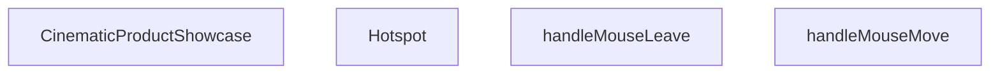

## Genel Bakış

Bu modül, sinematik bir ürün vitrini bileşeni sunar. Kullanıcının fare hareketlerini takip ederek etkileşimli bir deneyim sağlar ve ürün üzerinde konumlandırılmış bilgi noktaları (hotspot) aracılığıyla detaylı ürün bilgisi gösterir.

## Fonksiyon Grupları

### Ana Bileşen
Ürün vitrininin genel yapısını, düzenini ve fare etkileşimlerini yönetir. Fare hareketi ve fare ayrıldığında tetiklenen olayları yakalayarak görsel geri bildirim sağlar.
- CinematicProductShowcase, handleMouseMove, handleMouseLeave

### Alt Bileşen (Hotspot)
Ürün üzerinde belirli koordinatlarda konumlandırılan etkileşimli bilgi noktalarını temsil eder. Her hotspot bir etiket, detay bilgisi ve aktif/pasif durumu içerir; tıklama ile açılıp kapatılabilir.
- Hotspot

---

## AXIOMS – Mimari Varsayımlar
- Bu modül davranışsal mantık içermez (salt veri / konfigürasyon / tip tanımı).
- [Aksiyom 1]: Modülün dışa açtığı yapı (anahtar kümesi / şema) bir sözleşmedir; tüketiciler bu sabit yapıya bağlıdır — kırıcı değişiklik tüm tüketicileri etkiler.
- [Aksiyom 2]: Bir öğe ekleme/çıkarma yapısal-uyumlu olmalı; ilgili tipler ve seçiciler aynı commit'te güncel tutulmalıdır.

---

## FONKSİYON DETAYLARI

### Hotspot
**Ne yapar**: Kullanıcı etkileşimli bir hotspot (sıcak nokta) bileşeni oluşturur. Belirli bir konumda (x, y) yerleştirilen bu bileşen, tıklandığında aktif/pasif durumunu değiştirerek ürünün belirli bir bölgesi hakkında detay bilgi gösterir.
**Nasıl yapar**: Bileşen, tıklama olayında `setActiveHotspot` fonksiyonunu çağırarak çalışır. Gövdedeki mantık şu şekildedir: eğer mevcut aktif hotspot bu spot'un key değerine eşitse (yani zaten aktifse) aktif hotspot'u `null` yapar (pasifleştirir), aksi halde bu spot'un key değerini aktif hotspot olarak ayarlar. Bu toggle (aç-kapa) davranışı sağlar.
**Parametreler**:
- x: number — Hotspot'un yatay (x) konum koordinatı
- y: number — Hotspot'un dikey (y) konum koordinatı
- label: string — Hotspot'un görünen etiket metni
- detail: string — Hotspot tıklandığında gösterilecek detay açıklaması
- isActive: boolean — Hotspot'un o an aktif olup olmadığını belirten durum değeri
- onToggle: function — Hotspot durumu değiştiğinde çağırılacak geri çağırma fonksiyonu
**Dönüş**: `React.FC<HotspotProps>` — HotspotProps tipinde props alan bir React fonksiyon bileşeni döndürür.

### CinematicProductShowcase
**Ne yapar**: Sinematik bir ürün vitrin/gösterim bileşenidir. Ürünün interaktif ve görsel açıdan zengin bir şekilde sergilenmesini sağlayan ana kapsayıcı bileşendir.
**Nasıl yapar**: Kaynakta gövde detayı belirtilmemiştir. Bileşenin iç mantığı bilinmiyor.
**Parametreler**:
- (parametre yok) — Bileşen herhangi bir props almaz
**Dönüş**: `React.FC` — Props almayan bir React fonksiyon bileşeni döndürür.

### handleMouseMove
**Ne yapar**: Fare (mouse) hareket olaylarını işleyen bir olay yöneticisidir. Muhtemelen fare imlecinin konumunu takip ederek görsel efektler veya paralaks hareketleri tetikler.
**Nasıl yapar**: Kaynakta gövde detayı belirtilmemiştir. Fonksiyonun iç mantığı bilinmiyor.
**Parametreler**:
- e: React.MouseEvent — Fare hareket olayını temsil eden React mouse event nesnesi
**Dönüş**: Kaynakta dönüş tipi belirtilmemiştir, bilinmiyor.

### handleMouseLeave
**Ne yapar**: Fare bileşen alanı dışına çıktığında tetiklenen olay yöneticisidir. Muhtemelen fare alanı terk ettiğinde görsel durumu sıfırlar veya varsayılan konuma döndürür.
**Nasıl yapar**: Kaynakta gövde detayı belirtilmemiştir. Fonksiyonun iç mantığı bilinmiyor.
**Parametreler**:
- (parametre yok) — Herhangi bir parametre almaz
**Dönüş**: Kaynakta dönüş tipi belirtilmemiştir, bilinmiyor.

---

## İTHALATLAR (IMPORTS)
- import: ../../i18n/I18nProvider::useI18n
- import: framer-motion::AnimatePresence
- import: framer-motion::motion
- import: framer-motion::useMotionValue
- import: framer-motion::useSpring
- import: framer-motion::useTransform
- import: next/image::Image
- import: react::React
- import: react::useRef
- import: react::useState

---

## INTERFACES

### HotspotProps
- `x: number`
- `y: number`
- `label: string`
- `detail: string`
- `isActive: boolean`
- `onToggle: () => void`

---

## SABİTLER
- **productImages** (array) — `[
  { 
    src: '/images/vortice_lineo_futuristic.webp', 
    label: 'Futu...`

---

## AST POINTERS

### [N1_NASIL] AST Pointer: src/components/home/CinematicProductShowcase.tsx::Hotspot
- **params**: `x`, `y`, `label`, `detail`, `isActive`, `onToggle`
- **ic_degiskenler**:
  - `t` — `useI18n()` hook'undan dönen çeviri fonksiyonu; `home.cinematicShowcase.componentLabel` anahtarıyla metin getirir
- **Dönüş**: JSX elementi — mutlak konumlanmış bir `
` içinde tıklanabilir buton ve `isActive` true olduğunda açılan `motion.div` detay kartı

### [N2_NASIL] AST Pointer: src/components/home/CinematicProductShowcase.tsx::CinematicProductShowcase
- **params**: yok
- **ic_degiskenler**:
  - `t` — `useI18n()` hook'undan dönen çeviri fonksiyonu; `home.cinematicShowcase.*` anahtarlarıyla metinleri getirir
  - `activeHotspot` — `useState<string | null>(null)` ile tutulan, şu an aktif olan hotspot key'i; `null` ise hiçbir detay kartı açık değil
  - `setActiveHotspot` — `activeHotspot` state'ini güncelleyen setter fonksiyonu
  - `activeImageIdx` — `useState(0)` ile tutulan, `productImages` dizisindeki aktif görselin indeksi
  - `setActiveImageIdx` — `activeImageIdx` state'ini güncelleyen setter fonksiyonu
  - `containerRef` — `useRef<HTMLDivElement>(null)` ile oluşturulan, fare hareketinin referans aldığı container DOM elemanı
  - `mouseX` — `useMotionValue(0)` ile oluşturulan, normalize edilmiş yatay fare pozisyonunu tutan motion value
  - `mouseY` — `useMotionValue(0)` ile oluşturulan, normalize edilmiş dikey fare pozisyonunu tutan motion value
  - `springConfig` — yay animasyonu konfigürasyon objesi (`damping: 25, stiffness: 150`)
  - `rotateX` — `useSpring(useTransform(mouseY, [-0.5, 0.5], [10, -10]), springConfig)` ile türetilen, dikey fare hareketine bağlı X ekseni dönüş değeri
  - `rotateY` — `useSpring(useTransform(mouseX, [-0.5, 0.5], [-15, 15]), springConfig)` ile türetilen, yatay fare hareketine bağlı Y ekseni dönüş değeri
  - `handleMouseMove` — fare hareketi olayını yakalayan fonksiyon; `containerRef` sınırlayıcı kutusuna göre normalize edilmiş x ve y değerlerini `mouseX`/`mouseY`'ye yazar
  - `handleMouseLeave` — fare container'dan ayrıldığında `mouseX` ve `mouseY`'yi sıfırlayan, `activeHotspot`'u `null` yapan fonksiyon
  - `currentHotspots` — `productImages[activeImageIdx].hotspots` erişimiyle elde edilen, aktif görsele ait hotspot dizisi
- **Dönüş**: JSX elementi — `<section>` içinde arka plan ambiyans efektleri, fare hareketiyle 3D dönen görsel konteyner, `currentHotspots` üzerinde map ile render edilen `Hotspot` bileşenleri, thumbnail butonları ve metin içerik alanı

### [N3_NASIL] AST Pointer: src/components/home/CinematicProductShowcase.tsx::handleMouseMove
- **params**: `e: React.MouseEvent`
- **ic_degiskenler**:
  - `containerRef.current` — referansın mevcut DOM elemanı; `null` ise fonksiyon erken döner
  - `rect` — `containerRef.current.getBoundingClientRect()` ile elde edilen, container'ın sınırlayıcı kutusu
  - `x` — `(e.clientX - rect.left) / rect.width - 0.5` formülüyle hesaplanan, normalize edilmiş yatay fare pozisyonu (-0.5 ile 0.5 arası)
  - `y` — `(e.clientY - rect.top) / rect.height - 0.5` formülüyle hesaplanan, normalize edilmiş dikey fare pozisyonu (-0.5 ile 0.5 arası)
- **Dönüş**: yok — yan etki olarak `mouseX.set(x)` ve `mouseY.set(y)` çağrılarıyla motion value'ları günceller

### [N4_NASIL] AST Pointer: src/components/home/CinematicProductShowcase.tsx::handleMouseLeave
- **params**: yok
- **ic_degiskenler**: yok — dış scope'daki `mouseX`, `mouseY` ve `setActiveHotspot` kullanır
- **Dönüş**: yok — yan etki olarak `mouseX.set(0)`, `mouseY.set(0)` ve `setActiveHotspot(null)` çağrılarıyla motion value'ları sıfırlar ve aktif hotspot'u kapatır

### [N5_NASIL] AST Pointer: src/components/home/CinematicProductShowcase.tsx::mapCallback_hotspot
- **params**: `spot`
- **ic_degiskenler**: yok — dış scope'daki `activeImageIdx`, `activeHotspot`, `setActiveHotspot` ve `t` kullanır
- **Dönüş**: `Hotspot` JSX elementi — `spot.x`, `spot.y`, `spot.key` ile `t()` çeviri sonuçlarını prop olarak aktarır; `isActive` `activeHotspot === spot.key` karşılaştırmasıyla belirlenir; `onToggle` callback'i `activeHotspot` null ise `spot.key`'e, aksi halde `null`'a set eder

### [N6_NASIL] AST Pointer: src/components/home/CinematicProductShowcase.tsx::mapCallback_thumbnail
- **params**: `img`, `idx`
- **ic_degiskenler**: yok — dış scope'daki `activeImageIdx`, `setActiveImageIdx` ve `setActiveHotspot` kullanır
- **Dönüş**: `button` JSX elementi — tıklama olayında `setActiveImageIdx(idx)` ve `setActiveHotspot(null)` çağırarak aktif görseli değiştirir ve hotspot'u kapatır; `img.src` ve `img.label` ile `Image` bileşeni render edilir

---

## MERMAID CALL GRAPH

## NODE ID STANDARD

  file: CinematicProductShowcase.tsx
  function: CinematicProductShowcase.tsx::Hotspot
  function: CinematicProductShowcase.tsx::CinematicProductShowcase
  function: CinematicProductShowcase.tsx::handleMouseMove
  function: CinematicProductShowcase.tsx::handleMouseLeave

---

## DISA AKTARILANLAR (EXPORTS)
  export: CinematicProductShowcase
  export: Hotspot

---

## STİL TOKENLERİ

### Arbitrary Değerler (token'a geçirilmemiş)
Yok — tüm stiller token'a geçirilmiş. ✅

### Kullanılan Token'lar (zaten token'a geçirilmiş)
- `h-hvac-hero`, `hover:shadow-glow-lg`, `rounded-hvac-3xl`, `shadow-glow-md`, `tracking-hvac-normal`, `tracking-hvac-relaxed`

### Tailwind Sınıf Özeti
- **Renkler:** `bg-cyan-400`, `bg-cyan-500`, `bg-cyan-500/10`, `bg-cyan-500/20`, `bg-cyan-500/50`, `bg-cyan-grid`, `bg-gradient-to-r`, `bg-grid-100`, `bg-indigo-500/10`, `bg-slate-900`, `bg-slate-900/95`, `bg-slate-950`, `bg-white`, `bg-white/1`, `bg-white/10`
- **Layout:** `absolute`, `backdrop-blur-3xl`, `backdrop-blur-xl`, `bg-cyan-grid`, `bg-grid-100`, `bottom-0`, `bottom-10`, `bottom-full`, `drop-shadow-cinematic-drop`, `flex`, `flex-col`, `flex-wrap`, `from-transparent`, `gap-20`, `gap-3`
- **Varyant/Responsive:** `:`, `group-hover:`, `hover:`, `lg:`, `sm:` önekleri
- **Yardımcı Sınıflar:** `${activeImageIdx`, `${isActive`, `-inset-1`, `-translate-x-1/2`, `-translate-y-1.5`, `:`, `===`, `animate-ping`, `animate-pulse`, `aspect-square`, `blur-120`, `blur-150`, `blur-3xl`, `border`, `content-auto`