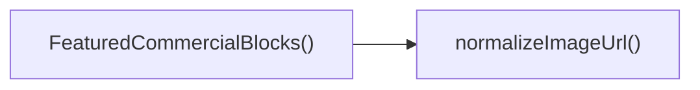

## Genel Bakış
Bu modül, ticari ürünlerin öne çıkan blokları olarak görüntülenmesini sağlayan bir React bileşeni içerir. Görsel URL'lerini güvenli bir şekilde hazırlayan bir yardımcı fonksiyonla birlikte, ürün listesini alıp kullanıcıya çekici bir şekilde sunar.

## Fonksiyon Grupları
### Görsel URL Normalizasyonu
Görsel adreslerinin null veya undefined gibi geçersiz değerleri temizleyip, güvenli bir string formatına dönüştürür.
- normalizeImageUrl

### Ana Bileşen
Ürün verilerini alarak, öne çıkan ticari blokları düzenler ve render eder; her blokta görsel ve ilgili bilgiler gösterilir.
- FeaturedCommercialBlocks

---

## AXIOMS – Mimari Varsayımlar
Bu modülün doğru çalışması için fonksiyonların parametreleri belirtilen tiplere uygun olmalı ve varsayılan değerler beklenildiği şekilde kullanılmalıdır.

[Aksiyom 1]: Eğer `normalizeImageUrl` fonksiyonuna `url` parametresi `string`, `null` veya `undefined` dışında bir değer geçilirse, fonksiyonun dönüş değeri veya hata davranışı garantilenmez.  
[Aksiyom 2]: Eğer `normalizeImageUrl` fonksiyonuna `url` parametresi `null` veya `undefined` geçilirse, fonksiyon bir hata fırlatmadan bir `string` döndürmelidir.  
[Aksiyom 3]: Eğer `FeaturedCommercialBlocks` bileşenine `initialProducts` prop'u olarak dizi olmayan bir değer geçilirse, bileşenin render çıktısı beklenmeyen şekilde olabilir.  
[Aksiyom 4]: Eğer `FeaturedCommercialBlocks` bileşenine `initialProducts` prop'u verilmezse, prop'un değeri boş bir dizi (`[]`) olarak kabul edilir. (Bu varsayım fonksiyon imzasındaki `initialProducts = []` default değerinden doğar.)

---

## FONKSIYON DETAYLARI

### normalizeImageUrl
**Ne yapar**: Verilen bir görsel URL'sini standart bir biçime dönüştürür, null veya undefined gibi geçersiz girdileri işler.  
**Nasıl yapar**: Girdi bir string ise gerekli düzenlemeleri yapar (örneğin protokol ekleme, boşluk temizleme); null/undefined ise boş string veya varsayılan bir URL döndürür.  
**Parametreler**:  
- url: string | null | undefined — Normalize edilecek görsel adresi; null veya undefined olabilir.  
**Dönüş**: string — Normalize edilmiş URL; geçersiz girdi için boş string veya varsayılan değer.

### FeaturedCommercialBlocks
**Ne yapar**: Başlangıç ürün listesi ile öne çıkan ticari blokları gösteren bir React bileşenidir.  
**Nasıl yapar**: `initialProducts` prop'u üzerinden ürün verisini alır, içeriği render eder; varsayılan olarak boş bir dizi kullanılır.  
**Parametreler**:  
- initialProducts: [] — Gösterilecek ürünlerin listesi; varsayılan değer boş dizidir.  
**Dönüş**: React.FC<FeaturedCommercialBlocksProps> — Özellikleri alarak UI'ı oluşturan fonksiyonel bileşen.

---

## INTERFACES

### FeaturedCommercialBlocksProps
- `initialProducts?: Product[]`
- `initialCategories?: Category[]`

---

## TYPE ALIASES

### CommercialTab
```typescript
type CommercialTab = 'featured' | 'newArrivals' | 'bestSellers'
```

---

## AST POINTERS

### [N1_NASIL] AST Pointer: src/components/home/FeaturedCommercialBlocks.tsx::normalizeImageUrl
- **params**: (url: string | null | undefined)
- **ic_degiskenler**: 
  - `trimmedUrl` — trimmed version of url after removing whitespace
- **Dönüş**: string

### [N2_NASIL] AST Pointer: src/components/home/FeaturedCommercialBlocks.tsx::FeaturedCommercialBlocks
- **params**: ({ initialProducts = [] })
- **ic_degiskenler**: 
  - `t` — translation function from useI18n
  - `activeTab` — currently selected tab key ('featured', 'newArrivals', 'bestSellers')
  - `setActiveTab` — setter function to change activeTab state
  - `productsByTab` — object mapping tab keys to product arrays (featured, newArrivals, bestSellers)
  - `activeProducts` — array of products for the currently active tab
- **Dönüş**: JSX.Element (React component)

### [N3_NASIL] AST Pointer: src/components/home/FeaturedCommercialBlocks.tsx::useMemoCallback
- **params**: ()
- **ic_degiskenler**: 
  - `featured` — array of up to 4 featured products, fallback to first 4 if none flagged
  - `newArrivals` — array of up to 4 products sorted by creation date descending
  - `bestSellers` — array of up to 4 products, fallback to first 4 if slice empty
- **Dönüş**: { featured: Product[], newArrivals: Product[], bestSellers: Product[] }

### [N4_NASIL] AST Pointer: src/components/home/FeaturedCommercialBlocks.tsx::TabButton
- **params**: (tab)
- **ic_degiskenler**: yok
- **Dönüş**: JSX.Element (button element)

### [N5_NASIL] AST Pointer: src/components/home/FeaturedCommercialBlocks.tsx::ProductItem
- **params**: (product, idx)
- **ic_degiskenler**: yok
- **Dönüş**: JSX.Element (motion.wrapped ProductCard)

---

## Çağrı Haritası

### Disariya Çağrılar (Outgoing)
- **FeaturedCommercialBlocks()** fonksiyonu, görsel URL'lerini standartlaştırmak için **normalizeImageUrl** fonksiyonunu çağırır.

### Disarından Çağrılanlar (Incoming)
- Bu modülü çağıran dış bir fonksiyon veya modül verilmemiştir; dolayısıyla **incoming** çağrı yoktur.

### İç İçe Fonksiyonlar (Nested)
- İç içe (nested) fonksiyon bulunmamaktadır. → **Yok**

---

## DOSYA-İÇİ ÇAĞRI GRAFİĞİ
  FeaturedCommercialBlocks() → normalizeImageUrl()



---

## NODE ID STANDARD

  file: src\components\home\FeaturedCommercialBlocks.tsx
  function: src\components\home\FeaturedCommercialBlocks.tsx::normalizeImageUrl
  function: src\components\home\FeaturedCommercialBlocks.tsx::FeaturedCommercialBlocks

---

## DISA AKTARILANLAR (EXPORTS)
  export: FeaturedCommercialBlocks
  export: normalizeImageUrl

---

## STİL TOKENLERİ

### Arbitrary Değerler (token'a geçirilmemiş)
- **shadow:** (yok)
- **height:** (yok)
- **width:** (yok)
- **spacing:** (yok)
- **diğer:** `hover:scale-[1.02]`, `lg:grid-cols-[1fr,320px]`, `tracking-[0.3em]`

### Kullanılan Token'lar (zaten token'a geçirilmiş)
- `rounded-hvac-2xl`

### Tailwind Sınıf Özeti
- **Renkler:** `bg-cyan-400`, `bg-cyan-500/10`, `bg-slate-200/50`, `bg-slate-900`, `bg-slate-950`, `bg-white`, `bg-white/5`, `border-cyan-500/10`, `border-slate-200`, `border-white/10`, `border-white/5`, `sm:text-6xl`, `text-4xl`, `text-center`, `text-cyan-400`
- **Layout:** `absolute`, `backdrop-blur-sm`, `flex`, `flex-col`, `gap-1`, `gap-10`, `gap-3`, `gap-4`, `gap-6`, `gap-8`, `grid`, `grid-cols-1`, `grid-cols-2`, `group-hover:grayscale-0`, `h-1.5`
- **Responsive:** `lg:`, `md:`, `sm:` prefix kullanımları
