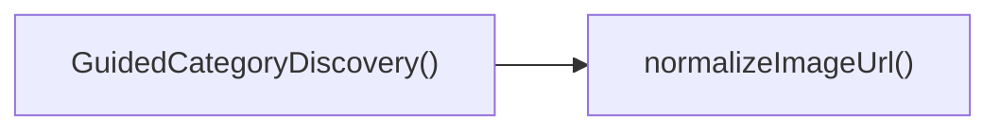

## Genel Bakış
Bu modül, kullanıcıya yönlendirilmiş kategori keşfi deneyimi sunan bir React bileşenini ve görsel URL'lerini standartlaştıran küçük bir yardımcı işlevi içerir. Bileşen, dışarıdan gelen kategori listesini alarak kullanıcıya görsel ve metin tabanlı bir keşif arayüzü oluşturur. Yardımcı işlev ise görsel adreslerinin geçerli ve tutarlı bir formatta kullanılmasını sağlar.

## Fonksiyon Grupları
### Yardımcı İşlevler
Görsel URL'lerini normalize ederek null veya tanımsız değerleri güvenli bir dizeye dönüştürür.
- normalizeImageUrl

### Bileşen Tanımları
Kategori keşfi arayüzünü render eder, dışarıdan gelen kategori listesini görsel ve metin öğeleriyle kullanıcıya sunar.
- GuidedCategoryDiscovery

---

## AXIOMS – Mimari Varsayımlar
Bu modül için özel aksiyomlar fonksiyon imzalardan türetilmiştir.

[Aksiyom 1]: Eğer normalizeImageUrl fonksiyonuna geçirilen url değeri **string, null veya undefined** türünde **değilse**, fonksiyonun çalışması beklenmedik sonuç verir (örneğin TypeError fırlatabilir).  
[Aksiyom 2]: Eğer GuidedCategoryDiscovery component'ine **displayCategories** prop'u tanımlanmazsa **ve** default değeri de sağlanmazsa, component render sırasında hata verir. (Varsayılan değer sağlandığı sürece, prop tanımlanmazsa boş bir dizi kullanarak güvenli bir şekilde render eder.)

---

## FONKSIYON DETAYLARI

### normalizeImageUrl
**Ne yapar**: Verilen bir görsel URL’sini alır, null veya undefined gibi geçersiz değerleri temizler ve standart bir string URL formatına dönüştürür.  
**Nasıl yapar**: Fonksiyon, gelen değeri önce tanımlı olup olmadığını kontrol eder; değer null veya undefined ise boş string döndürür, aksi takdirde girdiyi doğrudan string olarak döndürür (gerekirse trim veya temel biçimlendirme işlemleri uygulanabilir).  
**Parametreler**:
- url: string | null | undefined — Normalize edilmek istenen görsel URL’si; null veya undefined olabilir.  
**Dönüş**: string — Temizlenmiş ve güvenli bir görsel URL’si; giriş geçersizse boş string döner.

### GuidedCategoryDiscovery
**Ne yapar**: `displayCategories` prop’u ile sağlanan kategori listesini kullanarak, kullanıcıya yönlendirilmiş kategori keşfi arayüzünü render eden bir React bileşenidir.  
**Nasıl yapar**: Bileşen, `displayCategories` prop’unun varsayılan değerini boş bir dizi olarak alır; bu diziyi içeri harita yaparak her kategori için uygun görsel ve metin öğelerini oluşturur ve JSX döndürür. Prop tipi `GuidedCategoryDiscoveryProps` ile tip güvenliği sağlanır.  
**Parametreler**:
- displayCategories: [] — Gösterilecek kategori nesnelerinin dizisi; belirtilmezse boş dizidir.  
**Dönüş**: React.FC<GuidedCategoryDiscoveryProps> — Render edilmesi gereken kullanıcı arayüzünü tanımlayan fonksiyonel bileşen.

---

## INTERFACES

### CategoryViewModelLite
- `id: string`
- `slug: string`
- `displayName: string`
- `description: string`
- `image_url: string | null`

### GuidedCategoryDiscoveryProps
- `displayCategories?: CategoryViewModelLite[]`

---

## AST POINTERS

### [N1_NASIL] AST Pointer: src/components/home/GuidedCategoryDiscovery.tsx::normalizeImageUrl
- **params**: (url: string | null | undefined)
- **ic_degiskenler**: 
  - `trimmed` — url değerinden baş ve son boşluklar kaldırılmış hali
  - `supabaseUrl` — NEXT_PUBLIC_SUPABASE_URL ortam değişkeninin değeri
- **Dönüş**: string (normalize edilmiş resim URL’si)

### [N2_NASIL] AST Pointer: src/components/home/GuidedCategoryDiscovery.tsx::GuidedCategoryDiscovery
- **params**: ({ displayCategories = [] })
- **ic_degiskenler**: yok
- **Dönüş**: JSX elementi (React.FC<GuidedCategoryDiscoveryProps>) – kategorileri gösteren bölüm

### [N3_NASIL] AST Pointer: src/components/home/GuidedCategoryDiscovery.tsx::(category, idx) => { ... }
- **params**: (category, idx)
- **ic_degiskenler**: 
  - `finalSrc` — normalizeImageUrl ile elde edilen kategori görselinin最终 URL’si
  - `delayClass` — idx’ye göre ['delay-0','delay-100','delay-200','delay-300'] dizisinden seçilen gecikme sınıfı
- **Dönüş**: JSX elementi (her kategori için render edilen 
 kartı)

---

## ÇAĞRI HARİTASI

### Disariya Cagrilar (Outgoing)
- `GuidedCategoryDiscovery()` fonksiyonu, görsel URL'lerini standart bir formata dönüştürmek için `normalizeImageUrl` fonksiyonunu çağırır.

### Disaridan Cagrilanlar (Incoming)
- Verilen veri setinde bu modülü çağıran dış bir fonksiyon veya dosya bilgisi bulunmamaktadır (bilinmiyor).

### Ic Ice Fonksiyonlar (Nested)
- Yok

---

## DOSYA-İÇİ ÇAĞRI GRAFİĞİ
  GuidedCategoryDiscovery() → normalizeImageUrl()

---

## NODE ID STANDARD

  file: src\components\home\GuidedCategoryDiscovery.tsx
  function: src\components\home\GuidedCategoryDiscovery.tsx::normalizeImageUrl
  function: src\components\home\GuidedCategoryDiscovery.tsx::GuidedCategoryDiscovery

---

## DISA AKTARILANLAR (EXPORTS)
  export: CategoryViewModelLite
  export: GuidedCategoryDiscovery
  export: normalizeImageUrl