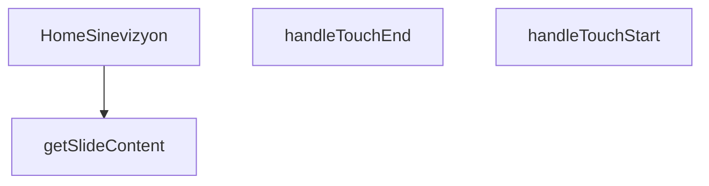

## Genel Bakış
HomeSinevizyon modülü, ana ekranda dokunmatik etkileşimlerle slayt geçişlerinin yapılabildiği bir sinevizyon bileşenidir. Kullanıcı etkileşimlerini yönetir, slayt içeriklerini indeks bazlı olarak dinamik şekilde oluşturur ve "Alıntı Al" gibi bir eylem gerçekleştiğinde dışarıya bildirim gönderir.

## Fonksiyon Grupları
### Ana Bileşen ve Koordinasyon
Sinevizyonun tüm alt fonksiyonlarını ve durum yönetimini bir araya getiren üst düzey bileşendir. Dokunma olaylarını dinler, slayt içeriğini üretir ve dışarıdan sağlanan geri çağırım fonksiyonunu tetikler.
- HomeSinevizyon

### Dokunmatik Etkileşim İşleme
Kullanıcının ekrana dokunma başlangıç ve bitiş anlarını yakalayarak slayt geçiş mantığını tetikleyen yardımcı fonksiyonlardır. Bu fonksiyonlar, mobil cihazlarda akıcı bir kaydırma deneyimi sağlar.
- handleTouchStart, handleTouchEnd

### Dinamik Slayt İçerik Oluşturma
Verilen bir slayt indeksine göre o slayta ait başlık, açıklama ve diğer bileşenleri üreten yardımcı fonksiyondur. İçerik yönetimini merkezileştirerek bileşen içindeki tekrarı önler.
- getSlideContent

---

## AXIOMS – Mimari Varsayımlar

[Aksiyom 1]: Eğer `onQuoteClick` prop'u sağlanmazsa, "Alıntı Al" butonuna tıklandığında ana uygulamaya bildirim gönderilemez.

[Aksiyom 2]: Eğer `slidesData` array'i boşsa, sinevizyonda gösterilecek slayt içeriği olmaz ve `getSlideContent` fonksiyonu geçerli bir içerik döndüremez.

[Aksiyom 3]: Eğer `getSlideContent` fonksiyonuna `slidesData` dizisinin uzunluğuna eşit veya büyük bir `index` değeriyse, geçerli bir slayt içeriği elde edilemez.

[Aksiyom 4]: Eğer dokunma olaylarını yakalayacak bir DOM yapısı yoksa, `handleTouchStart` ve `handleTouchEnd` fonksiyonları çağrılamaz ve slayt geçişleri dokunmatik etkileşimle yapılamaz.

---

## FONKSİYON DETAYLARI

### HomeSinevizyon
**Ne yapar**: Ana sayfadaki sinevizyon (banner) bölümünü oluşturan React bileşenidir. Hero alanındaki slaytları, başlık, alt başlık, etiket ve CTA butonlarını render eder. Konum bazlı içerik gösterimi ve dokunmatik kaydırma desteği sağlar.

**Nasıl yapar**: `onQuoteClick` prop’u ile isteğe bağlı bir callback alır. Bileşen içinde tanımlı slayt listesini (`slides` dizisi) `currentSlide` state’i ile yönetir. `getSlideContent` yardımcısı ile her indeksin içeriğini alır; `.map()` ile slayt içeriklerini render eder. Dokunma olayları (`handleTouchStart`, `handleTouchEnd`) ile sağ-sol kaydırmayı algılar ve slayt geçişlerini tetikler. Geçiş animasyonları CSS sınıfları (opacity, translate, transition) ile yönetilir.

**Parametreler**:
- `onQuoteClick`: `(() => void)` — İsteğe bağlı (opsiyonel). İkincil CTA butonu tıklandığında çalıştırılacak callback. Verilmezse `window.openLeadModal()` çağrılır.

**Dönüş**: `React.FC<HomeSinevizyonProps>` — Bileşenin kendisini döndürür, yani bir JSX.Element kümesi oluşturan fonksiyon.

### handleTouchStart
**Ne yapar**: Dokunma başlangıcını yakalayarak kullanıcı tarafından başlatılan bir hareketin (ör. kaydırma) ilk anını kaydeder.  
**Nasıl yapar**: Olay nesnesinden ilk dokunma noktasının koordinatlarını (`clientX`, `clientY`) çıkarır ve bu değerleri bir sonraki hareket adımı için geçici bir state veya ref içinde saklar; böylece `handleTouchEnd` ile karşılaştırarak yön ve mesafe hesaplanabilir.  
**Parametreler**:  
- e: React.TouchEvent — Dokunma başlangıcıyla ilgili tüm touch verilerini içeren SyntheticEvent nesnesi  
**Dönüş**: void — Fonksiyon bir değer döndürmez, sadece yan etkiler (state güncellemesi) yapar

### handleTouchEnd
**Ne yapar**: Dokunma bitişini yakalayarak kullanıcının hareketini tamamlar ve bu hareketin yönüne göre slayt indeksini günceller.  
**Nasıl yapar**: Olay nesnesinden son dokunma noktasının koordinatlarını alır, `handleTouchStart` tarafından saklanan başlangıç koordinatlarıyla farkı hesaplar; bu fark eşik değerini aşarsa (ör. sağa kaydırma) slayt indeksi bir azaltılır veya artırılır, ardından durum güncellenerek yeni slayt gösterilir.  
**Parametreler**:  
- e: React.TouchEvent — Dokunma bitişiyle ilgili tüm touch verilerini içeren SyntheticEvent nesnesi  
**Dönüş**: void — Fonksiyon bir değer döndürmez, sadece durum güncellemesi yapar

### getSlideContent

**Ne yapar**: Verilen slide indeksine karşılık gelen slayt içerik verisini döndürür. Sinevizyonda her bir slaytın gösterileceği metinsel içerikleri (etiket başlığı, ana başlık ve alt başlık) sağlar.

**Nasıl yapar**: Fonksiyon, slide indeksini parametre olarak alır ve bu indekse karşılık gelen slaytın tüm metinsel içerik bileşenlerini içeren bir nesne döndürür. İçerik nesnesi `eyebrow` (üst küçük başlık/tanımlama etiketi), `title` (ana büyük başlık) ve `subtitle` (açıklama metni) alanlarını içerir. Bu yapı, bileşen içinde her slayt için tutarlı bir içerik şablonu sunar.

**Parametreler**:
- `index`: number — Hangi slaytın içeriğinin getirileceğini belirten indeks numarası. 0'dan başlayan sıralı bir değerdir.

**Dönüş**: `{ eyebrow: string, title: string, subtitle: string }` — Slaytın üst etiket metnini, ana başlığını ve açıklama alt başlığını içeren bir nesne döndürür.

---

## İTHALATLAR (IMPORTS)
- import: ../../i18n/I18nProvider::useI18n
- import: @/hooks/useLocalizedRoutes::useLocalizedRoutes
- import: next/image::Image
- import: next/link::Link
- import: react::React
- import: react::useCallback
- import: react::useEffect
- import: react::useRef
- import: react::useState

---

## INTERFACES

### HomeSinevizyonProps
- `onQuoteClick?: () => void`

### SlideProduct
- `url: string`
- `labelKey: string`
- `subLabelKey: string`
- `familySlug: string`

### SlideData
- `image: string`
- `key: number`
- `products: SlideProduct[]`

---

## SABİTLER
- **slidesData** (array) — `[
  {
    image: '/images/hero_hvac_industrial_premium_1.webp',
    produc...`

---

## AST POINTERS

### [N1_NASIL] AST Pointer: src/components/home/HomeSinevizyon.tsx::HomeSinevizyon
- **params**: `{ onQuoteClick }` — teklif butonuna tıklandığında çağrılacak opsiyonel fonksiyon
- **ic_degiskenler**:
  - `t` — `useI18n()` hook'undan dönen çeviri fonksiyonu; metinleri yerelleştirmek için kullanılır
  - `Routes` — `useLocalizedRoutes()` hook'undan dönen rotalar nesnesi; `Routes.products()` ve `Routes.product(p.familySlug)` çağrılarıyla Link href'lerinde kullanılır
  - `currentSlide` — `useState(0)` ile oluşturulan mevcut slayt indeksi state'i; hangi slaytın aktif olduğunu belirler
  - `setCurrentSlide` — `currentSlide` state'ini güncelleyen setter fonksiyonu; `paginate`, `setCurrentSlide(idx)` ve `setCurrentSlide((prev) => ...)` çağrılarında kullanılır
  - `isMounted` — `useState(false)` ile oluşturulan mount durumu state'i; bileşenin tarayıcıda monte edilip edilmediğini takip eder
  - `setIsMounted` — `isMounted` state'ini güncelleyen setter fonksiyonu; ilk useEffect içinde `setIsMounted(true)` çağrılır
  - `touchStartX` — `useRef<number | null>(null)` ile oluşturulan dokunma başlangıç X koordinatı ref'i; `handleTouchStart` ve `handleTouchEnd` fonksiyonları arasında dokunma pozisyonunu taşır
  - `isInitialMount` — `useRef(true)` ile oluşturulan ilk mount kontrolü ref'i; mount useEffect'inde `isInitialMount.current = false` yapılır
  - `paginate` — `useCallback` ile sarılmış, `newDirection` parametresi alarak `setCurrentSlide` üzerinden mevcut slaytı döngüsel olarak kaydıran fonksiyon; `slidesData.length` ile modulo işlemi yapar
  - `handleTouchStart` — dokunma başlangıcında `e.touches[0].clientX` değerini `touchStartX.current`'a atayan fonksiyon
  - `handleTouchEnd` — dokunma bitişinde `touchStartX.current` ile `e.changedTouches[0].clientX` arasındaki farkı hesaplayarak 50px eşiğini aşan kaydırmalarda `paginate` çağıran fonksiyon
  - `getSlideContent` — verilen `index` parametresiyle `t()` çevirisi yaparak `{ eyebrow, title, subtitle }` objesi döndüren fonksiyon; fallback değerleri `'VentHub Engineering'`, `'High Performance HVAC'`, `'Advanced solutions for industrial ventilation.'` olarak tanımlıdır
  - `slide` — `slidesData.map` callback'inde kullanılan slayt objesi; `.key`, `.image`, `.products` alanlarına erişilir
  - `idx` — `slidesData.map` callback'inde kullanılan slayt indeksi; `idx === currentSlide` koşuluyla aktif slayt belirlenir
  - `currentContent` — `getSlideContent(idx)` çağrısından dönen `{ eyebrow, title, subtitle }` objesi; içerik tarafında slayt metinlerini render etmek için kullanılır
  - `slideIdx` — ürünler tarafındaki `slidesData.map` callback'inde kullanılan slayt indeksi; `slideIdx === currentSlide` koşuluyla aktif ürün grubu belirlenir
  - `p` — `slide.products.map` callback'inde kullanılan ürün objesi; `.url`, `.familySlug`, `.labelKey`, `.subLabelKey` alanlarına erişilir
  - `i` — `slide.products.map` callback'inde kullanılan ürün indeksi; `i === 0` koşuluyla birinci ürünün pozisyonu ve z-index'i belirlenir
  - `timer` — ikinci useEffect içinde `setInterval(() => paginate(1), 120000)` ile oluşturulan 120 saniyelik otomatik geçiş zamanlayıcısı
  - `handleKeyDown` — üçüncü useEffect içinde tanımlanan klavye olay dinleyicisi; `ArrowRight` ve `ArrowLeft` tuşlarıyla `paginate` çağırır
- **Dönüş**: `JSX.Element` — sinevizyon bölümünü render eden React bileşeni

### [N2_NASIL] AST Pointer: src/components/home/HomeSinevizyon.tsx::handleTouchStart
- **params**: `e: React.TouchEvent` — dokunma olayı
- **ic_degiskenler**: yok — sadece `touchStartX.current`'a doğrudan atama yapar
- **Dönüş**: yok

### [N3_NASIL] AST Pointer: src/components/home/HomeSinevizyon.tsx::handleTouchEnd
- **params**: `e: React.TouchEvent` — dokunma olayı
- **ic_degiskenler**:
  - `touchEndX` — `e.changedTouches[0].clientX` ile alınan dokunma bitiş X koordinatı
  - `diff` — `touchStartX.current - touchEndX` hesaplamasıyla elde edilen kaydırma mesafesi; pozitif değer sağa, negatif değer sola kaydırma anlamına gelir
- **Dönüş**: yok

### [N4_NASIL] AST Pointer: src/components/home/HomeSinevizyon.tsx::getSlideContent
- **params**: `index: number` — slayt indeksi
- **ic_degiskenler**: yok — doğrudan return objesi oluşturur
- **Dönüş**: `{ eyebrow: string, title: string, subtitle: string }` — `t()` çevirisiyle elde edilen slayt içerik objesi; çeviri bulunamazsa fallback değerler kullanılır

### [N5_NASIL] AST Pointer: src/components/home/HomeSinevizyon.tsx::paginate
- **params**: `newDirection: number` — geçiş yönü (1 ileri, -1 geri)
- **ic_degiskenler**: yok — `setCurrentSlide` callback'inde `prev` parametresi kullanılır
- **Dönüş**: yok

### [N6_NASIL] AST Pointer: src/components/home/HomeSinevizyon.tsx::useEffect[0]
- **params**: yok
- **ic_degiskenler**: yok
- **Dönüş**: yok — yan etki: `setIsMounted(true)` çağırır ve `isInitialMount.current = false` yapar

### [N7_NASIL] AST Pointer: src/components/home/HomeSinevizyon.tsx::useEffect[1]
- **params**: yok
- **ic_degiskenler**:
  - `timer` — `setInterval(() => paginate(1), 120000)` ile oluşturulan 120 saniyelik otomatik slayt geçiş zamanlayıcısı
- **Dönüş**: cleanup fonksiyonu — `clearInterval(timer)` çağırarak zamanlayıcıyı temizler; `isMounted` false ise erken dönüş yapar

### [N8_NASIL] AST Pointer: src/components/home/HomeSinevizyon.tsx::useEffect[2]
- **params**: yok
- **ic_degiskenler**:
  - `handleKeyDown` — `KeyboardEvent` parametresi alan anonim fonksiyon; `ArrowRight` tuşunda `paginate(1)`, `ArrowLeft` tuşunda `paginate(-1)` çağırır
- **Dönüş**: cleanup fonksiyonu — `window.removeEventListener('keydown', handleKeyDown)` çağırarak dinleyiciyi kaldırır

### [N9_NASIL] AST Pointer: src/components/home/HomeSinevizyon.tsx::handleKeyDown
- **params**: `e: KeyboardEvent` — klavye olayı
- **ic_degiskenler**: yok
- **Dönüş**: yok — `e.key === 'ArrowRight'` ise `paginate(1)`, `e.key === 'ArrowLeft'` ise `paginate(-1)` çağırır

---

## MERMAID CALL GRAPH

## NODE ID STANDARD

  file: src\components\home\HomeSinevizyon.tsx
  function: src\components\home\HomeSinevizyon.tsx::HomeSinevizyon
  function: src\components\home\HomeSinevizyon.tsx::handleTouchStart
  function: src\components\home\HomeSinevizyon.tsx::handleTouchEnd
  function: src\components\home\HomeSinevizyon.tsx::getSlideContent

---

## DISA AKTARILANLAR (EXPORTS)
  export: HomeSinevizyon

---

## STİL TOKENLERİ

### Arbitrary Değerler (token'a geçirilmemiş)
Yok — tüm stiller token'a geçirilmiş. ✅

### Kullanılan Token'lar (zaten token'a geçirilmiş)
- `hover:shadow-glow-lg`, `hover:shadow-glow-md`, `shadow-glow-sm`, `tracking-hvac-loose`, `tracking-hvac-normal`, `tracking-hvac-relaxed`

### Tailwind Sınıf Özeti
- **Renkler:** `bg-cyan-400`, `bg-cyan-500`, `bg-cyan-500/10`, `bg-gradient-to-r`, `bg-gradient-to-t`, `bg-slate-900/40`, `bg-slate-950`, `bg-slate-950/60`, `bg-white/10`, `bg-white/20`, `bg-white/5`, `border-b`, `border-cyan-400/10`, `border-cyan-400/60`, `border-cyan-500/20`
- **Layout:** `-left-24`, `-right-24`, `absolute`, `backdrop-blur-md`, `backdrop-blur-xl`, `block`, `bottom-0`, `bottom-10`, `drop-shadow-sinevizyon-drop`, `flex`, `flex-1`, `flex-col`, `from-slate-950/80`, `from-slate-950/90`, `from-transparent`
- **Varyant/Responsive:** `:`, `focus-visible:`, `group-hover:`, `hover:`, `lg:`, `sm:` önekleri
- **Yardımcı Sınıflar:** `$`, `${i`, `${idx`, `-translate-x-8`, `-translate-y-1/2`, `0`, `:`, `===`, `animate-pulse`, `animate-scan-slow`, `blur-1`, `border`, `contain-layout`, `currentSlide`, `delay-300`