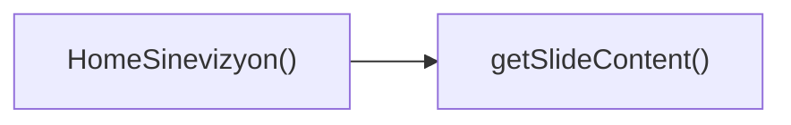

## Genel Bakış
Bu modül, ana ekranda görsel bir slayt gösterisi sunan bir React bileşeni tanımlar. Kullanıcı dokunmatik hareketlerini yakalayarak slaytlar arasında geçiş yapmayı sağlar ve her slaytta gösterilecek içeriği dinamik olarak belirler.

## Fonksiyon Grupları
### Bileşen Tanımı ve Renderleme
Ana bileşenin yapısını ve görünümünü oluşturur, dışarıdan alınan `onQuoteClick` geri çağrısını kullanarak alıntıya tıklandığında gerçekleşecek eylemi bağlar.
- HomeSinevizyon

### Dokunmatik Etkileşim Yönetimi
Kullanıcının ekrana dokunmaya başladığı ve bıraktığı anları yakalayarak touch başlangıç ve bitiş olaylarını işler, bu sayede slaytlar arasında sürükleme bırakma hareketlerini algılar.
- handleTouchStart
- handleTouchEnd

### Slayt İçeriği Sağlama
Verilen bir indekse göre o slaytta gösterilecek metin, görsel veya diğer öğeleri döndürür, böylece bileşen dinamik olarak içeriği güncelleyebilir.
- getSlideContent

---

## AXIOMS – Mimari Varsayımlar
Bu modül için özel aksiyom tanımlanmamıştır.

[Aksiyom 1]: Eğer `onQuoteClick` prop'u bir fonksiyon olarak sağlanmazsa, bileşen Quote öğesine tıklandığında beklenen geri çağırma çalışmaz ve hata oluşur.  
[Aksiyom 2]: Eğer `handleTouchStart` fonksiyonuna `React.TouchEvent` türünde bir argüman geçilmezse, dokunma başlangıcı eventi işlenemez ve dokunma hareketi başlatılamaz.  
[Aksiyom 3]: Eğer `handleTouchEnd` fonksiyonuna `React.TouchEvent` türünde bir argüman geçilmezse, dokunma sonu eventi işlenemez ve dokunma hareketi tamamlanamaz.  
[Aksiyom 4]: Eğer `getSlideContent` fonksiyonuna geçirilen `index` değeri `slidesData` dizisinin geçerli indeks aralığı (0 ≤ index < slidesData.length) dışındaysa, fonksiyon `undefined` döndürür (veya içerik sağlayamaz).  
[Aksiyom 5]: Eğer `slidesData` sabiti boş bir dizi ise, `getSlideContent` herhangi bir `index` için içerik döndürmez ve `undefined` döner.  
[Aksiyom 6]: Eğer `slidesData` sabiti tanımlı değilse (null veya undefined), `getSlideContent` çalışma zamanında hata fırlatır ve slayt içeriği alınamaz.

---

## FONKSIYON DETAYLARI

### HomeSinevizyon
**Ne yapar**: HomeSinevizyon bileşeni, bir görsel slayt gösterimi veya veri görselleştirme alanı sunar ve dışarıdan gelen `onQuoteClick` fonksiyonunu kullanarak slayt üzerindeki alıntıya tıklandığında özel bir işlem tetikler.  
**Nasıl yapar**: Bileşen, iç durumunda slayt indeksini tutar, dokunma olaylarını (`handleTouchStart`, `handleTouchEnd`) dinleyerek kullanıcı tarafından sağa/sola kaydırma hareketlerini algılar ve `getSlideContent` fonksiyonunu çağırarak mevcut slaytı render eder.  
**Parametreler**:  
- onQuoteClick: (quoteId: string) => void — Slayt üzerinde gösterilen alıntıya tıklandığında çağrılacak geri çağırım fonksiyonu  
**Dönüş**: React.FC<HomeSinevizyonProps> — JSX elementi olarak render edilebilir bir fonksiyon bileşeni  

### handleTouchStart
**Ne yapar**: Dokunma başlangıcını yakalayarak kullanıcı tarafından başlatılan bir hareketin (ör. kaydırma) ilk anını kaydeder.  
**Nasıl yapar**: Olay nesnesinden ilk dokunma noktasının koordinatlarını (`clientX`, `clientY`) çıkarır ve bu değerleri bir sonraki hareket adımı için geçici bir state veya ref içinde saklar; böylece `handleTouchEnd` ile karşılaştırarak yön ve mesafe hesaplanabilir.  
**Parametreler**:  
- e: React.TouchEvent — Dokunma başlangıcıyla ilgili tüm touch verilerini içeren SyntheticEvent nesnesi  
**Dönüş**: void — Fonksiyon bir değer döndürmez, sadece yan etkiler (state güncellemesi) yapar  

### handleTouchEnd
**Ne yapar**: Dokunma bitişini yakalayarak kullanıcının hareketini tamamlar ve bu hareketin yönüne göre slayt indeksini günceller.  
**Nasıl yapar**: Olay nesnesinden son dokunma noktasının koordinatlarını alır, `handleTouchStart` tarafından saklanan başlangıç koordinatlarıyla farkı hesaplar; bu fark eşik değerini aşarsa (ör. sağa kaydırma) slayt indeksi bir azaltılır veya artırılır, ardından durum güncellenerek yeni slayt gösterilir.  
**Parametreler**:  
- e: React.TouchEvent — Dokunma bitişiyle ilgili tüm touch verilerini içeren SyntheticEvent nesnesi  
**Dönüş**: void — Fonksiyon bir değer döndürmez, sadece durum güncellemesi yapar  

### getSlideContent
**Ne yapar**: Verilen slayt indeksine karşılık gelen içeriği (ör. görüntü, metin, alıntı) döndürerek bileşenin render edeceği öğeyi hazırlar.  
**Nasıl yapar**: İndex parametresini kullanarak önceden tanımlanmış bir veri dizisi veya yapıdan ilgili slayt nesnesini seçer; bu nesne genellikle `image`, `text`, `quote` gibi alanları içerir ve bu alanlar JSX olarak dönüştürülerek return edilir.  
**Parametreler**:  
- index: number — Gösterilecek slaytın sıfır tabanlı pozisyonu  
**Dönüş**: JSX.Element veya null — Belirtilen indekse ait slayt içeriğini temsil eden React elementi; geçersiz indeks için null döndürülebilir.

---

## INTERFACES

### HomeSinevizyonProps
- `onQuoteClick?: () => void`

### SlideProduct
- `url: string`
- `labelKey: string`
- `subLabelKey: string`
- `link: string`

### SlideData
- `image: string`
- `key: number`
- `products: SlideProduct[]`

---

## SABİTLER
- **slidesData** (array) — `[
  {
    image: '/images/hero_hvac_industrial_premium_1.png',
    product...`

---

## AST POINTERS

### [N1_NASIL] AST Pointer: src\components\home\HomeSinevizyon.tsx::HomeSinevizyon
- **params**: onQuoteClick (opsiyonel teklif modalını açmak için çağrılan callback)
- **ic_degiskenler**:
  - `t` — useI18n'den alınan çeviri fonksiyonu, tüm metinleri yerelleştirmek için kullanılır
  - `currentSlide` — Aktif olarak görüntülenen slaytın indeksini tutan state değişkeni
  - `setCurrentSlide` — currentSlide state'ini güncellemek için kullanılan state setter fonksiyonu
  - `isMounted` — Bileşenin DOM'a monte edildiğini işaret eden state değişkeni
  - `setIsMounted` — isMounted state'ini güncelleyen setter fonksiyonu
  - `touchStartX` — Dokunma hareketinin başlangıç X koordinatını saklayan useRef nesnesi
  - `isInitialMount` — Bileşenin ilk kez monte edildiğini kontrol eden useRef nesnesi
  - `paginate` — Slaytlar arası geçişi yöneten useCallback ile sarılmış fonksiyon
  - `handleTouchStart` — Dokunma başlangıç olayını işleyen fonksiyon
  - `handleTouchEnd` — Dokunma bitiş olayını işleyen, sürükleme ile slayt geçişini yöneten fonksiyon
  - `getSlideContent` — Belirli slaytın çevrilmiş metin içeriğini döndüren yardımcı fonksiyon
  - `slidesData` — Tüm slayt verilerini içeren sabit dizi
- **Dönüş**: Ana slider bölümünü oluşturan JSX elementi

### [N2_NASIL] AST Pointer: src\components\home\HomeSinevizyon.tsx::ilkUseEffectCallback
- **params**: (yok)
- **ic_degiskenler**:
  - `setIsMounted` — Bileşenin monte edildiğini işaretlemek için isMounted state'ini true yapan setter
  - `isInitialMount.current` — İlk montaj durumunu false olarak güncelleyen ref değeri
- **Dönüş**: yok

### [N3_NASIL] AST Pointer: src\components\home\HomeSinevizyon.tsx::paginate
- **params**: newDirection (geçilecek yönü belirten sayısal değer, 1 ileri, -1 geri)
- **ic_degiskenler**:
  - `setCurrentSlide` — Yeni aktif slayt indeksini state'e yazan setter fonksiyonu
  - `slidesData.length` — Toplam slayt sayısı, modül işlemi ile sonsuz döngü sağlar
- **Dönüş**: yok

### [N4_NASIL] AST Pointer: src\components\home\HomeSinevizyon.tsx::otomatikKaydirmaUseEffectCallback
- **params**: (yok)
- **ic_degiskenler**:
  - `isMounted` — Bileşen monte edilmediyse fonksiyonu sonlandırmak için kontrol edilen state
  - `timer` — 120 saniyede bir otomatik slayt geçişi tetikleyen setInterval ID'si
  - `paginate` — Otomatik geçiş için çağrılan slayt değiştirme fonksiyonu
  - `clearInterval` - Bileşen unmount olduğunda interval'i temizleyen fonksiyon
- **Dönüş**: interval'i temizleyen cleanup fonksiyonu

### [N5_NASIL] AST Pointer: src\components\home\HomeSinevizyon.tsx::klavyeOlayiUseEffectCallback
- **params**: (yok)
- **ic_degiskenler**:
  - `handleKeyDown` — Klavye tuş basımlarını işleyen iç içe fonksiyon
  - `window.addEventListener` — Pencereye keydown olay dinleyicisi ekler
  - `window.removeEventListener` — Unmount olduğunda olay dinleyicisini kaldırır
  - `paginate` — Ok tuşları ile slayt geçişini tetiklemek için kullanılan fonksiyon
- **Dönüş**: olay dinleyicisini temizleyen cleanup fonksiyonu

### [N6_NASIL] AST Pointer: src\components\home\HomeSinevizyon.tsx::handleKeyDown
- **params**: e (Klavye olayını içeren KeyboardEvent nesnesi)
- **ic_degiskenler**:
  - `e.key` — Basılan tuşun adını içeren özellik, sağ/sol okları kontrol eder
  - `paginate` — Ok tuşuna göre ileri/geri slayt geçişini tetikler
- **Dönüş**: yok

### [N7_NASIL] AST Pointer: src\components\home\HomeSinevizyon.tsx::handleTouchStart
- **params**: e (Dokunma başlangıç olayını içeren React.TouchEvent nesnesi)
- **ic_degiskenler**:
  - `touchStartX.current` — Dokunmanın başladığı X koordinatını saklayan ref değeri
  - `e.touches[0].clientX` — İlk dokunma noktasının ekran üzerindeki X koordinatı
- **Dönüş**: yok

### [N8_NASIL] AST Pointer: src\components\home\HomeSinevizyon.tsx::handleTouchEnd
- **params**: e (Dokunma bitiş olayını içeren React.TouchEvent nesnesi)
- **ic_degiskenler**:
  - `touchStartX.current` - Dokunma başlangıç koordinatını saklayan, null olup olmadığı kontrol edilen ref
  - `touchEndX` — Dokunmanın bittiği X koordinatı
  - `e.changedTouches[0].clientX` — Biten dokunmanın son X koordinatı
  - `diff` — Başlangıç ve bitiş koordinatları arasındaki fark, hareket yönünü belirler
  - `Math.abs` — Farkın mutlak değerini alarak minimum sürükleme mesafesini kontrol eder
  - `paginate` — Hareket yönüne göre slayt geçişini tetikler
- **Dönüş**: yok

### [N9_NASIL] AST Pointer: src\components\home\HomeSinevizyon.tsx::getSlideContent
- **params**: index (İçeriği alınacak slaytın indeksi)
- **ic_degiskenler**:
  - `t` — Slayt metinlerini çevirmek için kullanılan çeviri fonksiyonu
  - `eyebrow` - Slaytın üstünde gösterilen küçük başlık metni
  - `title` — Slaytın ana başlığı
  - `subtitle` — Slaytın açıklama metni
- **Dönüş**: Üç metin alanını içeren {eyebrow, title, subtitle} nesnesi

### [N10_NASIL] AST Pointer: src\components\home\HomeSinevizyon.tsx::arkaPlanSlaytMapCallback
- **params**: slide (İşlenen slayt nesnesi), idx (Slaytın indeksi)
- **ic_degiskenler**:
  - `slide.key` — React listeleri için benzersiz anahtar
  - `currentSlide` — Aktif slayt indeksi, görünürlüğü kontrol etmek için kullanılır
  - `slide.image` — Slaytın arka plan görselinin yolu
  - `t` — Görsel alt metnini çeviren fonksiyon
- **Dönüş**: İlk slayt için null, diğer slaytlar için arka plan görselini içeren JSX elementi

### [N11_NASIL] AST Pointer: src\components\home\HomeSinevizyon.tsx::icerikSlaytMapCallback
- **params**: slide (İşlenen slayt nesnesi), idx (Slaytın indeksi)
- **ic_degiskenler**:
  - `currentContent` — getSlideContent ile alınan slaytın metin içeriği
  - `getSlideContent` — Slayt metinlerini getiren yardımcı fonksiyon
  - `currentSlide` — Aktif slayt indeksi, içeriğin görünürlüğünü kontrol eder
  - `onQuoteClick` — Teklif butonuna tıklandığında çağrılan parent'tan gelen callback
  - `window.openLeadModal` — onQuoteClick yoksa varsayılan olarak açılan genel modal fonksiyonu
  - `Routes.products()` — Ürünler sayfasına yönlendiren rota üreticisi
  - `t` — Tüm buton ve metinleri çeviren fonksiyon
- **Dönüş**: Slayt metin ve butonlarını içeren JSX elementi

### [N12_NASIL] AST Pointer: src\components\home\HomeSinevizyon.tsx::teklifButonuOnClickCallback
- **params**: (yok)
- **ic_degiskenler**:
  - `onQuoteClick` - Parent'tan gelen teklif modalını açan callback, varsa çağrılır
  - `window` — Tarayıcı pencere nesnesi, openLeadModal'ın varlığını kontrol etmek için kullanılır
  - `window.openLeadModal` — Genel lead modalını açan opsiyonel global fonksiyon
- **Dönüş**: yok

### [N13_NASIL] AST Pointer: src\components\home\HomeSinevizyon.tsx::parcacikMapCallback
- **params**: _ (Kullanılmayan dizi elemanı), i (Parçacığın indeksi)
- **ic_degiskenler**:
  - `i` — Parçacığın sıralaması, konum ve animasyon gecikmesini ayarlamak için kullanılır
- **Dönüş**: Hava akımı parçacığını temsil eden JSX elementi

### [N14_NASIL] AST Pointer: src\components\home\HomeSinevizyon.tsx::urunSlaytMapCallback
- **params**: slide (İşlenen ürün slayt nesnesi), slideIdx (Ürün slaytının indeksi)
- **ic_degiskenler**:
  - `currentSlide` — Aktif slayt indeksi, ürün slaytının görünürlüğünü kontrol eder
  - `slide.products` - Slayt içinde gösterilecek ürünleri içeren dizi
- **Dönüş**: Ürünleri içeren slayt JSX elementi

### [N15_NASIL] AST Pointer: src\components\home\HomeSinevizyon.tsx::urunMapCallback
- **params**: p (İşlenen ürün nesnesi), i (Ürünün indeksi)
- **ic_degiskenler**:
  - `p.url` — Ürün görselinin dosya yolu
  - `slideIdx` — Slayt indeksi, ilk slayt için öncelikli görsel yükleme ayarı yapar
  - `currentSlide` — Aktif slayt, ürünün görünürlüğünü ve konumunu ayarlar
  - `p.link` — Ürünün tıklandığında yönlendirileceği rota
  - `p.labelKey` — Ürün başlığının çeviri anahtarı
  - `p.subLabelKey` — Ürün alt başlığının çeviri anahtarı
  - `t` — Tüm ürün metinlerini çeviren fonksiyon
- **Dönüş**: Ürün kartını ve HUD etiketini içeren JSX elementi

### [N16_NASIL] AST Pointer: src\components\home\HomeSinevizyon.tsx::gostergeMapCallback
- **params**: _ (Kullanılmayan slayt elemanı), idx (Göstergenin indeksi)
- **ic_degiskenler**:
  - `idx` — Tıklanan göstergenin indeksi, setCurrentSlide ile aktife alınır
  - `setCurrentSlide` - İlgili slaytı aktif yapmak için state'i güncelleyen setter
  - `currentSlide` — Aktif slayt indeksi, göstergenin genişliğini ve rengini ayarlar
- **Dönüş**: Slayt geçiş butonunu içeren JSX elementi

---

## ÇAĞRI HARİTASI

### Disariya Cagrilar (Outgoing)
- **HomeSinevizyon()** fonksiyonu, slayt içeriğini getirmek için **getSlideContent** fonksiyonunu çağırır.

### Disaridan Cagrilanlar (Incoming)
- Verilen veri setinde bu modülü çağıran dış bir fonksiyon veya dosya belirtilmemiştir; dolayısıyla gelen çağrı yoktur.

### Ic Ice Fonksiyonlar (Nested)
- Yok

---

## DOSYA-İÇİ ÇAĞRI GRAFİĞİ
  HomeSinevizyon() → getSlideContent()

---

## NODE ID STANDARD

  file: src\components\home\HomeSinevizyon.tsx
  function: src\components\home\HomeSinevizyon.tsx::HomeSinevizyon
  function: src\components\home\HomeSinevizyon.tsx::handleTouchStart
  function: src\components\home\HomeSinevizyon.tsx::handleTouchEnd
  function: src\components\home\HomeSinevizyon.tsx::getSlideContent

---

## DISA AKTARILANLAR (EXPORTS)
  export: HomeSinevizyon

---

## STİL TOKENLERİ

### Arbitrary Değerler (token'a geçirilmemiş)
- **shadow:** `shadow-[0_0_10px_#22D3EE]`, `shadow-[0_0_8px_#22D3EE]`
- **height:** `h-[1px]`, `h-[450px]`, `h-[80vh]`, `lg:h-[90vh]`, `min-h-[650px]`, `sm:h-[550px]`
- **width:** (yok)
- **spacing:** (yok)
- **diğer:** `animate-[scan_3s_linear_infinite]`, `blur-[1px]`, `drop-shadow-[0_30px_60px_rgba(0,0,0,0.9)]`, `hover:shadow-[0_0_20px_rgba(34,211,238,0.15)]`, `hover:shadow-[0_0_40px_rgba(34,211,238,0.4)]`, `leading-[1.05]`, `tracking-[0.2em]`, `tracking-[0.3em]`, `tracking-[0.4em]`

### Kullanılan Token'lar (zaten token'a geçirilmiş)
- (yok)

### Tailwind Sınıf Özeti
- **Renkler:** `bg-cyan-400`, `bg-cyan-400/10`, `bg-cyan-500`, `bg-cyan-500/10`, `bg-gradient-to-r`, `bg-gradient-to-t`, `bg-slate-900/40`, `bg-slate-950`, `bg-slate-950/60`, `bg-white/10`, `bg-white/20`, `bg-white/5`, `border-b`, `border-cyan-400/60`, `border-cyan-500/20`
- **Layout:** `-left-24`, `-right-24`, `absolute`, `backdrop-blur-md`, `backdrop-blur-xl`, `block`, `bottom-0`, `bottom-10`, `flex`, `flex-1`, `flex-col`, `from-slate-950/80`, `from-slate-950/90`, `from-transparent`, `gap-1`
- **Responsive:** `lg:`, `sm:` prefix kullanımları
