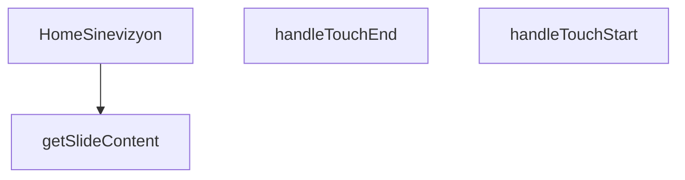

## Genel Bakış
HomeSinevizyon modülü, projenin ana ekranında yer alan ve dokunmatik etkileşimlerle slaytlar arasında geçiş yapılabilen dinamik bir sinevizyon (banner) bileşenidir. Her slayt için başlık, açıklama ve eylem butonu gibi içerikleri indeks bazlı olarak sağlar ve kullanıcı “Alıntı Al” butonuna tıkladığında ana uygulamaya bildirim gönderir.

## Fonksiyon Grupları
### Ana Bileşen ve Koordinasyon
Sinevizyonun tüm işlevlerini bir araya getiren üst düzey React bileşenidir. State yönetimi, dokunma olayları, içerik oluşturma ve dışarıya bildirim gönderme gibi temel akışları koordine eder.
- HomeSinevizyon

### Dokunmatik Etkileşim İşleme
Kullanıcının ekrana dokunma başlangıç ve bitiş anlarını yakalayarak slayt geçişlerini tetikler. Bu sayede mobil cihazlarda akıcı bir kaydırma deneyimi sunulur.
- handleTouchStart, handleTouchEnd

### Dinamik Slayt İçerik Oluşturma
Verilen slayt numarasına göre o slayta ait başlık, açıklama, resim ve diğer bileşenleri üreten yardımcı fonksiyondur. İçerik yönetimini merkezileştirerek kod tekrarını önler.
- getSlideContent

---

## AXIOMS – Mimari Varsayımlar

Bu modül, dokunmatik slayt gösterimi sunan React bileşeninin doğru çalışması için aşağıdaki mimari varsayımları gerektirir.

[Aksiyom 1]: Eğer `onQuoteClick` bir çağrılabilir fonksiyon (callback) olarak sağlanmıyorsa, kullanıcı slaytlardaki "Alıntı" butonuna tıkladığında çalışma zamanı hatası oluşur ve teklif akışı tetiklenemez.

[Aksiyom 2]: Eğer `slidesData` sabit dizisi tanımlı veya boş (`undefined`/boş dizi) ise, sinevizyon hiçbir slayt gösteremeyerek boş/beklenmeyen bir durum sergiler.

[Aksiyom 3]: Eğer `getSlideContent` fonksiyonuna geçirilen `index` parametresi `slidesData` dizisinin geçerli indeks aralığının (0 ≤ index < slidesData.length) dışında ise, fonksiyon geçersiz slayt içeriği (`undefined`) döndürür ve bileşen hatalı render edilir.

[Aksiyom 4]: Eğer `handleTouchStart` veya `handleTouchEnd` fonksiyonlarına `React.TouchEvent` dışı bir nesne geçirilirse, dokunmatik kayma (swipe) hesaplaması doğru yapılamaz ve slayt geçişi bozulur.

[Aksiyom 5]: Eğer `slidesData` dizisindeki her bir elemanın slayt gösterimi için gerekli alanları (örn: başlık, açıklama, görsel yolu) eksik ise, `getSlideContent` hatalı veya eksik içerik render eder.

---

## FONKSİYON DETAYLARI

### HomeSinevizyon
**Ne yapar**: Ana sayfadaki sinevizyon (banner) bölümünü oluşturan React bileşenidir. Hero alanındaki slaytları, başlık, alt başlık, etiket ve CTA butonlarını render eder. Konum bazlı içerik gösterimi ve dokunmatik kaydırma desteği sağlar.

**Nasıl yapar**: `onQuoteClick` prop’u ile isteğe bağlı bir callback alır. Bileşen içinde tanımlı slayt listesini (`slides` dizisi) `currentSlide` state’i ile yönetir. `getSlideContent` yardımcısı ile her indeksin içeriğini alır; `.map()` ile slayt içeriklerini render eder. Dokunma olayları (`handleTouchStart`, `handleTouchEnd`) ile sağ-sol kaydırmayı algılar ve slayt geçişlerini tetikler. Geçiş animasyonları CSS sınıfları (opacity, translate, transition) ile yönetilir.

**Parametreler**:
- `onQuoteClick`: `(() => void)` — İsteğe bağlı (opsiyonel). İkincil CTA butonu tıklandığında çalıştırılacak callback. Verilmezse `window.openLeadModal()` çağrılır.

**Dönüş**: `React.FC<HomeSinevizyonProps>` — Bileşenin kendisini döndürür, yani bir JSX.Element kümesi oluşturan fonksiyon.

### handleTouchStart
**Ne yapar**: Dokunma başlangıcını yakalayarak kullanıcı tarafından başlatılan bir hareketin (ör. kaydırma) ilk anını kaydeder.  
**Nasıl yapar**: Olay nesnesinden ilk dokunma noktasının koordinatlarını (`clientX`, `clientY`) çıkarır ve bu değerleri bir sonraki hareket adımı için geçici bir state veya ref içinde saklar; böylece `handleTouchEnd` ile karşılaştırarak yön ve mesafe hesaplanabilir.  
**Parametreler**:  
- e: React.TouchEvent — Dokunma başlangıcıyla ilgili tüm touch verilerini içeren SyntheticEvent nesnesi  
**Dönüş**: void — Fonksiyon bir değer döndürmez, sadece yan etkiler (state güncellemesi) yapar

### handleTouchEnd
**Ne yapar**: Dokunma bitişini yakalayarak kullanıcının hareketini tamamlar ve bu hareketin yönüne göre slayt indeksini günceller.  
**Nasıl yapar**: Olay nesnesinden son dokunma noktasının koordinatlarını alır, `handleTouchStart` tarafından saklanan başlangıç koordinatlarıyla farkı hesaplar; bu fark eşik değerini aşarsa (ör. sağa kaydırma) slayt indeksi bir azaltılır veya artırılır, ardından durum güncellenerek yeni slayt gösterilir.  
**Parametreler**:  
- e: React.TouchEvent — Dokunma bitişiyle ilgili tüm touch verilerini içeren SyntheticEvent nesnesi  
**Dönüş**: void — Fonksiyon bir değer döndürmez, sadece durum güncellemesi yapar

### getSlideContent

**Ne yapar**: Verilen slide indeksine karşılık gelen slayt içerik verisini döndürür. Sinevizyonda her bir slaytın gösterileceği metinsel içerikleri (etiket başlığı, ana başlık ve alt başlık) sağlar.

**Nasıl yapar**: Fonksiyon, slide indeksini parametre olarak alır ve bu indekse karşılık gelen slaytın tüm metinsel içerik bileşenlerini içeren bir nesne döndürür. İçerik nesnesi `eyebrow` (üst küçük başlık/tanımlama etiketi), `title` (ana büyük başlık) ve `subtitle` (açıklama metni) alanlarını içerir. Bu yapı, bileşen içinde her slayt için tutarlı bir içerik şablonu sunar.

**Parametreler**:
- `index`: number — Hangi slaytın içeriğinin getirileceğini belirten indeks numarası. 0'dan başlayan sıralı bir değerdir.

**Dönüş**: `{ eyebrow: string, title: string, subtitle: string }` — Slaytın üst etiket metnini, ana başlığını ve açıklama alt başlığını içeren bir nesne döndürür.

---

## INTERFACES

### HomeSinevizyonProps
- `onQuoteClick?: () => void`

### SlideProduct
- `url: string`
- `labelKey: string`
- `subLabelKey: string`
- `link: string`

### SlideData
- `image: string`
- `key: number`
- `products: SlideProduct[]`

---

## SABİTLER
- **slidesData** (array) — `[

  {

    image: '/images/hero_hvac_industrial_premium_1.webp',

    produc...`

---

## AST POINTERS

### [N1_NASIL] AST Pointer: `src/components/home/HomeSinevizyon.tsx::HomeSinevizyon`
- **params**: `{ onQuoteClick }` — tırnak talebi butonuna tıklandığında çağrılan callback fonksiyonu
- **ic_degiskenler**:
  - `t` — `useI18n()` hook'undan dönen çeviri fonksiyonu, i18n key'lerini çeviri metinlerine dönüştürür
  - `currentSlide` — `useState(0)` ile tanımlı, aktif slayt indeksini tutar (0-tabanlı)
  - `isMounted` — `useState(false)` ile tanımlı, bileşenin tarayıcıda mount olup olmadığını kontrol eder (hydration sonrası true olur)
  - `touchStartX` — `useRef<number | null>(null)` ile tanımlı, mobil dokunma başlangıç X koordinatını tutar
  - `isInitialMount` — `useRef(true)` ile tanımlı, ilk mount durumunu takip eder, useEffect içinde false yapılır
  - `paginate` — `useCallback` ile sarılı, `newDirection` parametresi kadar slayt ileri/geri kaydırır; mevcut indeksi `slidesData.length` modülü ile döngüsel olarak hesaplar
  - `handleTouchStart` — React TouchEvent handler'ı, dokunma başlangıç X koordinatını `touchStartX.current`'e kaydeder
  - `handleTouchEnd` — React TouchEvent handler'ı, dokunma bitiş koordinatıyla karşılaştırarak 50px eşik üzeri kaydırma algılar ve slayt değiştirir
  - `getSlideContent` — `index` parametresi ile `slidesData` indeksine karşılık gelen i18n eyebrow, title, subtitle değerlerini dönen fonksiyon
- **Dönüş**: JSX — sinevizyon section elementi (arka plan görselleri, slide içerikleri, ürün görselleri, slayt göstergeleri)

---

### [N2_NASIL] AST Pointer: `src/components/home/HomeSinevizyon.tsx::useEffect_initialMount`
- **params**: yok (boş bağımlılık dizisi `[]`)
- **ic_degiskenler**:
  - Yok
- **Dönüş**: yok — bileşen mount edildiğinde `isMounted`'ı true yapar, `isInitialMount.current`'ı false yapar; temizlik fonksiyonu yoktur

---

### [N3_NASIL] AST Pointer: `src/components/home/HomeSinevizyon.tsx::paginate`
- **params**: `newDirection: number` — slayt yönü (+1 ileri, -1 geri)
- **ic_degiskenler**:
  - Yok
- **Dönüş**: yok — `setCurrentSlide` ile state güncellenir, mevcut indeks + yeni yön + toplam slayt sayısı mod slayt sayısı hesaplanır

---

### [N4_NASIL] AST Pointer: `src/components/home/HomeSinevizyon.tsx::useEffect_autoPlay`
- **params**: yok (bağımlılıklar: `[paginate, isMounted]`)
- **ic_degiskenler**:
  - `timer` — `setInterval` dönen ID'si, 120 saniyede bir `paginate(1)` çağırır; temizlikte `clearInterval` ile durdurulur
- **Dönüş**: cleanup fonksiyonu döner — `timer`'ı temizler

---

### [N5_NASIL] AST Pointer: `src/components/home/HomeSinevizyon.tsx::useEffect_keyDown`
- **params**: yok (bağımlılıklar: `[paginate]`)
- **ic_degiskenler**:
  - `handleKeyDown` — `KeyboardEvent` handler'ı, `ArrowRight` tuşuna basıldığında `paginate(1)`, `ArrowLeft` tuşuna basıldığında `paginate(-1)` çağırır
- **Dönüş**: cleanup fonksiyonu döner — `window`'dan `keydown` event listener'ı kaldırır

---

### [N6_NASIL] AST Pointer: `src/components/home/HomeSinevizyon.tsx::handleKeyDown`
- **params**: `e: KeyboardEvent` — klavye olay nesnesi
- **ic_degiskenler**: Yok
- **Dönüş**: yok — `e.key` değerine göre `paginate` fonksiyonunu çağırır (yan etki)

---

### [N7_NASIL] AST Pointer: `src/components/home/HomeSinevizyon.tsx::handleTouchStart`
- **params**: `e: React.TouchEvent` — dokunma olay nesnesi
- **ic_degiskenler**: Yok
- **Dönüş**: yok — `e.touches[0].clientX` değerini `touchStartX.current`'e atar (yan etki)

---

### [N8_NASIL] AST Pointer: `src/components/home/HomeSinevizyon.tsx::handleTouchEnd`
- **params**: `e: React.TouchEvent` — dokunma olay nesnesi
- **ic_degiskenler**:
  - `touchEndX` — `e.changedTouches[0].clientX` değerinden hesaplanan dokunma bitiş X koordinatı
  - `diff` — `touchStartX.current - touchEndX` hesaplaması ile başlangıç ve bitiş arasındaki yatay fark
- **Dönüş**: yok — `Math.abs(diff) > 50` eşik kontrolü sonrası pozitif ise `paginate(1)`, negatif ise `paginate(-1)` çağırır; `touchStartX.current` sıfırlanır

---

### [N9_NASIL] AST Pointer: `src/components/home/HomeSinevizyon.tsx::getSlideContent`
- **params**: `index: number` — slayt indeks numarası
- **ic_degiskenler**: Yok
- **Dönüş**: `{ eyebrow: string, title: string, subtitle: string }` — i18n çevirileri ile doldurulan obje; her alan fallback değerine sahiptir (`'VentHub Engineering'`, `'High Performance HVAC'`, `'Advanced solutions for industrial ventilation.'`)

---

### [N10_NASIL] AST Pointer: `src/components/home/HomeSinevizyon.tsx::onClick_quoteButton`
- **params**: yok (inline arrow fonksiyon)
- **ic_degiskenler**: Yok
- **Dönüş**: yok — `onQuoteClick` varsa çağrılır; yoksa `typeof window !== "undefined"` kontrolü sonrası `window.openLeadModal?.()` çağrılır

---

### [N11_NASIL] AST Pointer: `src/components/home/HomeSinevizyon.tsx::map_slidesData_background`
- **params**: `slide` — slidesData dizisindeki slayt objesi (image, key, products alanları), `idx` — slayt indeksi
- **ic_degiskenler**: Yok
- **Dönüş**: `null` (eğer `idx === 0` ise, çünkü slide 0 statik olarak ayrı render edilir) veya JSX `
` elementi (slide görseli + overlay katmanları)

---

### [N12_NASIL] AST Pointer: `src/components/home/HomeSinevizyon.tsx::map_slidesData_content`
- **params**: `slide` — slidesData dizisindeki slayt objesi, `idx` — slayt indeksi
- **ic_degiskenler**:
  - `currentContent` — `getSlideContent(idx)` çağrısıyla dönen `{ eyebrow, title, subtitle }` objesi
- **Dönüş**: JSX `
` elementi — slayt başlık, alt başlık ve CTA butonları içeren içerik bloğu

---

### [N13_NASIL] AST Pointer: `src/components/home/HomeSinevizyon.tsx::map_airFlowParticles`
- **params**: `_` — kullanılmayan eleman (undefined), `i` — dizi indeksi (0-5 arası)
- **ic_degiskenler**: Yok
- **Dönüş**: JSX `
` elementi — CSS animasyonlu hava akışı partikülü; `top` stili `${20 + i * 15}%`, `animationDelay` stili `${i * 0.5}s` hesaplanır

---

### [N14_NASIL] AST Pointer: `src/components/home/HomeSinevizyon.tsx::map_slidesData_products`
- **params**: `slide` — slidesData dizisindeki slayt objesi, `slideIdx` — slayt indeksi
- **ic_degiskenler**: Yok
- **Dönüş**: JSX `
` elementi — slaytın `products` dizisini map eden container; aktif slayt kontrolü ile opacity/scale/z-index değerleri dinamik hesaplanır

---

### [N15_NASIL] AST Pointer: `src/components/home/HomeSinevizyon.tsx::map_slideProducts`
- **params**: `p` — `slide.products` dizisindeki ürün objesi (`url`, `link`, `labelKey`, `subLabelKey` alanları), `i` — ürün indeksi (0 veya 1)
- **ic_degiskenler**: Yok
- **Dönüş**: JSX `
` elementi — ürün görseli (`p.url`), HUD etiketi (`t(p.labelKey)`, `t(p.subLabelKey)`), Link (`p.link`), animasyonlu float efekti (`animation: float ${5 + i}s`)

---

### [N16_NASIL] AST Pointer: `src/components/home/HomeSinevizyon.tsx::map_slideIndicators`
- **params**: `_` — kullanılmayan eleman, `idx` — slayt indeksi
- **ic_degiskenler**: Yok
- **Dönüş**: JSX `<button>` elementi — slayt göstergesi butonu; tıklandığında `setCurrentSlide(idx)` çağrılır, `idx === currentSlide` kontrolü ile aktif gösterge genişliği ve rengi değişir

---

## MERMAID CALL GRAPH

## NODE ID STANDARD

  file: src\components\home\HomeSinevizyon.tsx
  function: src\components\home\HomeSinevizyon.tsx::HomeSinevizyon
  function: src\components\home\HomeSinevizyon.tsx::handleTouchStart
  function: src\components\home\HomeSinevizyon.tsx::handleTouchEnd
  function: src\components\home\HomeSinevizyon.tsx::getSlideContent

---

## DISA AKTARILANLAR (EXPORTS)
  export: HomeSinevizyon

---

## STİL TOKENLERİ

### Arbitrary Değerler (token'a geçirilmemiş)
Yok — tüm stiller token'a geçirilmiş. ✅

### Kullanılan Token'lar (zaten token'a geçirilmiş)
- `hover:shadow-glow-lg`, `hover:shadow-glow-md`, `shadow-glow-sm`, `tracking-hvac-loose`, `tracking-hvac-normal`, `tracking-hvac-relaxed`

### Tailwind Sınıf Özeti
- **Renkler:** `bg-cyan-400`, `bg-cyan-500`, `bg-cyan-500/10`, `bg-gradient-to-r`, `bg-gradient-to-t`, `bg-slate-900/40`, `bg-slate-950`, `bg-slate-950/60`, `bg-white/10`, `bg-white/20`, `bg-white/5`, `border-b`, `border-cyan-400/10`, `border-cyan-400/60`, `border-cyan-500/20`
- **Layout:** `-left-24`, `-right-24`, `absolute`, `backdrop-blur-md`, `backdrop-blur-xl`, `block`, `bottom-0`, `bottom-10`, `drop-shadow-sinevizyon-drop`, `flex`, `flex-1`, `flex-col`, `from-slate-950/80`, `from-slate-950/90`, `from-transparent`
- **Varyant/Responsive:** `:`, `focus-visible:`, `group-hover:`, `hover:`, `lg:`, `sm:` önekleri
- **Yardımcı Sınıflar:** `$`, `${i`, `${idx`, `-translate-x-8`, `-translate-y-1/2`, `0`, `:`, `===`, `animate-pulse`, `animate-scan-slow`, `blur-1`, `border`, `contain-layout`, `currentSlide`, `delay-300`