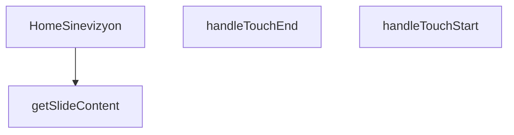

## Genel Bakış
Bu modül, HVAC projesinin ana ekranında dinamik slayt gösterisi (sinevizyon) sunan bir React bileşeni tanımlar. Kullanıcıların dokunmatik hareketlerle slaytlar arasında geçiş yapmasını sağlarken, her slayt için uygun içeriği dinamik olarak oluşturur. Alıntı butonuna tıklandığında dışarıdan aktarılan geri çağırım fonksiyonunu tetikleyerek bileşeni ana uygulama ile entegre eder.

## Fonksiyon Grupları
### Ana Bileşen Yönetimi
Sinevizyonun temel çalışma yapısını oluşturan ana bileşendir, dışarıdan alınan geri çağırımları entegre eder ve tüm alt işlevleri koordine ederek slayt gösterisinin sorunsuz çalışmasını sağlar.
- HomeSinevizyon

### Dokunmatik Etkileşim Yönetimi
Kullanıcının ekrana dokunma başlangıç ve bitiş olaylarını yakalar, bu hareketleri işleyerek slaytlar arasında geçiş işlemini tetikler.
- handleTouchStart, handleTouchEnd

### Slayt İçeriği Yönetimi
Verilen slayt indeksine göre o slaytta gösterilecek tüm içeriği sağlayarak dinamik ve sıralı içerik sunumunu mümkün kılar.
- getSlideContent

---

## AXIOMS – Mimari Varsayımlar
(Sentez hatası)

---

## FONKSİYON DETAYLARI

### HomeSinevizyon
**Ne yapar**: Ana sayfadaki sinevizyon (banner) bölümünü oluşturan React bileşenidir. Hero alanındaki slaytları, başlık, alt başlık, etiket ve CTA butonlarını render eder. Konum bazlı içerik gösterimi ve dokunmatik kaydırma desteği sağlar.

**Nasıl yapar**: `onQuoteClick` prop’u ile isteğe bağlı bir callback alır. Bileşen içinde tanımlı slayt listesini (`slides` dizisi) `currentSlide` state’i ile yönetir. `getSlideContent` yardımcısı ile her indeksin içeriğini alır; `.map()` ile slayt içeriklerini render eder. Dokunma olayları (`handleTouchStart`, `handleTouchEnd`) ile sağ-sol kaydırmayı algılar ve slayt geçişlerini tetikler. Geçiş animasyonları CSS sınıfları (opacity, translate, transition) ile yönetilir.

**Parametreler**:
- `onQuoteClick`: `(() => void)` — İsteğe bağlı (opsiyonel). İkincil CTA butonu tıklandığında çalıştırılacak callback. Verilmezse `window.openLeadModal()` çağrılır.

**Dönüş**: `React.FC<HomeSinevizyonProps>` — Bileşenin kendisini döndürür, yani bir JSX.Element kümesi oluşturan fonksiyon.

### handleTouchStart
**Ne yapar**: Dokunma başlangıcını yakalayarak kullanıcı tarafından başlatılan bir hareketin (ör. kaydırma) ilk anını kaydeder.  
**Nasıl yapar**: Olay nesnesinden ilk dokunma noktasının koordinatlarını (`clientX`, `clientY`) çıkarır ve bu değerleri bir sonraki hareket adımı için geçici bir state veya ref içinde saklar; böylece `handleTouchEnd` ile karşılaştırarak yön ve mesafe hesaplanabilir.  
**Parametreler**:  
- e: React.TouchEvent — Dokunma başlangıcıyla ilgili tüm touch verilerini içeren SyntheticEvent nesnesi  
**Dönüş**: void — Fonksiyon bir değer döndürmez, sadece yan etkiler (state güncellemesi) yapar

### handleTouchEnd
**Ne yapar**: Dokunma bitişini yakalayarak kullanıcının hareketini tamamlar ve bu hareketin yönüne göre slayt indeksini günceller.  
**Nasıl yapar**: Olay nesnesinden son dokunma noktasının koordinatlarını alır, `handleTouchStart` tarafından saklanan başlangıç koordinatlarıyla farkı hesaplar; bu fark eşik değerini aşarsa (ör. sağa kaydırma) slayt indeksi bir azaltılır veya artırılır, ardından durum güncellenerek yeni slayt gösterilir.  
**Parametreler**:  
- e: React.TouchEvent — Dokunma bitişiyle ilgili tüm touch verilerini içeren SyntheticEvent nesnesi  
**Dönüş**: void — Fonksiyon bir değer döndürmez, sadece durum güncellemesi yapar

### getSlideContent
**Ne yapar**: Verilen slayt indeksine karşılık gelen içeriği (ör. görüntü, metin, alıntı) döndürerek bileşenin render edeceği öğeyi hazırlar.  
**Nasıl yapar**: İndex parametresini kullanarak önceden tanımlanmış bir veri dizisi veya yapıdan ilgili slayt nesnesini seçer; bu nesne genellikle `image`, `text`, `quote` gibi alanları içerir ve bu alanlar JSX olarak dönüştürülerek return edilir.  
**Parametreler**:  
- index: number — Gösterilecek slaytın sıfır tabanlı pozisyonu  
**Dönüş**: JSX.Element veya null — Belirtilen indekse ait slayt içeriğini temsil eden React elementi; geçersiz indeks için null döndürülebilir.

---

## INTERFACES

### HomeSinevizyonProps
- `onQuoteClick?: () => void`

### SlideProduct
- `url: string`
- `labelKey: string`
- `subLabelKey: string`
- `link: string`

### SlideData
- `image: string`
- `key: number`
- `products: SlideProduct[]`

---

## SABİTLER
- **slidesData** (array) — `[

  {

    image: '/images/hero_hvac_industrial_premium_1.webp',

    produc...`

---

## AST POINTERS

### [N1_NASIL] AST Pointer: src/components/home/HomeSinevizyon.tsx::HomeSinevizyon
- **params**: (`{ onQuoteClick }`)
- **ic_degiskenler**:
  - `t` — `useI18n()` hook’den gelen çeviri fonksiyonu, metinleri yerelleştirmek için kullanılır.
  - `currentSlide` — `useState(0)` ile tanımlanan mevcut slayt indeksini tutar.
  - `setCurrentSlide` — `currentSlide` değerini güncelleyen state setter fonksiyonu.
  - `isMounted` — bileşenin DOM’a monte edilip edilmediğini izleyen boolean state.
  - `setIsMounted` — `isMounted` değerini güncelleyen state setter fonksiyonu.
  - `touchStartX` — `useRef<number | null>(null)` ile tanımlanan dokunma başlangıç X koordinatını saklayan ref.
  - `isInitialMount` — `useRef(true)` ile tanımlanan, bileşenin ilk render’ı olup olmadığını izleyen ref.
  - `paginate` — `useCallback` içinde tanımlanan, `newDirection` parametresiyle `currentSlide`ı kaydıran fonksiyon.
  - `timer` — otomatik slayt geçişi için `setInterval` tarafından döndürülen zamanlayıcı kimliği; effect temizleme fonksiyonunda `clearInterval(timer)` ile iptal edilir.
  - `handleKeyDown` — klavye ok tuşlarını dinleyen ve `paginate` çağıran yerel fonksiyon; `window.addEventListener`/`removeEventListener` ile yönetilir.
- **Dönüş**: React element (JSX) döndürür; bileşen yan etkileri olarak zamanlayıcı, klavye ve dokunma event listener’ları kurar.

### [N2_NASIL] AST Pointer: src/components/home/HomeSinevizyon.tsx::handleTouchStart
- **params**: (`e: React.TouchEvent`)
- **ic_degiskenler**:
  - `touchStartX` — dış scope’tan gelen `useRef` objesi; `e.touches[0].clientX` değeriyle güncellenir.
- **Dönüş**: yok (fonksiyon sadece `touchStartX.current` değerini ayarlar).

### [N3_NASIL] AST Pointer: src/components/home/HomeSinevizyon.tsx::handleTouchEnd
- **params**: (`e: React.TouchEvent`)
- **ic_degiskenler**:
  - `touchStartX` — dış scope’tan gelen `useRef`; başlangıç koordinatı kontrol edilir.
  - `touchEndX` — `e.changedTouches[0].clientX` ile elde edilen dokunma bitiş X koordinatı.
  - `diff` — `touchStartX.current - touchEndX` farkı; kaydırma yönünü belirlemek için kullanılır.
- **Dönüş**: yok (gerektiğinde `paginate` çağırır, ardından `touchStartX.current`i `null` yapar).

### [N4_NASIL] AST Pointer: src/components/home/HomeSinevizyon.tsx::getSlideContent
- **params**: (`index: number`)
- **ic_degiskenler**:
  - `t` — dış scope’tan gelen çeviri fonksiyonu.
  - `eyebrow` — `t('home.hero.sinevizyon.slides.${index}.eyebrow')` sonucunu veya varsayılan `'VentHub Engineering'` değerini tutar.
  - `title` — `t('home.hero.sinevizyon.slides.${index}.title')` sonucunu veya varsayılan `'High Performance HVAC'` değerini tutar.
  - `subtitle` — `t('home.hero.sinevizyon.slides.${index}.subtitle')` sonucunu veya varsayılan `'Advanced solutions for industrial ventilation.'` değerini tutar.
- **Dönüş**: `{ eyebrow, title, subtitle }` nesnesi (slide içeriği).

---

## MERMAID CALL GRAPH

## NODE ID STANDARD

  file: src\components\home\HomeSinevizyon.tsx
  function: src\components\home\HomeSinevizyon.tsx::HomeSinevizyon
  function: src\components\home\HomeSinevizyon.tsx::handleTouchStart
  function: src\components\home\HomeSinevizyon.tsx::handleTouchEnd
  function: src\components\home\HomeSinevizyon.tsx::getSlideContent

---

## DISA AKTARILANLAR (EXPORTS)
  export: HomeSinevizyon

---

## STİL TOKENLERİ

### Arbitrary Değerler (token'a geçirilmemiş)
Yok — tüm stiller token'a geçirilmiş. ✅

### Kullanılan Token'lar (zaten token'a geçirilmiş)
- `hover:shadow-glow-lg`, `hover:shadow-glow-md`, `shadow-glow-sm`, `tracking-hvac-loose`, `tracking-hvac-normal`, `tracking-hvac-relaxed`

### Tailwind Sınıf Özeti
- **Renkler:** `bg-cyan-400`, `bg-cyan-500`, `bg-cyan-500/10`, `bg-gradient-to-r`, `bg-gradient-to-t`, `bg-slate-900/40`, `bg-slate-950`, `bg-slate-950/60`, `bg-white/10`, `bg-white/20`, `bg-white/5`, `border-b`, `border-cyan-400/10`, `border-cyan-400/60`, `border-cyan-500/20`
- **Layout:** `-left-24`, `-right-24`, `absolute`, `backdrop-blur-md`, `backdrop-blur-xl`, `block`, `bottom-0`, `bottom-10`, `drop-shadow-sinevizyon-drop`, `flex`, `flex-1`, `flex-col`, `from-slate-950/80`, `from-slate-950/90`, `from-transparent`
- **Varyant/Responsive:** `:`, `focus-visible:`, `group-hover:`, `hover:`, `lg:`, `sm:` önekleri
- **Yardımcı Sınıflar:** `$`, `${i`, `${idx`, `-translate-x-8`, `-translate-y-1/2`, `0`, `:`, `===`, `animate-pulse`, `animate-scan-slow`, `blur-1`, `border`, `contain-layout`, `currentSlide`, `delay-300`