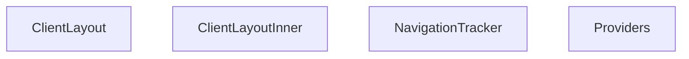

## Genel Bakış
Bu modül, istemci tarafı uygulamanın temel yapı taşlarını bir araya getiren layout bileşenlerini tanımlar. Uygulama genelindeki bağlam sağlayıcılarını yapılandırır, gezinti olaylarını izler ve sayfa düzeninin katmanlı yapısını oluşturur.

## Fonksiyon Grupları
### Bağlam Sağlayıcıları
Uygulama genelinde kullanılacak olan durum yönetimi ve servis sağlayıcılarını sıralı bir yapıda çocukların üzerine sararak, tüm alt bileşenlerin bu verilere erişmesini sağlar.
- Providers

### Gezinti İzleme
URL değişimlerini ve sayfa geçişlerini izleyen bileşendir; böylece uygulama içindeki gezinti olayları takip edilebilir hale gelir.
- NavigationTracker

### Düzen Bileşenleri
Sayfa yapısının dış ve iç katmanlarını oluşturur; dış bileşen genel çerçeveyi tanımlarken, iç bileşen içerik alanının yerleşimini ve stillendirilmesini yönetir.
- ClientLayout, ClientLayoutInner

---

## AXIOMS – Mimari Varsayımlar

Bu modül için fonksiyon gövdeleri paylaşılmadığından, yalnızca fonksiyon imzalarından çıkarılabilecek minimal varsayımlar tanımlanmıştır.

[Aksiyom 1]: Eğer `Providers` bileşeni çağrıldığında `children` prop'u sağlanmazsa, sağlayıcılar içinde render edilecek hiçbir içerik olmayacağından uygulama içeriği görünmez hale gelir.

[Aksiyom 2]: Eğer `NavigationTracker` bileşeni `usePathname` veya benzeri bir Next.js navigasyon hook'u kullanıyorsa ve bu hook providers zincirinin dışında çağrılırsa, bileşen doğru gezinti bilgisini alamaz ve navigasyon izleme çalışmaz.

[Aksiyom 3]: Eğer `ClientLayoutInner` bileşeni çağrıldığında `children` prop'u sağlanmazsa, layout içinde sayfa içeriği render edilmez ve boş bir sayfa görüntülenir.

[Aksiyom 4]: Eğer `ClientLayout` bileşeni çağrıldığında `children` prop'u sağlanmazsa, tüm layout yapısı (sağlayıcılar, gezinti izleyici, düzen) boş içeriğe sahip olur.

[Aksiyom 5]: Eğer `Providers` bileşeni, iç içe geçmiş birden fazla context sağlayıcısı kullanıyorsa ve sağlayıcı sırası yanlışatersa, bağımlı sağlayıcılar doğru bağlam değerlerini bulamaz ve hata oluşur.

---

**Not:** Bu modül için detaylı mimari varsayımların üretilebilmesi için fonksiyon gövdelerinin (function bodies) paylaşılması gerekmektedir. Mevcut aksiyonlar yalnızca fonksiyon imza imzalarından ve React bileşen kalıplarından (patterns) türetilmiştir.

---

## FONKSİYON DETAYLARI

### Providers
**Ne yapar**: Uygulama genelinde kullanılacak olan bağlam (context) sağlayıcılarını çocuk bileşenlerin üzerine katmanlar halinde sararak, tüm alt bileşenlerin bu bağlam verilerine erişmesini sağlar.

**Nasıl yapar**: Beş farklı sağlayıcıyı iç içe bir yapıda sıralar: I18nProvider → AuthProvider → CategoryProvider → CartProvider → ProjectProvider. Sıralama önemlidir çünkü dış katmandaki sağlayıcılar, iç katmanlardaki sağlayıcıların verilerine erişebilir. `{children}` en iç katmanda yer alarak tüm bağlam verilerini miras alır.

**Parametreler**:
- `children`: `React.ReactNode` — Bu sağlayıcıların sarmalayacağı tüm alt bileşenlerin düğüm yapısıdır. Tüm uygulama içeriği bu parameter aracılığıyla sağlayıcılara dahil edilir.

**Dönüş**: JSX yapısı döndürür. Doğrudan `{children}` düğümünü, sağlanan bağlam katmanlarının içine yerleştirilmiş biçimde render eder.

### NavigationTracker
**Ne yapar**: `useSearchParams` hook'u üzerinden geçerli URL arama parametrelerini izleyerek navigasyon değişikliklerini takip eder.  
**Nasıl yapar**: Bileşen içinde `useSearchParams` çağrısı yapar, parametrelerdeki değişikliklere yanıt vererek (örneğin bir efekt içinde) gerekli takip veya güncelleme mantığını çalıştırır. Ayrı bir bileşen olarak `Suspense` içinde render edilmesi önerilir, çünkü hook'un asenkron davranışı nedeniyle bekleme süresi olabilir.  
**Parametreler**: *(yok)*  
**Dönüş**: null – fonksiyon herhangi bir görsel çıktı üretmez, sadece yan etkiler (takip) sağlar.

### ClientLayoutInner

**Ne yapar**: Uygulamanın istemci tarafı (client-side) ana layout yapısını oluşturur. Sayfa içeriklerini (`children`) sarmalayan üst düzey layout bileşenidir ve sayfanın alt kısmına çerez onay bannerı ile sayfa navigasyon takipçisini ekler.

**Nasıl yapar**: Fonksiyon, React bileşenleri olan `MainLayout`, `CookieConsent` ve `NavigationTracker`'ı bir araya getirir. `MainLayout` bileşeni içinde `children`'ı render ederek sayfa içeriğini yerleştirir. Ardından `CookieConsent` bileşenini doğrudan ekler. `NavigationTracker` bileşenini ise `Suspense` ile sararak yükleme durumunda (`fallback={null}`) herhangi bir UI göstermeden asenktron olarak yüklenmesini sağlar. Bu sayede navigasyon takibi arka planda çalışırken ana sayfa içeriği engellenmemiş olur.

**Parametreler**:
- `children`: `React.ReactNode` — Ana layout içinde render edilecek sayfa içeriği. Bu prop, geçerli rotaya ait tüm alt sayfa bileşenlerini barındırır.

**Dönüş**: JSX elementi döndürür. `MainLayout` içine sarılmış, sayfa içeriği (`children`), çerez onay bileşeni (`CookieConsent`) ve sarmalanmış navigasyon takipçisi (`NavigationTracker`) içeren bir React bileşen yapısı döndürür.

### ClientLayout
**Ne yapar**: Uygulama istemci tarafı düzenini oluşturmak için `ClientLayoutInner` bileşenini kullanarak verilen `children` öğesini sarmalar.  
**Nasıl yapar**: Fonksiyon, `ClientLayoutInner` bileşenini render eder ve içine `children` prop'ını yerleştirir; bu sayfa düzeninin temel yapısını sağlar.  
**Parametreler**:  
- children: React.ReactNode — Düzen içinde gösterilecek içerik  
**Dönüş**: JSX elementi – `<ClientLayoutInner>{children}</ClientLayoutInner>` şeklinde bir ağaç döndürür.

---

## AST POINTERS

### [N1_NASIL] AST Pointer: src/components/layout/ClientLayout.tsx::Providers
- **params**: `{ children }: { children: React.ReactNode }` — React alt elemanları
- **ic_degiskenler**: (yok — sadece JSX döner)
- **Dönüş**: JSX — I18nProvider > AuthProvider > CategoryProvider > CartProvider > ProjectProvider ile sarmalanmış children

---

### [N2_NASIL] AST Pointer: src/components/layout/ClientLayout.tsx::NavigationTracker
- **params**: (parametre yok)
- **ic_degiskenler**:
  - `pathname` — `usePathname()` hook'undan gelen mevcut URL yolu, navigasyon stack mantığında birincil belirleyici
  - `searchParams` — `useSearchParams()` hook'undan gelen URL arama parametreleri, currentFullPath oluşturmada kullanılır
  - `handlePopState` — popstate eventi tetiklendiğinde `sessionStorage`'a `'vh_is_pop'` flag'ini `'true'` olarak yazan callback, geri butonu tespiti için
  - `handleInteraction` — mousedown ve keydown eventlerinde `sessionStorage`'a `'vh_is_pop'` flag'ini `'false'` olarak yazan callback, kullanıcı etkileşimi ile geri tuşu ayrımı için
  - `updateStack` — navigasyon geçmişini `sessionStorage` anahtarı `'vh_nav_stack'` altında JSON array olarak yöneten ana mantık fonksiyonu
  - `search` — `searchParams?.toString() || ''` ile elde edilen query string, currentFullPath birleştirmesinde kullanılır
  - `hash` — `window.location.hash || ''` ile elde edilen URL fragment, currentFullPath birleştirmesinde kullanılır
  - `currentFullPath` — pathname + search + hash birleşiminden oluşan tam URL yolu, stack karşılaştırmalarında kullanılır
  - `stack` — `JSON.parse(sessionStorage.getItem('vh_nav_stack') || '[]')` ile okunan navigasyon geçmişi dizisi, maksimum 10 eleman tutulur
  - `lastItem` — `stack[stack.length - 1]` ile alınan son navigasyon girişi, mevcut sayfa ile aynıysa stack değiştirilmez
  - `secondLastItem` — `stack[stack.length - 2]` ile alınan sondan bir önceki navigasyon girişi, geri gidilen sayfa tespiti için kullanılır
- **Dönüş**: `null` — bileşen JSX üretmez, yan etkisi olarak sessionStorage'da navigasyon geçmişini tutar

---

### [N3_NASIL] AST Pointer: src/components/layout/ClientLayout.tsx::ClientLayoutInner
- **params**: `{ children }: { children: React.ReactNode }` — React alt elemanları
- **ic_degiskenler**: (yok — sadece JSX döner)
- **Dönüş**: JSX — MainLayout içine children, CookieConsent ve Suspense ile sarılmış NavigationTracker döner

---

### [N4_NASIL] AST Pointer: src/components/layout/ClientLayout.tsx::ClientLayout
- **params**: `{ children }: { children: React.ReactNode }` — React alt elemanları
- **ic_degiskenler**: (yok — sadece JSX döner)
- **Dönüş**: JSX — ClientLayoutInner içine children sarmalanarak döner

---

## MERMAID CALL GRAPH

## NODE ID STANDARD

  file: src\components\layout\ClientLayout.tsx
  function: src\components\layout\ClientLayout.tsx::Providers
  function: src\components\layout\ClientLayout.tsx::NavigationTracker
  function: src\components\layout\ClientLayout.tsx::ClientLayoutInner
  function: src\components\layout\ClientLayout.tsx::ClientLayout

---

## DISA AKTARILANLAR (EXPORTS)
  export: ClientLayout
  export: ClientLayoutInner
  export: NavigationTracker
  export: Providers

---

## STİL TOKENLERİ

### Arbitrary Değerler (token'a geçirilmemiş)
Yok — tüm stiller token'a geçirilmiş. ✅

### Kullanılan Token'lar (zaten token'a geçirilmiş)
- (yok)

### Tailwind Sınıf Özeti
- **Renkler:** (yok)
- **Layout:** (yok)
- **Varyant/Responsive:** (yok)
- **Yardımcı Sınıflar:** (yok)