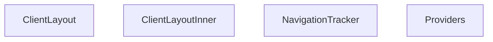

## Genel Bakış
Bu modül, istemci tarafı uygulamanın temel yerleşim ve altyapı katmanlarını tanımlar. Uygulama genelindeki tüm çocukların erişeceği bağlam sağlayıcılarını yapılandırır, gezinti olaylarını merkezi olarak izler ve sayfa düzeninin dış-iç katmanlarını oluşturur.

## Fonksiyon Grupları
### Bağlam ve Yapılandırma
Uygulama genelinde kullanılacak olan durum yönetimi ve servis sağlayıcılarını sıralı bir yapıda çocukların üzerine sararak, tüm alt bileşenlerin bu verilere erişmesini sağlar.
- Providers

### Gezinti İzleme
URL değişimlerini ve sayfa geçişlerini izleyen bağımsız bir bileşendir; böylece uygulama içindeki gezinti olayları takip edilebilir ve tetiklenebilir hale gelir.
- NavigationTracker

### Düzen Katmanları
Sayfa yapısının dış ve iç katmanlarını oluşturur. Dış katman (ClientLayout) genel sayfa çerçevesini ve sağlayıcıları sararken, iç katman (ClientLayoutInner) içerik alanının yerleşimini, düzenini ve alt bileşenlerin (örn. gezinti izleyici) konumunu yönetir.
- ClientLayout, ClientLayoutInner

---

## AXIOMS – Mimari Varsayımlar
- Bu modül davranışsal mantık içermez (salt veri / konfigürasyon / tip tanımı).
- [Aksiyom 1]: Modülün dışa açtığı yapı (anahtar kümesi / şema) bir sözleşmedir; tüketiciler bu sabit yapıya bağlıdır — kırıcı değişiklik tüm tüketicileri etkiler.
- [Aksiyom 2]: Bir öğe ekleme/çıkarma yapısal-uyumlu olmalı; ilgili tipler ve seçiciler aynı commit'te güncel tutulmalıdır.

---

## FONKSİYON DETAYLARI

### Providers

**Ne yapar**: Uygulamanın tüm context provider'larını bir araya getirerekchildren bileşenini saran üst seviye bir sarıcı (wrapper) bileşendir. Bu yapı sayesinde uygulama genelinde Supabase bağlantısı, dil desteği, kimlik doğrulama, kategori verileri, sepet ve proje verileri gibi servisler tek bir noktadan yönetilir.

**Nasıl yapar**: Provider'ları iç içe nesting (yapısal katmanlama) yaparakhiyerarşik bir sarmalama oluşturur. En dış katman `SupabaseProvider` ile başlar ve sırasıyla `I18nProvider`, `AuthProvider`, `CategoryProvider`, `CartProvider` ile devam eder. En iç katman olan `ProjectProvider` içerisine `children` yerleştirilerek tüm provider'ların kapsam alanı tanımlanmış olur. Bu yapı, React Context'in doğası gereği iç katmanların dış katmanlara erişebilmesini sağlar.

**Parametreler**:
- `children`: React.ReactNode — Sarılacak alt bileşenlerdir. Tüm provider'ların kapsam alanı içinde yer alacak React elementlerini veya bileşenlerini temsil eder. Genellikle uygulamanın ana bileşen ağacı veya sayfa içerikleri buraya yerleştirilir.

**Dönüş**: JSX Element — Tüm provider'lar ile sarılmış `children` bileşenini döndürür. Return tipi doğrudan React fonksiyonel bileşen dönüşümü olup, `React.ReactElement` veya JSX.Element formatındadır.

### NavigationTracker
**Ne yapar**: `useSearchParams` hook'u üzerinden geçerli URL arama parametrelerini izleyerek navigasyon değişikliklerini takip eder.  
**Nasıl yapar**: Bileşen içinde `useSearchParams` çağrısı yapar, parametrelerdeki değişikliklere yanıt vererek (örneğin bir efekt içinde) gerekli takip veya güncelleme mantığını çalıştırır. Ayrı bir bileşen olarak `Suspense` içinde render edilmesi önerilir, çünkü hook'un asenkron davranışı nedeniyle bekleme süresi olabilir.  
**Parametreler**: *(yok)*  
**Dönüş**: null – fonksiyon herhangi bir görsel çıktı üretmez, sadece yan etkiler (takip) sağlar.

### ClientLayoutInner
**Ne yapar**: Uygulamanın istemci tarafı düzen yapısını oluşturan bir React bileşenidir. Ana düzen bileşeni içinde çocuk bileşenleri, çerez onay mekanizmasını, rızaya bağlı analitik izlemeyi ve gezinme takipçisini bir araya getirir.

**Nasıl yapar**: `MainLayout` bileşeni ile tüm içeriği sarmalar. Önce `children` prop'u olarak gelen alt bileşenleri render eder. Ardından `CookieConsent` bileşenini ekleyerek çerez onay mekanizmasını devreye sokar. `ConsentGatedAnalytics` bileşeni, yorumda belirtildiği üzere `NEXT_PUBLIC_GA_ID` ortam değişkeni yoksa VEYA kullanıcı rızası yoksa hiçbir şey yüklemez (T020-VH referansı). Son olarak `NavigationTracker` bileşeni, `Suspense` ile sarılarak asenkron yükleme sırasında herhangi bir fallback gösterilmeden (`fallback={null}`) eklenir.

**Parametreler**:
- children: React.ReactNode — Bileşenin içinde render edilecek alt bileşenler veya içerik

**Dönüş**: Belirtilmemiş. JSX yapısı döndürdüğü gözlemlenmektedir ancak dönüş tipi hakkında kesin bir bilgi kaynakta yer almamaktadır.

### ClientLayout
**Ne yapar**: Uygulama istemci tarafı düzenini oluşturmak için `ClientLayoutInner` bileşenini kullanarak verilen `children` öğesini sarmalar.  
**Nasıl yapar**: Fonksiyon, `ClientLayoutInner` bileşenini render eder ve içine `children` prop'ını yerleştirir; bu sayfa düzeninin temel yapısını sağlar.  
**Parametreler**:  
- children: React.ReactNode — Düzen içinde gösterilecek içerik  
**Dönüş**: JSX elementi – `<ClientLayoutInner>{children}</ClientLayoutInner>` şeklinde bir ağaç döndürür.

---

## İTHALATLAR (IMPORTS)
- import: ../../contexts/AuthContext::AuthProvider
- import: ../../contexts/CartProvider::CartProvider
- import: ../../contexts/CategoryContext::CategoryProvider
- import: ../../contexts/ProjectProvider::ProjectProvider
- import: ../../i18n/I18nProvider::I18nProvider
- import: ./CookieConsent::CookieConsent
- import: ./MainLayout::MainLayout
- import: @/components/analytics/ConsentGatedAnalytics::ConsentGatedAnalytics
- import: @/providers/SupabaseProvider::SupabaseProvider
- import: next/navigation::usePathname
- import: next/navigation::useSearchParams
- import: react::React
- import: react::Suspense
- import: react::useEffect

---

## AST POINTERS

### [N1_NASIL] AST Pointer: src/components/layout/ClientLayout.tsx::Providers
- **params**: `{ children }: { children: React.ReactNode }` — sarmalanacak alt bileşenler
- **ic_degiskenler**: yok (yalnızca JSX return eder)
- **Dönüş**: JSX ağacı — `SupabaseProvider` > `I18nProvider` > `AuthProvider` > `CategoryProvider` > `CartProvider` > `ProjectProvider` > `{children}` sıralamasıyla sarmalanmış React elementi

### [N2_NASIL] AST Pointer: src/components/layout/ClientLayout.tsx::NavigationTracker
- **params**: yok
- **ic_degiskenler**:
  - `pathname` — `usePathname()` hook'undan alınan mevcut URL yolu
  - `searchParams` — `useSearchParams()` hook'undan alınan mevcut sorgu parametreleri nesnesi
  - `handlePopState` — `popstate` tarayıcı olayını dinleyen geri çağırma; `sessionStorage`'da `'vh_is_pop'` anahtarını `'true'` olarak ayarlar
  - `handleInteraction` — `mousedown` ve `keydown` olaylarını dinleyen geri çağırma; `sessionStorage`'da `'vh_is_pop'` anahtarını `'false'` olarak ayarlar
  - `updateStack` — navigasyon geçmişini `sessionStorage`'da `'vh_nav_stack'` anahtarında güncelleyen fonksiyon
  - `search` — `searchParams?.toString()` sonucu; sorgu parametrelerinin string temsili, yoksa boş dize
  - `hash` — `window.location.hash`; mevcut URL fragment'ı, yoksa boş dize
  - `currentFullPath` — `pathname + (search ? '?' + search : '') + hash` birleşimi; tam URL yolu
  - `stack` — `sessionStorage`'dan `'vh_nav_stack'` anahtarıyla okunan ve JSON.parse ile çözümleme edilen `string[]` dizisi; hata durumunda boş dizi
  - `lastItem` — `stack[stack.length - 1]`; dizinin son elemanı
  - `secondLastItem` — `stack[stack.length - 2]`; dizinin sondan bir önceki elemanı
- **Dönüş**: `null` (yalnızca yan etki: `sessionStorage`'da navigasyon yığını ve pop-state bayrağı güncellenir; `popstate`, `hashchange`, `mousedown`, `keydown` olay dinleyicileri eklenir/kaldırılır)

### [N3_NASIL] AST Pointer: src/components/layout/ClientLayout.tsx::ClientLayoutInner
- **params**: `{ children }: { children: React.ReactNode }` — sarmalanacak alt bileşenler
- **ic_degiskenler**: yok (yalnızca JSX return eder)
- **Dönüş**: JSX ağacı — `MainLayout` içinde `{children}`, `CookieConsent`, `ConsentGatedAnalytics` ve `Suspense` ile sarmalanmış `NavigationTracker` bileşenlerini barındıran React elementi

### [N4_NASIL] AST Pointer: src/components/layout/ClientLayout.tsx::ClientLayout
- **params**: `{ children }: { children: React.ReactNode }` — sarmalanacak alt bileşenler
- **ic_degiskenler**: yok (yalnızca JSX return eder)
- **Dönüş**: JSX ağacı — `ClientLayoutInner` ile sarmalanmış `{children}` içeren React elementi

---

## MERMAID CALL GRAPH

## NODE ID STANDARD

  file: src\components\layout\ClientLayout.tsx
  function: src\components\layout\ClientLayout.tsx::Providers
  function: src\components\layout\ClientLayout.tsx::NavigationTracker
  function: src\components\layout\ClientLayout.tsx::ClientLayoutInner
  function: src\components\layout\ClientLayout.tsx::ClientLayout

---

## DISA AKTARILANLAR (EXPORTS)
  export: ClientLayout
  export: ClientLayoutInner
  export: NavigationTracker
  export: Providers

---

## STİL TOKENLERİ

### Arbitrary Değerler (token'a geçirilmemiş)
Yok — tüm stiller token'a geçirilmiş. ✅

### Kullanılan Token'lar (zaten token'a geçirilmiş)
- (yok)

### Tailwind Sınıf Özeti
- **Renkler:** (yok)
- **Layout:** (yok)
- **Varyant/Responsive:** (yok)
- **Yardımcı Sınıflar:** (yok)