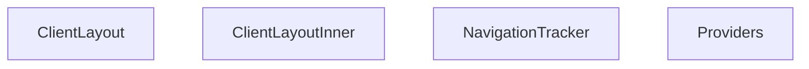

## Genel Bakış
Bu modül, istemci tarafı uygulamanın temel yerleşim ve altyapı katmanlarını tanımlar. Uygulama genelindeki tüm çocukların erişeceği bağlam sağlayıcılarını yapılandırır, gezinti olaylarını merkezi olarak izler ve sayfa düzeninin dış- iç katmanlarını oluşturur.

## Fonksiyon Grupları
### Bağlam ve Yapılandırma
Uygulama genelinde kullanılacak olan durum yönetimi ve servis sağlayıcılarını sıralı bir yapıda çocukların üzerine sararak, tüm alt bileşenlerin bu verilere erişmesini sağlar.
- Providers

### Gezinti İzleme
URL değişimlerini ve sayfa geçişlerini izleyen bağımsız bir bileşendir; böylece uygulama içindeki gezinti olayları takip edilebilir ve tetiklenebilir hale gelir.
- NavigationTracker

### Düzen Katmanları
Sayfa yapısının dış ve iç katmanlarını oluşturur. Dış katman (ClientLayout) genel sayfa çerçevesini ve sağlayıcıları sararken, iç katman (ClientLayoutInner) içerik alanının yerleşimini, düzenini ve alt bileşenlerin (örn. gezinti izleyici) konumunu yönetir.
- ClientLayout, ClientLayoutInner

---

## AXIOMS – Mimari Varsayımlar

Bu modül, istemci tarafı uygulamanın temel yapı taşlarını bir araya getiren layout bileşenlerinden oluşur. Aşağıdaki mimari varsayımlar, bu bileşenlerin doğru çalışması için zorunlu kabul edilir.

**[Aksiyom 1]: Eğer `Providers` bileşeni, uygulamanın üst seviye bileşenlerini sarmıyorsa (veya gerekli bağlam sağlayıcıları içermiyorsa), alt bileşenler

---

## FONKSİYON DETAYLARI

### Providers

**Ne yapar**: Uygulamanın tüm context provider'larını bir araya getirerekchildren bileşenini saran üst seviye bir sarıcı (wrapper) bileşendir. Bu yapı sayesinde uygulama genelinde Supabase bağlantısı, dil desteği, kimlik doğrulama, kategori verileri, sepet ve proje verileri gibi servisler tek bir noktadan yönetilir.

**Nasıl yapar**: Provider'ları iç içe nesting (yapısal katmanlama) yaparakhiyerarşik bir sarmalama oluşturur. En dış katman `SupabaseProvider` ile başlar ve sırasıyla `I18nProvider`, `AuthProvider`, `CategoryProvider`, `CartProvider` ile devam eder. En iç katman olan `ProjectProvider` içerisine `children` yerleştirilerek tüm provider'ların kapsam alanı tanımlanmış olur. Bu yapı, React Context'in doğası gereği iç katmanların dış katmanlara erişebilmesini sağlar.

**Parametreler**:
- `children`: React.ReactNode — Sarılacak alt bileşenlerdir. Tüm provider'ların kapsam alanı içinde yer alacak React elementlerini veya bileşenlerini temsil eder. Genellikle uygulamanın ana bileşen ağacı veya sayfa içerikleri buraya yerleştirilir.

**Dönüş**: JSX Element — Tüm provider'lar ile sarılmış `children` bileşenini döndürür. Return tipi doğrudan React fonksiyonel bileşen dönüşümü olup, `React.ReactElement` veya JSX.Element formatındadır.

### NavigationTracker
**Ne yapar**: `useSearchParams` hook'u üzerinden geçerli URL arama parametrelerini izleyerek navigasyon değişikliklerini takip eder.  
**Nasıl yapar**: Bileşen içinde `useSearchParams` çağrısı yapar, parametrelerdeki değişikliklere yanıt vererek (örneğin bir efekt içinde) gerekli takip veya güncelleme mantığını çalıştırır. Ayrı bir bileşen olarak `Suspense` içinde render edilmesi önerilir, çünkü hook'un asenkron davranışı nedeniyle bekleme süresi olabilir.  
**Parametreler**: *(yok)*  
**Dönüş**: null – fonksiyon herhangi bir görsel çıktı üretmez, sadece yan etkiler (takip) sağlar.

### ClientLayoutInner

**Ne yapar**: Uygulamanın istemci tarafı (client-side) ana layout yapısını oluşturur. Sayfa içeriklerini (`children`) sarmalayan üst düzey layout bileşenidir ve sayfanın alt kısmına çerez onay bannerı ile sayfa navigasyon takipçisini ekler.

**Nasıl yapar**: Fonksiyon, React bileşenleri olan `MainLayout`, `CookieConsent` ve `NavigationTracker`'ı bir araya getirir. `MainLayout` bileşeni içinde `children`'ı render ederek sayfa içeriğini yerleştirir. Ardından `CookieConsent` bileşenini doğrudan ekler. `NavigationTracker` bileşenini ise `Suspense` ile sararak yükleme durumunda (`fallback={null}`) herhangi bir UI göstermeden asenktron olarak yüklenmesini sağlar. Bu sayede navigasyon takibi arka planda çalışırken ana sayfa içeriği engellenmemiş olur.

**Parametreler**:
- `children`: `React.ReactNode` — Ana layout içinde render edilecek sayfa içeriği. Bu prop, geçerli rotaya ait tüm alt sayfa bileşenlerini barındırır.

**Dönüş**: JSX elementi döndürür. `MainLayout` içine sarılmış, sayfa içeriği (`children`), çerez onay bileşeni (`CookieConsent`) ve sarmalanmış navigasyon takipçisi (`NavigationTracker`) içeren bir React bileşen yapısı döndürür.

### ClientLayout
**Ne yapar**: Uygulama istemci tarafı düzenini oluşturmak için `ClientLayoutInner` bileşenini kullanarak verilen `children` öğesini sarmalar.  
**Nasıl yapar**: Fonksiyon, `ClientLayoutInner` bileşenini render eder ve içine `children` prop'ını yerleştirir; bu sayfa düzeninin temel yapısını sağlar.  
**Parametreler**:  
- children: React.ReactNode — Düzen içinde gösterilecek içerik  
**Dönüş**: JSX elementi – `<ClientLayoutInner>{children}</ClientLayoutInner>` şeklinde bir ağaç döndürür.

---

## İTHALATLAR (IMPORTS)
- import: ../../contexts/AuthContext::AuthProvider
- import: ../../contexts/CartProvider::CartProvider
- import: ../../contexts/CategoryContext::CategoryProvider
- import: ../../contexts/ProjectProvider::ProjectProvider
- import: ../../i18n/I18nProvider::I18nProvider
- import: ./CookieConsent::CookieConsent
- import: ./MainLayout::MainLayout
- import: @/providers/SupabaseProvider::SupabaseProvider
- import: next/navigation::usePathname
- import: next/navigation::useSearchParams
- import: react::React
- import: react::Suspense
- import: react::useEffect

---

## AST POINTERS

### [N1_NASIL] AST Pointer: ClientLayout.tsx::Providers
- **params**: `{ children }: { children: React.ReactNode }`
- **ic_degiskenler**:
  - `children` — Alt bileşenler, provider sarmalama zincirinin en içine yerleştirilen React düğümleri
- **Dönüş**: JSX (SupabaseProvider > I18nProvider > AuthProvider > CategoryProvider > CartProvider > ProjectProvider > children sarmalama yapısı)

### [N2_NASIL] AST Pointer: ClientLayout.tsx::NavigationTracker
- **params**: (yok)
- **ic_degiskenler**:
  - `pathname` — `usePathname()` hook'undan gelen mevcut URL path'i, navigasyon yığını güncellemelerinde hangi sayfada olunduğunu belirler
  - `searchParams` — `useSearchParams()` hook'undan gelen URL arama parametreleri, tam yol hesaplamasında query string kısmını oluşturur
  - `handlePopState` — Arrow fonksiyon; tarayıcı geri/ileri butonu ile navigasyonda `sessionStorage`'a `vh_is_pop` = `'true'` yazan event handler
  - `handleInteraction` — Arrow fonksiyon; fare tıklaması veya tuş basımı ile `sessionStorage`'a `vh_is_pop` = `'false'` yazan event handler (capture modunda)
  - `updateStack` — Arrow fonksiyon; mevcut path, search params ve hash'i birleştirerek `vh_nav_stack` session storage anahtarında navigasyon geçmişini yığın olarak yönetir
  - `search` — `searchParams?.toString()` sonucu, URL query string'i (`?key=value` formatında); yol birleştirme için kullanılır
  - `hash` — `window.location.hash`, URL fragment identifier'ı; tam yol hesaplamasında eklenir
  - `currentFullPath` — `pathname`, `search` ve `hash` birleştirilerek oluşturulan tam URL yolu; navigasyon yığınındaki eşleşmeleri kontrol eder
  - `stack` — `string[]` tipinde dizi; `sessionStorage`'dan okunan veya boş dizi ile başlatılan navigasyon geçmiş yığını, `currentFullPath` eklenip/çıkartılarak güncellenir
  - `lastItem` — `stack[stack.length - 1]`, navigasyon yığınının en üstündeki (son eklenen) yol; mevcut yol ile karşılaştırma için kullanılır
  - `secondLastItem` — `stack[stack.length - 2]`, navigasyon yığınının sondan bir önceki yolu; geri navigasyon algılama için kullanılır
- **Dönüş**: `null` (JSX render etmez, sadece yan etki olarak sessionStorage ve event listener yönetimi yapar)

### [N3_NASIL] AST Pointer: ClientLayout.tsx::ClientLayoutInner
- **params**: `{ children }: { children: React.ReactNode }`
- **ic_degiskenler**:
  - `children` — Alt bileşenler, `MainLayout` içine yerleştirilen React düğümleri
- **Dönüş**: JSX (MainLayout sarmalaması içinde children, CookieConsent ve Suspense ile sarılmış NavigationTracker)

### [N4_NASIL] AST Pointer: ClientLayout.tsx::ClientLayout
- **params**: `{ children }: { children: React.ReactNode }`
- **ic_degiskenler**:
  - `children` — Alt bileşenler, `ClientLayoutInner` içine aktarılan React düğümleri
- **Dönüş**: JSX (ClientLayoutInner sarmalaması içinde children)

---

## MERMAID CALL GRAPH

## NODE ID STANDARD

  file: src\components\layout\ClientLayout.tsx
  function: src\components\layout\ClientLayout.tsx::Providers
  function: src\components\layout\ClientLayout.tsx::NavigationTracker
  function: src\components\layout\ClientLayout.tsx::ClientLayoutInner
  function: src\components\layout\ClientLayout.tsx::ClientLayout

---

## DISA AKTARILANLAR (EXPORTS)
  export: ClientLayout
  export: ClientLayoutInner
  export: NavigationTracker
  export: Providers

---

## STİL TOKENLERİ

### Arbitrary Değerler (token'a geçirilmemiş)
Yok — tüm stiller token'a geçirilmiş. ✅

### Kullanılan Token'lar (zaten token'a geçirilmiş)
- (yok)

### Tailwind Sınıf Özeti
- **Renkler:** (yok)
- **Layout:** (yok)
- **Varyant/Responsive:** (yok)
- **Yardımcı Sınıflar:** (yok)