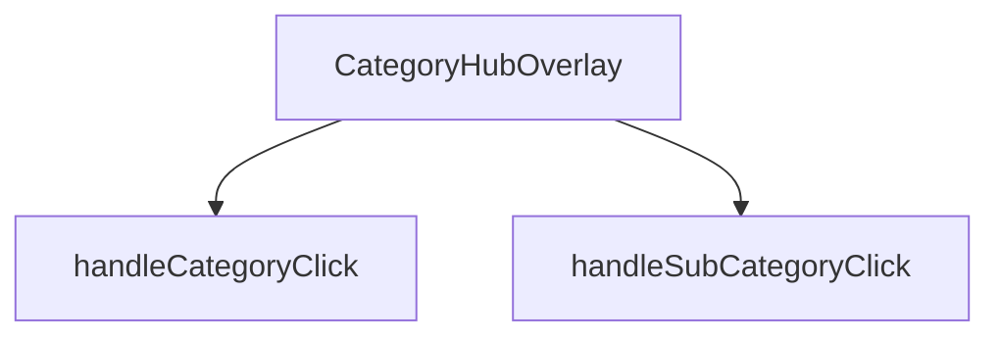

## Genel Bakış
CategoryHubOverlay, kategorileri ve alt kategorileri listeleyen bir kapak/açılır menü bileşenidir. Bileşenin görünürlüğü `isOpen` prop'u ile kontrol edilir ve `onClose` prop'u aracılığıyla kapatma işlemi dışarıya bildirilir.

## Fonksiyon Grupları
### Bileşen Renderlama
Overlay'in açık/kapalı durumuna göre arayüzün oluşturulmasından ve render edilmesinden sorumludur.
- CategoryHubOverlay

### Etkileşim İşleyicileri
Kullanıcının kategori veya alt kategori üzerine tıklamasıyla tetiklenen seçim işlemlerini yönetir.
- handleCategoryClick, handleSubCategoryClick

---

## AXIOMS – Mimari Varsayımlar

Bu modül, bir React kapalı/açılır menü (overlay) bileşenidir ve dışarıdan sağlanan props'lara bağımlıdır.

[Aksiyom 1]: Eğer `isOpen` prop'u sağlanmazsa veya `undefined` ise, bileşenin görünürlük durumu belirsiz olur ve overlay'in doğru şekilde gösterilip gösterilmeyeceği kontrolden çıkar.

[Aksiyom 2]: Eğer `onClose` callback'i sağlanmazsa, kullanıcı overlay'i kapatmak istediğinde kapatma işlemi tetiklenemez ve menü açık kalır (kullanıcı dışarı tıklayarak veya ESC ile kapatamaz).

[Aksiyom 3]: Eğer `handleCategoryClick` çağrısında `category` parametresi `DomainCategory` tipinde bir nesne olarak sağlanmazsa, kategori seçim işlemi hatalı çalışır veya çöker.

[Aksiyom 4]: Eğer `handleSubCategoryClick` çağrısında `subCategory` parametresi `DomainCategory` tipinde bir nesne olarak sağlanmazsa, alt kategori seçim işlemi hatalı çalışır veya çöker.

[Aksiyom 5]: Eğer `isOpen` `true` olarak ayarlandığında `onClose` fonksiyonu çağrılamaz durumdaysa (örn. referans kaybı), overlay açıldıktan sonra programatik olarak kapatılamaz.

---

## FONKSİYON DETAYLARI

### CategoryHubOverlay
**Ne yapar**: Kategori navigasyon hub'ının overlay (katman) bileşenidir. Kullanıcı ana navigasyon menüsünden bir kategori grubuna tıkladığında açılan ve alt kategorileri gösteren tam ekran veya yarı saydam overlay bileşenini render eder.

**Nasıl yapar**: React fonksiyonel bileşeni olarak tanımlanmıştır. Bileşenin görünürlüğünü kontrol eden `isOpen` durumunu ve overlay'ı kapatma işlevini sağlayan `onClose` callback'ini parametre olarak alır. Bileşen, domain kategorilerini ve alt kategorilerini列表leyerek kullanıcıya hiyerarşik navigasyon imkanı sunar.

**Parametreler**:
- isOpen: boolean — Overlay'ın açık olup olmadığını belirten durum bayrağı. true olduğunda bileşen görünür hale gelir.
- onClose: () => void — Overlay kapatma butonuna tıklandığında veya dışarı tıklandığında çağrılacak geri çağırma fonksiyonu.

**Dönüş**: React.FC<CategoryHubOverlayProps> tipinde bir React bileşeni döndürür.

### handleCategoryClick
**Ne yapar**: Bir kategori öğesine tıklandığında çağrılan işleyici fonksiyonudur.  
**Nasıl yapar**: `category` parametresi olarak gelen DomainCategory nesnesini alır ve ilgili kategoriyle ilgili işlemleri (örneğin seçimi, navigasyon veya state güncellemesi) gerçekleştirir.  
**Parametreler**:
- category: DomainCategory — Tıklanan kategori nesnesi  
**Dönüş**: void — Fonksiyon bir değer döndürmez

### handleSubCategoryClick
**Ne yapar**: Bir alt kategori öğesine tıklandığında çağrılan işleyici fonksiyonudur.  
**Nasıl yapar**: `subCategory` parametresi olarak gelen DomainCategory nesnesini alır ve ilgili alt kategoriyle ilgili işlemleri (örneğin seçimi, filtren uygulanması veya state güncellemesi) gerçekleştirir.  
**Parametreler**:
- subCategory: DomainCategory — Tıklanan alt kategori nesnesi  
**Dönüş**: void — Fonksiyon bir değer döndürmez

---

## INTERFACES

### CategoryHubOverlayProps
- `isOpen: boolean`
- `onClose: () => void`

---

## AST POINTERS

### [N1_NASIL] AST Pointer: CategoryHubOverlay.tsx::CategoryHubOverlay
- **params**: `{ isOpen, onClose }` — isOpen: overlay'in açık olup olmadığını belirler, onClose: overlay'i kapatmak için çağrılan callback
- **ic_degiskenler**:
  - `router` — useRouter() hook'undan gelen Next.js router, sayfa yönlendirmeleri için kullanılır
  - `categories` — useCategories() hook'undan gelen tüm kategoriler dizisi, alt kategori sayımlarında ve filtrelemede kullanılır
  - `mainCategories` — useCategories() hook'undan gelen categoryTree alias'ı, üst düzey kategorileri temsil eder
  - `wrapCategory` — useCategoryViewModel() hook'undan gelen fonksiyon, DomainCategory'yi view model'e dönüştürür
  - `isAnimating` — useState<boolean>, overlay animasyon durumunu kontrol eder (scale-y, opacity transitionları)
  - `isVisible` — useState<boolean>, overlay'in DOM'da render edilip edilmeyeceğini kontrol eder
  - `hoveredCategory` — useState<DomainCategory | null>, sol panelde hover edilen kategoriyi tutar, 3D ikon ve açıklama gösterimi için kullanılır
  - `selectedParentCategory` — useState<DomainCategory | null>, tıklanan üst kategoriyi tutar, alt kategori listesine geçiş yapar
  - `getSubCategoryCount` — useCallback ile tanımlı fonksiyon, bir kategorinin alt kategori sayısını döndürür
  - `handleCategoryClick` — useCallback olmayan fonksiyon, kategori tıklamasını yönetir (alt kategori varsa seçim, yoksa yönlendirme)
  - `handleSubCategoryClick` — useCallback olmayan fonksiyon, alt kategori tıklamasında sayfa yönlendirmesi yapar
  - `displayCategories` — selectedParentCategory'e göre filtrelenmiş veya mainCategories olan kategoriler dizisi, JSX'te map ile render edilir
  - `hoveredVm` — hoveredCategory'in wrapCategory() ile oluşturulmuş view model'i, JSX'te displayName ve description olarak kullanılır
- **Dönüş**: JSX elementi veya `null` (isVisible false ise null döner)

### [N2_NASIL] AST Pointer: CategoryHubOverlay.tsx::useEffect (hoveredCategory başlatma)
- **params**: yok
- **ic_degiskenler**:
  (boş — useCallback içinde değişken tanımlanmamış)
- **Dönüş**: yok

### [N3_NASIL] AST Pointer: CategoryHubOverlay.tsx::getSubCategoryCount
- **params**: `parentId: string` — alt kategori sayılacak olan üst kategorinin ID'si
- **ic_degiskenler**:
  (fonksiyon gövdesinde ek değişken yok, doğrudan filter sonucu length döndürür)
- **Dönüş**: `number` — parentId'ye sahip alt kategorilerin sayısı

### [N4_NASIL] AST Pointer: CategoryHubOverlay.tsx::useEffect (isOpen açılış/kapanış yönetimi)
- **params**: yok
- **ic_degiskenler**:
  - `timer` — setTimeout handle'ı, kapanış animasyonu sonrası isVisible'ı false yapar, cleanup'ta temizlenir
- **Dönüş**: cleanup fonksiyonu (clearTimer)

### [N5_NASIL] AST Pointer: CategoryHubOverlay.tsx::requestAnimationFrame callback
- **params**: yok
- **ic_degiskenler**:
  (boş)
- **Dönüş**: yok

### [N6_NASIL] AST Pointer: CategoryHubOverlay.tsx::useEffect (Escape tuşu handler)
- **params**: yok
- **ic_degiskenler**:
  - `handleEsc` — KeyboardEvent handler, Escape tuşuna basıldığında selectedParentCategory varsa geri döner, yoksa onClose() çağırır
- **Dönüş**: cleanup fonksiyonu (keydown listener kaldırılır)

### [N7_NASIL] AST Pointer: CategoryHubOverlay.tsx::handleEsc
- **params**: `e: KeyboardEvent` — klavye olayı nesnesi
- **ic_degiskenler**:
  (boş)
- **Dönüş**: yok

### [N8_NASIL] AST Pointer: CategoryHubOverlay.tsx::useEffect (body overflow yönetimi)
- **params**: yok
- **ic_degiskenler**:
  (boş)
- **Dönüş**: cleanup fonksiyonu (body overflow'u sıfırlar)

### [N9_NASIL] AST Pointer: CategoryHubOverlay.tsx::useEffect cleanup (overflow reset)
- **params**: yok
- **ic_degiskenler**:
  (boş)
- **Dönüş**: yok

### [N10_NASIL] AST Pointer: CategoryHubOverlay.tsx::handleCategoryClick
- **params**: `category: DomainCategory` — tıklanan kategori nesnesi
- **ic_degiskenler**:
  - `subCount` — category.id'ye sahip alt kategorilerin sayısı, 0'dan büyükse alt kategori listesine geçilir
- **Dönüş**: yok

### [N11_NASIL] AST Pointer: CategoryHubOverlay.tsx::handleSubCategoryClick
- **params**: `subCategory: DomainCategory` — tıklanan alt kategori nesnesi
- **ic_degiskenler**:
  (boş — doğrudan selectedParentCategory kontrolü yapılıp router.push çağrılır)
- **Dönüş**: yok

### [N12_NASIL] AST Pointer: CategoryHubOverlay.tsx::IIFE (metric gösterimi)
- **params**: yok
- **ic_degiskenler**:
  - `metadata` — hoveredCategory.metadata'inin CategoryMetadata olarak cast edilmiş hali, metric bilgilerini içerir
  - `metric1` — metadata.metric1 alanının { value, label } nesnesi olarak cast edilmiş hali, ekranda gösterilen istatistik değeri
- **Dönüş**: JSX elementi veya `null` (metric1 yoksa null)

### [N13_NASIL] AST Pointer: CategoryHubOverlay.tsx::map callback (displayCategories)
- **params**: `cat` — DomainCategory, map içindeki her bir kategori elemanı
- **ic_degiskenler**:
  - `vm` — wrapCategory(cat) ile oluşturulan view model, displayName gösterimi için kullanılır
  - `isSelected` — selectedParentCategory !== null kontrolünden türetilen boolean, alt kategori modunda olunduğunu belirtir
  - `subCount` — isSelected false ise getSubCategoryCount(cat.id) ile hesaplanan alt kategori sayısı, 0'dan büyükse "Alt Kategori" etiketi gösterilir
- **Dönüş**: JSX button elementi

---

## MERMAID CALL GRAPH

## NODE ID STANDARD

  file: src\components\navigation\CategoryHubOverlay.tsx
  function: src\components\navigation\CategoryHubOverlay.tsx::CategoryHubOverlay
  function: src\components\navigation\CategoryHubOverlay.tsx::handleCategoryClick
  function: src\components\navigation\CategoryHubOverlay.tsx::handleSubCategoryClick

---

## DISA AKTARILANLAR (EXPORTS)
  export: CategoryHubOverlay

---

## STİL TOKENLERİ

### Arbitrary Değerler (token'a geçirilmemiş)
Yok — tüm stiller token'a geçirilmiş. ✅

### Kullanılan Token'lar (zaten token'a geçirilmiş)
- `h-hvac-hero`, `tracking-hvac-normal`, `tracking-hvac-snug`

### Tailwind Sınıf Özeti
- **Renkler:** `before:bg-sky-400`, `bg-gradient-to-r`, `bg-sky-400/10`, `bg-slate-800`, `bg-slate-800/50`, `bg-slate-900/30`, `bg-slate-900/90`, `bg-slate-950/60`, `border-2`, `border-b`, `border-r`, `border-sky-400/20`, `border-sky-500/30`, `border-slate-700/50`, `border-t-sky-500`
- **Layout:** `absolute`, `backdrop-blur-2xl`, `backdrop-blur-sm`, `backdrop-blur-xl`, `before:absolute`, `before:h-0`, `before:left-0`, `before:top-1/2`, `before:w-3px`, `bottom-10`, `fixed`, `flex`, `flex-1`, `flex-col`, `from-transparent`
- **Varyant/Responsive:** `:`, `before:`, `group-hover/item:`, `group-hover:`, `hover:`, `lg:`, `md:` önekleri
- **Yardımcı Sınıflar:** `${isAnimating`, `-mt-8`, `-translate-x-4`, `:`, `animate-in`, `animate-spin`, `before:-translate-y-1/2`, `before:duration-300`, `before:rounded-r-full`, `before:transition-transform`, `blur-2`, `blur-2xl`, `blur-none`, `border`, `duration-200`