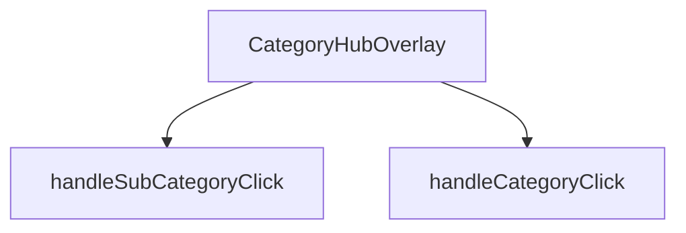

## Genel Bakış
CategoryHubOverlay, site içi navigasyonda kullanılan kategorileri ve alt kategorileri listeleyen bir açılır menü (overlay) bileşenidir. Bileşenin görünürlüğü dışarıdan sağlanan bir durum prop'u ile kontrol edilir ve kullanıcı etkileşimleri bu prop'lar aracılığıyla üst bileşenlere bildirilir. Overlay, kullanıcının kategori yapısını keşfetmesine ve seçim yapmasına olanak tanıyan geçici bir navigasyon arayüzü sağlar.

## Fonksiyon Grupları
### Bileşen ve Görünüm Yönetimi
Bileşenin temel yapısını, açık/kapalı durumunu ve içeriğini render etmekten sorumludur. Dışarıdan sağlanan props'ları yöneterek overlay'in nasıl görüntüleneceğini ve kapanacağını belirler.
- CategoryHubOverlay

### Kullanıcı Etkileşim İşleyicileri
Kullanıcının kategori veya alt kategori seçeneklerini tıklamasıyla tetiklenen eylemleri yönetir. Seçim durumunu dışarıya bildirir ve menünün kapanmasını tetikleyebilir.
- handleCategoryClick, handleSubCategoryClick

---

## AXIOMS – Mimari Varsayımlar

Bu modül için aşağıdaki mimari varsayımlar tanımlanmıştır:

**[Aksiyom 1]:** Eğer `isOpen` prop'u falsy bir değer ise, overlay içeriği render edilmemeli veya görünür olmamalıdır.

**[Aksiyom 2]:** Eğer `onCallback` prop'u sağlanmamış veya geçerli bir fonksiyon değilse, overlay kapatılamaz ve kullanıcı etkileşimleri sonucunda hata oluşur.

**[Aksiyom 3]:** Eğer `handleCategoryClick` çağrıldığında geçerli bir `DomainCategory` nesnesi sağlanmamışsa, kategori yönlendirmesi gerçekleştirilemez.

**[Aksiyom 4]:** Eğer `handleSubCategoryClick` çağrıldığında geçerli bir `DomainCategory` nesnesi sağlanmamışsa, alt kategori yönlendirmesi gerçekleştirilemez.

**[Aksiyom 5]:** Eğer overlay açıkken (`isOpen = true`) kullanıcı overlay dışına tıklarsa veya ESC tuşuna basarsa, `onClose` fonksiyonu çağrılmalıdır (bu davranış bileşen içi mantık ile sağlanmalıdır).

**[Aksiyom 6]:** Eğer `DomainCategory` yapısında `id` veya `slug` gibi tanımlayıcı alanlar eksikse, kategori/alt kategori tıklama işlemleri hatalı sonuçlanır.

**[Aksiyom 7]:** Eğer bileşen mounted durumdayken `isOpen` prop'u `true`'ya değişirse, overlay animasyonlu bir şekilde açılmalıdır; `false`'a değişirse kapanmalıdır.

---

## FONKSİYON DETAYLARI

### CategoryHubOverlay
**Ne yapar**: Kategori navigasyon hub'ının overlay (katman) bileşenidir. Kullanıcı ana navigasyon menüsünden bir kategori grubuna tıkladığında açılan ve alt kategorileri gösteren tam ekran veya yarı saydam overlay bileşenini render eder.

**Nasıl yapar**: React fonksiyonel bileşeni olarak tanımlanmıştır. Bileşenin görünürlüğünü kontrol eden `isOpen` durumunu ve overlay'ı kapatma işlevini sağlayan `onClose` callback'ini parametre olarak alır. Bileşen, domain kategorilerini ve alt kategorilerini列表leyerek kullanıcıya hiyerarşik navigasyon imkanı sunar.

**Parametreler**:
- isOpen: boolean — Overlay'ın açık olup olmadığını belirten durum bayrağı. true olduğunda bileşen görünür hale gelir.
- onClose: () => void — Overlay kapatma butonuna tıklandığında veya dışarı tıklandığında çağrılacak geri çağırma fonksiyonu.

**Dönüş**: React.FC<CategoryHubOverlayProps> tipinde bir React bileşeni döndürür.

### handleCategoryClick
**Ne yapar**: Bir kategori öğesine tıklandığında çağrılan işleyici fonksiyonudur.  
**Nasıl yapar**: `category` parametresi olarak gelen DomainCategory nesnesini alır ve ilgili kategoriyle ilgili işlemleri (örneğin seçimi, navigasyon veya state güncellemesi) gerçekleştirir.  
**Parametreler**:
- category: DomainCategory — Tıklanan kategori nesnesi  
**Dönüş**: void — Fonksiyon bir değer döndürmez

### handleSubCategoryClick
**Ne yapar**: Bir alt kategori öğesine tıklandığında çağrılan işleyici fonksiyonudur.  
**Nasıl yapar**: `subCategory` parametresi olarak gelen DomainCategory nesnesini alır ve ilgili alt kategoriyle ilgili işlemleri (örneğin seçimi, filtren uygulanması veya state güncellemesi) gerçekleştirir.  
**Parametreler**:
- subCategory: DomainCategory — Tıklanan alt kategori nesnesi  
**Dönüş**: void — Fonksiyon bir değer döndürmez

---

## İTHALATLAR (IMPORTS)
- import: ../../contexts/CategoryContext::useCategories
- import: ../../hooks/useCategoryViewModel::useCategoryViewModel
- import: ../../hooks/useLocalizedRoutes::useLocalizedRoutes
- import: ../../i18n/I18nProvider::useI18n
- import: ../../lib/type-converters::DomainCategory
- import: ../../types/db-rows::type { CategoryMetadata }
- import: ../../utils/categoryHelpers::getLocalizedCategorySlug
- import: ../products/3d/core::VentHubCanvas
- import: ../products/Category3DIcon::Category3DIcon
- import: @react-three/drei::OrbitControls
- import: lucide-react::ArrowLeft
- import: lucide-react::ChevronRight
- import: lucide-react::Grid3X3
- import: lucide-react::X
- import: next/navigation::useRouter
- import: react::React
- import: react::Suspense
- import: react::useCallback
- import: react::useEffect
- import: react::useState

---

## INTERFACES

### CategoryHubOverlayProps
- `isOpen: boolean`
- `onClose: () => void`

---

## AST POINTERS

### [N1_NASIL] AST Pointer: `CategoryHubOverlay.tsx`::CategoryHubOverlay
- **params**: (`isOpen: boolean`, `onClose: () => void`)
- **ic_degiskenler**:
    - `router` — Next.js router nesnesi, sayfa yönlendirmeleri için kullanılır
    - `t` — useI18n hook'undan gelen çeviri fonksiyonu, metinleri çevirir
    - `lang` — useI18n hook'undan gelen mevcut dil kodu (tr, en vb.)
    - `categories` — useCategories hook'undan gelen tüm kategoriler dizisi
    - `mainCategories` — useCategories hook'undan gelen ana kategori ağacı (categoryTree)
    - `wrapCategory` — useCategoryViewModel hook'undan gelen kategorileri view model'e dönüştüren fonksiyon
    - `Routes` — useLocalizedRoutes hook'undan gelen lokalize rota oluşturucu nesne
    - `isAnimating` — useState: animasyon durumunu tutar (true/false)
    - `isVisible` — useState: overlay'in DOM'da görünüp görünmediğini tutar
    - `hoveredCategory` — useState: mouse ile üzerine gelinen kategoriyi tutar
    - `selectedParentCategory` — useState: seçilen üst kategoriyi tutar (alt kategorileri gösterirken)
    - `getSubCategoryCount` — useCallback: belirli bir parentId'ye sahip alt kategori sayısını hesaplar
    - `timer` — setTimeout döndüsü: overlay kapatılırken görünürlük gecikmesini yönetir
    - `handleEsc` — KeyboardEvent handler: Escape tuşu ile kapatma/p小心翼宁愿ni tetikler
    - `handleCategoryClick` — tıklama handler'ı: kategori tıklamasını işler
    - `handleSubCategoryClick` — tıklama handler'ı: alt kategori tıklamasını işler
    - `displayCategories` — filtrelenmiş kategori listesi: selectedParentCategory'a göre üst veya alt kategorileri gösterir
    - `hoveredVm` — wrapCategory ile oluşturulmuş hover edilmiş kategorinin view model'i
    - `metadata` — hoveredCategory?.metadata as CategoryMetadata: kategorinin metadata nesnesi
    - `metric1` — metadata?.metric1 as {value, label}: kategorinin ilk metrik bilgisi
- **Dönüş**: `null | JSX.Element` (isVisible false ise null, değilse overlay JSX'i döner)

### [N2_NASIL] AST Pointer: `CategoryHubOverlay.tsx`::handleCategoryClick
- **params**: (`category: DomainCategory`)
- **ic_degiskenler**:
    - `subCount` — category.id ile eşleşen alt kategori sayısını hesaplar
- **Dönüş**: `void` (yan etki: selectedParentCategory ve hoveredCategory state'lerini günceller veya sayfa yönlendirmesi yapar)

### [N3_NASIL] AST Pointer: `CategoryHubOverlay.tsx`::handleSubCategoryClick
- **params**: (`subCategory: DomainCategory`)
- **ic_degiskenler**: yok
- **Dönüş**: `void` (yan etki: router.push ile sayfa yönlendirmesi yapar ve onClose çağırır)

---

## MERMAID CALL GRAPH

## NODE ID STANDARD

  file: src\components\navigation\CategoryHubOverlay.tsx
  function: src\components\navigation\CategoryHubOverlay.tsx::CategoryHubOverlay
  function: src\components\navigation\CategoryHubOverlay.tsx::handleCategoryClick
  function: src\components\navigation\CategoryHubOverlay.tsx::handleSubCategoryClick

---

## DISA AKTARILANLAR (EXPORTS)
  export: CategoryHubOverlay

---

## STİL TOKENLERİ

### Arbitrary Değerler (token'a geçirilmemiş)
Yok — tüm stiller token'a geçirilmiş. ✅

### Kullanılan Token'lar (zaten token'a geçirilmiş)
- `h-hvac-hero`, `tracking-hvac-normal`, `tracking-hvac-snug`

### Tailwind Sınıf Özeti
- **Renkler:** `before:bg-sky-400`, `bg-gradient-to-r`, `bg-sky-400/10`, `bg-slate-800`, `bg-slate-800/50`, `bg-slate-900/30`, `bg-slate-900/90`, `bg-slate-950/60`, `border-2`, `border-b`, `border-r`, `border-sky-400/20`, `border-sky-500/30`, `border-slate-700/50`, `border-t-sky-500`
- **Layout:** `absolute`, `backdrop-blur-2xl`, `backdrop-blur-sm`, `backdrop-blur-xl`, `before:absolute`, `before:h-0`, `before:left-0`, `before:top-1/2`, `before:w-3px`, `bottom-10`, `fixed`, `flex`, `flex-1`, `flex-col`, `from-transparent`
- **Varyant/Responsive:** `:`, `before:`, `group-hover/item:`, `group-hover:`, `hover:`, `lg:`, `md:` önekleri
- **Yardımcı Sınıflar:** `${isAnimating`, `-mt-8`, `-translate-x-4`, `:`, `animate-in`, `animate-spin`, `before:-translate-y-1/2`, `before:duration-300`, `before:rounded-r-full`, `before:transition-transform`, `blur-2`, `blur-2xl`, `blur-none`, `border`, `duration-200`