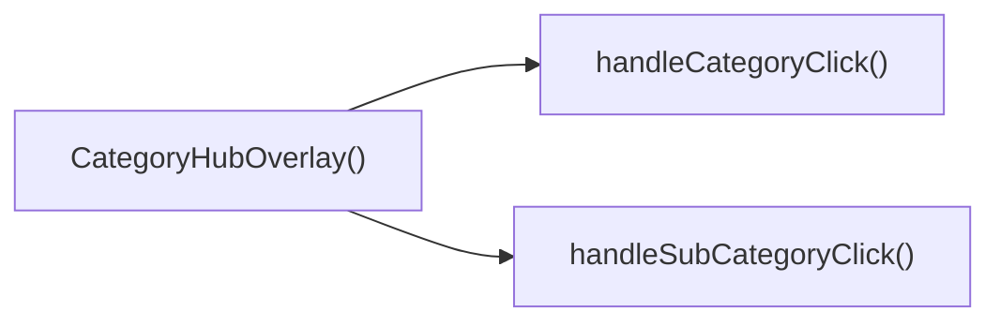

## Genel Bakış
CategoryHubOverlay, kullanıcıların kategorileri ve alt kategorileri görüntüleyip seçebileceği bir kapalı/açılır menü bileşenidir. Bileşen, görsel bir arayüz sunarken tıklama olaylarını işleyerek seçilen kategoriye veya alt kategoriye dair gerekli eylemleri tetikler.

## Fonksiyon Grupları
### Bileşen Renderlama
Kullanıcı arayüzünün oluşturulması ve görünürlüğünün kontrolü sağlanır.
- CategoryHubOverlay

### Etkileşim İşleyicileri
Kullanıcının kategori veya alt kategori seçtiğinde gerçekleştirilecek işlemleri yönetir.
- handleCategoryClick
- handleSubCategoryClick

---

## AXIOMS – Mimari Varsayımlar
Bu modülün doğru çalışması için aşağıdaki koşullar sağlanmalıdır.

[Aksiyom 1]: Eğer `isOpen` prop'u tanımlı değilse, overlay görüntülenmeyeceği veya beklenmedik bir şekilde kapalı kalacağı varsayılır.  
[Aksiyom 2]: Eğer `onClose` prop'u tanımlı değilse, kullanıcı kapatma eylemi gerçekleştirdiğinde bir hata veya tanımlanmamış davranış oluşabilir.  
[Aksiyom 3]: Eğer `handleCategoryClick` fonksiyonuna `DomainCategory` türüne uygun olmayan bir değer geçirilirse, fonksiyonun içindeki kategori işleme mantığı beklenmedik sonuçlar üretebilir veya hata fırlatabilir.  
[Aksiyom 4]: Eğer `handleSubCategoryClick` fonksiyonuna `DomainCategory` türüne uygun olmayan bir değer geçirilirse, alt kategori işleme mantığı similarly beklenmedik sonuçlar üretebilir veya hata fırlatabilir.

---

## FONKSIYON DETAYLARI

### CategoryHubOverlay
**Ne yapar**: Bir React bileşeni olarak, `isOpen` ve `onClose` props'larını alarak CategoryHubOverlay arayüzünü render eder.  
**Nasıl yapar**: Bileşen, `isOpen` değeri true olduğunda overlay'i gösterir; `onClose` fonksiyonu üzerinden kapatma işlemini tetikler.  
**Parametreler**:
- isOpen: boolean — Overlay'in açık olup olmadığını belirler  
- onClose: () => void — Overlay'i kapatmak için çağrılacak fonksiyon  
**Dönüş**: React.FC<CategoryHubOverlayProps> — Render edilebilir bir React bileşeni döndürür  

### handleCategoryClick
**Ne yapar**: Bir kategori öğesine tıklandığında çağrılan işleyici fonksiyonudur.  
**Nasıl yapar**: `category` parametresi olarak gelen DomainCategory nesnesini alır ve ilgili kategoriyle ilgili işlemleri (örneğin seçimi, navigasyon veya state güncellemesi) gerçekleştirir.  
**Parametreler**:
- category: DomainCategory — Tıklanan kategori nesnesi  
**Dönüş**: void — Fonksiyon bir değer döndürmez  

### handleSubCategoryClick
**Ne yapar**: Bir alt kategori öğesine tıklandığında çağrılan işleyici fonksiyonudur.  
**Nasıl yapar**: `subCategory` parametresi olarak gelen DomainCategory nesnesini alır ve ilgili alt kategoriyle ilgili işlemleri (örneğin seçimi, filtren uygulanması veya state güncellemesi) gerçekleştirir.  
**Parametreler**:
- subCategory: DomainCategory — Tıklanan alt kategori nesnesi  
**Dönüş**: void — Fonksiyon bir değer döndürmez

---

## INTERFACES

### CategoryHubOverlayProps
- `isOpen: boolean`
- `onClose: () => void`

---

## AST POINTERS

### [N1_NASIL] AST Pointer: C:\Users\alize\venthub-hvac\src\components\navigation\CategoryHubOverlay.tsx::CategoryHubOverlay
- **params**: isOpen, onClose
- **ic_degiskenler**: 
  - `router` — Next.js router instance used for programmatic navigation.
  - `categories` — array of all category objects fetched from `useCategories`.
  - `mainCategories` — top‑level categories (those without a parent) derived from `categories`.
  - `wrapCategory` — function that converts a `DomainCategory` into its view‑model (displayName, description, metadata).
  - `isAnimating` — boolean state that drives the overlay’s animation CSS classes.
  - `setIsAnimating` — setter function for `isAnimating`.
  - `isVisible` — boolean state controlling whether the overlay is rendered.
  - `setIsVisible` — setter function for `isVisible`.
  - `hoveredCategory` — currently hovered `DomainCategory` (or `null`).
  - `setHoveredCategory` — setter function for `hoveredCategory`.
  - `selectedParentCategory` — parent category that is currently selected when drilling into sub‑categories.
  - `setSelectedParentCategory` — setter function for `selectedParentCategory`.
- **Dönüş**: JSX.Element

### [N2_NASIL] AST Pointer: C:\Users\alize\venthub-hvac\src\components\navigation\CategoryHubOverlay.tsx::getSubCategoryCount
- **params**: parentId: string
- **ic_degiskenler**: (yok)
- **Dönüş**: number

### [N3_NASIL] AST Pointer: C:\Users\alize\venthub-hvac\src\components\navigation\CategoryHubOverlay.tsx::handleCategoryClick
- **params**: category: DomainCategory
- **ic_degiskenler**: 
  - `subCount` — number of sub‑categories belonging to the clicked category.
- **Dönüş**: yok

### [N4_NASIL] AST Pointer: C:\Users\alize\venthub-hvac\src\components\navigation\CategoryHubOverlay.tsx::handleSubCategoryClick
- **params**: subCategory: DomainCategory
- **ic_degiskenler**: (yok)
- **Dönüş**: yok

### [N5_NASIL] AST Pointer: C:\Users\alize\venthub-hvac\src\components\navigation\CategoryHubOverlay.tsx::useEffect_hoveredCategoryInit
- **params**: (yok)
- **ic_degiskenler**: (yok)
- **Dönüş**: yok

### [N6_NASIL] AST Pointer: C:\Users\alize\venthub-hvac\src\components\navigation\CategoryHubOverlay.tsx::useEffect_isOpenHandling
- **params**: (yok)
- **ic_degiskenler**: 
  - `timer` — ID returned by `setTimeout` used to hide the overlay after a delay.
- **Dönüş**: cleanup function (clears the timeout)

### [N7_NASIL] AST Pointer: C:\Users\alize\venthub-hvac\src\components\navigation\CategoryHubOverlay.tsx::useEffect_keydownListener
- **params**: (yok)
- **ic_degiskenler**: 
  - `handleEsc` — keydown handler that closes the overlay or clears the selected parent on Escape.
- **Dönüş**: cleanup function (removes the keydown listener)

### [N8_NASIL] AST Pointer: C:\Users\alize\venthub-hvac\src\components\navigation\CategoryHubOverlay.tsx::handleEsc
- **params**: e: KeyboardEvent
- **ic_degiskenler**: (yok)
- **Dönüş**: yok

### [N9_NASIL] AST Pointer: C:\Users\alize\venthub-hvac\src\components\navigation\CategoryHubOverlay.tsx::useEffect_bodyOverflow
- **params**: (yok)
- **ic_degiskenler**: (yok)
- **Dönüş**: cleanup function (resets `document.body.style.overflow`)

### [N10_NASIL] AST Pointer: C:\Users\alize\venthub-hvac\src\components\navigation\CategoryHubOverlay.tsx::cleanup_bodyOverflow
- **params**: (yok)
- **ic_degiskenler**: (yok)
- **Dönüş**: yok

### [N11_NASIL] AST Pointer: C:\Users\alize\venthub-hvac\src\components\navigation\CategoryHubOverlay.tsx::metricRenderFn
- **params**: (yok)
- **ic_degiskenler**: 
  - `metadata` — `CategoryMetadata` object extracted from `hoveredCategory?.metadata` (or `null`).
  - `metric1` — first metric entry (`{value?, label?}`) from `metadata`, or `null`.
- **Dönüş**: JSX.Element | null

### [N12_NASIL] AST Pointer: C:\Users\alize\venthub-hvac\src\components\navigation\CategoryHubOverlay.tsx::mapItemFn
- **params**: cat: DomainCategory
- **ic_degiskenler**: 
  - `vm` — view‑model of the category returned by `wrapCategory(cat)`.
  - `isSelected` — boolean indicating whether a parent category is currently selected.
  - `subCount` — number of sub‑categories for `cat` (only relevant when no parent is selected).
- **Dönüş**: JSX.Element (button element)

---

## Çağrı Haritası

### Dışarıya Çağrılar (Outgoing)
CategoryHubOverlay fonksiyonu, kullanıcı bir kategori veya alt kategori seçtiğinde ilgili işlemleri yürütmek için handleCategoryClick ve handleSubCategoryClick fonksiyonlarını çağırır.

### Dışarıdan Çağrılanlar (Incoming)
Veri sağlanmadığı için bu modülü dışarıdan çağıran fonksiyon veya dosya bilgisi bulunmamaktadır.

### İç İçe Fonksiyonlar (Nested)
Yok

---

## DOSYA-İÇİ ÇAĞRI GRAFİĞİ
  CategoryHubOverlay() → handleCategoryClick()
  CategoryHubOverlay() → handleSubCategoryClick()

---

## NODE ID STANDARD

  file: src\components\navigation\CategoryHubOverlay.tsx
  function: src\components\navigation\CategoryHubOverlay.tsx::CategoryHubOverlay
  function: src\components\navigation\CategoryHubOverlay.tsx::handleCategoryClick
  function: src\components\navigation\CategoryHubOverlay.tsx::handleSubCategoryClick

---

## DISA AKTARILANLAR (EXPORTS)
  export: CategoryHubOverlay