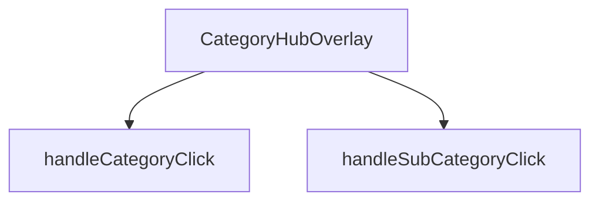

## Genel Bakış
CategoryHubOverlay, kategori navigasyonu için kullanılan bir React overlay bileşenidir. Bileşen, açık/kapalı durumunu `isOpen` prop'uyla kontrol eder ve kapatma işlemini `onClose` geri çağırımı aracılığıyla üst bileşene bildirir. Kullanıcı etkileşimlerini işlemek üzere kategori ve alt kategori tıklama olaylarını yönetir.

## Fonksiyon Grupları

### Ana Bileşen
Overlay'in yaşam döngüsünü ve render mantığını yönetir. `isOpen` ve `onClose` parametrelerini alarak bileşenin görünürlüğünü ve kapatma davranışını kontrol eder.
- CategoryHubOverlay

### Olay İşleyicileri
Kullanıcının kategori ve alt kategori seçimlerini yakalayarak ilgili işlemleri tetikler. Her iki fonksiyon da `DomainCategory` türünde parametre alır.
- handleCategoryClick, handleSubCategoryClick

---

## AXIOMS – Mimari Varsayımlar

Fonksiyon gövdeleri verilmediğinden, yalnızca imzalardan çıkarılabilecek minimum düzeyde varsayımlar belirlenebilir.

[Aksiyom 1]: Eğer `isOpen` prop'u sağlanmazsa, bileşenin gösterilip gösterilmediği belirlenemez.
[Aksiyom 2]: Eğer `onClose` fonksiyonu sağlanmazsa, bileşenin kapatma işlevi çalışmaz.
[Aksiyom 3]: Eğer `DomainCategory` tipi tanımlı değilse, `handleCategoryClick` ve `handleSubCategoryClick` fonksiyonları çağrılamaz.

**Not:** Fonksiyon gövdeleri mevcut olmadığından, bu bileşenin iç mantığı, koşullu render, state yönetimi veya alt bileşen kullanımı hakkında aksiyom üretilememiştir. Daha detaylı mimari varsayımlar için kaynak dosyanın tamamı gereklidir.

---

## FONKSİYON DETAYLARI

### CategoryHubOverlay
**Ne yapar**: Kategori merkezi katmanını (overlay) oluşturan React fonksiyonel bileşenidir. Kullanıcıya kategori ve alt kategori seçim arayüzünü sunan ana bileşendir.
**Nasıl yapar**: Bileşen, `isOpen` prop'u ile görünürlük durumunu kontrol eder ve `onClose` prop'u ile kapatma işlevini tetikler. `CategoryHubOverlayProps` arayüzüne uygun şekilde props alır ve `React.FC<CategoryHubOverlayProps>` tipinde bir fonksiyonel bileşen döndürür.
**Parametreler**:
- isOpen: boolean — Overlay bileşeninin açık/kapalı durumunu belirten değer
- onClose: () => void — Overlay kapatıldığında çağrılacak geri çağırım fonksiyonu
**Dönüş**: `React.FC<CategoryHubOverlayProps>` — Kategori hub overlay bileşeni

### handleCategoryClick
**Ne yapar**: Kullanıcı bir kategoriye tıkladığında çağrılan olay işleyicisidir. Seçili kategorinin durumuna göre farklı işlem gerçekleştirir.
**Nasıl yapar**: Gövde mantığına göre, eğer kategori zaten seçili (`isSelected`) ise `handleSubCategoryClick` fonksiyonunu çağırır; aksi takdirde `handleCategoryClick` fonksiyonunu çağırır. Bu yapı, seçili olma durumuna göre alt kategori veya ana kategori tıklama davranışını yönlendirir.
**Parametreler**:
- category: DomainCategory — Tıklanan kategori nesnesi
**Dönüş**: Bilinmiyor

### handleSubCategoryClick
**Ne yapar**: Kullanıcı bir alt kategoriye tıkladığında çağrılan olay işleyicisidir. Seçili alt kategorinin durumuna göre farklı işlem gerçekleştirir.
**Nasıl yapar**: Gövde mantığına göre, eğer alt kategori zaten seçili (`isSelected`) ise `handleSubCategoryClick` fonksiyonunu çağırır; aksi takdirde `handleCategoryClick` fonksiyonunu çağırır. Bu yapı, seçili olma durumuna göre alt kategori veya ana kategori tıklama davranışını yönlendirir.
**Parametreler**:
- subCategory: DomainCategory — Tıklanan alt kategori nesnesi
**Dönüş**: Bilinmiyor

---

## İTHALATLAR (IMPORTS)
- import: ../../contexts/CategoryContext::useCategories
- import: ../../hooks/useCategoryViewModel::useCategoryViewModel
- import: ../../hooks/useLocalizedRoutes::useLocalizedRoutes
- import: ../../i18n/I18nProvider::useI18n
- import: ../../lib/type-converters::DomainCategory
- import: ../../types/db-rows::type { CategoryMetadata }
- import: ../../utils/categoryHelpers::getLocalizedCategorySlug
- import: ../products/3d/core::VentHubCanvas
- import: ../products/Category3DIcon::Category3DIcon
- import: @react-three/drei::OrbitControls
- import: lucide-react::ArrowLeft
- import: lucide-react::ChevronRight
- import: lucide-react::Grid3X3
- import: lucide-react::X
- import: next/navigation::useRouter
- import: react::React
- import: react::Suspense
- import: react::useCallback
- import: react::useEffect
- import: react::useState

---

## INTERFACES

### CategoryHubOverlayProps
- `isOpen: boolean`
- `onClose: () => void`

---

## AST POINTERS

### [N1_NASIL] AST Pointer: src/components/navigation/CategoryHubOverlay.tsx::CategoryHubOverlay
- **params**: `isOpen` — overlay'in açık/kapalı durumunu belirten boolean, `onClose` — overlay kapatıldığında çağrılacak fonksiyon
- **ic_degiskenler**:
  - `router` — `useRouter()` ile alınan Next.js router nesnesi, sayfa yönlendirmelerinde kullanılır
  - `t` — `useI18n()` ile alınan çeviri fonksiyonu, metinleri yerelleştirir
  - `lang` — `useI18n()` ile alınan mevcut dil kodu, kategori slug'larını yerelleştirmede kullanılır
  - `categories` — `useCategories()` ile alınan tüm kategoriler dizisi, alt kategori filtrelemesinde kullanılır
  - `mainCategories` — `useCategories()` ile alınan `categoryTree` değeri, ana kategori listesi olarak kullanılır
  - `wrapCategory` — `useCategoryViewModel()` ile alınan fonksiyon, kategori nesnesini view model'e dönüştürür
  - `Routes` — `useLocalizedRoutes()` ile alınan yerelleştirilmiş rota şablonları
  - `isAnimating` — `useState(false)` ile tanımlanan animasyon durumu, CSS geçişlerini kontrol eder
  - `isVisible` — `useState(false)` ile tanımlanan görünürlük durumu, bileşenin render edilip edilmeyeceğini belirler
  - `hoveredCategory` — `useState<DomainCategory | null>(null)` ile tanımlanan fareyle üzerine gelinen kategori, sol panelde detay gösterimi için kullanılır
  - `selectedParentCategory` — `useState<DomainCategory | null>(null)` ile tanımlanan seçili üst kategori, alt kategori görünümüne geçiş için kullanılır
  - `getSubCategoryCount` — `useCallback` ile sarılmış fonksiyon, verilen parentId'ye sahip alt kategori sayısını döndürür
  - `handleCategoryClick` — kategori tıklama işleyicisi, alt kategorisi varsa alt kategori görünümüne geçer, yoksa kategori sayfasına yönlendirir
  - `handleSubCategoryClick` — alt kategori tıklama işleyicisi, seçili üst kategoriye göre doğru rotaya yönlendirir
  - `displayCategories` — `selectedParentCategory` varsa onun alt kategorilerini, yoksa `mainCategories`'i gösteren hesaplanmış değer
  - `hoveredVm` — `wrapCategory(hoveredCategory)` ile elde edilen view model, sol panelde displayName ve description göstermek için kullanılır
- **Dönüş**: JSX element — modal overlay bileşeni

### [N2_NASIL] AST Pointer: src/components/navigation/CategoryHubOverlay.tsx::useEffect (hoveredCategory başlatma)
- **params**: (yok — useEffect callback)
- **ic_degiskenler**:
  - `mainCategories` — bağımlılık dizisindeki ana kategori listesi, uzunluğu kontrol edilir
  - `hoveredCategory` — bağımlılık dizisindeki fareyle üzerine gelinen kategori, null olup olmadığı kontrol edilir
- **Dönüş**: yok — `setHoveredCategory(mainCategories[0])` çağrısı yapar

### [N3_NASIL] AST Pointer: src/components/navigation/CategoryHubOverlay.tsx::getSubCategoryCount
- **params**: `parentId` — string, alt kategorileri sayılacak üst kategorinin ID'si
- **ic_degiskenler**:
  - `cat` — `categories.filter()` içindeki her kategori nesnesi, `cat.parent_id` değeri `parentId` ile karşılaştırılır
- **Dönüş**: number — verilen parentId'ye sahip alt kategori sayısı

### [N4_NASIL] AST Pointer: src/components/navigation/CategoryHubOverlay.tsx::useEffect (isOpen animasyon yönetimi)
- **params**: (yok — useEffect callback)
- **ic_degiskenler**:
  - `isOpen` — bağımlılık dizisindeki açık/kapalı durumu
  - `timer` — `setTimeout` ile oluşturulan zamanlayıcı, 300ms sonra `setIsVisible(false)` çağırır
- **Dönüş**: cleanup fonksiyonu — `clearTimeout(timer)` çağrısı yapar

### [N5_NASIL] AST Pointer: src/components/navigation/CategoryHubOverlay.tsx::requestAnimationFrame callback
- **params**: (yok)
- **ic_degiskenler**: (yok)
- **Dönüş**: yok — `setIsAnimating(true)` çağrısı yapar

### [N6_NASIL] AST Pointer: src/components/navigation/CategoryHubOverlay.tsx::useEffect (Escape tuşu dinleyicisi)
- **params**: (yok — useEffect callback)
- **ic_degiskenler**:
  - `handleEsc` — `KeyboardEvent` parametresi alan fonksiyon, Escape tuşu basıldığında overlay kapatma veya üst kategori seçimini sıfırlama işlemini yapar
  - `e` — `KeyboardEvent` nesnesi, `e.key` değeri `'Escape'` olarak kontrol edilir
- **Dönüş**: cleanup fonksiyonu — `window.removeEventListener('keydown', handleEsc)` çağrısı yapar

### [N7_NASIL] AST Pointer: src/components/navigation/CategoryHubOverlay.tsx::handleEsc
- **params**: `e` — KeyboardEvent, klavye olayı nesnesi
- **ic_degiskenler**:
  - `isOpen` — overlay'in açık olup olmadığını kontrol eden değer
  - `selectedParentCategory` — seçili üst kategori, null ise `onClose()` çağrılır, değilse `setSelectedParentCategory(null)` çağrılır
- **Dönüş**: yok — koşullu olarak `setSelectedParentCategory(null)` veya `onClose()` çağrısı yapar

### [N8_NASIL] AST Pointer: src/components/navigation/CategoryHubOverlay.tsx::useEffect (body overflow yönetimi)
- **params**: (yok — useEffect callback)
- **ic_degiskenler**:
  - `isOpen` — bağımlılık dizisindeki açık/kapalı durumu, `document.body.style.overflow` değerini belirler
- **Dönüş**: cleanup fonksiyonu — `document.body.style.overflow = ''` çağrısı yapar

### [N9_NASIL] AST Pointer: src/components/navigation/CategoryHubOverlay.tsx::cleanup callback (overflow)
- **params**: (yok)
- **ic_degiskenler**: (yok)
- **Dönüş**: yok — `document.body.style.overflow = ''` çağrısı yapar

### [N10_NASIL] AST Pointer: src/components/navigation/CategoryHubOverlay.tsx::handleCategoryClick
- **params**: `category` — DomainCategory, tıklanan kategori nesnesi
- **ic_degiskenler**:
  - `subCount` — `categories.filter(c => c.parent_id === category.id).length` ile hesaplanan alt kategori sayısı
  - `category.id` — tıklanan kategorinin ID'si, filtreleme için kullanılır
  - `category` — `setSelectedParentCategory(category)` ve `setHoveredCategory(category)` ile state'e atanır
  - `Routes` — `Routes.category()` ile rota oluşturulur
  - `lang` — `getLocalizedCategorySlug(category, lang)` ile yerelleştirilmiş slug oluşturulur
  - `router` — `router.push()` ile sayfa yönlendirmesi yapılır
- **Dönüş**: yok — koşullu olarak state günceller veya `router.push()` ve `onClose()` çağrısı yapar

### [N11_NASIL] AST Pointer: src/components/navigation/CategoryHubOverlay.tsx::handleSubCategoryClick
- **params**: `subCategory` — DomainCategory, tıklanan alt kategori nesnesi
- **ic_degiskenler**:
  - `selectedParentCategory` — seçili üst kategori, null kontrolü yapılır
  - `Routes` — `Routes.category()` ile rota oluşturulur
  - `lang` — `getLocalizedCategorySlug()` ile yerelleştirilmiş slug'lar oluşturulur
  - `router` — `router.push()` ile sayfa yönlendirmesi yapılır
- **Dönüş**: yok — `router.push()` ve `onClose()` çağrısı yapar

### [N12_NASIL] AST Pointer: src/components/navigation/CategoryHubOverlay.tsx::IIFE (metric1 gösterimi)
- **params**: (yok — IIFE)
- **ic_degiskenler**:
  - `metadata` — `hoveredCategory?.metadata as CategoryMetadata | null` ile elde edilen kategori metadata'sı
  - `metric1` — `metadata?.metric1 as { value?: string | number, label?: string } | null` ile elde edilen metrik verisi
  - `metric1.value` — metrik değeri, `String(metric1.value || '')` ile string'e dönüştürülür
  - `metric1.label` — metrik etiketi, `String(metric1.label || '')` ile string'e dönüştürülür
- **Dönüş**: JSX element veya null — `metric1` yoksa null, varsa metrik değerini ve etiketini gösteren div

### [N13_NASIL] AST Pointer: src/components/navigation/CategoryHubOverlay.tsx::map callback (kategori listesi)
- **params**: `cat` — DomainCategory, dizideki her kategori nesnesi
- **ic_degiskenler**:
  - `vm` — `wrapCategory(cat)` ile elde edilen view model, `vm?.displayName` ile görüntü adı gösterilir
  - `isSelected` — `selectedParentCategory !== null` kontrolü, alt kategori görünümünde olup olmadığını belirler
  - `subCount` — `!isSelected ? getSubCategoryCount(cat.id) : 0` ile hesaplanan alt kategori sayısı
  - `cat.id` — butonun `key` prop'u olarak kullanılır
  - `cat` — `onMouseEnter` ve `onClick` handler'larında kullanılır
  - `t` — `t('megamenu.categoryHub.subCategoryCount', { count: subCount })` ile çeviri metni alınır
- **Dönüş**: JSX element — kategori butonu, displayName, alt kategori sayısı ve ChevronRight ikonu içerir

---

## MERMAID CALL GRAPH

## NODE ID STANDARD

  file: CategoryHubOverlay.tsx
  function: CategoryHubOverlay.tsx::CategoryHubOverlay
  function: CategoryHubOverlay.tsx::handleCategoryClick
  function: CategoryHubOverlay.tsx::handleSubCategoryClick

---

## DISA AKTARILANLAR (EXPORTS)
  export: CategoryHubOverlay

---

## STİL TOKENLERİ

### Arbitrary Değerler (token'a geçirilmemiş)
Yok — tüm stiller token'a geçirilmiş. ✅

### Kullanılan Token'lar (zaten token'a geçirilmiş)
- `h-hvac-hero`, `tracking-hvac-normal`, `tracking-hvac-snug`

### Tailwind Sınıf Özeti
- **Renkler:** `before:bg-sky-400`, `bg-gradient-to-r`, `bg-sky-400/10`, `bg-slate-800`, `bg-slate-800/50`, `bg-slate-900/30`, `bg-slate-900/90`, `bg-slate-950/60`, `border-2`, `border-b`, `border-r`, `border-sky-400/20`, `border-sky-500/30`, `border-slate-700/50`, `border-t-sky-500`
- **Layout:** `absolute`, `backdrop-blur-2xl`, `backdrop-blur-sm`, `backdrop-blur-xl`, `before:absolute`, `before:h-0`, `before:left-0`, `before:top-1/2`, `before:w-3px`, `bottom-10`, `fixed`, `flex`, `flex-1`, `flex-col`, `from-transparent`
- **Varyant/Responsive:** `:`, `before:`, `group-hover/item:`, `group-hover:`, `hover:`, `lg:`, `md:` önekleri
- **Yardımcı Sınıflar:** `${isAnimating`, `-mt-8`, `-translate-x-4`, `:`, `animate-in`, `animate-spin`, `before:-translate-y-1/2`, `before:duration-300`, `before:rounded-r-full`, `before:transition-transform`, `blur-2`, `blur-2xl`, `blur-none`, `border`, `duration-200`