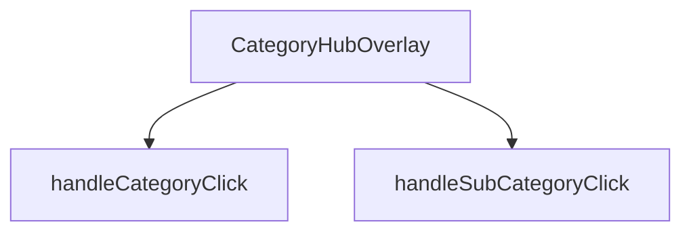

## Genel Bakış
CategoryHubOverlay, kullanıcıların kategorileri ve alt kategorileri görüntüleyip seçebileceği bir kapalı/açılır menü bileşenidir. Bileşen, `isOpen` prop'u ile görünürlüğünü kontrol eder ve `onClose` prop'u ile kapatma işlemini yönetir. Kullanıcı etkileşimlerini işleyerek ilgili kategori veya alt kategori seçim tetikler.

## Fonksiyon Grupları
### Bileşen Renderlama
Overlay'in durumuna göre arayüzün oluşturulması ve render edilmesinden sorumludur. Görünürlük, `isOpen` prop'u ile kontrol edilir.
- CategoryHubOverlay

### Etkileşim İşleyicileri
Kullanıcının kategori veya alt kategori seçeneklerine tıklaması durumunda tetiklenecek işlemleri yönetir. Bu işleyiciler, bileşen içindeki tıklama olaylarına bağlıdır.
- handleCategoryClick
- handleSubCategoryClick

---

## AXIOMS – Mimari Varsayımlar

Bu modülün doğru çalışması için aşağıdaki koşullar sağlanmalıdır.

[Aksiyom 1]: Eğer `isOpen` prop'u sağlanmazsa, overlay'in görünürlük durumu belirsiz olur ve bileşenin açılıp kapanması kontrol edilemez.

[Aksiyom 2]: Eğer `onClose` callback'i sağlanmazsa, overlay açıldığında kullanıcı arayüzünden kapatılamaz (iç bileşenlerden kapanma tetiklenemez).

[Aksiyom 3]: Eğer `handleCategoryClick` bir `DomainCategory` tipinde veri almazsa, tıklanan kategorinin tanımı yapılamaz ve ilgili navigasyon/eylem gerçekleştirilemez.

[Aksiyom 4]: Eğer `handleSubCategoryClick` bir `DomainCategory` tipinde veri almazsa, tıklanan alt kategorinin tanımı yapılamaz ve ilgili navigasyon/eylem gerçekleştirilemez.

---

## FONKSİYON DETAYLARI

### CategoryHubOverlay
**Ne yapar**: Kategori navigasyon hub'ının overlay (katman) bileşenidir. Kullanıcı ana navigasyon menüsünden bir kategori grubuna tıkladığında açılan ve alt kategorileri gösteren tam ekran veya yarı saydam overlay bileşenini render eder.

**Nasıl yapar**: React fonksiyonel bileşeni olarak tanımlanmıştır. Bileşenin görünürlüğünü kontrol eden `isOpen` durumunu ve overlay'ı kapatma işlevini sağlayan `onClose` callback'ini parametre olarak alır. Bileşen, domain kategorilerini ve alt kategorilerini列表leyerek kullanıcıya hiyerarşik navigasyon imkanı sunar.

**Parametreler**:
- isOpen: boolean — Overlay'ın açık olup olmadığını belirten durum bayrağı. true olduğunda bileşen görünür hale gelir.
- onClose: () => void — Overlay kapatma butonuna tıklandığında veya dışarı tıklandığında çağrılacak geri çağırma fonksiyonu.

**Dönüş**: React.FC<CategoryHubOverlayProps> tipinde bir React bileşeni döndürür.

### handleCategoryClick
**Ne yapar**: Bir kategori öğesine tıklandığında çağrılan işleyici fonksiyonudur.  
**Nasıl yapar**: `category` parametresi olarak gelen DomainCategory nesnesini alır ve ilgili kategoriyle ilgili işlemleri (örneğin seçimi, navigasyon veya state güncellemesi) gerçekleştirir.  
**Parametreler**:
- category: DomainCategory — Tıklanan kategori nesnesi  
**Dönüş**: void — Fonksiyon bir değer döndürmez

### handleSubCategoryClick
**Ne yapar**: Bir alt kategori öğesine tıklandığında çağrılan işleyici fonksiyonudur.  
**Nasıl yapar**: `subCategory` parametresi olarak gelen DomainCategory nesnesini alır ve ilgili alt kategoriyle ilgili işlemleri (örneğin seçimi, filtren uygulanması veya state güncellemesi) gerçekleştirir.  
**Parametreler**:
- subCategory: DomainCategory — Tıklanan alt kategori nesnesi  
**Dönüş**: void — Fonksiyon bir değer döndürmez

---

## INTERFACES

### CategoryHubOverlayProps
- `isOpen: boolean`
- `onClose: () => void`

---

## AST POINTERS

### [N1_NASIL] AST Pointer: CategoryHubOverlay.tsx::CategoryHubOverlay
- **params**: `(isOpen, onClose)` — overlay'in açık/kapalı durumunu ve kapatma fonksiyonunu tutar
- **ic_degiskenler**:
  - `router` — `useRouter()` ile alınan Next.js yönlendirici nesnesi; sayfa navigasyonu için `router.push()` çağrılır
  - `categories` — `useCategories()` hook'undan gelen tüm kategoriler dizisi; filtreleme ve alt kategori sayımı için kullanılır
  - `mainCategories` — `useCategories()` hook'undan gelen `categoryTree` olarak yeniden adlandırılmış; üst seviye kategorileri temsil eder
  - `wrapCategory` — `useCategoryViewModel()` hook'undan gelen fonksiyon; ham kategori nesnesini view model'e dönüştürür
  - `isAnimating` — `useState(false)`; CSS animasyon durumunu kontrol eder, true olduğunda scale/opacity/blurred geçiş tetiklenir
  - `isVisible` — `useState(false)`; overlay'in DOM'da bulunup bulunmadığını kontrol eder, false ise `return null` ile render edilmez
  - `hoveredCategory` — `useState<DomainCategory | null>`; fare ile üzerine gelinen kategoriyi tutar, sol panelde 3D ikon ve açıklama gösteriminde kullanılır
  - `selectedParentCategory` — `useState<DomainCategory | null>`; tıklanan üst kategoriyi tutar; null olmadığında alt kategoriler gösterilir
  - `getSubCategoryCount` — `useCallback` ile tanımlı fonksiyon; verilen `parentId`'ye sahip alt kategori sayısını döndürür
  - `displayCategories` — `selectedParentCategory` null ise `mainCategories`, değilse `selectedParentCategory.id`'ye eşit `parent_id`'li kategoriler filtered dizi
  - `hoveredVm` — `wrapCategory(hoveredCategory)` çağrısıyla elde edilen view model; `displayName`, `description` gibi display alanlarını sağlar
- **Dönüş**: JSX elementi — overlay DOM'u, veya isVisible false ise `null`

---

### [N2_NASIL] AST Pointer: CategoryHubOverlay.tsx::useEffect[callback-1] (hoveredCategory init)
- **params**: yok (arrow function)
- **ic_degiskenler**:
  - `mainCategories` — üst seviye kategoriler dizisi; uzunluğu kontrol edilir
  - `hoveredCategory` — mevcut hover durumu; null ise ilk kategori atanır
  - `setHoveredCategory` — state setter; `mainCategories[0]` ile ilk kategoriyi atanır
- **Dönüş**: yok — yan etki: `setHoveredCategory(mainCategories[0])`

---

### [N3_NASIL] AST Pointer: CategoryHubOverlay.tsx::getSubCategoryCount
- **params**: `(parentId: string)` — üst kategori ID'si
- **ic_degiskenler**:
  - `categories` — useCategories'ten gelen tüm kategoriler; `.filter()` ile `cat.parent_id === parentId` koşuluna göre filtrelenir
- **Dönüş**: `number` — eşleşen alt kategori sayısı

---

### [N4_NASIL] AST Pointer: CategoryHubOverlay.tsx::useEffect[callback-2] (isOpen animasyon)
- **params**: yok (arrow function)
- **ic_degiskenler**:
  - `isOpen` — prop; overlay'in açılıp açılmadığını belirler
  - `setIsVisible` — isVisible state setter; açıkken `true`'ye ayarlanır
  - `requestAnimationFrame` — native API; bir frame sonra `setIsAnimating(true)` çağırarak animasyon tetikler
  - `setIsAnimating` — isAnimating state setter; kapanırken `false`'ya ayarlanır
  - `setSelectedParentCategory` — selectedParentCategory state setter; kapanırken `null`'a sıfırlanır
  - `timer` — `setTimeout()` dönüşü; 300ms sonra `setIsVisible(false)` çağırarak DOM'dan kaldırma gecikmesi sağlar
  - `clearTimeout` — temizlik fonksiyonu; timer'ı iptal eder
- **Dönüş**: yok — cleanup fonksiyonu `clearTimeout(timer)` döndürür

---

### [N5_NASIL] AST Pointer: CategoryHubOverlay.tsx::requestAnimationFrame[callback]
- **params**: yok (arrow function)
- **ic_degiskenler**:
  - `setIsAnimating` — state setter; `true` değerini atayarak scale/opacity/blurred animasyonunu başlatır
- **Dönüş**: yok — yan etki: `setIsAnimating(true)`

---

### [N6_NASIL] AST Pointer: CategoryHubOverlay.tsx::useEffect[callback-3] (Esc tuşu)
- **params**: yok (arrow function)
- **ic_degiskenler**:
  - `handleEsc` — inner function; KeyboardEvent parametresi alır, Escape tuşuna basıldığında `selectedParentCategory` varsa sıfırlar, yoksa `onClose()` çağırır
  - `isOpen` — prop; dinleyici aktifken true olmalı
  - `onClose` — prop; overlay'i kapatmak için çağrılır
  - `selectedParentCategory` — state; null değilse önce sıfırlanır
  - `window.addEventListener` — Escape tuşu için global keydown dinleyicisi eklenir
  - `window.removeEventListener` — cleanup'ta dinleyici kaldırılır
- **Dönüş**: yok — cleanup: `window.removeEventListener('keydown', handleEsc)`

---

### [N7_NASIL] AST Pointer: CategoryHubOverlay.tsx::handleEsc
- **params**: `(e: KeyboardEvent)` — klavye olay nesnesi
- **ic_degiskenler**:
  - `e.key` — basılan tuşun değeri; `'Escape'` kontrol edilir
  - `isOpen` — prop; sadece overlay açıksa Escape işler
  - `selectedParentCategory` — state; null değilse sıfırlanır, null ise onClose çağrılır
  - `setSelectedParentCategory` — state setter; `null`'a ayarlanarak ana kategori listesine dönüş sağlanır
  - `onClose` — prop fonksiyonu; overlay'i tamamen kapatır
- **Dönüş**: yok — yan etki: state değişikliği veya onClose çağrısı

---

### [N8_NASIL] AST Pointer: CategoryHubOverlay.tsx::useEffect[callback-4] (body overflow)
- **params**: yok (arrow function)
- **ic_degiskenler**:
  - `isOpen` — prop; true ise body scroll kilitlenir
  - `document.body.style.overflow` — sayfa scroll durumunu kontrol eder; açıkken `'hidden'`, kapalığında `''` yapılır
- **Dönüş**: yok — cleanup: `document.body.style.overflow = ''`

---

### [N9_NASIL] AST Pointer: CategoryHubOverlay.tsx::handleCategoryClick
- **params**: `(category: DomainCategory)` — tıklanan kategori nesnesi
- **ic_degiskenler**:
  - `subCount` — `categories.filter(c => c.parent_id === category.id).length` ile hesaplanan alt kategori sayısı
  - `categories` — useCategories'ten gelen tüm kategoriler; filtreleme yapılır
  - `setSelectedParentCategory` — state setter; `subCount > 0` ise kategori atanarak alt kategori görünümü açılır
  - `setHoveredCategory` — state setter; `category` atanır, sol panelde görünür
  - `router` — Next.js router; `Routes.category(category.slug)` ile sayfaya yönlendirme yapılır
  - `onClose` — prop fonksiyonu; alt kategori yoksa navigasyon sonrası overlay kapatılır
- **Dönüş**: yok — yan etki: state değişikliği, router.push veya onClose

---

### [N10_NASIL] AST Pointer: CategoryHubOverlay.tsx::handleSubCategoryClick
- **params**: `(subCategory: DomainCategory)` — tıklanan alt kategori nesnesi
- **ic_degiskenler**:
  - `selectedParentCategory` — state; null değilse `Routes.category(selectedParentCategory.slug, subCategory.slug)` ile üst+alt sluglı URL oluşturulur
  - `router` — Next.js router; `router.push()` ile navigasyon yapılır
  - `onClose` — prop fonksiyonu; navigasyon sonrası overlay kapatılır
- **Dönüş**: yok — yan etki: router.push ve onClose çağrısı

---

### [N11_NASIL] AST Pointer: CategoryHubOverlay.tsx::JSX[callback-metric1]
- **params**: yok (IIFE arrow function)
- **ic_degiskenler**:
  - `metadata` — `hoveredCategory?.metadata as CategoryMetadata | null`; kategorinin metadata alanı cast edilir
  - `metric1` — `metadata?.metric1 as { value?: string | number, label?: string } | null`; metrik nesnesi, `value` ve `label` alanları barındırır
- **Dönüş**: JSX elementi (`
` içinde metrik gösterimi) veya `null` (metric1 yoksa)

---

### [N12_NASIL] AST Pointer: CategoryHubOverlay.tsx::displayCategories.map[callback]
- **params**: `(cat)` — DomainCategory dizisi elemanı
- **ic_degiskenler**:
  - `vm` — `wrapCategory(cat)` çağrısıyla elde edilen view model; `displayName` alanı buton içinde gösterilir
  - `isSelected` — `selectedParentCategory !== null` boolean kontrolü; true ise alt kategori görünümündedir
  - `subCount` — `isSelected` false ise `getSubCategoryCount(cat.id)` ile alt kategori sayısı hesaplanır, aksi halde 0
  - `getSubCategoryCount` — useCallback ile tanımlı fonksiyon; `cat.id` ile çağrılır
  - `handleSubCategoryClick` — isSelected true ise çağrılır
  - `handleCategoryClick` — isSelected false ise çağrılır
  - `setHoveredCategory` — onMouseEnter'de isSelected false ise fare üzerine gelinen kategori atanır
- **Dönüş**: JSX elementi (`<button>` — her kategori için bir kart butonu)

---

## MERMAID CALL GRAPH

## NODE ID STANDARD

  file: src\components\navigation\CategoryHubOverlay.tsx
  function: src\components\navigation\CategoryHubOverlay.tsx::CategoryHubOverlay
  function: src\components\navigation\CategoryHubOverlay.tsx::handleCategoryClick
  function: src\components\navigation\CategoryHubOverlay.tsx::handleSubCategoryClick

---

## DISA AKTARILANLAR (EXPORTS)
  export: CategoryHubOverlay

---

## STİL TOKENLERİ

### Arbitrary Değerler (token'a geçirilmemiş)
Yok — tüm stiller token'a geçirilmiş. ✅

### Kullanılan Token'lar (zaten token'a geçirilmiş)
- `h-hvac-hero`, `tracking-hvac-normal`, `tracking-hvac-snug`

### Tailwind Sınıf Özeti
- **Renkler:** `before:bg-sky-400`, `bg-gradient-to-r`, `bg-sky-400/10`, `bg-slate-800`, `bg-slate-800/50`, `bg-slate-900/30`, `bg-slate-900/90`, `bg-slate-950/60`, `border-2`, `border-b`, `border-r`, `border-sky-400/20`, `border-sky-500/30`, `border-slate-700/50`, `border-t-sky-500`
- **Layout:** `absolute`, `backdrop-blur-2xl`, `backdrop-blur-sm`, `backdrop-blur-xl`, `before:absolute`, `before:h-0`, `before:left-0`, `before:top-1/2`, `before:w-3px`, `bottom-10`, `fixed`, `flex`, `flex-1`, `flex-col`, `from-transparent`
- **Varyant/Responsive:** `:`, `before:`, `group-hover/item:`, `group-hover:`, `hover:`, `lg:`, `md:` önekleri
- **Yardımcı Sınıflar:** `${isAnimating`, `-mt-8`, `-translate-x-4`, `:`, `animate-in`, `animate-spin`, `before:-translate-y-1/2`, `before:duration-300`, `before:rounded-r-full`, `before:transition-transform`, `blur-2`, `blur-2xl`, `blur-none`, `border`, `duration-200`