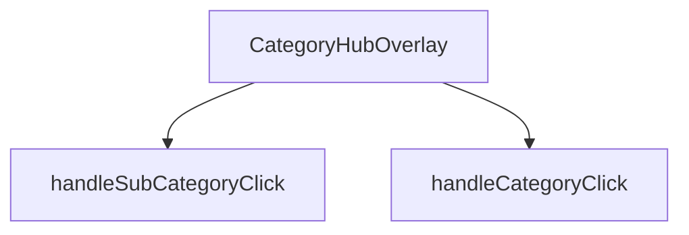

## Genel Bakış
CategoryHubOverlay, site içi navigasyonda kullanılan kategorileri ve alt kategorileri listeleyen bir açılır menü (overlay) bileşenidir. Bileşenin görünürlüğü dışarıdan sağlanan bir durum prop'u ile kontrol edilir ve kullanıcı etkileşimleri bu prop'lar aracılığıyla dış bileşenlere bildirilir.

## Fonksiyon Grupları
### Bileşen ve Görünüm Yönetimi
Bileşenin temel yapısını, açık/kapalı durumunu ve içeriğini render etmekten sorumludur. Dışarıdan sağlanan props'ları yöneterek overlay'in nasıl görüntüleneceğini belirler.
- CategoryHubOverlay

### Kullanıcı Etkileşim İşleyicileri
Kullanıcının kategori veya alt kategori seçeneklerini tıklamasıyla tetiklenen eylemleri yönetir. Seçim durumunu dışarıya bildirir ve menünün kapanmasını tetikleyebilir.
- handleCategoryClick, handleSubCategoryClick

---

## AXIOMS – Mimari Varsayımlar
Bu modül, belirli bağımlılıklar ve koşullar olmadan doğru çalışamaz.

[Aksiyom 1]: Eğer `isOpen` prop'u bileşene iletilmezse (veya geçerli bir boolean değeri yoksa), bileşenin görünürlük durumu belirsiz olur ve overlay açılıp kapatılamaz.

[Aksiyom 2]: Eğer `onClose` prop'u bileşene iletilmezse (veya bir fonksiyon değilse), kullanıcı arayüzünden kapatma işlemi başlatıldığında üst bileşene bildirim yapılamaz ve bileşenin durumu tutarsız hale gelebilir.

[Aksiyom 3]: Eğer `handleCategoryClick` veya `handleSubCategoryClick` fonksiyonları, geçerli bir `DomainCategory` nesnesi alamazsa (örneğin `category` veya `subCategory` parametresi `null`/`undefined` ise), tıklama işlemleri tanımsız davranışa yol açabilir.

[Aksiyom 4]: Eğer bileşen, bir React component ağacının içinde render edilmezse (örneğin bir `ReactDOM.render` veya `createRoot` çağrısı yapılmazsa), hiçbir React hook'u veya yaşam döngüsü çalışmaz ve bileşen işlevsel olmaz.

---

## FONKSİYON DETAYLARI

### CategoryHubOverlay
**Ne yapar**: Kategori navigasyon hub'ının overlay (katman) bileşenidir. Kullanıcı ana navigasyon menüsünden bir kategori grubuna tıkladığında açılan ve alt kategorileri gösteren tam ekran veya yarı saydam overlay bileşenini render eder.

**Nasıl yapar**: React fonksiyonel bileşeni olarak tanımlanmıştır. Bileşenin görünürlüğünü kontrol eden `isOpen` durumunu ve overlay'ı kapatma işlevini sağlayan `onClose` callback'ini parametre olarak alır. Bileşen, domain kategorilerini ve alt kategorilerini列表leyerek kullanıcıya hiyerarşik navigasyon imkanı sunar.

**Parametreler**:
- isOpen: boolean — Overlay'ın açık olup olmadığını belirten durum bayrağı. true olduğunda bileşen görünür hale gelir.
- onClose: () => void — Overlay kapatma butonuna tıklandığında veya dışarı tıklandığında çağrılacak geri çağırma fonksiyonu.

**Dönüş**: React.FC<CategoryHubOverlayProps> tipinde bir React bileşeni döndürür.

### handleCategoryClick
**Ne yapar**: Bir kategori öğesine tıklandığında çağrılan işleyici fonksiyonudur.  
**Nasıl yapar**: `category` parametresi olarak gelen DomainCategory nesnesini alır ve ilgili kategoriyle ilgili işlemleri (örneğin seçimi, navigasyon veya state güncellemesi) gerçekleştirir.  
**Parametreler**:
- category: DomainCategory — Tıklanan kategori nesnesi  
**Dönüş**: void — Fonksiyon bir değer döndürmez

### handleSubCategoryClick
**Ne yapar**: Bir alt kategori öğesine tıklandığında çağrılan işleyici fonksiyonudur.  
**Nasıl yapar**: `subCategory` parametresi olarak gelen DomainCategory nesnesini alır ve ilgili alt kategoriyle ilgili işlemleri (örneğin seçimi, filtren uygulanması veya state güncellemesi) gerçekleştirir.  
**Parametreler**:
- subCategory: DomainCategory — Tıklanan alt kategori nesnesi  
**Dönüş**: void — Fonksiyon bir değer döndürmez

---

## İTHALATLAR (IMPORTS)
- import: ../../contexts/CategoryContext::useCategories
- import: ../../hooks/useCategoryViewModel::useCategoryViewModel
- import: ../../i18n/I18nProvider::useI18n
- import: ../../lib/type-converters::DomainCategory
- import: ../../types/db-rows::type { CategoryMetadata }
- import: ../../utils/routes::Routes
- import: ../products/Category3DIcon::Category3DIcon
- import: @react-three/drei::OrbitControls
- import: @react-three/fiber::Canvas
- import: lucide-react::ArrowLeft
- import: lucide-react::ChevronRight
- import: lucide-react::Grid3X3
- import: lucide-react::X
- import: next/navigation::useRouter
- import: react::React
- import: react::Suspense
- import: react::useCallback
- import: react::useEffect
- import: react::useState

---

## INTERFACES

### CategoryHubOverlayProps
- `isOpen: boolean`
- `onClose: () => void`

---

## AST POINTERS

### [N1_NASIL] AST Pointer: CategoryHubOverlay.tsx::CategoryHubOverlay
- **params**: `{ isOpen, onClose }`
- **ic_degiskenler**:
  - `router` — `useRouter()` hook ile elde edilen Next.js router instance'ı, sayfa yönlendirmeleri (router.push) için kullanılır
  - `t` — `useI18n()` hook'undan dönen çeviri fonksiyonu, UI metinlerinin çok dilli karşılıklarını getirir (örn. `t('megamenu.productCategories')`)
  - `categories` — `useCategories()` hook'undan gelen tüm kategorilerin düz listesi, alt kategori filtreleme ve sayma işlemlerinde kullanılır
  - `mainCategories` — `useCategories()` hook'undan gelen `categoryTree` alanı, üst seviye ( kök ) kategorilerin listesi
  - `wrapCategory` — `useCategoryViewModel()` hook'undan gelen fonksiyon, ham `DomainCategory` nesnelerini `displayName`, `description` gibi sunum alanı eklenmiş view model'e dönüştürür
  - `isAnimating` — `useState<boolean>` — overlay'in animasyon durumunu (açılış/kapanış geçişini) kontrol eder, CSS scale/opacity class'larını belirler
  - `isVisible` — `useState<boolean>` — overlay'in DOM'da render edilip edilmeyeceğini kontrol eder, `false` iken `return null` ile hiçbir şey render edilmez
  - `hoveredCategory` — `useState<DomainCategory | null>` — mouse ile üzerine gelinen kategoriyi tutar, sol paneldeki 3D ikon ve açıklama bilgisini belirler
  - `selectedParentCategory` — `useState<DomainCategory | null>` — tıklanan üst kategoriyi tutar, `null` olmadığında alt kategori listesini gösterir ve geri butonunu aktif eder
  - `displayCategories` — hesaplanan değişken; `selectedParentCategory` varsa onun alt kategorilerini (`categories.filter`), yoksa `mainCategories` listesini tutar
  - `hoveredVm` — `wrapCategory(hoveredCategory)` çağrısıyla elde edilen hover edilmiş kategorinin view model nesnesi, `displayName` ve `description` alanlarını sunar
  - `metadata` — JSX içi IIFE'de `hoveredCategory?.metadata as CategoryMetadata | null` — hover edilen kategorinin metadata objesi
  - `metric1` — `metadata?.metric1 as { value?: string | number, label?: string } | null` — metadata içinden ilk metrik değeri ve etiketi
  - `vm` — `.map()` callback'inde `wrapCategory(cat)` — her bir listedeki kategorinin view model'i, `displayName` alanı render edilir
  - `isSelected` — `.map()` callback'inde `selectedParentCategory !== null` — alt kategori modunda olunup olunmadığını belirten boolean
  - `subCount` — `.map()` callback'inde `!isSelected ? getSubCategoryCount(cat.id) : 0` — kategorinin alt kategori sayısı, sadece üst seviye modunda hesaplanır
- **Dönüş**: JSX elementi (`
` root'lu overlay markup) veya erken `return null` ile `undefined`

---

### [N2_NASIL] AST Pointer: CategoryHubOverlay.tsx::handleCategoryClick
- **params**: `category: DomainCategory` — tıklanan kategori nesnesi
- **ic_degiskenler**:
  - `subCount` — `categories.filter(c => c.parent_id === category.id).length` — tıklanan kategorinin sahip olduğu alt kategori sayısını hesaplar; `0`'dan büyükse alt kategori moduna geçilir, değilse doğrudan navigasyon yapılır
- **Dönüş**: yok — side effect olarak `setSelectedParentCategory(category)` + `setHoveredCategory(category)` çağrısı veya `router.push(Routes.category(category.slug))` + `onClose()` çağrısı yapar

---

### [N3_NASIL] AST Pointer: CategoryHubOverlay.tsx::handleSubCategoryClick
- **params**: `subCategory: DomainCategory` — tıklanan alt kategori nesnesi
- **ic_degiskenler**: yok
- **Dönüş**: yok — side effect olarak `selectedParentCategory` varsa `router.push(Routes.category(selectedParentCategory.slug, subCategory.slug))`, yoksa `router.push(Routes.category(subCategory.slug))` ile navigasyon yapar ve ardından `onClose()` çağrısıyla overlay'i kapatır

---

## MERMAID CALL GRAPH

## NODE ID STANDARD

  file: src\components\navigation\CategoryHubOverlay.tsx
  function: src\components\navigation\CategoryHubOverlay.tsx::CategoryHubOverlay
  function: src\components\navigation\CategoryHubOverlay.tsx::handleCategoryClick
  function: src\components\navigation\CategoryHubOverlay.tsx::handleSubCategoryClick

---

## DISA AKTARILANLAR (EXPORTS)
  export: CategoryHubOverlay

---

## STİL TOKENLERİ

### Arbitrary Değerler (token'a geçirilmemiş)
Yok — tüm stiller token'a geçirilmiş. ✅

### Kullanılan Token'lar (zaten token'a geçirilmiş)
- `h-hvac-hero`, `tracking-hvac-normal`, `tracking-hvac-snug`

### Tailwind Sınıf Özeti
- **Renkler:** `before:bg-sky-400`, `bg-gradient-to-r`, `bg-sky-400/10`, `bg-slate-800`, `bg-slate-800/50`, `bg-slate-900/30`, `bg-slate-900/90`, `bg-slate-950/60`, `border-2`, `border-b`, `border-r`, `border-sky-400/20`, `border-sky-500/30`, `border-slate-700/50`, `border-t-sky-500`
- **Layout:** `absolute`, `backdrop-blur-2xl`, `backdrop-blur-sm`, `backdrop-blur-xl`, `before:absolute`, `before:h-0`, `before:left-0`, `before:top-1/2`, `before:w-3px`, `bottom-10`, `fixed`, `flex`, `flex-1`, `flex-col`, `from-transparent`
- **Varyant/Responsive:** `:`, `before:`, `group-hover/item:`, `group-hover:`, `hover:`, `lg:`, `md:` önekleri
- **Yardımcı Sınıflar:** `${isAnimating`, `-mt-8`, `-translate-x-4`, `:`, `animate-in`, `animate-spin`, `before:-translate-y-1/2`, `before:duration-300`, `before:rounded-r-full`, `before:transition-transform`, `blur-2`, `blur-2xl`, `blur-none`, `border`, `duration-200`