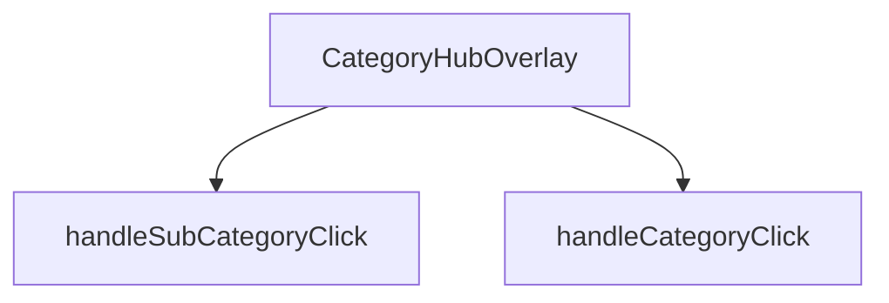

## Genel Bakış
CategoryHubOverlay, kullanıcıların kategorileri ve alt kategorileri görüntüleyip seçebileceği bir kapalı/açılır menü bileşenidir. Bileşen, `isOpen` prop'u ile görünürlüğünü kontrol eder ve `onClose` prop'u ile kapatma işlemini yönetir. Kullanıcı etkileşimlerini işleyerek ilgili kategori veya alt kategori seçim tetikler.

## Fonksiyon Grupları
### Bileşen Renderlama
Overlay'in durumuna göre arayüzün oluşturulması ve render edilmesinden sorumludur. Görünürlük, `isOpen` prop'u ile kontrol edilir.
- CategoryHubOverlay

### Etkileşim İşleyicileri
Kullanıcının kategori veya alt kategori seçeneklerine tıklaması durumunda tetiklenecek işlemleri yönetir. Bu işleyiciler, bileşen içindeki tıklama olaylarına bağlıdır.
- handleCategoryClick
- handleSubCategoryClick

---

## AXIOMS – Mimari Varsayımlar

Bu modül için belirlenen mimari varsayımlar, fonksiyon imzalarına ve prop'ların beklenen kullanımına dayanır.

[Aksiyom 1]: Eğer `isOpen` prop'u sağlanmazsa, bileşenin başlangıç görünürlük durumu belirsizdir ve bileşen hatalı davranabilir.

[Aksiyom 2]: Eğer `isOpen` false değerini alırsa, bileşen (overlay) gizli durumda render edilmemeli veya görünmez olmalıdır.

[Aksiyom 3]: Eğer `isOpen` true değerini alırsa, bileşen (overlay) görünür durumda render edilmeli ve kullanıcı etkileşimine açık olmalıdır.

[Aksiyom 4]: Eğer `onClose` prop'u sağlanmazsa, bileşenin kapatma işlemi tetiklendiğinde hata oluşur veya kapatma işlevi çalışmaz.

[Aksiyom 5]: Eğer `onClose` bir fonksiyon değilse (örn: null veya undefined), bileşenin kapanma mekanizması bozulur.

[Aksiyom 6]: Eğer `handleCategoryClick` çağrıldığında `category` parametresi `DomainCategory` tipine uygun değilse, kategori seçim tetikleme işlemi beklenmeyen sonuçlar doğurur.

[Aksiyom 7]: Eğer `handleSubCategoryClick` çağrıldığında `subCategory` parametresi `DomainCategory` tipine uygun değilse, alt kategori seçim tetikleme işlemi beklenmeyen sonuçlar doğurur.

[Aksiyom 8]: Eğer `isOpen` true iken bileşen render edilir ancak geçerli kategori verisi (DomainCategory) sağlanmazsa, menü içeriği boş veya hatalı görüntülenir.

---

## FONKSİYON DETAYLARI

### CategoryHubOverlay
**Ne yapar**: Kategori navigasyon hub'ının overlay (katman) bileşenidir. Kullanıcı ana navigasyon menüsünden bir kategori grubuna tıkladığında açılan ve alt kategorileri gösteren tam ekran veya yarı saydam overlay bileşenini render eder.

**Nasıl yapar**: React fonksiyonel bileşeni olarak tanımlanmıştır. Bileşenin görünürlüğünü kontrol eden `isOpen` durumunu ve overlay'ı kapatma işlevini sağlayan `onClose` callback'ini parametre olarak alır. Bileşen, domain kategorilerini ve alt kategorilerini列表leyerek kullanıcıya hiyerarşik navigasyon imkanı sunar.

**Parametreler**:
- isOpen: boolean — Overlay'ın açık olup olmadığını belirten durum bayrağı. true olduğunda bileşen görünür hale gelir.
- onClose: () => void — Overlay kapatma butonuna tıklandığında veya dışarı tıklandığında çağrılacak geri çağırma fonksiyonu.

**Dönüş**: React.FC<CategoryHubOverlayProps> tipinde bir React bileşeni döndürür.

### handleCategoryClick
**Ne yapar**: Bir kategori öğesine tıklandığında çağrılan işleyici fonksiyonudur.  
**Nasıl yapar**: `category` parametresi olarak gelen DomainCategory nesnesini alır ve ilgili kategoriyle ilgili işlemleri (örneğin seçimi, navigasyon veya state güncellemesi) gerçekleştirir.  
**Parametreler**:
- category: DomainCategory — Tıklanan kategori nesnesi  
**Dönüş**: void — Fonksiyon bir değer döndürmez

### handleSubCategoryClick
**Ne yapar**: Bir alt kategori öğesine tıklandığında çağrılan işleyici fonksiyonudur.  
**Nasıl yapar**: `subCategory` parametresi olarak gelen DomainCategory nesnesini alır ve ilgili alt kategoriyle ilgili işlemleri (örneğin seçimi, filtren uygulanması veya state güncellemesi) gerçekleştirir.  
**Parametreler**:
- subCategory: DomainCategory — Tıklanan alt kategori nesnesi  
**Dönüş**: void — Fonksiyon bir değer döndürmez

---

## INTERFACES

### CategoryHubOverlayProps
- `isOpen: boolean`
- `onClose: () => void`

---

## AST POINTERS

### [N1_NASIL] AST Pointer: CategoryHubOverlay.tsx::CategoryHubOverlay
- **params**: `isOpen` — overlay'ın açılıp kapatıldığını kontrol eden boolean, `onClose` — overlay'ı kapatmak için çağrılan fonksiyon
- **ic_degiskenler**:
    - `router` — Next.js useRouter hook'undan gelen yönlendirme nesnesi, sayfa yönlendirmeleri için kullanılır
    - `categories` — useCategories hook'undan gelen tüm kategorilerin listesi (düz liste)
    - `mainCategories` — useCategories hook'undan gelen `categoryTree` verisi, ana (üst seviye) kategorilerin ağacı
    - `wrapCategory` — useCategoryViewModel hook'undan gelen, ham kategori verisini görünüm modeline dönüştüren fonksiyon
    - `isAnimating` — animasyon durumunu kontrol eden state, CSS geçişlerini tetikler
    - `isVisible` — overlay'ın DOM'da bulunup bulunmayacağını kontrol eden state, gecikmeli kapanma için kullanılır
    - `hoveredCategory` — Fareyle üzerine gelinen kategoriyi tutan DomainCategory state'i
    - `selectedParentCategory` — Seçilen üst kategoriyi tutan DomainCategory state'i (alt kategorileri gösterirken kullanılır)
    - `getSubCategoryCount` — useCallback ile tanımlanmış, verilen üst kategori ID'sine ait alt kategori sayısını hesaplayan fonksiyon
    - `handleCategoryClick` — Kategori tıklamasını işleyen iç fonksiyon
    - `handleSubCategoryClick` — Alt kategori tıklamasını işleyen iç fonksiyon
    - `displayCategories` — Görüntülenecek kategorilerin listesi, seçili üst kategorinin alt kategorileri veya ana kategoriler
    - `hoveredVm` — `hoveredCategory`'nin `wrapCategory` ile oluşturulmuş görünüm modeli
- **Dönüş**: React.FC<CategoryHubOverlayProps> — JSX elementi veya `null` (isVisible false ise)

### [N2_NASIL] AST Pointer: CategoryHubOverlay.tsx::handleCategoryClick
- **params**: `category` — DomainCategory tipinde, tıklanan kategori nesnesi
- **ic_degiskenler**:
    - `subCount` — `categories` listesinden filtrelenerek hesaplanan, verilen kategorinin alt kategori sayısı
- **Dönüş**: yok

### [N3_NASIL] AST Pointer: CategoryHubOverlay.tsx::handleSubCategoryClick
- **params**: `subCategory` — DomainCategory tipinde, tıklanan alt kategori nesnesi
- **ic_degiskenler**: (yok)
- **Dönüş**: yok

---

## MERMAID CALL GRAPH

## NODE ID STANDARD

  file: src\components\navigation\CategoryHubOverlay.tsx
  function: src\components\navigation\CategoryHubOverlay.tsx::CategoryHubOverlay
  function: src\components\navigation\CategoryHubOverlay.tsx::handleCategoryClick
  function: src\components\navigation\CategoryHubOverlay.tsx::handleSubCategoryClick

---

## DISA AKTARILANLAR (EXPORTS)
  export: CategoryHubOverlay

---

## STİL TOKENLERİ

### Arbitrary Değerler (token'a geçirilmemiş)
Yok — tüm stiller token'a geçirilmiş. ✅

### Kullanılan Token'lar (zaten token'a geçirilmiş)
- `h-hvac-hero`, `tracking-hvac-normal`, `tracking-hvac-snug`

### Tailwind Sınıf Özeti
- **Renkler:** `before:bg-sky-400`, `bg-gradient-to-r`, `bg-sky-400/10`, `bg-slate-800`, `bg-slate-800/50`, `bg-slate-900/30`, `bg-slate-900/90`, `bg-slate-950/60`, `border-2`, `border-b`, `border-r`, `border-sky-400/20`, `border-sky-500/30`, `border-slate-700/50`, `border-t-sky-500`
- **Layout:** `absolute`, `backdrop-blur-2xl`, `backdrop-blur-sm`, `backdrop-blur-xl`, `before:absolute`, `before:h-0`, `before:left-0`, `before:top-1/2`, `before:w-3px`, `bottom-10`, `fixed`, `flex`, `flex-1`, `flex-col`, `from-transparent`
- **Varyant/Responsive:** `:`, `before:`, `group-hover/item:`, `group-hover:`, `hover:`, `lg:`, `md:` önekleri
- **Yardımcı Sınıflar:** `${isAnimating`, `-mt-8`, `-translate-x-4`, `:`, `animate-in`, `animate-spin`, `before:-translate-y-1/2`, `before:duration-300`, `before:rounded-r-full`, `before:transition-transform`, `blur-2`, `blur-2xl`, `blur-none`, `border`, `duration-200`