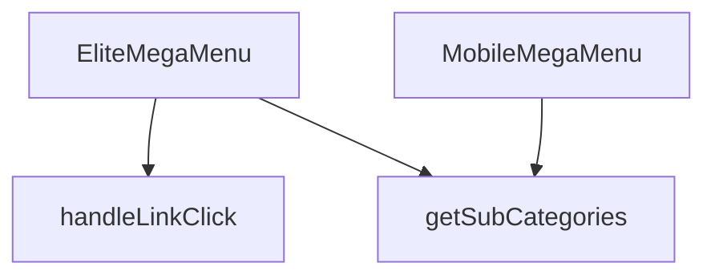

## Genel Bakış
Bu modül, web sitesinin ana navigasyonunu sağlayan çok seviyeli bir mega menü bileşenidir. Hem masaüstü hem de mobil cihazlar için optimize edilmiş iki farklı görünüm sunar. Modül, dışarıdan sağlanan `categories` verisi ve `onNavigate` callback fonksiyonuna bağımlıdır; bu veriler olmadan menü yapısı oluşturulamaz ve kullanıcı yönlendirmesi yapılamaz. Mimari olarak, kullanıcının site içi dolaşımını kontrol eden kritik bir arayüz bileşenidir.

## Fonksiyon Grupları
### Menü Bileşenleri
Masaüstü ve mobil cihazlara özel, veriye dayalı arayüzü render eden iki ana React bileşenini içerir.
- `EliteMegaMenu`, `MobileMegaMenu`

### Etkileşim ve Yönlendirme İşleyicileri
Kullanıcının bir menü bağlantısına tıklaması olayını yakalar ve tıklanan öğenin seviyesine göre uygun navigasyon yolunu hesaplayarak tetikler.
- `handleLinkClick`

### Veri Yardımcıları
Menü yapısını oluşturmak için gerekli olan, belirli bir üst kategorinin tüm alt kategorilerini filtreleyip döndüren yardımcı bir mantık birimi.
- `getSubCategories`

---

## AXIOMS – Mimari Varsayımlar

Bu modül, çok seviyeli navigasyon menüsü sunan React bileşenleri içerir. Aşağıdaki mimari varsayımlar, yalnızca fonksiyon imzaları ve modül sabitlerinden türetilmiştir.

**[Aksiyom 1]:** Eğer `categories` prop'u `EliteMegaMenu` veya `MobileMegaMenu`'ya sağlanmazsa, menü hiyerarşisi oluşturulamaz ve bileşen boş/hatalı render edilir.

**[Aksiyom 2]:** Eğer `onNavigate` callback'i `EliteMegaMenu` veya `MobileMegaMenu`'ya sağlanmazsa, kullanıcı menü bağlantısına tıkladığında yönlendirme gerçekleştirilmez.

**[Aksiyom 3]:** Eğer `getSubCategories`'e geçilen `parentId` string'i geçerli bir kategori kimliği değilse, alt kategoriler alınamaz ve menü alt seviye dalları boş kalır.

**[Aksiyom 4]:** Eğer `handleLinkClick` fonksiyonu çağrılırken `level` parametresi sayısal bir değer olarak sağlanmazsa, tıklanan bağlantının derinlik seviyesi belirlenemez ve yanlış sayfaya yönlendirme olabilir.

**[Aksiyom 5]:** Eğer `handleLinkClick` fonksiyonu çağrılırken `slug` parametresi bir string olarak sağlanmazsa, hedef URL belirlenemez ve `onNavigate` geçersiz bir slugs ile çağrılabilir.

**[Aksiyom 6]:** Eğer `categories` prop'u bir dizi (array) formatında değilse, hem masaüstü (`EliteMegaMenu`) hem de mobil (`MobileMegaMenu`) bileşenlerinde menü öğeleri iterate edilemez.

---

## FONKSİYON DETAYLARI

### MobileMegaMenu
**Ne yapar**: Mobil cihazlarda kullanılan bir mega menü bileşenini tanımlar. Verilen kategori listesi ve yönlendirme fonksiyonunu alarak menünün görsel ve etkileşimsel yapısını oluşturur.  
**Nasıl yapar**: Fonksiyon, `categories` ve `onNavigate` prop’larını alır ve bu verileri `EliteMegaMenu` bileşenine aktararak aynı menü mantığını mobil uyumlu bir şekilde render eder.  
**Parametreler**:
- `categories`: array — Menüde gösterilecek kategori nesnelerinin listesi.  
- `onNavigate`: function (opsiyonel) — Bir menü öğesine tıklandığında çalıştırılacak geri çağırma fonksiyonu.  
**Dönüş**: `React.FC<EliteMegaMenuProps>` — `EliteMegaMenuProps` tipinde özellikler alan bir React fonksiyonel bileşeni.

### EliteMegaMenu
**Ne yapar**: Masaüstü ve büyük ekranlarda kullanılan ana mega menü bileşenini oluşturur. Kategori hiyerarşisini ve navigasyon davranışını yönetir.  
**Nasıl yapar**: Gelen `categories` dizisini dolaşarak her bir kategori için başlık ve alt kategori linklerini render eder; `onNavigate` fonksiyonu tıklama olaylarına bağlanır.  
**Parametreler**:
- `categories`: array — Menüde gösterilecek ana kategori nesneleri.  
- `onNavigate`: function (opsiyonel) — Menü öğesi tıklandığında tetiklenecek geri çağırma.  
**Dönüş**: `React.FC<EliteMegaMenuProps>` — `EliteMegaMenuProps` tipinde özellikler alan bir React fonksiyonel bileşeni.

### handleLinkClick
**Ne yapar**: Belirli bir menü seviyesindeki (level) ve slug değerine sahip bir linke tıklandığında yürütülen işlemleri tanımlar.  
**Nasıl yapar**: Fonksiyon, tıklama olayını yakalar ve verilen `level` ile `slug` parametrelerini kullanarak yönlendirme ya da izleme gibi işlemleri gerçekleştirir; örnek kullanım `() => handleLinkClick(0, category.slug)` şeklindedir.  
**Parametreler**:
- `level`: number — Menüdeki hiyerarşi seviyesini belirten sayı.  
- `slug`: string — Tıklanan kategori ya da alt kategori için benzersiz tanımlayıcı.  
**Dönüş**: Belirtilmemiş (fonksiyonun dönüş tipi dokümantasyonda tanımlı değildir).

### getSubCategories
**Ne yapar**: Verilen bir üst kategori kimliğine (`parentId`) ait alt kategori listesini elde eder.  
**Nasıl yapar**: Fonksiyon, `parentId` parametresiyle çağrıldığında ilgili alt kategorileri döndürür; örnek kullanım içinde `const subs = getSubCategories(category.id)` şeklinde görülür ve dönen `subs` dizisi render sürecinde alt linkler olarak gösterilir.  
**Parametreler**:
- `parentId`: string — Alt kategorilerin alınacağı üst kategori kimliği.  
**Dönüş**: Belirtilmemiş (fonksiyonun dönüş tipi dokümantasyonda tanımlı değildir).

---

## İTHALATLAR (IMPORTS)
- import: ../../hooks/useCategoryViewModel::useCategoryViewModel
- import: ../../i18n/I18nProvider::useI18n
- import: ../../lib/type-converters::DomainCategory
- import: ../../utils/getCategoryIcon::getCategoryIcon
- import: ../../utils/routes::Routes
- import: @radix-ui/react-navigation-menu
- import: lucide-react::ChevronDown
- import: lucide-react::ExternalLink
- import: next/dynamic::dynamic
- import: next/link::Link
- import: react::React
- import: react::useEffect
- import: react::useState

---

## INTERFACES

### EliteMegaMenuProps
- `categories: DomainCategory[]`
- `onNavigate?: () => void`

---

## SABİTLER
- **MegaMenu3DBackground** (call) — `dynamic(() => import('./MegaMenu3DBackground'), { ssr: false })`

---

## AST POINTERS

### [N1_NASIL] AST Pointer: components/navigation/EliteMegaMenu.tsx::MobileMegaMenu
- **params**: `{ categories, onNavigate }`
- **ic_degiskenler**:
  - `wrapCategory` — `useCategoryViewModel()` hook'undan alınan, kategori nesnesini view model'e saran fonksiyon
  - `mainCategories` — `categories.filter((c) => !c.parent_id)` ile elde edilen, üst seviye (kök) kategoriler dizisi
  - `getSubCategories` — `(parentId: string) => categories.filter(...)` tanımı; verilen parentId'e ait alt kategorileri döndüren yardımcı fonksiyon
  - `subs` — her ana kategori döngüsünde `getSubCategories(category.id)` ile elde edilen alt kategoriler dizisi
  - `vm` — `wrapCategory(category)` ile sarılmış ana kategori view modeli
  - `subVm` — iç içe `subs.map` içinde `wrapCategory(sub)` ile sarılmış alt kategori view modeli
- **Dönüş**: JSX — flex column layout'unda ana ve alt kategorileri listele

---

### [N2_NASIL] AST Pointer: components/navigation/EliteMegaMenu.tsx::EliteMegaMenu
- **params**: `{ categories, onNavigate }`
- **ic_degiskenler**:
  - `wrapCategory` — `useCategoryViewModel()` hook'undan alınan kategori view model wrapper fonksiyonu
  - `t` — `useI18n()` hook'undan alınan çeviri fonksiyonu (örn. `t('megamenu.elite.viewAll')`)
  - `isMounted` — `useState(false)` ile tanımlı, client-side mount durumunu takip eden state
  - `handleLinkClick` — link tıklamalarını işleyen, level ve slug parametreleri alan dahili fonksiyon
  - `mainCategories` — `categories.filter((c) => !c.parent_id)` ile elde edilen üst seviye kategoriler
  - `getSubCategories` — `(parentId: string) => categories.filter(...)` tanımı; alt kategorileri filtreleyen yardımcı fonksiyon
  - `subs` — her ana kategori döngüsünde `getSubCategories(category.id)` ile elde edilen alt kategoriler dizisi
  - `vm` — `wrapCategory(category)` ile sarılmış ana kategori view modeli
  - `subVm` — `subs.filter().map` içinde `wrapCategory(sub)` ile sarılmış alt kategori view modeli
- **Dönüş**: `null` (eğer `!isMounted` ise) veya Radix NavigationMenu tabanlı mega menu JSX

---

### [N3_NASIL] AST Pointer: components/navigation/EliteMegaMenu.tsx::handleLinkClick
- **params**: `(level: number, slug: string)`
- **ic_degiskenler**:
  - `_log` — `` `${level} - ${slug}` `` formatında oluşturulan, log amaçlı string (lint uyumluluğu için console.log kaldırılmış)
- **Dönüş**: yok — `onNavigate?.()` yan etkisi tetikler

---

### [N4_NASIL] AST Pointer: components/navigation/EliteMegaMenu.tsx::getSubCategories
- **params**: `(parentId: string)`
- **ic_degiskenler**: yok
- **Dönüş**: `categories.filter((c) => c.parent_id === parentId)` — parentId'e eşleşen alt kategoriler dizisi

---

### [N5_NASIL] AST Pointer: components/navigation/EliteMegaMenu.tsx::useEffect callback (EliteMegaMenu içinde)
- **params**: yok
- **ic_degiskenler**: yok
- **Dönüş**: yok — `setIsMounted(true)` yan etkisi ile mount durumunu true yapar

---

### [N6_NASIL] AST Pointer: components/navigation/EliteMegaMenu.tsx::mainCategories.map callback (MobileMegaMenu içinde)
- **params**: `{ category }`
- **ic_degiskenler**:
  - `subs` — `getSubCategories(category.id)` ile mevcut kategorinin alt kategorileri
  - `vm` — `wrapCategory(category)` ile sarılmış kategori view modeli
- **Dönüş**: JSX — kategori adı ve alt kategorileri içeren div

---

### [N7_NASIL] AST Pointer: components/navigation/EliteMegaMenu.tsx::subs.map callback (MobileMegaMenu içinde)
- **params**: `{ sub }`
- **ic_degiskenler**:
  - `subVm` — `wrapCategory(sub)` ile sarılmış alt kategori view modeli
- **Dönüş**: JSX — `Link` bileşeni ile alt kategori bağlantısı

---

### [N8_NASIL] AST Pointer: components/navigation/EliteMegaMenu.tsx::mainCategories.map callback (EliteMegaMenu içinde)
- **params**: `{ category }`
- **ic_degiskenler**:
  - `subs` — `getSubCategories(category.id)` ile mevcut kategorinin alt kategorileri
  - `vm` — `wrapCategory(category)` ile sarılmış kategori view modeli
  - `subVm` — iç içe `subs.filter().map` içinde `wrapCategory(sub)` ile sarılmış alt kategori view modeli
- **Dönüş**: JSX — alt kategorisi yoksa basit Link, varsa NavigationMenu.Item + Trigger + Content yapısı (MegaMenu3DBackground dahil)

---

### [N9_NASIL] AST Pointer: components/navigation/EliteMegaMenu.tsx::subs.filter().map callback (EliteMegaMenu içinde)
- **params**: `{ sub }`
- **ic_degiskenler**:
  - `subVm` — `wrapCategory(sub)` ile sarılmış alt kategori view modeli
- **Dönüş**: JSX — `li` içinde `Link` bileşeni ile alt kategori bağlantısı

---

## MERMAID CALL GRAPH

## NODE ID STANDARD

  file: src\components\navigation\EliteMegaMenu.tsx
  function: src\components\navigation\EliteMegaMenu.tsx::MobileMegaMenu
  function: src\components\navigation\EliteMegaMenu.tsx::EliteMegaMenu
  function: src\components\navigation\EliteMegaMenu.tsx::handleLinkClick
  function: src\components\navigation\EliteMegaMenu.tsx::getSubCategories

---

## DISA AKTARILANLAR (EXPORTS)
  export: EliteMegaMenu
  export: MobileMegaMenu

---

## STİL TOKENLERİ

### Arbitrary Değerler (token'a geçirilmemiş)
Yok — tüm stiller token'a geçirilmiş. ✅

### Kullanılan Token'lar (zaten token'a geçirilmiş)
- `lg:w-hvac-mega-lg`, `md:w-hvac-mega-md`, `rounded-hvac-sm`, `sm:w-hvac-mega-sm`

### Tailwind Sınıf Özeti
- **Renkler:** `bg-opacity-95`, `bg-slate-50/80`, `bg-white`, `border-slate-100/50`, `border-slate-200/50`, `data-[state=open]:bg-slate-100`, `hover:bg-slate-50`, `hover:text-primary-navy`, `text-base`, `text-primary-navy`, `text-secondary-blue`, `text-slate-600`, `text-slate-700`, `text-slate-900`, `text-sm`
- **Layout:** `absolute`, `backdrop-blur-md`, `backdrop-blur-sm`, `block`, `col-span-1`, `flex`, `flex-col`, `gap-0.5`, `gap-2`, `gap-4`, `gap-x-8`, `grid`, `grid-cols-2`, `h-3`, `h-full`
- **Varyant/Responsive:** `data-[motion=from-end]:`, `data-[motion=from-start]:`, `data-[motion=to-end]:`, `data-[motion=to-start]:`, `data-[state=open]:`, `disabled:`, `focus-visible:`, `group-data-[state=open]:`, `hover:`, `lg:`, `md:`, `sm:` önekleri
- **Yardımcı Sınıflar:** `border`, `center`, `cursor-pointer`, `data-[motion=from-end]:animate-enterFromRight`, `data-[motion=from-start]:animate-enterFromLeft`, `data-[motion=to-end]:animate-exitToRight`, `data-[motion=to-start]:animate-exitToLeft`, `disabled:opacity-50`, `disabled:pointer-events-none`, `duration-300`, `duration-hvac-normal`, `ease-in`, `focus-visible:ring-2`, `focus-visible:ring-slate-300`, `font-bold`