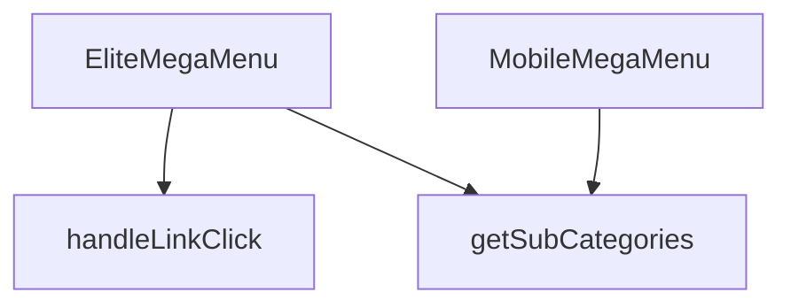

## Genel Bakış
`EliteMegaMenu` bileşeni, hem masaüstü hem de mobil cihazlarda kullanılmak üzere çok seviyeli bir navigasyon menüsü sunar. Menü verileri kategori hiyerarşisinden oluşturulur ve kullanıcı etkileşimleri (link tıklamaları) yönlendirme mantığıyla işlenir.

## Fonksiyon Grupları
### Menü Bileşenleri
Bu grup, menünün UI‑sını tanımlar ve ilgili veri setini alarak render eder.  
- `MobileMegaMenu`, `EliteMegaMenu`

### Navigasyon ve Etkileşim İşleyicileri
Kullanıcı bir menü öğesine tıkladığında hangi seviyede ve hangi slug (yol) üzerinden yönlendirme yapılacağını belirler.  
- `handleLinkClick`

### Veri Yardımcıları
Kategorilerin hiyerarşik yapısında bir üst öğenin altındaki alt‑kategorileri çekmek için kullanılan yardımcı fonksiyon.  
- `getSubCategories`

---

## AXIOMS – Mimari Varsayımlar
Bu modüldeki tüm bileşen ve fonksiyonlar, varsayılan değeri belirtilmemiş olan tüm parametre ve prop'ların sağlanması gerekmektedir.

[Aksiyom 1]: Eğer MobileMegaMenu bileşenine `categories` prop'u sağlanmazsa, bileşen beklenen şekilde çalışamaz.
[Aksiyom 2]: Eğer MobileMegaMenu bileşenine `onNavigate` prop'u sağlanmazsa, bileşenin gezinme işlevselliği çalışmaz.
[Aksiyom 3]: Eğer EliteMegaMenu bileşenine `categories` prop'u sağlanmazsa, bileşen beklenen şekilde çalışamaz.
[Aksiyom 4]: Eğer EliteMegaMenu bileşenine `onNavigate` prop'u sağlanmazsa, bileşenin gezinme işlevselliği çalışmaz.
[Aksiyom 5]: Eğer handleLinkClick fonksiyonuna `level` argümanı sağlanmazsa, fonksiyon beklenen şekilde çalışamaz.
[Aksiyom 6]: Eğer handleLinkClick fonksiyonuna `slug` argümanı sağlanmazsa, fonksiyon beklenen şekilde çalışamaz.
[Aksiyom 7]: Eğer getSubCategories fonksiyonuna `parentId` argümanı sağlanmazsa, fonksiyon beklenen şekilde çalışamaz.

---

## FONKSİYON DETAYLARI

### MobileMegaMenu
**Ne yapar**: Mobil cihazlarda kullanılan bir mega menü bileşenini tanımlar. Verilen kategori listesi ve yönlendirme fonksiyonunu alarak menünün görsel ve etkileşimsel yapısını oluşturur.  
**Nasıl yapar**: Fonksiyon, `categories` ve `onNavigate` prop’larını alır ve bu verileri `EliteMegaMenu` bileşenine aktararak aynı menü mantığını mobil uyumlu bir şekilde render eder.  
**Parametreler**:
- `categories`: array — Menüde gösterilecek kategori nesnelerinin listesi.  
- `onNavigate`: function (opsiyonel) — Bir menü öğesine tıklandığında çalıştırılacak geri çağırma fonksiyonu.  
**Dönüş**: `React.FC<EliteMegaMenuProps>` — `EliteMegaMenuProps` tipinde özellikler alan bir React fonksiyonel bileşeni.

### EliteMegaMenu
**Ne yapar**: Masaüstü ve büyük ekranlarda kullanılan ana mega menü bileşenini oluşturur. Kategori hiyerarşisini ve navigasyon davranışını yönetir.  
**Nasıl yapar**: Gelen `categories` dizisini dolaşarak her bir kategori için başlık ve alt kategori linklerini render eder; `onNavigate` fonksiyonu tıklama olaylarına bağlanır.  
**Parametreler**:
- `categories`: array — Menüde gösterilecek ana kategori nesneleri.  
- `onNavigate`: function (opsiyonel) — Menü öğesi tıklandığında tetiklenecek geri çağırma.  
**Dönüş**: `React.FC<EliteMegaMenuProps>` — `EliteMegaMenuProps` tipinde özellikler alan bir React fonksiyonel bileşeni.

### handleLinkClick
**Ne yapar**: Belirli bir menü seviyesindeki (level) ve slug değerine sahip bir linke tıklandığında yürütülen işlemleri tanımlar.  
**Nasıl yapar**: Fonksiyon, tıklama olayını yakalar ve verilen `level` ile `slug` parametrelerini kullanarak yönlendirme ya da izleme gibi işlemleri gerçekleştirir; örnek kullanım `() => handleLinkClick(0, category.slug)` şeklindedir.  
**Parametreler**:
- `level`: number — Menüdeki hiyerarşi seviyesini belirten sayı.  
- `slug`: string — Tıklanan kategori ya da alt kategori için benzersiz tanımlayıcı.  
**Dönüş**: Belirtilmemiş (fonksiyonun dönüş tipi dokümantasyonda tanımlı değildir).

### getSubCategories
**Ne yapar**: Verilen bir üst kategori kimliğine (`parentId`) ait alt kategori listesini elde eder.  
**Nasıl yapar**: Fonksiyon, `parentId` parametresiyle çağrıldığında ilgili alt kategorileri döndürür; örnek kullanım içinde `const subs = getSubCategories(category.id)` şeklinde görülür ve dönen `subs` dizisi render sürecinde alt linkler olarak gösterilir.  
**Parametreler**:
- `parentId`: string — Alt kategorilerin alınacağı üst kategori kimliği.  
**Dönüş**: Belirtilmemiş (fonksiyonun dönüş tipi dokümantasyonda tanımlı değildir).

---

## INTERFACES

### EliteMegaMenuProps
- `categories: DomainCategory[]`
- `onNavigate?: () => void`

---

## AST POINTERS

### [N1_NASIL] AST Pointer: src/components/navigation/EliteMegaMenu.tsx::MobileMegaMenu
- **params**: ({ categories, onNavigate })
- **ic_degiskenler**:
  - `wrapCategory` — `useCategoryViewModel` hook’den alınan fonksiyon, kategori nesnesini view‑model’e dönüştürür.
  - `mainCategories` — `categories` dizisinden `parent_id` null/undefined olanlar, yani üst seviye kategoriler.
  - `getSubCategories` — verilen `parentId` için `categories` içinde aynı `parent_id` değerine sahip alt kategorileri döndüren yerel fonksiyon.
  - `category` — `mainCategories.map` içinde tekrarlanan her üst kategori nesnesi.
  - `subs` — `getSubCategories(category.id)` çağrısıyla elde edilen `category`’nin alt kategorileri.
  - `vm` — `wrapCategory(category)` sonucu, üst kategori için view‑model.
  - `sub` — `subs.map` içinde tekrarlanan alt kategori nesnesi.
  - `subVm` — `wrapCategory(sub)` sonucu, alt kategori için view‑model.
- **Dönüş**: React element (JSX) – menü yapısını oluşturan `
` ağacı.

### [N2_NASIL] AST Pointer: src/components/navigation/EliteMegaMenu.tsx::EliteMegaMenu
- **params**: ({ categories, onNavigate })
- **ic_degiskenler**:
  - `wrapCategory` — `useCategoryViewModel` hook’den alınan fonksiyon.
  - `isMounted` — bileşenin client‑side mount durumunu tutan state.
  - `setIsMounted` — `isMounted` state’ini güncelleyen set fonksiyonu.
  - `useEffect` — component mount olduğunda `setIsMounted(true)` çalıştırır.
  - `handleLinkClick` — link tıklandığında `onNavigate?.()` çağıran ve log değişkeni tutan yerel fonksiyon.
  - `_log` — `level` ve `slug` değerlerini birleştiren geçici string (konsola yazılmaz).
  - `mainCategories` — `categories` dizisinden üst seviyedekiler (`!c.parent_id`).
  - `getSubCategories` — `parentId` eşleşen alt kategorileri döndüren yerel fonksiyon.
  - `category` — `mainCategories.map` içinde tekrarlanan üst kategori.
  - `subs` — `getSubCategories(category.id)` ile elde edilen alt kategori listesi.
  - `vm` — `wrapCategory(category)` sonucu, üst kategori view‑model’i.
  - `sub` — `subs.filter(...).map` içinde tekrarlanan alt kategori.
  - `subVm` — `wrapCategory(sub)` sonucu, alt kategori view‑model’i.
- **Dönüş**: React element (JSX) – Radix NavigationMenu tabanlı mega menü bileşeni.

### [N3_NASIL] AST Pointer: src/components/navigation/EliteMegaMenu.tsx::handleLinkClick
- **params**: (level: number, slug: string)
- **ic_degiskenler**:
  - `_log` — ``${level} - ${slug}`` biçiminde oluşturulan geçici string (konsola yazılmaz).
  - `onNavigate` — üst bileşenden gelen opsiyonel callback, `onNavigate?.()` ile tetiklenir.
- **Dönüş**: yok (fonksiyon sadece yan etki olarak `onNavigate` callback’ini çalıştırır).

### [N4_NASIL] AST Pointer: src/components/navigation/EliteMegaMenu.tsx::getSubCategories
- **params**: (parentId: string)
- **ic_degiskenler**:
  - `categories` — dışarıdan gelen prop, tüm kategori listesi.
  - `parentId` — alt kategorileri filtrelemek için kullanılan id.
- **Dönüş**: `categories.filter((c) => c.parent_id === parentId)` ifadesinin sonucu; alt kategori nesnelerinin dizisi.

---

## MERMAID CALL GRAPH

## NODE ID STANDARD

  file: src\components\navigation\EliteMegaMenu.tsx
  function: src\components\navigation\EliteMegaMenu.tsx::MobileMegaMenu
  function: src\components\navigation\EliteMegaMenu.tsx::EliteMegaMenu
  function: src\components\navigation\EliteMegaMenu.tsx::handleLinkClick
  function: src\components\navigation\EliteMegaMenu.tsx::getSubCategories

---

## DISA AKTARILANLAR (EXPORTS)
  export: EliteMegaMenu
  export: MobileMegaMenu

---

## STİL TOKENLERİ

### Arbitrary Değerler (token'a geçirilmemiş)
Yok — tüm stiller token'a geçirilmiş. ✅

### Kullanılan Token'lar (zaten token'a geçirilmiş)
- `lg:w-hvac-mega-lg`, `md:w-hvac-mega-md`, `rounded-hvac-sm`, `sm:w-hvac-mega-sm`

### Tailwind Sınıf Özeti
- **Renkler:** `bg-opacity-95`, `bg-slate-50/80`, `bg-white`, `border-slate-100/50`, `border-slate-200/50`, `data-[state=open]:bg-slate-100`, `hover:bg-slate-50`, `hover:text-primary-navy`, `text-base`, `text-primary-navy`, `text-secondary-blue`, `text-slate-600`, `text-slate-700`, `text-slate-900`, `text-sm`
- **Layout:** `absolute`, `backdrop-blur-md`, `backdrop-blur-sm`, `block`, `col-span-1`, `flex`, `flex-col`, `gap-0.5`, `gap-2`, `gap-4`, `gap-x-8`, `grid`, `grid-cols-2`, `h-3`, `h-full`
- **Varyant/Responsive:** `data-[motion=from-end]:`, `data-[motion=from-start]:`, `data-[motion=to-end]:`, `data-[motion=to-start]:`, `data-[state=open]:`, `disabled:`, `focus-visible:`, `group-data-[state=open]:`, `hover:`, `lg:`, `md:`, `sm:` önekleri
- **Yardımcı Sınıflar:** `border`, `center`, `cursor-pointer`, `data-[motion=from-end]:animate-enterFromRight`, `data-[motion=from-start]:animate-enterFromLeft`, `data-[motion=to-end]:animate-exitToRight`, `data-[motion=to-start]:animate-exitToLeft`, `disabled:opacity-50`, `disabled:pointer-events-none`, `duration-300`, `duration-hvac-normal`, `ease-in`, `focus-visible:ring-2`, `focus-visible:ring-slate-300`, `font-bold`