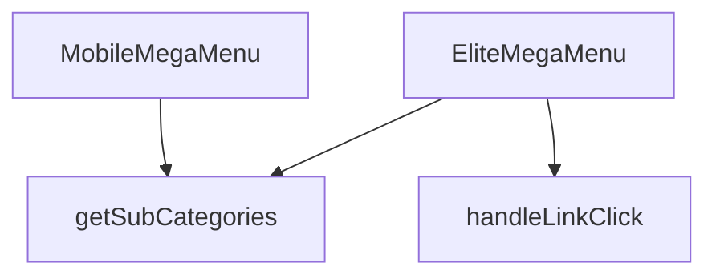

## Genel Bakış
Bu modül, web sitesinin ana navigasyonunu sağlayan çok seviyeli bir mega menü bileşenidir. Hem masaüstü hem de mobil cihazlar için optimize edilmiş iki farklı görünüm sunar. Modül, dışarıdan sağlanan `categories` verisi ve `onNavigate` callback fonksiyonuna bağımlıdır; bu veriler olmadan menü yapısı oluşturulamaz ve kullanıcı yönlendirmesi yapılamaz.

## Fonksiyon Grupları
### Menü Bileşenleri
Masaüstü ve mobil cihazlara özel, veriye dayalı arayüzü render eden iki ana React bileşenini içerir.
- `EliteMegaMenu`, `MobileMegaMenu`

### Etkileşim ve Yönlendirme İşleyicileri
Kullanıcının bir menü bağlantısına tıklaması olayını yakalar ve tıklanan öğenin seviyesine göre uygun navigasyon yolunu hesaplayarak tetikler.
- `handleLinkClick`

### Veri Yardımcıları
Menü yapısını oluşturmak için gerekli olan, belirli bir üst kategorinin tüm alt kategorilerini filtreleyip döndüren yardımcı bir mantık birimi.
- `getSubCategories`

---

## AXIOMS – Mimari Varsayımlar

Bu modül, çok seviyeli mega menü navigasyonu için masaüstü ve mobil olmak üzere iki ayrı bileşen sunar ve her ikisi de aynı prop yapısına (`categories`, `onNavigate`) bağımlıdır.

[Aksiyom 1]: Eğer `categories` prop'u sağlanmazsa, menü yapısı oluşturulamaz; bileşen alt kategorileri hiyerarik olarak gösteremez.

[Aksiyom 2]: Eğer `onNavigate` callback fonksiyonu sağlanmazsa, kullanıcı yönlendirmesi yapılamaz; link tıklamaları bir eylem tetiklemez.

[Aksiyom 3]: Eğer `getSubCategories` fonksiyonuna geçerli bir `parentId` sağlanmazsa, ilgili alt kategoriler getirilemez; menü dallanması eksik kalır.

[Aksiyom 4]: Eğer `handleLinkClick` fonksiyonuna geçerli bir `level` ve `slug` sağlanmazsa, çok seviyeli navigasyon yapısı doğru şekilde işlenemez.

[Aksiyom 5]: Eğer `MegaMenu3DBackground` bileşeni render edilemezse, menü arka plan efekti gösterilmez; görsel deneyim eksik kalır.

[Aksiyom 6]: Eğer `categories` verisi hiyerarik bir yapıya (parentId-child ilişkisi) sahip değilse, `getSubCategories` fonksiyonu beklenen şekilde çalışamaz; menü dallanması düzgün oluşturulamaz.

---

## FONKSİYON DETAYLARI

### MobileMegaMenu
**Ne yapar**: Mobil cihazlarda kullanılan bir mega menü bileşenini tanımlar. Verilen kategori listesi ve yönlendirme fonksiyonunu alarak menünün görsel ve etkileşimsel yapısını oluşturur.  
**Nasıl yapar**: Fonksiyon, `categories` ve `onNavigate` prop’larını alır ve bu verileri `EliteMegaMenu` bileşenine aktararak aynı menü mantığını mobil uyumlu bir şekilde render eder.  
**Parametreler**:
- `categories`: array — Menüde gösterilecek kategori nesnelerinin listesi.  
- `onNavigate`: function (opsiyonel) — Bir menü öğesine tıklandığında çalıştırılacak geri çağırma fonksiyonu.  
**Dönüş**: `React.FC<EliteMegaMenuProps>` — `EliteMegaMenuProps` tipinde özellikler alan bir React fonksiyonel bileşeni.

### EliteMegaMenu
**Ne yapar**: Masaüstü ve büyük ekranlarda kullanılan ana mega menü bileşenini oluşturur. Kategori hiyerarşisini ve navigasyon davranışını yönetir.  
**Nasıl yapar**: Gelen `categories` dizisini dolaşarak her bir kategori için başlık ve alt kategori linklerini render eder; `onNavigate` fonksiyonu tıklama olaylarına bağlanır.  
**Parametreler**:
- `categories`: array — Menüde gösterilecek ana kategori nesneleri.  
- `onNavigate`: function (opsiyonel) — Menü öğesi tıklandığında tetiklenecek geri çağırma.  
**Dönüş**: `React.FC<EliteMegaMenuProps>` — `EliteMegaMenuProps` tipinde özellikler alan bir React fonksiyonel bileşeni.

### handleLinkClick
**Ne yapar**: Belirli bir menü seviyesindeki (level) ve slug değerine sahip bir linke tıklandığında yürütülen işlemleri tanımlar.  
**Nasıl yapar**: Fonksiyon, tıklama olayını yakalar ve verilen `level` ile `slug` parametrelerini kullanarak yönlendirme ya da izleme gibi işlemleri gerçekleştirir; örnek kullanım `() => handleLinkClick(0, category.slug)` şeklindedir.  
**Parametreler**:
- `level`: number — Menüdeki hiyerarşi seviyesini belirten sayı.  
- `slug`: string — Tıklanan kategori ya da alt kategori için benzersiz tanımlayıcı.  
**Dönüş**: Belirtilmemiş (fonksiyonun dönüş tipi dokümantasyonda tanımlı değildir).

### getSubCategories
**Ne yapar**: Verilen bir üst kategorinin (`parentId`) alt kategorilerini özyinelemeli (recursive) olarak bulur ve her bir alt kategoriyi hiyerarşik bir JSX ağacı biçiminde render eder. Ana kategori kalın (bold) yazı ve ikonla birlikte gösterilir; alt kategoriler varsa girintili bir şekilde liste olarak eklenir.

**Nasıl yapar**: Fonksiyon bir arrow function olarak tanımlanmıştır ve bir kategori nesnesi alarak çalışır. Önce `getSubCategories(category.id)` çağrısıyla mevcut kategorinin alt kategorilerini özyinelemeli olarak sorgular. Ardından `wrapCategory(category)` ile kategori nesnesini bir görünüm modeline dönüştürür. Dışarıdan gelen `lang` değişkenini kullanarak `getLocalizedCategorySlug` fonksiyonu aracılığıyla yerelleştirilmiş slug'lar üretir ve `Routes.category` ile URL'ler oluşturur. Ana kategori için `getCategoryIcon` ile bir ikon ve `vm?.displayName` ile görünen adı içeren kalın bir `Link` bileşeni render eder. Alt kategoriler (`subs.length > 0` kontrolüyle) mevcutsa, `pl-6` sınıfıyla girintili bir `div` içinde her bir alt kategori için `subVm?.displayName` görünen adını taşıyan daha küçük metin boyutunda `Link` bileşenleri oluşturur. Her iki link seviyesinde de `onNavigate?.()` opsiyonel çağrı ile tıklama olayı tetiklenir.

**Parametreler**:
- `parentId`: `string` — Alt kategorileri sorgulanacak üst kategorinin benzersiz kimlik numarası. Gövde içinde doğrudan kullanılmaz; fonksiyonun çağrıldığı kapsamda bu değere karşılık gelen kategori nesnesi arrow function parametresi olarak iletilir.

**Dönüş**: Belirtilmemiş. Gövde incelendiğinde bir React JSX ağacı (JSX.Element benzeri bir yapı) döndürdüğü görülmektedir; ancak kaynak kodda açık bir dönüş tipi tanımlı değildir.

---

## İTHALATLAR (IMPORTS)
- import: ../../hooks/useCategoryViewModel::useCategoryViewModel
- import: ../../hooks/useLocalizedRoutes::useLocalizedRoutes
- import: ../../i18n/I18nProvider::useI18n
- import: ../../lib/type-converters::DomainCategory
- import: ../../utils/categoryHelpers::getLocalizedCategorySlug
- import: ../../utils/getCategoryIcon::getCategoryIcon
- import: @radix-ui/react-navigation-menu
- import: lucide-react::ChevronDown
- import: lucide-react::ExternalLink
- import: next/dynamic::dynamic
- import: next/link::Link
- import: react::React
- import: react::useEffect
- import: react::useState

---

## INTERFACES

### EliteMegaMenuProps
- `categories: DomainCategory[]`
- `onNavigate?: () => void`

---

## SABİTLER
- **MegaMenu3DBackground** (call) — `dynamic(() => import('./MegaMenu3DBackground'), { ssr: false })`

---

## AST POINTERS

### [N1_NASIL] AST Pointer: src/components/navigation/EliteMegaMenu.tsx::MobileMegaMenu
- **params**: `categories`, `onNavigate`
- **ic_degiskenler**:
  - `wrapCategory` — `useCategoryViewModel()` hook'undan dönen fonksiyon; kategori nesnesini view model'e dönüştürür
  - `lang` — `useI18n()` hook'undan dönen mevcut dil kodu
  - `Routes` — `useLocalizedRoutes()` hook'undan dönen rotalar nesnesi; `Routes.category()` ile kategori URL'leri üretir
  - `mainCategories` — `categories` dizisinin `parent_id` değeri olmayan (ana kategori) öğelerini filtreler
  - `getSubCategories` — aldığı `parentId` parametresine eşit `parent_id`'ye sahip kategorileri filtreleyen fonksiyon
  - `category` — `mainCategories.map()` döngüsündeki her bir ana kategori nesnesi
  - `subs` — `getSubCategories(category.id)` ile elde edilen alt kategori dizisi
  - `vm` — `wrapCategory(category)` ile oluşturulan ana kategori view model'i; `vm?.displayName` ile görüntü adı alınır
  - `sub` — `subs.map()` döngüsündeki her bir alt kategori nesnesi
  - `subVm` — `wrapCategory(sub)` ile oluşturulan alt kategori view model'i; `subVm?.displayName` ile görüntü adı alınır
- **Dönüş**: JSX elementi — mobil mega menü yapısını render eder

### [N2_NASIL] AST Pointer: src/components/navigation/EliteMegaMenu.tsx::EliteMegaMenu
- **params**: `categories`, `onNavigate`
- **ic_degiskenler**:
  - `wrapCategory` — `useCategoryViewModel()` hook'undan dönen fonksiyon; kategori nesnesini view model'e dönüştürür
  - `t` — `useI18n()` hook'undan dönen çeviri fonksiyonu; `t('megamenu.elite.defaultDescription')` ve `t('megamenu.elite.viewAll')` anahtarlarıyla metin alır
  - `lang` — `useI18n()` hook'undan dönen mevcut dil kodu
  - `Routes` — `useLocalizedRoutes()` hook'undan dönen rotalar nesnesi; `Routes.category()` ile kategori URL'leri üretir
  - `isMounted` — `useState(false)` ile oluşturulan durum değişkeni; bileşenin mount edilip edilmediğini takip eder
  - `setIsMounted` — `isMounted` durumunu güncelleyen setter fonksiyonu
  - `handleLinkClick` — aldığı `level` ve `slug` parametreleriyle `_log` değişkenini oluşturup `onNavigate?.()` çağrısı yapan fonksiyon
  - `mainCategories` — `categories` dizisinin `parent_id` değeri olmayan (ana kategori) öğelerini filtreler
  - `getSubCategories` — aldığı `parentId` parametresine eşit `parent_id`'ye sahip kategorileri filtreleyen fonksiyon
  - `category` — `mainCategories.map()` döngüsündeki her bir ana kategori nesnesi
  - `subs` — `getSubCategories(category.id)` ile elde edilen alt kategori dizisi
  - `vm` — `wrapCategory(category)` ile oluşturulan ana kategori view model'i; `vm?.displayName` ve `vm?.description` özellikleri kullanılır
  - `sub` — `subs.filter(sub => sub.slug !== category.slug).map()` döngüsündeki her bir alt kategori nesnesi
  - `subVm` — `wrapCategory(sub)` ile oluşturulan alt kategori view model'i; `subVm?.displayName` ile görüntü adı alınır
- **Dönüş**: `isMounted` false ise `null`, aksi halde JSX elementi — Radix NavigationMenu tabanlı mega menü yapısını render eder

### [N3_NASIL] AST Pointer: src/components/navigation/EliteMegaMenu.tsx::handleLinkClick
- **params**: `level` (number), `slug` (string)
- **ic_degiskenler**:
  - `_log` — `level` ve `slug` değerlerini birleştiren template literal string; konsol günlüğü kaldırılmış, yalnızca oluşturulur
- **Dönüş**: yok — yan etki olarak `onNavigate?.()` çağrısı yapar

### [N4_NASIL] AST Pointer: src/components/navigation/EliteMegaMenu.tsx::getSubCategories
- **params**: `parentId` (string)
- **ic_degiskenler**: yok — tek satırlık `categories.filter()` işlemi
- **Dönüş**: `parentId` değeri eşleşen kategori dizisi

---

## MERMAID CALL GRAPH

## NODE ID STANDARD

  file: src\components\navigation\EliteMegaMenu.tsx
  function: src\components\navigation\EliteMegaMenu.tsx::MobileMegaMenu
  function: src\components\navigation\EliteMegaMenu.tsx::EliteMegaMenu
  function: src\components\navigation\EliteMegaMenu.tsx::handleLinkClick
  function: src\components\navigation\EliteMegaMenu.tsx::getSubCategories

---

## DISA AKTARILANLAR (EXPORTS)
  export: EliteMegaMenu
  export: MobileMegaMenu

---

## STİL TOKENLERİ

### Arbitrary Değerler (token'a geçirilmemiş)
Yok — tüm stiller token'a geçirilmiş. ✅

### Kullanılan Token'lar (zaten token'a geçirilmiş)
- `lg:w-hvac-mega-lg`, `md:w-hvac-mega-md`, `rounded-hvac-sm`, `sm:w-hvac-mega-sm`

### Tailwind Sınıf Özeti
- **Renkler:** `bg-opacity-95`, `bg-slate-50/80`, `bg-white`, `border-slate-100/50`, `border-slate-200/50`, `data-[state=open]:bg-slate-100`, `hover:bg-slate-50`, `hover:text-primary-navy`, `text-base`, `text-primary-navy`, `text-secondary-blue`, `text-slate-600`, `text-slate-700`, `text-slate-900`, `text-sm`
- **Layout:** `absolute`, `backdrop-blur-md`, `backdrop-blur-sm`, `block`, `col-span-1`, `flex`, `flex-col`, `gap-0.5`, `gap-2`, `gap-4`, `gap-x-8`, `grid`, `grid-cols-2`, `h-3`, `h-full`
- **Varyant/Responsive:** `data-[motion=from-end]:`, `data-[motion=from-start]:`, `data-[motion=to-end]:`, `data-[motion=to-start]:`, `data-[state=open]:`, `disabled:`, `focus-visible:`, `group-data-[state=open]:`, `hover:`, `lg:`, `md:`, `sm:` önekleri
- **Yardımcı Sınıflar:** `border`, `center`, `cursor-pointer`, `data-[motion=from-end]:animate-enterFromRight`, `data-[motion=from-start]:animate-enterFromLeft`, `data-[motion=to-end]:animate-exitToRight`, `data-[motion=to-start]:animate-exitToLeft`, `disabled:opacity-50`, `disabled:pointer-events-none`, `duration-300`, `duration-hvac-normal`, `ease-in`, `focus-visible:ring-2`, `focus-visible:ring-slate-300`, `font-bold`