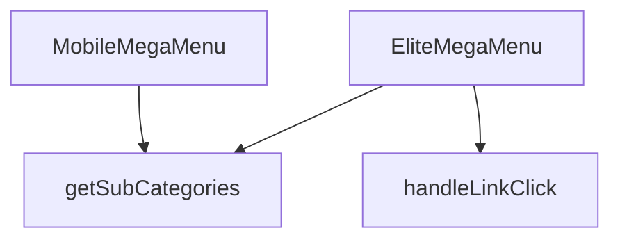

## Genel Bakış
Bu modül, web sitesinin ana navigasyonunu sağlayan çok seviyeli bir mega menü bileşenidir. Hem masaüstü hem de mobil cihazlar için optimize edilmiş iki farklı görünüm sunar ve kullanıcının tıklamalarını dinamik bir şekilde işleyerek doğru sayfaya yönlendirir.

## Fonksiyon Grupları
### Menü Bileşenleri
Masaüstü ve mobil cihazlara özel, veriye dayalı arayüzü render eden iki ana React bileşenini içerir.
- `EliteMegaMenu`, `MobileMegaMenu`

### Etkileşim ve Yönlendirme İşleyicileri
Kullanıcının bir menü bağlantısına tıklaması olayını yakalar ve tıklanan öğenin seviyesine göre uygun navigasyon yolunu hesaplayarak tetikler.
- `handleLinkClick`

### Veri Yardımcıları
Menü yapısını oluşturmak için gerekli olan, belirli bir üst kategorinin tüm alt kategorilerini filtreleyip döndüren yardımcı bir mantık birimi.
- `getSubCategories`

---

---

## FONKSİYON DETAYLARI

### MobileMegaMenu
**Ne yapar**: Mobil cihazlarda kullanılan bir mega menü bileşenini tanımlar. Verilen kategori listesi ve yönlendirme fonksiyonunu alarak menünün görsel ve etkileşimsel yapısını oluşturur.  
**Nasıl yapar**: Fonksiyon, `categories` ve `onNavigate` prop’larını alır ve bu verileri `EliteMegaMenu` bileşenine aktararak aynı menü mantığını mobil uyumlu bir şekilde render eder.  
**Parametreler**:
- `categories`: array — Menüde gösterilecek kategori nesnelerinin listesi.  
- `onNavigate`: function (opsiyonel) — Bir menü öğesine tıklandığında çalıştırılacak geri çağırma fonksiyonu.  
**Dönüş**: `React.FC<EliteMegaMenuProps>` — `EliteMegaMenuProps` tipinde özellikler alan bir React fonksiyonel bileşeni.

### EliteMegaMenu
**Ne yapar**: Masaüstü ve büyük ekranlarda kullanılan ana mega menü bileşenini oluşturur. Kategori hiyerarşisini ve navigasyon davranışını yönetir.  
**Nasıl yapar**: Gelen `categories` dizisini dolaşarak her bir kategori için başlık ve alt kategori linklerini render eder; `onNavigate` fonksiyonu tıklama olaylarına bağlanır.  
**Parametreler**:
- `categories`: array — Menüde gösterilecek ana kategori nesneleri.  
- `onNavigate`: function (opsiyonel) — Menü öğesi tıklandığında tetiklenecek geri çağırma.  
**Dönüş**: `React.FC<EliteMegaMenuProps>` — `EliteMegaMenuProps` tipinde özellikler alan bir React fonksiyonel bileşeni.

### handleLinkClick
**Ne yapar**: Belirli bir menü seviyesindeki (level) ve slug değerine sahip bir linke tıklandığında yürütülen işlemleri tanımlar.  
**Nasıl yapar**: Fonksiyon, tıklama olayını yakalar ve verilen `level` ile `slug` parametrelerini kullanarak yönlendirme ya da izleme gibi işlemleri gerçekleştirir; örnek kullanım `() => handleLinkClick(0, category.slug)` şeklindedir.  
**Parametreler**:
- `level`: number — Menüdeki hiyerarşi seviyesini belirten sayı.  
- `slug`: string — Tıklanan kategori ya da alt kategori için benzersiz tanımlayıcı.  
**Dönüş**: Belirtilmemiş (fonksiyonun dönüş tipi dokümantasyonda tanımlı değildir).

### getSubCategories
**Ne yapar**: Verilen bir üst kategori kimliğine (`parentId`) ait alt kategori listesini elde eder.  
**Nasıl yapar**: Fonksiyon, `parentId` parametresiyle çağrıldığında ilgili alt kategorileri döndürür; örnek kullanım içinde `const subs = getSubCategories(category.id)` şeklinde görülür ve dönen `subs` dizisi render sürecinde alt linkler olarak gösterilir.  
**Parametreler**:
- `parentId`: string — Alt kategorilerin alınacağı üst kategori kimliği.  
**Dönüş**: Belirtilmemiş (fonksiyonun dönüş tipi dokümantasyonda tanımlı değildir).

---

## INTERFACES

### EliteMegaMenuProps
- `categories: DomainCategory[]`
- `onNavigate?: () => void`

---

## SABİTLER
- **MegaMenu3DBackground** (call) — `dynamic(() => import('./MegaMenu3DBackground'), { ssr: false })`

---

## AST POINTERS

### [N1_NASIL] AST Pointer: `src/components/navigation/EliteMegaMenu.tsx`::MobileMegaMenu
- **params**: `({ categories, onNavigate })` — `categories`: DomainCategory dizisi (tüm kategoriler), `onNavigate`: menü öğesine tıklandığında çağrılan callback fonksiyonu
- **ic_degiskenler**:
  - `wrapCategory` — `useCategoryViewModel()` hook'undan dönen kategori view model wrapper fonksiyonu; ham kategori verisini UI için zenginleştirilmiş view model'e dönüştürür
  - `mainCategories` — `categories.filter((c) => !c.parent_id)` ile elde edilen üst seviye (parent_id'si olmayan) kategoriler dizisi
  - `getSubCategories` — `(parentId: string) => categories.filter((c) => c.parent_id === parentId)` tanımlı inline arrow fonksiyon; verilen parentId'e ait alt kategorileri filtreler ve döner
  - `subs` — map callback içinde, `getSubCategories(category.id)` çağrısıyla elde edilen her ana kategoriye ait alt kategoriler dizisi
  - `vm` — map callback içinde, `wrapCategory(category)` ile sarılmış ana kategorinin view model nesnesi; `vm?.displayName` olarak kullanılır
  - `subVm` — iç içe map callback içinde, `wrapCategory(sub)` ile sarılmış alt kategorinin view model nesnesi; `subVm?.displayName` olarak kullanılır
- **Dönüş**: JSX — Mobil cihazlar için dikey kartlar halinde kategori listesi ve alt kategori linkleri içeren menü layout'u

---

## MERMAID CALL GRAPH

## NODE ID STANDARD

  file: src\components\navigation\EliteMegaMenu.tsx
  function: src\components\navigation\EliteMegaMenu.tsx::MobileMegaMenu
  function: src\components\navigation\EliteMegaMenu.tsx::EliteMegaMenu
  function: src\components\navigation\EliteMegaMenu.tsx::handleLinkClick
  function: src\components\navigation\EliteMegaMenu.tsx::getSubCategories

---

## DISA AKTARILANLAR (EXPORTS)
  export: EliteMegaMenu
  export: MobileMegaMenu

---

## STİL TOKENLERİ

### Arbitrary Değerler (token'a geçirilmemiş)
Yok — tüm stiller token'a geçirilmiş. ✅

### Kullanılan Token'lar (zaten token'a geçirilmiş)
- `lg:w-hvac-mega-lg`, `md:w-hvac-mega-md`, `rounded-hvac-sm`, `sm:w-hvac-mega-sm`

### Tailwind Sınıf Özeti
- **Renkler:** `bg-opacity-95`, `bg-slate-50/80`, `bg-white`, `border-slate-100/50`, `border-slate-200/50`, `data-[state=open]:bg-slate-100`, `hover:bg-slate-50`, `hover:text-primary-navy`, `text-base`, `text-primary-navy`, `text-secondary-blue`, `text-slate-600`, `text-slate-700`, `text-slate-900`, `text-sm`
- **Layout:** `absolute`, `backdrop-blur-md`, `backdrop-blur-sm`, `block`, `col-span-1`, `flex`, `flex-col`, `gap-0.5`, `gap-2`, `gap-4`, `gap-x-8`, `grid`, `grid-cols-2`, `h-3`, `h-full`
- **Varyant/Responsive:** `data-[motion=from-end]:`, `data-[motion=from-start]:`, `data-[motion=to-end]:`, `data-[motion=to-start]:`, `data-[state=open]:`, `disabled:`, `focus-visible:`, `group-data-[state=open]:`, `hover:`, `lg:`, `md:`, `sm:` önekleri
- **Yardımcı Sınıflar:** `border`, `center`, `cursor-pointer`, `data-[motion=from-end]:animate-enterFromRight`, `data-[motion=from-start]:animate-enterFromLeft`, `data-[motion=to-end]:animate-exitToRight`, `data-[motion=to-start]:animate-exitToLeft`, `disabled:opacity-50`, `disabled:pointer-events-none`, `duration-300`, `duration-hvac-normal`, `ease-in`, `focus-visible:ring-2`, `focus-visible:ring-slate-300`, `font-bold`