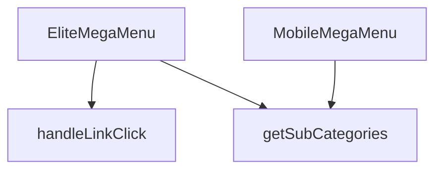

## Genel Bakış

Bu modül, web sitesinin ana navigasyonunu sağlayan çok seviyeli bir mega menü bileşenidir. Hem masaüstü hem de mobil cihazlar için optimize edilmiş iki farklı görünüm sunar. Modül, dışarıdan sağlanan `categories` verisi ve `onNavigate` callback fonksiyonuna bağımlıdır; bu veriler olmadan menü yapısı oluşturulamaz ve kullanıcı yönlendirmesi yapılamaz.

## Fonksiyon Grupları

### Menü Bileşenleri
Masaüstü ve mobil cihazlara özel, veriye dayalı arayüzü render eden iki ana React bileşenini içerir. Her iki bileşen de aynı prop yapısını (`categories`, `onNavigate`) alır.
- `EliteMegaMenu`, `MobileMegaMenu`

### Etkileşim ve Yönlendirme İşleyicileri
Kullanıcının bir menü bağlantısına tıklaması olayını yakalar ve tıklanan öğenin seviyesine göre uygun navigasyon yolunu hesaplayarak tetikler.
- `handleLinkClick`

### Veri Yardımcıları
Menü yapısını oluşturmak için gerekli olan, belirli bir üst kategorinin tüm alt kategorilerini filtreleyip döndüren yardımcı bir mantık birimi.
- `getSubCategories`

---

## AXIOMS – Mimari Varsayımlar

[Aksiyom 1]: Eğer `categories` prop'u sağlanmazsa, menü yapısı oluşturulamaz ve bileşen boş veya hatalı durumda render edilir.

[Aksiyom 2]: Eğer `onNavigate` callback fonksiyonu sağlanmazsa, kullanıcı tıklama işlemleri sonucunda sayfa yönlendirmesi gerçekleştirilemez.

[Aksiyom 3]: Eğer `getSubCategories` fonksiyonuna geçerli bir `parentId` değeri verilmezse, alt kategori verileri getirilemez.

[Aksiyom 4]: Eğer `handleLinkClick` fonksiyonuna geçerli bir `level` ve `slug` değeri sağlanmazsa, link tıklama işlemi düzgün biçimde işlenemez.

[Aksiyom 5]: Eğer `MegaMenu3DBackground` bileşeni mevcut değilse, menü arka plan efekti görüntülenemez.

---

## FONKSİYON DETAYLARI

### MobileMegaMenu
**Ne yapar**: Mobil cihazlarda kullanılan bir mega menü bileşenini tanımlar. Verilen kategori listesi ve yönlendirme fonksiyonunu alarak menünün görsel ve etkileşimsel yapısını oluşturur.  
**Nasıl yapar**: Fonksiyon, `categories` ve `onNavigate` prop’larını alır ve bu verileri `EliteMegaMenu` bileşenine aktararak aynı menü mantığını mobil uyumlu bir şekilde render eder.  
**Parametreler**:
- `categories`: array — Menüde gösterilecek kategori nesnelerinin listesi.  
- `onNavigate`: function (opsiyonel) — Bir menü öğesine tıklandığında çalıştırılacak geri çağırma fonksiyonu.  
**Dönüş**: `React.FC<EliteMegaMenuProps>` — `EliteMegaMenuProps` tipinde özellikler alan bir React fonksiyonel bileşeni.

### EliteMegaMenu
**Ne yapar**: Masaüstü ve büyük ekranlarda kullanılan ana mega menü bileşenini oluşturur. Kategori hiyerarşisini ve navigasyon davranışını yönetir.  
**Nasıl yapar**: Gelen `categories` dizisini dolaşarak her bir kategori için başlık ve alt kategori linklerini render eder; `onNavigate` fonksiyonu tıklama olaylarına bağlanır.  
**Parametreler**:
- `categories`: array — Menüde gösterilecek ana kategori nesneleri.  
- `onNavigate`: function (opsiyonel) — Menü öğesi tıklandığında tetiklenecek geri çağırma.  
**Dönüş**: `React.FC<EliteMegaMenuProps>` — `EliteMegaMenuProps` tipinde özellikler alan bir React fonksiyonel bileşeni.

### handleLinkClick
**Ne yapar**: Belirli bir menü seviyesindeki (level) ve slug değerine sahip bir linke tıklandığında yürütülen işlemleri tanımlar.  
**Nasıl yapar**: Fonksiyon, tıklama olayını yakalar ve verilen `level` ile `slug` parametrelerini kullanarak yönlendirme ya da izleme gibi işlemleri gerçekleştirir; örnek kullanım `() => handleLinkClick(0, category.slug)` şeklindedir.  
**Parametreler**:
- `level`: number — Menüdeki hiyerarşi seviyesini belirten sayı.  
- `slug`: string — Tıklanan kategori ya da alt kategori için benzersiz tanımlayıcı.  
**Dönüş**: Belirtilmemiş (fonksiyonun dönüş tipi dokümantasyonda tanımlı değildir).

### getSubCategories
**Ne yapar**: Verilen bir üst kategorinin alt kategorilerini özyinelemeli (recursive) olarak alır ve her bir kategori için bir React JSX yapısı döndürerek hiyerarşik bir menü öğesi oluşturur. Ana kategori bir `Link` bileşeni olarak gösterilirken, var olan alt kategoriler girintili bir şekilde (`pl-6`) listelenir.

**Nasıl yapar**: Fonksiyon bir `category` parametresi alır ve önce `getSubCategories(category.id)` çağrısıyla aynı fonksiyonu özyinelemeli olarak kullanarak alt kategorileri (`subs`) elde eder. Ardından `wrapCategory(category)` ile kategori verisini bir görünüm modeline (`vm`) sarar. Döndürülen JSX yapısında ana kategori için `Routes.category(getLocalizedCategorySlug(category, lang))` ile bir URL oluşturularak `Link` bileşeninde kullanılır; `getCategoryIcon(category.slug, { size: 18 })` ile ikon ve `vm?.displayName` ile görünen ad gösterilir. Alt kategoriler varsa (`subs.length > 0`), her bir alt kategori için `wrapCategory(sub)` ile görünüm modeli oluşturulur ve `Routes.category(getLocalizedCategorySlug(category, lang), getLocalizedCategorySlug(sub, lang))` ile alt kategoriye özel URL ile ayrı `Link` bileşenleri render edilir. Her iki `Link` bileşeninde de `onClick` olayında `onNavigate?.()` çağrısı yapılır; bu, isteğe bağlı bir navigasyon callback'idir ve varsa tetiklenir.

**Parametreler**:
- `parentId`: string — Alt kategorileri alınacak üst kategorinin kimlik numarası. Fonksiyon tanımında bu parametre yer alır; ancak gövde içinde doğrudan `parentId` yerine `category.id` kullanılmaktadır.

**Dönüş**: JSX elementi döndürür. Döndürülen yapı, bir üst `div` içinde ana kategori `Link`'ini ve varsa alt kategorilerin listelendiği girintili bir `div` yapısını içerir. Dönüş tipi açıkça belirtilmemiştir; TypeScript/React ortamında `JSX.Element` veya benzeri bir tip olması beklenir ancak kaynakta tanımlı değildir.

---

## İTHALATLAR (IMPORTS)
- import: ../../hooks/useCategoryViewModel::useCategoryViewModel
- import: ../../hooks/useLocalizedRoutes::useLocalizedRoutes
- import: ../../i18n/I18nProvider::useI18n
- import: ../../lib/type-converters::DomainCategory
- import: ../../utils/categoryHelpers::getLocalizedCategorySlug
- import: ../../utils/getCategoryIcon::getCategoryIcon
- import: @radix-ui/react-navigation-menu
- import: lucide-react::ChevronDown
- import: lucide-react::ExternalLink
- import: next/dynamic::dynamic
- import: next/link::Link
- import: react::React
- import: react::useEffect
- import: react::useState

---

## INTERFACES

### EliteMegaMenuProps
- `categories: DomainCategory[]`
- `onNavigate?: () => void`

---

## SABİTLER
- **MegaMenu3DBackground** (call) — `dynamic(() => import('./MegaMenu3DBackground'), { ssr: false })`

---

## AST POINTERS

### [N1_NASIL] AST Pointer: C:\tmp\vh-altyapi-t165\src\components\navigation\EliteMegaMenu.tsx::MobileMegaMenu
- **params**: `categories`, `onNavigate`
- **ic_degiskenler**:
  - `wrapCategory` — `useCategoryViewModel` hook'undan dönen, bir kategori nesnesini sarıp görüntü modeline dönüştüren fonksiyon
  - `lang` — `useI18n` hook'undan dönen, geçerli dil kodunu tutan değişken
  - `Routes` — `useLocalizedRoutes` hook'undan dönen, yerelleştirilmiş rota oluşturma fonksiyonlarını içeren nesne
  - `mainCategories` — `categories` dizisinden `parent_id` değeri olmayan (ana) kategorileri filtreleyerek oluşturan dizi
  - `getSubCategories` — `parentId` parametresiyle eşleşen `parent_id`'ye sahip alt kategorileri `categories` dizisinden filtreleyen fonksiyon
  - `category` — `.map` döngüsünde kullanılan, ana kategoriler dizisindeki tekil eleman
  - `subs` — `getSubCategories` fonksiyonu ile hesaplanan, mevcut ana kategorinin alt kategorilerini tutan dizi
  - `vm` — `wrapCategory(category)` çağrısı ile elde edilen, ana kategorinin görüntü modeli nesnesi
  - `sub` — alt kategoriler dizisindeki tekil eleman
  - `subVm` — `wrapCategory(sub)` çağrısı ile elde edilen, alt kategorinin görüntü modeli nesnesi
- **Dönüş**: JSX (React bileşeni)

### [N2_NASIL] AST Pointer: C:\tmp\vh-altyapi-t165\src\components\navigation\EliteMegaMenu.tsx::EliteMegaMenu
- **params**: `categories`, `onNavigate`
- **ic_degiskenler**:
  - `wrapCategory` — `useCategoryViewModel` hook'undan dönen, bir kategori nesnesini sarıp görüntü modeline dönüştüren fonksiyon
  - `t` — `useI18n` hook'undan dönen, çeviri anahtarını alıp yerelleştirilmiş metni döndüren fonksiyon
  - `lang` — `useI18n` hook'undan dönen, geçerli dil kodunu tutan değişken
  - `Routes` — `useLocalizedRoutes` hook'undan dönen, yerelleştirilmiş rota oluşturma fonksiyonlarını içeren nesne
  - `isMounted` — `useState(false)` ile oluşturulan, bileşenin tarayıcıda monte edilip edilmediğini takip eden state değişkeni
  - `setIsMounted` — `isMounted` state'ini güncelleyen setter fonksiyonu
  - `handleLinkClick` — `level` ve `slug` parametrelerini alıp, bir `_log` değişkeni oluşturduktan sonra `onNavigate` fonksiyonunu çağıran fonksiyon
  - `mainCategories` — `categories` dizisinden `parent_id` değeri olmayan (ana) kategorileri filtreleyerek oluşturan dizi
  - `getSubCategories` — `parentId` parametresiyle eşleşen `parent_id`'ye sahip alt kategorileri `categories` dizisinden filtreleyen fonksiyon
  - `category` — `.map` döngüsünde kullanılan, ana kategoriler dizisindeki tekil eleman
  - `subs` — `getSubCategories` fonksiyonu ile hesaplanan, mevcut ana kategorinin alt kategorilerini tutan dizi
  - `vm` — `wrapCategory(category)` çağrısı ile elde edilen, ana kategorinin görüntü modeli nesnesi
  - `sub` — alt kategoriler dizisindeki tekil eleman
  - `subVm` — `wrapCategory(sub)` çağrısı ile elde edilen, alt kategorinin görüntü modeli nesnesi
- **Dönüş**: JSX (React bileşeni) veya `null` (`isMounted` `false` ise)

### [N3_NASIL] AST Pointer: C:\tmp\vh-altyapi-t165\src\components\navigation\EliteMegaMenu.tsx::handleLinkClick
- **params**: `level`, `slug`
- **ic_degiskenler**:
  - `_log` — `level` ve `slug` değişkenlerini birleştirerek oluşturan, ancak kullanılmayan (console log kaldırılmış) string değişken
- **Dönüş**: yok

### [N4_NASIL] AST Pointer: C:\tmp\vh-altyapi-t165\src\components\navigation\EliteMegaMenu.tsx::getSubCategories
- **params**: `parentId`
- **ic_degiskenler**: yok
- **Dönüş**: `DomainCategory[]` (filtrelenmiş alt kategoriler dizisi)

---

## MERMAID CALL GRAPH

## NODE ID STANDARD

  file: src\components\navigation\EliteMegaMenu.tsx
  function: src\components\navigation\EliteMegaMenu.tsx::MobileMegaMenu
  function: src\components\navigation\EliteMegaMenu.tsx::EliteMegaMenu
  function: src\components\navigation\EliteMegaMenu.tsx::handleLinkClick
  function: src\components\navigation\EliteMegaMenu.tsx::getSubCategories

---

## DISA AKTARILANLAR (EXPORTS)
  export: EliteMegaMenu
  export: MobileMegaMenu

---

## STİL TOKENLERİ

### Arbitrary Değerler (token'a geçirilmemiş)
Yok — tüm stiller token'a geçirilmiş. ✅

### Kullanılan Token'lar (zaten token'a geçirilmiş)
- `lg:w-hvac-mega-lg`, `md:w-hvac-mega-md`, `rounded-hvac-sm`, `sm:w-hvac-mega-sm`

### Tailwind Sınıf Özeti
- **Renkler:** `bg-opacity-95`, `bg-slate-50/80`, `bg-white`, `border-slate-100/50`, `border-slate-200/50`, `data-[state=open]:bg-slate-100`, `hover:bg-slate-50`, `hover:text-primary-navy`, `text-base`, `text-primary-navy`, `text-secondary-blue`, `text-slate-600`, `text-slate-700`, `text-slate-900`, `text-sm`
- **Layout:** `absolute`, `backdrop-blur-md`, `backdrop-blur-sm`, `block`, `col-span-1`, `flex`, `flex-col`, `gap-0.5`, `gap-2`, `gap-4`, `gap-x-8`, `grid`, `grid-cols-2`, `h-3`, `h-full`
- **Varyant/Responsive:** `data-[motion=from-end]:`, `data-[motion=from-start]:`, `data-[motion=to-end]:`, `data-[motion=to-start]:`, `data-[state=open]:`, `disabled:`, `focus-visible:`, `group-data-[state=open]:`, `hover:`, `lg:`, `md:`, `sm:` önekleri
- **Yardımcı Sınıflar:** `border`, `center`, `cursor-pointer`, `data-[motion=from-end]:animate-enterFromRight`, `data-[motion=from-start]:animate-enterFromLeft`, `data-[motion=to-end]:animate-exitToRight`, `data-[motion=to-start]:animate-exitToLeft`, `disabled:opacity-50`, `disabled:pointer-events-none`, `duration-300`, `duration-hvac-normal`, `ease-in`, `focus-visible:ring-2`, `focus-visible:ring-slate-300`, `font-bold`