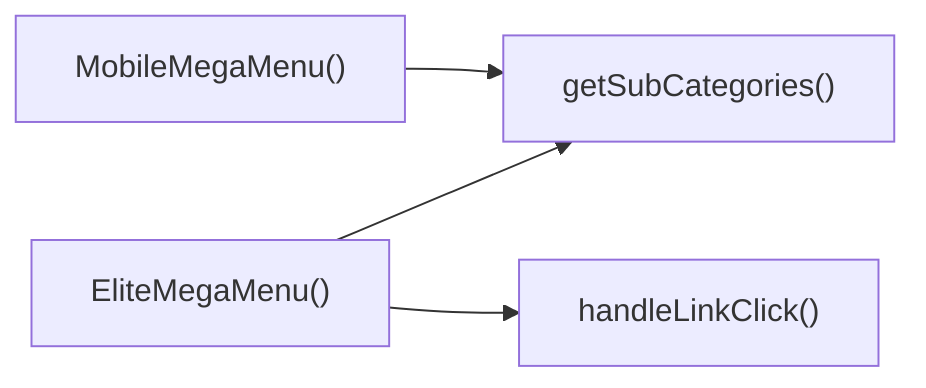

## Genel Bakış
EliteMegaMenu modülü, uygulama içinde büyük ve dinamik menü yapılarını sunmak için kullanılan bir bileşen setidir. Masaüstü ve mobil görünümler için ayrı render fonksiyonları sağlar, menü öğelerine tıklandığında yönlendirmeyi yönetir ve alt kategorileri dinamik olarak çeker.

## Fonksiyon Grupları
### Ana Menü Bileşenleri
Kullanıcı arayüzünde menüyü gösteren ve yapılandırılan React bileşenlerini içerir.
- EliteMegaMenu
- MobileMegaMenu

### Etkileşim ve Veri Yardımcıları
Menü üzerindeki kullanıcı etkileşimlerini işleyen ve gerekli veri çekimini sağlayan fonksiyonları toplar.
- handleLinkClick
- getSubCategories

---

## AXIOMS – Mimari Varsayımlar
Bu modülün çalışabilmesi için `categories` ve `onNavigate` tanımlı olmalı ve fonksiyon parametreleri beklenen tiplerde (number, string) olmalıdır.

[Aksiyom 1]: Eğer `categories` tanımsız veya boş bir dizi değilse, menü öğeleri render edilmez veya hata oluşur.  
[Aksiyom 2]: Eğer `onNavigate` fonksiyonu tanımlı değilse, menü öğelerine tıklandığında navigasyon işlemi gerçekleşmez.  
[Aksiyom 3]: Eğer `handleLinkClick` fonksiyonuna `level` parametresi sayı (number) türünde değilse, beklenen davranış garantilenmez (tip hatası veya yanlış seviye seçimi).  
[Aksiyom 4]: Eğer `handleLinkClick` fonksiyonuna `slug` parametresi string türünde değilse, bağlantı işleme mantığı hatalı çalışabilir veya hata fırlatabilir.  
[Aksiyom 5]: Eğer `getSubCategories` fonksiyonuna `parentId` parametresi string türünde değilse, alt kategori çekme işlemi başarısız olabilir veya undefined döndürebilir.

---

## FONKSIYON DETAYLARI

### MobileMegaMenu
**Ne yapar**: Kategorileri ve navigasyon geri çağrısını alarak bir mega menü bileşeni render eder.  
**Nasıl yapar**: Prop olarak gelen `categories` verisini kullanarak menü yapısını oluşturur; `onNavigate` propu üzerinden menü öğelerine tıklandığında dışarıya bildirim gönderir.  
**Parametreler**:
- categories: veri yapısı (tipi belirsiz) — menüde gösterilecek kategori verileri
- onNavigate: fonksiyon — bir menü öğesi seçildiğinde çağrılan geri çağrı
**Dönüş**: React.FC<EliteMegaMenuProps> — JSX elementi döndüren bir React fonksiyon bileşeni

### EliteMegaMenu
**Ne yapar**: MobileMegaMenu ile aynı işlevi görür; kategorileri ve navigasyon geri çağrısını alarak mega menü arayüzü oluşturur.  
**Nasıl yapar**: `categories` propundan menü yapısını çıkarır, `onNavigate` propu üzerinden kullanıcı etkileşimlerini dışa aktarır.  
**Parametreler**:
- categories: veri yapısı (tipi belirsiz) — menüde gösterilecek kategori verileri
- onNavigate: fonksiyon — bir menü öğesi seçildiğinde çağrılan geri çağrı
**Dönüş**: React.FC<EliteMegaMenuProps> — JSX elementi döndüren bir React fonksiyon bileşeni

### handleLinkClick
**Ne yapar**: Bir menü bağlantısına tıklandığında ilgili işlemi gerçekleştirir.  
**Nasıl yapar**: `level` ve `slug` parametrelerini alarak tıklanan bağlantının derinliğini ve kimliğini belirler; iç mantık (örneğin durum güncellemesi veya yönlendirme) belirtilmemiştir.  
**Parametreler**:
- level: number — bağlantının menü hiyerarşisindeki derinliği
- slug: string — bağlantının benzersiz tanımlayıcısı (örneğin URL slug)
**Dönüş**: void veya bilinmiyor — fonksiyon bir değer döndürmez veya dönüş tipi belirtilmemiş

### getSubCategories
**Ne yapar**: Bir üst kategori kimliğine ait alt kategorileri getirir.  
**Nasıl yapar**: `parentId` parametresini kullanarak ilgili üst kategoriye bağlı alt kategori verisini alır; veri alma veya filtreleme mekanizması belirtilmemiştir.  
**Parametreler**:
- parentId: string — alt kategorileri alınacak üst kategori kimliği
**Dönüş**: void veya bilinmiyor — dönüş tipi belirtilmemiştir; genellikle alt kategori listesi döndürülür gibi bir varsayım yapılmamalıdır.

---

## INTERFACES

### EliteMegaMenuProps
- `categories: DomainCategory[]`
- `onNavigate?: () => void`

---

## AST POINTERS

### [N1_NASIL] AST Pointer: C:\Users\alize\venthub-hvac\src\components\navigation\EliteMegaMenu.tsx::MobileMegaMenu
- **params**: categories, onNavigate
- **ic_degiskenler**:
  - wrapCategory — useCategoryViewModel'den dönen fonksiyon, kategori nesnesini görüntüleme modeline dönüştürür
  - mainCategories — parent_id olmayan üst kategori listesini tutar
  - getSubCategories — verilen parentId'e sahip alt kategorileri filtreleyen iç fonksiyon
  - category — map iterasyonundaki tek kategori nesnesi
  - subs — getSubCategories(category.id) ile elde edilen alt kategori listesi
  - vm — wrapCategory(category) ile elde edilen kategori görüntüleme modeli
  - sub — iç map'teki alt kategori nesnesi
  - subVm — wrapCategory(sub) ile elde edilen alt kategori görüntüleme modeli
- **Dönüş**: JSX element (React component)

### [N2_NASIL] AST Pointer: C:\Users\alize\venthub-hvac\src\components\navigation\EliteMegaMenu.tsx::EliteMegaMenu
- **params**: categories, onNavigate
- **ic_degiskenler**:
  - wrapCategory — useCategoryViewModel'den dönen fonksiyon, kategori nesnesini görüntüleme modeline dönüştürür
  - isMounted — component'in mount olup olmadığını takip eden useState bayrağı
  - setIsMounted — isMounted state'ini güncelleyen setter fonksiyonu
  - handleLinkClick — seviye ve slug bilgisini alıp onNavigate'i tetikleyen iç fonksiyon
  - mainCategories — parent_id olmayan üst kategori listesini tutar
  - getSubCategories — verilen parentId'e sahip alt kategorileri filtreleyen iç fonksiyon
  - category — mainCategories.map iterasyonundaki tek kategori nesnesi
  - subs — getSubCategories(category.id) ile elde edilen alt kategori listesi
  - vm — wrapCategory(category) ile elde edilen kategori görüntüleme modeli
  - sub — subs.filter(...).map iterasyonundaki alt kategori nesnesi
  - subVm — wrapCategory(sub) ile elde edilen alt kategori görüntüleme modeli
- **Dönüş**: JSX element | null (isMounted false ise null)

### [N3_NASIL] AST Pointer: C:\Users\alize\venthub-hvac\src\components\navigation\EliteMegaMenu.tsx::handleLinkClick
- **params**: level, slug
- **ic_degiskenler**:
  - _log — level ve slug bilgisini birleştirip geçici olarak tutan string (lint tarafından kaldırılan console log için kullanılır)
- **Dönüş**: yok (fonksiyon sadece onNavigate?.() çağrısını yapar, değer döndürmez)

### [N4_NASIL] AST Pointer: C:\Users\alize\venthub-hvac\src\components\navigation\EliteMegaMenu.tsx::getSubCategories
- **params**: parentId
- **ic_degiskenler**: (yok)
- **Dönüş**: Category[] (parentId'ye eşen alt kategorilerin dizisi)

---

## ÇAĞRI HARİTASI

### Disariya Cagrilar (Outgoing)
- **MobileMegaMenu()** fonksiyonu, menünün alt kategorilerini getirmek için **getSubCategories()** fonksiyonunu çağırır.  
- **EliteMegaMenu()** fonksiyonu, kullanıcı linkine tıkladığında ilgili işlemi yapmak için **handleLinkClick()** ve aynı zamanda alt kategorileri almak için **getSubCategories()** fonksiyonlarını çağırır.

### Disaridan Cagrilanlar (Incoming)
- Verilen veri setinde bu modülü çağıran dış dosya veya fonksiyon bilgisi bulunmamaktadır.

### Ic Ice Fonksiyonlar (Nested)
- Yok

---

## DOSYA-İÇİ ÇAĞRI GRAFİĞİ
  EliteMegaMenu() → getSubCategories()
  EliteMegaMenu() → handleLinkClick()
  MobileMegaMenu() → getSubCategories()

---

## NODE ID STANDARD

  file: src\components\navigation\EliteMegaMenu.tsx
  function: src\components\navigation\EliteMegaMenu.tsx::MobileMegaMenu
  function: src\components\navigation\EliteMegaMenu.tsx::EliteMegaMenu
  function: src\components\navigation\EliteMegaMenu.tsx::handleLinkClick
  function: src\components\navigation\EliteMegaMenu.tsx::getSubCategories

---

## DISA AKTARILANLAR (EXPORTS)
  export: EliteMegaMenu
  export: MobileMegaMenu