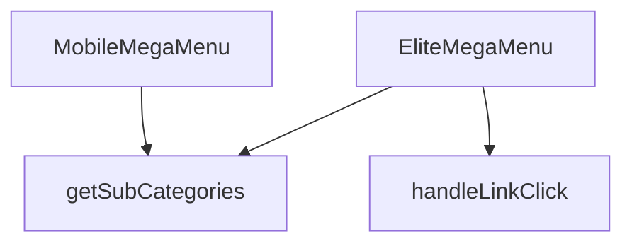

## Genel Bakış
EliteMegaMenu modülü, web sitesinin ana navigasyonunu yöneten, çok seviyeli bir mega menü arayüzü sunan React bileşenlerinden oluşur. Hem masaüstü hem de mobil cihazlar için ayrı ve optimize edilmiş iki farklı görünüm sunar. Modül, dışarıdan sağlanan `categories` hiyerarşisi ve `onNavigate` yönlendirme fonksiyonuna tamamen bağımlıdır; bu veriler olmadan menü yapısı oluşturulamaz ve kullanıcı site içinde gezinti yapamaz. Mimari olarak, kullanıcının istediği bölümlere hızlıca ulaşmasını sağlayan, kritik bir arayüz kontrolü ve veri filtreleme mantığını bir arada barındırır.

## Fonksiyon Grupları
### Ana Menü Bileşenleri
Modülün çekirdeğini oluşturur; masaüstü ve mobil cihazlara özel, kategorilere dayalı çok seviyeli menü yapısını render eden iki ana React bileşenini tanımlar.
- `EliteMegaMenu`, `MobileMegaMenu`

### Etkileşim ve Yönlendirme İşleyicileri
Kullanıcının menü bağlantısına tıklaması olayını dinler, tıklanan öğenin seviyesini analiz eder ve `onNavigate` callback'i aracılığıyla ilgili sayfaya yönlendirme işlemini tetikler.
- `handleLinkClick`

### Veri Filtreleme Yardımcıları
Menü hiyerarşisini dinamik olarak oluşturmaya yönelik yardımcı mantık birimi; belirli bir üst kategorinin tüm alt kategorilerini递归 filtreleyip döndürerek bileşenlere gerekli alt veriyi sağlar.
- `getSubCategories`

---

## AXIOMS – Mimari Varsayımlar

Bu modül, dış veriye bağımlı bir navigasyon mega menü bileşenidir; temel işlevsellik `categories` verisi ve `onNavigate` callback'i olmadan çalışmaz.

[Aksiyom 1]: Eğer `categories` prop'u sağlanmazsa, menü yapısı oluşturulamaz ve bileşen boş/hatalı render edilir.

[Aksiyom 2]: Eğer `onNavigate` callback fonksiyonu sağlanmazsa, kullanıcı bir menü bağlantısına tıkladığında herhangi bir sayfa yönlendirmesi yapılamaz.

[Aksiyom 3]: Eğer `getSubCategories(parentId)` çağrısında `parentId` geçerli bir string değilse, alt kategoriler düzgün filtrelenemez ve menü alt katmanları gösterilemez.

[Aksiyom 4]: Eğer `handleLinkClick(level, slug)` çağrısında `level` sayısal bir değer değilse veya `slug` geçerli bir string değilse, navigasyon hiyerarşisi bozulur ve yanlış sayfaya yönlendirme yapılabilir.

[Aksiyom 5]: Eğer `MegaMenu3DBackground` bileşeni çalıştırılamazsa (bağımlılıklar eksikse), arka plan görseli render edilmez, ancak menü işlevselliği etkilenmez.

[Aksiyom 6]: Eğer `categories` prop'u boş bir dizi ise, menü rendered olur ancak herhangi bir menü öğesi gösterilmez.

---

## FONKSİYON DETAYLARI

### MobileMegaMenu
**Ne yapar**: Mobil cihazlarda kullanılan bir mega menü bileşenini tanımlar. Verilen kategori listesi ve yönlendirme fonksiyonunu alarak menünün görsel ve etkileşimsel yapısını oluşturur.  
**Nasıl yapar**: Fonksiyon, `categories` ve `onNavigate` prop’larını alır ve bu verileri `EliteMegaMenu` bileşenine aktararak aynı menü mantığını mobil uyumlu bir şekilde render eder.  
**Parametreler**:
- `categories`: array — Menüde gösterilecek kategori nesnelerinin listesi.  
- `onNavigate`: function (opsiyonel) — Bir menü öğesine tıklandığında çalıştırılacak geri çağırma fonksiyonu.  
**Dönüş**: `React.FC<EliteMegaMenuProps>` — `EliteMegaMenuProps` tipinde özellikler alan bir React fonksiyonel bileşeni.

### EliteMegaMenu
**Ne yapar**: Masaüstü ve büyük ekranlarda kullanılan ana mega menü bileşenini oluşturur. Kategori hiyerarşisini ve navigasyon davranışını yönetir.  
**Nasıl yapar**: Gelen `categories` dizisini dolaşarak her bir kategori için başlık ve alt kategori linklerini render eder; `onNavigate` fonksiyonu tıklama olaylarına bağlanır.  
**Parametreler**:
- `categories`: array — Menüde gösterilecek ana kategori nesneleri.  
- `onNavigate`: function (opsiyonel) — Menü öğesi tıklandığında tetiklenecek geri çağırma.  
**Dönüş**: `React.FC<EliteMegaMenuProps>` — `EliteMegaMenuProps` tipinde özellikler alan bir React fonksiyonel bileşeni.

### handleLinkClick
**Ne yapar**: Belirli bir menü seviyesindeki (level) ve slug değerine sahip bir linke tıklandığında yürütülen işlemleri tanımlar.  
**Nasıl yapar**: Fonksiyon, tıklama olayını yakalar ve verilen `level` ile `slug` parametrelerini kullanarak yönlendirme ya da izleme gibi işlemleri gerçekleştirir; örnek kullanım `() => handleLinkClick(0, category.slug)` şeklindedir.  
**Parametreler**:
- `level`: number — Menüdeki hiyerarşi seviyesini belirten sayı.  
- `slug`: string — Tıklanan kategori ya da alt kategori için benzersiz tanımlayıcı.  
**Dönüş**: Belirtilmemiş (fonksiyonun dönüş tipi dokümantasyonda tanımlı değildir).

### getSubCategories
**Ne yapar**: Verilen bir üst kategorinin (parent) alt kategorilerini递归 olarak getirir. Kategori hiyerarşisinde derinlemesine erişim sağlayarak, belirli bir parentId'ye bağlı tüm alt kategorileri bir dizi (array) olarak döndürür.

**Nasıl yapar**: Fonksiyon, verilen `parentId` parametresine karşılık gelen kategoriye ait tüm alt kategorileri bulur ve bir dizi olarak geri döner. Elde edilen dizi, daha sonra `.map()` ile iterate edilerek her alt kategori için bağlayıcı (Link) elemanları oluşturulur. Eğer alt kategorilerin de kendi altları varsa, aynı fonksiyon recursive çağrılarla daha derin seviyeleri de işler. Fonksiyonun dönüş tipi kodda açıkça belirtilmemiş olmakla birlikte, kullanım biçiminden (`subs.length`, `subs.map()`) bir dizi döndürdüğü açıktır.

**Parametreler**:
- `parentId: string` — Alt kategorileri getirilecek üst kategorinin benzersiz tanımlayıcısı. Bu ID, kategori nesnelerinin `id` alanıyla eşleşir.

**Dönüş**: Fonksiyonun dönüş tipi kaynak kodda doğrudan belirtilmemiştir. Ancak kullanım bağlamından (`subs.length > 0` kontrolü ve `subs.map()` iterasyonu) bir dizi (array) döndürdüğü anlaşılmaktadır. Dizinin eleman türü, kategori nesnelerinden oluşmaktadır.

---

## İTHALATLAR (IMPORTS)
- import: ../../hooks/useCategoryViewModel::useCategoryViewModel
- import: ../../hooks/useLocalizedRoutes::useLocalizedRoutes
- import: ../../i18n/I18nProvider::useI18n
- import: ../../lib/type-converters::DomainCategory
- import: ../../utils/categoryHelpers::getLocalizedCategorySlug
- import: ../../utils/getCategoryIcon::getCategoryIcon
- import: @radix-ui/react-navigation-menu
- import: lucide-react::ChevronDown
- import: lucide-react::ExternalLink
- import: next/dynamic::dynamic
- import: next/link::Link
- import: react::React
- import: react::useEffect
- import: react::useState

---

## INTERFACES

### EliteMegaMenuProps
- `categories: DomainCategory[]`
- `onNavigate?: () => void`

---

## SABİTLER
- **MegaMenu3DBackground** (call) — `dynamic(() => import('./MegaMenu3DBackground'), { ssr: false })`

---

## AST POINTERS

### [N1_NASIL] AST Pointer: components/navigation/EliteMegaMenu.tsx::MobileMegaMenu
- **params**: `{ categories, onNavigate }`
- **ic_degiskenler**:
  - `wrapCategory` — `useCategoryViewModel` hook'undan gelen, kategori nesnesini view model'e sarmalayan fonksiyon
  - `lang` — `useI18n` hook'undan gelen aktif dil kodu (örn. "tr", "en")
  - `Routes` — `useLocalizedRoutes` hook'undan gelen lokalize rota üreteçleri nesnesi; `Routes.category(...)` çağrılır
  - `mainCategories` — `categories` içinden `parent_id`'si falsy olan ana kategorilerin filtrelenmiş dizisi
  - `getSubCategories` — verilen `parentId` ile eşleşen alt kategorileri döndüren inner fonksiyon
- **Dönüş**: JSX — `
` içinde kategori ve alt kategori Link'leri barındıran mobil mega menü yapısı; `onNavigate?.()` çağrısıyla navigasyon tetikler

---

### [N2_NASIL] AST Pointer: components/navigation/EliteMegaMenu.tsx::MobileMegaMenu::mainCategories.map callback (category)
- **params**: `category` — `mainCategories` dizisinden gelen tekil `DomainCategory` nesnesi
- **ic_degiskenler**:
  - `subs` — `getSubCategories(category.id)` çağrısıyla elde edilen mevcut kategorinin alt kategorileri dizisi
  - `vm` — `wrapCategory(category)` ile sarılmış kategori view model nesnesi; `vm?.displayName` olarak kullanılır
- **Dönüş**: JSX — `
` içinde kategori adı Link'i ve varsa alt kategorilerin listelendiği `
`

---

### [N3_NASIL] AST Pointer: components/navigation/EliteMegaMenu.tsx::MobileMegaMenu::mainCategories.map::subs.map callback (sub)
- **params**: `sub` — `subs` dizisinden gelen tekil alt `DomainCategory` nesnesi
- **ic_degiskenler**:
  - `subVm` — `wrapCategory(sub)` ile sarılmış alt kategori view model nesnesi; `subVm?.displayName` olarak kullanılır
- **Dönüş**: JSX — `<Link>` bileşeni; iki seviyeli lokalize slug ile `Routes.category(...)` href'i, onClick'te `onNavigate?.()`

---

### [N4_NASIL] AST Pointer: components/navigation/EliteMegaMenu.tsx::EliteMegaMenu
- **params**: `{ categories, onNavigate }`
- **ic_degiskenler**:
  - `wrapCategory` — `useCategoryViewModel` hook'undan gelen kategori view model sarmalayıcı fonksiyon
  - `t` — `useI18n` hook'undan gelen çeviri fonksiyonu; `t('megamenu.elite.defaultDescription')` ve `t('megamenu.elite.viewAll')` çağrılır
  - `lang` — `useI18n` hook'undan gelen aktif dil kodu
  - `Routes` — `useLocalizedRoutes` hook'undan gelen lokalize rota üreteçleri nesnesi
  - `isMounted` — `useState(false)` ile oluşturulmuş boolean state; bileşenin istemci tarafında mount olup olmadığını takip eder
  - `setIsMounted` — `isMounted` state'ini güncelleyen setter fonksiyonu; `useEffect` callback'inde `true` olarak çağrılır
  - `handleLinkClick` — inner fonksiyon; `(level: number, slug: string)` alır, log string oluşturur ve `onNavigate?.()` çağırır
  - `mainCategories` — `categories` içinden `parent_id`'si falsy olan ana kategorilerin filtrelenmiş dizisi
  - `getSubCategories` — `(parentId: string) => categories.filter(...)` — parentId eşleşen alt kategorileri döndüren inner fonksiyon
- **Dönüş**: `null` (eğer `isMounted` false ise) veya JSX — `<NavigationMenu.Root>` ile tam mega menü yapısı; ana kategoriler `NavigationMenu.Item` olarak listelenir, alt kategorisi olanlar `NavigationMenu.Trigger` + `NavigationMenu.Content` ile dropdown oluşturur; `MegaMenu3DBackground`, `getCategoryIcon`, `ChevronDown`, `ExternalLink` bileşenleri kullanılır

---

### [N5_NASIL] AST Pointer: components/navigation/EliteMegaMenu.tsx::EliteMegaMenu::useEffect callback
- **params**: yok
- **ic_degiskenler**: yok
- **Dönüş**: yok — `setIsMounted(true)` çağırarak bileşenin mount durumunu günceller; bağımlılık dizisi `[]` olduğu için sadece ilk render'da çalışır

---

### [N6_NASIL] AST Pointer: components/navigation/EliteMegaMenu.tsx::EliteMegaMenu::handleLinkClick
- **params**: `level: number`, `slug: string`
- **ic_degiskenler**:
  - `_log` — `` `${level} - ${slug}` `` template literal'i; debug amaçlı oluşturulmuş ama kullanılmayan (lint compliance için console log kaldırılmış)
- **Dönüş**: yok (void) — `onNavigate?.()` çağırarak menü navigasyonunu tetikler

---

### [N7_NASIL] AST Pointer: components/navigation/EliteMegaMenu.tsx::EliteMegaMenu::getSubCategories
- **params**: `parentId: string`
- **ic_degiskenler**: yok
- **Dönüş**: `categories.filter((c) => c.parent_id === parentId)` — verilen `parentId`'ye sahip alt kategorilerin dizisi

---

### [N8_NASIL] AST Pointer: components/navigation/EliteMegaMenu.tsx::EliteMegaMenu::mainCategories.map callback (category)
- **params**: `category` — `mainCategories` dizisinden gelen tekil `DomainCategory` nesnesi
- **ic_degiskenler**:
  - `subs` — `getSubCategories(category.id)` ile elde edilen mevcut kategorinin alt kategorileri dizisi
  - `vm` — `wrapCategory(category)` ile sarılmış kategori view model nesnesi; `vm?.displayName` ve `vm?.description` olarak kullanılır
- **Dönüş**: JSX — `subs.length === 0` ise düz `NavigationMenu.Item` + `Link` döner; aksi halde `NavigationMenu.Trigger` + `NavigationMenu.Content` ile dropdown mega menü paneli döner; `MegaMenu3DBackground` bileşeni `categorySlug={category.slug}` ile render edilir

---

### [N9_NASIL] AST Pointer: components/navigation/EliteMegaMenu.tsx::EliteMegaMenu::mainCategories.map::subs.filter().map callback (sub)
- **params**: `sub` — `subs.filter(sub => sub.slug !== category.slug)` dizisinden gelen tekil alt `DomainCategory` nesnesi
- **ic_degiskenler**:
  - `subVm` — `wrapCategory(sub)` ile sarılmış alt kategori view model nesnesi; `subVm?.displayName` olarak kullanılır
- **Dönüş**: JSX — `<li key={sub.id}>` içinde `<Link>` bileşeni; iki seviyeli lokalize slug ile `Routes.category(...)` href, onClick'te `handleLinkClick(1, sub.slug)` çağrısı

---

## MERMAID CALL GRAPH

## NODE ID STANDARD

  file: src\components\navigation\EliteMegaMenu.tsx
  function: src\components\navigation\EliteMegaMenu.tsx::MobileMegaMenu
  function: src\components\navigation\EliteMegaMenu.tsx::EliteMegaMenu
  function: src\components\navigation\EliteMegaMenu.tsx::handleLinkClick
  function: src\components\navigation\EliteMegaMenu.tsx::getSubCategories

---

## DISA AKTARILANLAR (EXPORTS)
  export: EliteMegaMenu
  export: MobileMegaMenu

---

## STİL TOKENLERİ

### Arbitrary Değerler (token'a geçirilmemiş)
Yok — tüm stiller token'a geçirilmiş. ✅

### Kullanılan Token'lar (zaten token'a geçirilmiş)
- `lg:w-hvac-mega-lg`, `md:w-hvac-mega-md`, `rounded-hvac-sm`, `sm:w-hvac-mega-sm`

### Tailwind Sınıf Özeti
- **Renkler:** `bg-opacity-95`, `bg-slate-50/80`, `bg-white`, `border-slate-100/50`, `border-slate-200/50`, `data-[state=open]:bg-slate-100`, `hover:bg-slate-50`, `hover:text-primary-navy`, `text-base`, `text-primary-navy`, `text-secondary-blue`, `text-slate-600`, `text-slate-700`, `text-slate-900`, `text-sm`
- **Layout:** `absolute`, `backdrop-blur-md`, `backdrop-blur-sm`, `block`, `col-span-1`, `flex`, `flex-col`, `gap-0.5`, `gap-2`, `gap-4`, `gap-x-8`, `grid`, `grid-cols-2`, `h-3`, `h-full`
- **Varyant/Responsive:** `data-[motion=from-end]:`, `data-[motion=from-start]:`, `data-[motion=to-end]:`, `data-[motion=to-start]:`, `data-[state=open]:`, `disabled:`, `focus-visible:`, `group-data-[state=open]:`, `hover:`, `lg:`, `md:`, `sm:` önekleri
- **Yardımcı Sınıflar:** `border`, `center`, `cursor-pointer`, `data-[motion=from-end]:animate-enterFromRight`, `data-[motion=from-start]:animate-enterFromLeft`, `data-[motion=to-end]:animate-exitToRight`, `data-[motion=to-start]:animate-exitToLeft`, `disabled:opacity-50`, `disabled:pointer-events-none`, `duration-300`, `duration-hvac-normal`, `ease-in`, `focus-visible:ring-2`, `focus-visible:ring-slate-300`, `font-bold`