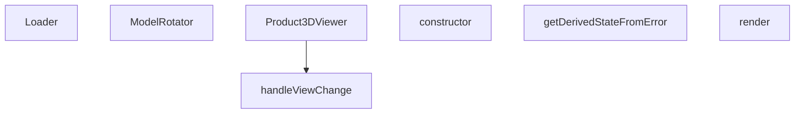

## Genel Bakış
Bu modül, ürünlerin 3D modellerini görüntülemek için kullanılan bir React bileşeni sunar. Kullanıcının modeli farklı açılardan (ön, üst, sağ, arka, alt, sol, izometrik) incelemesine olanak tanır. Tam ekran desteği, otomatik döndürme ve hata yakalama gibi özellikleri içerir.

## Fonksiyon Grupları

### Ana Görüntüleyici
Ürünün 3D modelini görüntülemek için ana bileşeni sağlar. Slug ve model tipi gibi parametrelerle hangi modelin yükleneceğini belirler; tam ekran modu ve kapatma fonksiyonu gibi kullanıcı etkileşimlerini yönetir.
- Product3DViewer

### Model Kontrolü ve Görünüm Yönetimi
3D modelin döndürülmesini ve farklı açılardan görüntülenmesini sağlar. ModelRotator bileşeni modeli otomatik veya manuel olarak döndürürken, handleViewChange fonksiyonu ön, üst, sağ, arka, alt, sol ve izometrik görünümler arasında geçiş yapar.
- ModelRotator, handleViewChange

### Yükleme ve Hata Yönetimi
Model yüklenirken kullanıcıya yükleme durumu gösterir ve 3D işleme sırasında oluşabilecek hataları yakalayarak kullanıcıya anlamlı hata mesajları sunar. ErrorBoundary sınıfı, React bileşen ağacındaki hataları yakalar ve çökme yerine hata ekranı gösterir.
- Loader, ErrorBoundary (constructor, getDerivedStateFromError, render)

---

## AXIOMS – Mimari Varsayımlar
- Bu modül davranışsal mantık içermez (salt veri / konfigürasyon / tip tanımı).
- [Aksiyom 1]: Modülün dışa açtığı yapı (anahtar kümesi / şema) bir sözleşmedir; tüketiciler bu sabit yapıya bağlıdır — kırıcı değişiklik tüm tüketicileri etkiler.
- [Aksiyom 2]: Bir öğe ekleme/çıkarma yapısal-uyumlu olmalı; ilgili tipler ve seçiciler aynı commit'te güncel tutulmalıdır.

---

## FONKSİYON DETAYLARI

### Loader
**Ne yapar**: 3D model yükleme işleminin ilerleme yüzdesini ekranda gösteren bir bileşendir. Kullanıcıya modelin ne kadarının yüklendiğini yüzde olarak bildirir.

**Nasıl yapar**: `useProgress` kancasından `progress` değerini alır. Bu değeri `toFixed(0)` ile ondalıksız tam sayıya çevirerek ekrana yansıtır. `Html` bileşeni kullanılarak Three.js sahnesi üzerine HTML içeriği yerleştirilir ve ortalanmış bir şekilde görüntülenir. Metin, koyu lacivert renkte, yarı saydam beyaz arka plan üzerinde yuvarlatılmış köşeli bir kutu içinde sunulur.

**Parametreler**:
- Bu fonksiyon parametre almaz.

**Dönüş**: JSX elementi döndürür. `Html` bileşeni içinde yüzde değerini gösteren bir `div` elementi içerir.

### ModelRotator
**Ne yapar**: Geliştirildi ancak detay üretilemedi.

### Product3DViewer
**Ne yapar**: Geliştirildi ancak detay üretilemedi.

### handleViewChange
**Ne yapar**: Geliştirildi ancak detay üretilemedi.

### constructor
**Ne yapar**: ErrorBoundary sınıfının kurucu fonksiyonudur. React bileşeninin başlangıç durumunu (state) ayarlar ve üst sınıfın kurucusunu çağırır.
**Nasıl yapar**: `super(props)` çağrısı ile React bileşen sınıfının kurucusunu çalıştırır. Ardından `this.state` nesnesini `hasError: false` ve `error: null` değerleriyle başlatır. Bu, bileşenin başlangıçta hata durumunda olmadığını belirtir.
**Parametreler**:
- props: { children: React.ReactNode, t: (key: string) => string } — Bileşenin alacağı özellikleri içerir. `children` alt bileşenleri, `t` ise çeviri fonksiyonunu temsil eder.
**Dönüş**: Belirtilmemiş (void veya bilinmiyor).

### getDerivedStateFromError
**Ne yapar**: React'ın hata yakalama yaşam döngüsü metodudur. Bir alt bileşende hata oluştuğunda çağrılır ve bileşenin durumunu güncelleyerek hata yakalama işlemini başlatır.
**Nasıl yapar**: Statik bir metot olarak tanımlanmıştır. Parametre olarak yakalanan `error` nesnesini alır ve `{ hasError: true, error }` nesnesini döndürür. Bu dönüş değeri, bileşenin state'ine birleştirilerek `hasError` durumunu `true` yapar ve yakalanan hatayı saklar.
**Parametreler**:
- error: Error — Yakalanan hata nesnesi.
**Dönüş**: { hasError: true, error } — Bileşenin state'ine birleştirilecek hata durumu nesnesi.

### render
**Ne yapar**: Bileşenin arayüzünü oluşturur. Hata durumuna göre ya hata mesajını gösterir ya da alt bileşenleri render eder.
**Nasıl yapar**: İlk olarak `this.state.hasError` değerini kontrol eder. Eğer `true` ise, bir hata arayüzü oluşturur: `Html` bileşeni içinde kırmızı renkli bir uyarı kutusu gösterir. Bu kutuda `this.props.t('product3d.loadError')` ile çevrilmiş hata başlığı ve `this.state.error?.message?.slice(0, 100)` ile hata mesajının ilk 100 karakteri yer alır. Eğer hata yoksa (`hasError` `false` ise), doğrudan `this.props.children` döndürülerek alt bileşenlerin normal şekilde render edilmesi sağlanır.
**Parametreler**: Parametre almaz.
**Dönüş**: JSX.Element — Hata durumunda hata arayüzü, normal durumda `this.props.children`.

---

## İTHALATLAR (IMPORTS)
- import: ../../../i18n/I18nProvider::useI18n
- import: ../../../utils/3dModelOffsets::getModelPlacement
- import: ./ProductModelRenderer::ProductModelRenderer
- import: ./core::VentHubCanvas
- import: @react-three/fiber::useThree
- import: react::React
- import: react::Suspense
- import: react::useCallback
- import: react::useEffect
- import: react::useRef
- import: react::useState
- import: three::Vector3
- import: three::type { Group }

---

## INTERFACES

### Product3DViewerProps
- `slug?: string`
- `modelType?: string`
- `isFullscreen?: boolean`
- `onToggleFullscreen?: () => void`
- `onClose?: () => void`

---

## SABİTLER
- **_camRight** (new_expression) — `new Vector3()`
- **_camUp** (new_expression) — `new Vector3()`

---

## AST POINTERS

### [N1_NASIL] AST Pointer: src/components/products/3d/Product3DViewer.tsx::Loader
- **params**: (parametre yok)
- **ic_degiskenler**:
  - `progress` — `useProgress()` hook'undan gelen yükleme ilerleme yüzdesi (sayı)
- **Dönüş**: JSX element — `<Html>` bileşeni içinde yüzdeyi gösteren div

### [N2_NASIL] AST Pointer: src/components/products/3d/Product3DViewer.tsx::ModelRotator
- **params**: `children` (React.ReactNode), `enabled` (boolean), `rotationRef` (React.MutableRefObject<Group | null>)
- **ic_degiskenler**:
  - `gl` — `useThree()` hook'undan gelen WebGL renderer nesnesi
  - `camera` — `useThree()` hook'undan gelen kamera nesnesi
  - `isDragging` — useRef ile tutulan sürükleme durumu (boolean); pointer basıldığında true, bırakıldığında false olur
  - `previousMouse` — useRef ile tutulan önceki mouse pozisyonu (`{x: number, y: number}`)
  - `canvas` — `gl.domElement`; olay dinleyicilerin eklendiği canvas elementi
  - `handlePointerDown` — pointer basma olayını işleyen fonksiyon; `enabled` true ve sol tıklama ise `isDragging` true yapar, `previousMouse` günceller
  - `handlePointerUp` — pointer bırakma olayını işleyen fonksiyon; `isDragging` false yapar
  - `handlePointerMove` — pointer hareket olayını işleyen fonksiyon; `enabled` true, `isDragging` true ve `rotationRef.current` varsa modeli döndürür
  - `dx` — yatay mouse hareket farkı (`e.clientX - previousMouse.current.x`)
  - `dy` — dikey mouse hareket farkı (`e.clientY - previousMouse.current.y`)
  - `speed` — rotasyon hızı sabiti (0.005)
  - `_camRight` — modül seviyesinde tanımlanmış `Vector3`; kameranın sağ vektörünü tutar, `camera.quaternion` ile döndürülür
  - `_camUp` — modül seviyesinde tanımlanmış `Vector3`; kameranın yukarı vektörünü tutar, `camera.quaternion` ile döndürülür
- **Dönüş**: JSX element — `<group ref={rotationRef}>{children}</group>`

### [N3_NASIL] AST Pointer: src/components/products/3d/Product3DViewer.tsx::Product3DViewer
- **params**: `slug` (string), `modelType` (string), `isFullscreen` (boolean, varsayılan: false), `onClose` (fonksiyon, opsiyonel)
- **ic_degiskenler**:
  - `t` — `useI18n()` hook'undan gelen çeviri fonksiyonu
  - `showGrid` — useState ile tutulan grid görünürlük durumu (boolean, varsayılan: true)
  - `autoRotate` — useState ile tutulan otomatik rotasyon durumu (boolean, varsayılan: false)
  - `showViewMenu` — useState ile tutulan görünüm menüsü açık/kapalı durumu (boolean, varsayılan: false)
  - `rotationMode` — useState ile tutulan rotasyon modu (`'orbit' | 'free'`, varsayılan: `'orbit'`)
  - `controlsRef` — useRef ile tutulan OrbitControls bileşen referansı
  - `modelGroupRef` — useRef ile tutulan model grubu referansı (Group | null)
  - `tb` — `isFullscreen` durumuna göre toolbar boyutlandırma nesnesi; `icon`, `font`, `pad`, `minW`, `div`, `top` alanlarını içerir
  - `handleReset` — useCallback ile tanımlanmış sıfırlama fonksiyonu; `autoRotate` false, `rotationMode` 'orbit', `showGrid` true yapar, controls ve model rotasyonunu sıfırlar
  - `handleViewChange` — görünüm değiştirme fonksiyonu; kamera pozisyonunu ve up vektörünü belirtilen görünüme göre ayarlar
  - `placement` — `getModelPlacement(modelType, slug, 'grounded')` çağrısından dönen model yerleşim bilgisi (`position` ve `rotation` alanları)
  - `handleKeyDown` — useEffect içinde tanımlanan klavye olayı işleyicisi; 'g' tuşu grid'i toggle eder, 'r' tuşu reset yapar
  - `dist` — handleViewChange içinde kullanılan kamera mesafesi sabiti (3.5)
  - `cam` — handleViewChange içinde `controlsRef.current.object` olarak erişilen kamera nesnesi
- **Dönüş**: JSX element — 3D görüntüleyici container'ı (VentHubCanvas, toolbar, brand logosu)

### [N4_NASIL] AST Pointer: src/components/products/3d/Product3DViewer.tsx::handleViewChange
- **params**: `view` (`'front' | 'top' | 'right' | 'back' | 'bottom' | 'left' | 'iso'`)
- **ic_degiskenler**:
  - `dist` — kamera mesafesi sabiti (3.5)
  - `cam` — `controlsRef.current.object`; kamera nesnesi, pozisyon ve up vektörü ayarlanır
- **Dönüş**: yok (void) — yan etki olarak kamera pozisyonu, up vektörü ve target güncellenir

### [N5_NASIL] AST Pointer: src/components/products/3d/Product3DViewer.tsx::ErrorBoundary.constructor
- **params**: `props` (`{children: React.ReactNode, t: (key: string) => string}`)
- **ic_degiskenler**: yok — sadece `this.state` başlatılır (`{hasError: false, error: null}`)
- **Dönüş**: yok

### [N6_NASIL] AST Pointer: src/components/products/3d/Product3DViewer.tsx::ErrorBoundary.getDerivedStateFromError
- **params**: `error` (Error)
- **ic_degiskenler**: yok
- **Dönüş**: `{hasError: true, error}` — hata durumunu ve hata nesnesini içeren nesne

### [N7_NASIL] AST Pointer: src/components/products/3d/Product3DViewer.tsx::ErrorBoundary.render
- **params**: yok (class method)
- **ic_degiskenler**:
  - `this.state.hasError` — hata oluşup oluşmadığını gösteren boolean
  - `this.state.error` — yakalanan hata nesnesi; `error?.message?.slice(0, 100)` ile ilk 100 karakter gösterilir
  - `this.props.t` — çeviri fonksiyonu; `'product3d.loadError'` anahtarıyla hata mesajı alınır
  - `this.props.children` — hata yoksa render edilen alt bileşenler
- **Dönüş**: JSX element — hata durumunda kırmızı hata mesajı div'i, normal durumunda `this.props.children`

---

## MERMAID CALL GRAPH

## NODE ID STANDARD

  file: src\components\products\3d\Product3DViewer.tsx
  function: src\components\products\3d\Product3DViewer.tsx::Loader
  function: src\components\products\3d\Product3DViewer.tsx::ModelRotator
  function: src\components\products\3d\Product3DViewer.tsx::Product3DViewer
  function: src\components\products\3d\Product3DViewer.tsx::handleViewChange
  class: src\components\products\3d\Product3DViewer.tsx::ErrorBoundary

---

## DISA AKTARILANLAR (EXPORTS)
  export: ErrorBoundary
  export: Loader
  export: ModelRotator
  export: Product3DViewer

---

## BILEŞIM (CONTAINS)
  contains: ReactNode
  contains: error: Error | null }>
  contains: t: (key: string) => string }
  contains: { hasError: boolean

---

## STİL TOKENLERİ

### Arbitrary Değerler (token'a geçirilmemiş)
Yok — tüm stiller token'a geçirilmiş. ✅

### Kullanılan Token'lar (zaten token'a geçirilmiş)
- (yok)

### Tailwind Sınıf Özeti
- **Renkler:** `bg-blue-50`, `bg-product-3d-radial`, `bg-red-50`, `bg-white`, `bg-white/80`, `bg-white/90`, `bg-white/95`, `border-gray-200`, `border-gray-300`, `border-light-gray`, `border-red-200`, `fill-current`, `hover:bg-blue-50`, `hover:bg-gray-100`, `hover:text-primary-navy`
- **Layout:** `absolute`, `backdrop-blur-md`, `bottom-4`, `fixed`, `flex`, `flex-col`, `gap-0.5`, `gap-1`, `gap-2`, `h-full`, `items-center`, `left-0`, `left-1/2`, `left-4`, `overflow-hidden`
- **Varyant/Responsive:** `:`, `hover:` önekleri
- **Yardımcı Sınıflar:** `${autoRotate`, `${isFullscreen`, `${rotationMode`, `${tb.font`, `${tb.minW`, `${tb.pad`, `${tb.top`, `-translate-x-1/2`, `:`, `===`, `animate-spin`, `border`, `break-words`, `font-bold`, `free`