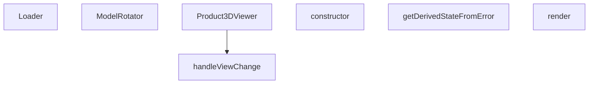

## Genel Bakış
Bu modül, ürünlerin üç boyutlu modellerinin tarayıcıda interaktif olarak görüntülenmesini sağlayan React bileşenlerinden oluşur. Modelin yüklenme sürecini, sahne döndürme mantığını ve farklı kamera açılarından görüntüleme seçeneklerini tek bir koordineli yapı altında toplar. Ayrıca, 3D render sırasında oluşabilecek beklenmedik hataları yakalayarak kullanıcıya bilgilendirici bir geri bildirim sunar.

## Fonksiyon Grupları
### Görüntüleme Motoru ve Etkileşim
Üç boyutlu sahnenin temel yaşam döngüsünü yöneten bileşenler bu grupta yer alır. Modelin yüklenmesi, kullanıcının döndürme girişimlerinin işlenmesi ve kamera açılarının değiştirilmesi gibi temel interaksiyonları kapsar.

- Product3DViewer (ana bileşen, konfigürasyon ve sahneyi başlatır)
- ModelRotator (çocuk bileşenleri sarmalayarak döndürme eksenini kontrol eder)
- Loader (model yüklenirken gösterilen beklenme arayüzü)
- handleViewChange (ön, üst, izometrik gibi tanımlı kamera açılarına geçiş yapar)

### Hata Kalkanı
3D sahne oluşturulurken veya model yüklenirken ortaya çıkabilecek kritik hataları yakalayarak uygulamanın tamamen çökmesini önleyen güvenlik mekanizmasıdır. Hata durumunda kullanıcıya anlaşılır bir alternatif ekran sunulmasını sağlar.

- Error_boundary sınıfı (constructor, getDerivedStateFromError, render)

---

## AXIOMS – Mimari Varsayımlar

Bu modül, THREE.js tabanlı 3D model gösterimi için bir React bileşen zinciri oluşturur. Aşağıdaki mimari varsayımlar fonksiyon imzalarından türetilmiştir.

[Aksiyom 1]: Eğer THREE.js kütüphanesi (veya `THREE.Group` türü) mevcut değilse, `ModelRotator` bileşeni `rotationRef` parametresiyle çalışamaz ve 3D sahne döndürme işlevi bozulur.

[Aksiyom 2]: Eğer `Product3DViewer` bileşeni çağrıldığında `slug` parametresi sağlanmazsa, hangi ürünün 3D modelinin yükleneceği belirsiz kalır ve model yükleme başarısız olur.

[Aksiyom 3]: Eğer `Product3DViewer` bileşeni çağrıldığında `modelType` parametresi sağlanmazsa, modelin hangi format/stratejiyle render edileceği bilinemez ve 3D görünüm oluşturulamaz.

[Aksiyom 4]: Eğer `isFullscreen` değeri `true` olarak ayarlandığında `onClose` callback fonksiyonu sağlanmazsa, kullanıcı tam ekran modundan çıkış yapamaz ve bileşen kilitli kalır.

[Aksiyom 5]: Eğer `ModelRotator` bileşeninde `rotationRef.current` değeri `null` olduğunda döndürme mantığı bu durumu işlemezse, bileşen çökme hatası (null reference) oluşur.

[Aksiyom 6]: Eğer `ModelRotator` bileşeninde `enabled` değeri `false` iken döndürme tetiklenirse, istenmeyen model rotasyonu gerçekleşir.

[Aksiyom 7]: Eğer `handleViewChange` fonksiyonuna `view` parametresi olarak izin verilen değerlerden (`'front'`, `'top'`, `'right'`, `'back'`, `'bottom'`, `'left'`, `'iso'`) farklı bir değer geçilirse, kamera açısı beklenmeyen bir konuma geçer veya render hatası oluşur.

[Aksiyom 8]: Eğer `ErrorBoundary` bileşeni `constructor` çağrısında `t` (çeviri fonksiyonu) parametresi sağlanmazsa, hata durumunda kullanıcıya gösterilecek mesaj oluşturulamaz ve render fonksiyonu hata verir.

[Aksiyom 9]: Eğer `ErrorBoundary.getDerivedStateFromError` fonksiyonu tarafından yakalanan `error` nesnesi beklenen formatta değilse (örn: `message` özelliği yoksa), hata bilgisi eksik işlenir ve kullanıcıya anlamsız bir hata mesajı gösterilebilir.

---

## FONKSİYON DETAYLARI

### Loader
**Ne yapar**: Yüklenme durumunu gösteren basit bir bileşen render eder.  
**Nasıl yapar**: Fonksiyon parametre almaz ve doğrudan JSX döndürür; bu JSX, metin stilini ve arka planını tanımlayan bir `
` öğesini içerir.  
**Parametreler**:  
- Parametre yok  
**Dönüş**: `<Html center>
…
` şeklinde bir JSX elemanı.

### ModelRotator
**Ne yapar**: Verilen çocukları bir THREE.js grup öğesinin içine sararak, bu gruba bir referans bağlar.  
**Nasıl yapar**: `children`, `enabled` ve `rotationRef` özelliklerini alır; `rotationRef` üzerinden grup referansını ayarlar ve ardından `<group ref={rotationRef}>{children}</group>` JSX'ini döndürür.  
**Parametreler**:  
- children: React.ReactNode — Grup içinde render edilecek içerik  
- enabled: boolean — Dönüşümün etkin olup olmadığını belirler (şu anki uygulama doğrudan kullanmıyor olabilir)  
- rotationRef: React.MutableRefObject<THREE.Group | null> — THREE.js grup nesnesine referans tutmak için kullanılan mutable ref  
**Dönüş**: `<group ref={rotationRef}>{children}</group>` JSX elemanı.

### Product3DViewer
**Ne yapar**: Belirtilen ürünün 3D modelini görüntüleyen bir bileşen render eder; tam ekran modu ve kapatma işlevi için props kabul eder.  
**Nasıl yapar**: `slug`, `modelType`, `isFullscreen` (varsayılan false) ve `onClose` props'larını alır; bu bilgilere dayalı olarak 3D görüntüleyiciyi oluşturur ve gerekirse tam ekran veya kapatma kontrollerini sağlar.  
**Parametreler**:  
- slug: string — Görüntülenecek ürünün benzersiz tanımlayıcısı  
- modelType: string — Kullanılacak 3D modelinin türü veya formatı  
- isFullscreen: boolean (varsayılan: false) — Bileşenin tam ekran olarak görüntülenip görüntülenmeyeceği  
- onClose: function — Bileşen kapatıldığında çağrılacak geri çağırım fonksiyonu  
**Dönüş**: `React.FC<Product3DViewerProps>` türünde bir fonksiyon bileşeni.

### handleViewChange
**Ne yapar**: Kamera veya görünüme belirli bir yön (ön, üst, sağ, arka, alt, sol, izometrik) ayarlar.  
**Nasıl yapar**: `view` parametresi olarak kabul edilen litéral birleşim türünden bir değer alır ve bu değere göre iç durum veya görüntüleme matrisini günceller (detaylı uygulama sağlanmadı).  
**Parametreler**:  
- view: 'front' | 'top' | 'right' | 'back' | 'bottom' | 'left' | 'iso' — Uygulanacak görünüme yön  
**Dönüş**: Bilinmiyor (verilen bilgiye göre `void` veya dönüş değeri yoktur).

### constructor
**Ne yapar**: ErrorBoundary bileşeninin başlatıcı (constructor) metodudur. React bileşen yaşam döngüsünün en başında çağrılır ve bileşenin ilk durumunu (state) tanımlar.

**Nasıl yapar**: Önce `super(props)` çağrısı ile üst sınıf (React.Component) constructor'ını çalıştırır, ardından `this.state` nesnesini `hasError: false` ve `error: null` değerleriyle başlatır. Bu sayede bileşen ilk yüklendiğinde herhangi bir hata durumu olmadığını belirtir.

**Parametreler**:
- `props`: object — Bileşenin dışarıdan aldığı özellikler dizisi
  - `children`: React.ReactNode — ErrorBoundary içinde sarılacak olan alt bileşenler
  - `t`: (key: string) => string — Çeviri (i18n) fonksiyonu, verilen anahtar kelimeye karşılık gelen çevrilmiş metni döndürür

**Dönüş**: void — Constructor'lar geriye değer dönmez, sadece nesne başlatma işlemi yapar.

### getDerivedStateFromError
**Ne yapar**: Geliştirildi ancak detay üretilemedi.

### render
**Ne yapar**: Geliştirildi ancak detay üretilemedi.

---

## INTERFACES

### Product3DViewerProps
- `slug?: string`
- `modelType?: string`
- `isFullscreen?: boolean`
- `onToggleFullscreen?: () => void`
- `onClose?: () => void`

---

## AST POINTERS

### [N1_NASIL] AST Pointer: components/products/3d/Product3DViewer.tsx::Loader
- **params**: (yok)
- **ic_degiskenler**:
  - `progress` — useProgress() hook'undan gelen yükleme yüzdesi (0-100), `progress.toFixed(0)` ile formatlanarak JSX'te gösterilir
- **Dönüş**: JSX — `<Html>` içine sarılmış, yükleme yüzdesini gösteren `
` (örn: "75%")

---

### [N2_NASIL] AST Pointer: components/products/3d/Product3DViewer.tsx::ErrorBoundary.constructor
- **params**: `props: { children: React.ReactNode, t: (key: string) => string }`
- **ic_degiskenler**:
  - `this.state` — `{ hasError: false, error: null }` olarak başlatılır; hata durumunu ve hata nesnesini tutar
- **Dönüş**: yok (constructor)

---

### [N3_NASIL] AST Pointer: components/products/3d/Product3DViewer.tsx::ErrorBoundary.getDerivedStateFromError
- **params**: `error: Error`
- **ic_degiskenler**: (yok)
- **Dönüş**: `{ hasError: true, error }` — derived state objesi, React'e hata olduğunu bildirir

---

### [N4_NASIL] AST Pointer: components/products/3d/Product3DViewer.tsx::ErrorBoundary.render
- **params**: (yok — class method)
- **ic_degiskenler**:
  - `this.state.hasError` — hata durumu bayrağı, true ise hata UI'ı render edilir
  - `this.state.error?.message?.slice(0, 100)` — hata mesajının ilk 100 karakteri, ekranda gösterilir
  - `this.props.t('product3d.loadError')` — i18n çeviri fonksiyonu ile yüklenme hata metni
  - `this.props.children` — hata yoksa render edilen child bileşenler
- **Dönüş**: Hata varsa hata UI JSX'i (`<Html>` içinde hata kartı); hata yoksa `this.props.children`

---

### [N5_NASIL] AST Pointer: components/products/3d/Product3DViewer.tsx::ModelRotator
- **params**: `{ children: React.ReactNode, enabled: boolean, rotationRef: React.MutableRefObject<THREE.Group | null> }`
- **ic_degiskenler**:
  - `gl` — useThree() hook'undan gelen WebGL renderer nesnesi, `gl.domElement` ile canvas erişilir
  - `camera` — useThree() hook'undan gelen kamera nesnesi, `camera.quaternion` ile kameranın rotasyonu alınır
  - `isDragging` — useRef, fare sürükleme durumunu tutar (boolean), pointerdown ile true, pointerup ile false olur
  - `previousMouse` — useRef, bir önceki fare pozisyonunu tutar `{ x: number, y: number }`, sürükleme miktarını hesaplamak için kullanılır
  - `canvas` — useEffect içinde `gl.domElement` olarak alınır, pointerdown event listener'ı eklenir
  - `handlePointerDown` — arrow function, pointerdown olayını işler; `enabled` ve `e.button !== 0` kontrolü yapar, sürükleme başladığında `isDragging.current` ve `previousMouse.current` güncellenir
  - `handlePointerUp` — arrow function, pointerup olayında `isDragging.current`'ı false yapar
  - `handlePointerMove` — arrow function, pointermove olayını işler; `dx` ve `dy` hesaplanır, `speed` (0.005) ile çarpılır, `camRight` ve `camUp` vektörleri `camera.quaternion` ile hesaplanır, `rotationRef.current.rotateOnWorldAxis()` ile model döndürülür
  - `dx` — fare hareketinin X eksenindeki farkı (`e.clientX - previousMouse.current.x`)
  - `dy` — fare hareketinin Y eksenindeki farkı (`e.clientY - previousMouse.current.y`)
  - `speed` — rotasyon hız sabiti (0.005)
  - `camRight` — kameranın sağ yön vektörü, `THREE.Vector3(1, 0, 0).applyQuaternion(camera.quaternion)` ile hesaplanır
  - `camUp` — kameranın yukarı yön vektörü, `THREE.Vector3(0, 1, 0).applyQuaternion(camera.quaternion)` ile hesaplanır
- **Dönüş**: JSX — `<group ref={rotationRef}>{children}</group>` (children'ı saran döndürülebilir group)

---

### [N6_NASIL] AST Pointer: components/products/3d/Product3DViewer.tsx::Product3DViewer
- **params**: `{ slug: string, modelType: string, isFullscreen?: boolean, onClose?: () => void }`
- **ic_degiskenler**:
  - `t` — useI18n() hook'undan gelen çeviri fonksiyonu, JSX içinde `t('product3d.xxx')` çağrıları ile kullanılır
  - `showGrid` — useState<boolean>, ızgaranın görünürlüğünü tutar, tuş 'g' ile toggle edilir
  - `autoRotate` — useState<boolean>, otomatik döndürme durumunu tutar, buton ile toggle edilir
  - `showViewMenu` — useState<boolean>, görünüm menüsünün açık/kapalı durumunu tutar
  - `rotationMode` — useState<'orbit' | 'free'>, döndürme modunu tutar; 'orbit' kamera döndürür, 'free' modeli döndürür
  - `controlsRef` — useRef<OrbitControls | null>, OrbitControls bileşenine erişim sağlar, `controlsRef.current.reset()` ve `controlsRef.current.object` ile kamera kontrolü yapılır
  - `modelGroupRef` — useRef<THREE.Group | null>, modelin 3D group referansını tutar, free modda `modelGroupRef.current.rotation.set(0, 0, 0)` ile sıfırlanır
  - `tb` — toolbar stil konfigürasyonu objesi; `isFullscreen` durumuna göre `icon`, `font`, `pad`, `minW`, `div`, `top` değerleri belirlenir (fullscreen: büyük, normal: küçük)
  - `tb.icon` — toolbar ikon boyutu (fullscreen: 18, normal: 13)
  - `tb.font` — toolbar font class'ı (fullscreen: 'text-xs', normal: 'text-[6px]')
  - `tb.pad` — toolbar padding class'ı (fullscreen: 'p-1.5', normal: 'p-1')
  - `tb.minW` — toolbar minimum genişlik class'ı (fullscreen: 'min-w-40px', normal: 'min-w-28px')
  - `tb.top` — toolbar üst konum class'ı (fullscreen: 'top-4', normal: 'top-2')
  - `handleReset` — useCallback ile tanımlı fonksiyon; `autoRotate`'ı false, `rotationMode`'u 'orbit', `showGrid`'i true yapar, `controlsRef.current.reset()` ile kamerayı, `modelGroupRef.current.rotation.set(0,0,0)` ile modeli sıfırlar
  - `handleViewChange` — inner fonksiyon, kamera görünümünü değiştirir (aşağıda ayrı AST Pointer)
  - `placement` — `getModelPlacement(modelType, slug, 'grounded')` çağrısının dönüşü, `{ position: [x,y,z], rotation: [x,y,z] }` formatında modelin sahnedeki konum ve rotasyonunu tutar
- **Dönüş**: JSX — tam 3D ürün görüntüleyici UI'ı (Canvas, ışıklar, model, kontroller, toolbar, bilgi kartı dahil)

---

### [N7_NASIL] AST Pointer: components/products/3d/Product3DViewer.tsx::Product3DViewer::handleViewChange
- **params**: `view: 'front' | 'top' | 'right' | 'back' | 'bottom' | 'left' | 'iso'`
- **ic_degiskenler**:
  - `setAutoRotate` — closure'dan, `autoRotate` state'ini false yapar
  - `setShowViewMenu` — closure'dan, görünüm menüsünü kapatır (false)
  - `controlsRef` — closure'dan, OrbitControls referansı; `null` ise erken return yapılır
  - `modelGroupRef` — closure'dan, model group referansı; `rotation.set(0, 0, 0)` ile modelin kendi rotasyonu sıfırlanır
  - `dist` — kamera mesafesi sabiti (3.5), tüm görünüm pozisyonları için kullanılır
  - `cam` — `controlsRef.current.object`, THREE.js kamera nesnesi; `cam.position.set()` ve `cam.up.set()` ile kamera konumu/yukarısı ayarlanır
  - Switch-case bloğu içinde her view için kamera pozisyonu ayarlanır:
    - `'front'`: `cam.position.set(0, 0, dist)` — kamera +Z ekseni önünde
    - `'top'`: `cam.position.set(0, dist, 0)`, `cam.up.set(0, 0, -1)` — kamera üstte, up vektörü -Z
    - `'right'`: `cam.position.set(dist, 0, 0)` — kamera +X sağında
    - `'back'`: `cam.position.set(0, 0, -dist)` — kamera -Z arkasında
    - `'bottom'`: `cam.position.set(0, -dist, 0)`, `cam.up.set(0, 0, 1)` — kamera altta, up vektörü +Z
    - `'left'`: `cam.position.set(-dist, 0, 0)` — kamera -X solunda
    - `'iso'`: `cam.position.set(dist * 0.7, dist * 0.7, dist * 0.7)` — izometrik açı
  - `controlsRef.current.target.set(0, 0, 0)` — kamera hedefini orijine ayarlar
  - `controlsRef.current.update()` — kontrolleri günceller
- **Dönüş**: yok (yan etki: kamera pozisyonunu değiştirir, state'leri günceller)

---

### [N8_NASIL] AST Pointer: components/products/3d/Product3DViewer.tsx::Product3DViewer::useEffect_keyboard
- **params**: (useEffect callback, parametre yok)
- **ic_degiskenler**:
  - `handleKeyDown` — arrow function, KeyboardEvent handler; `e.target`'ın HTMLInputElement veya HTMLTextAreaElement olup olmadığını kontrol eder (input/multiline içinde tuşları yoksaymak için), `e.key.toLowerCase()` ile tuş kontrolü yapılır:
    - `'g'`: `setShowGrid(prev => !prev)` — ızgarayı toggle eder
    - `'r'`: `handleReset()` — kamera ve modeli sıfırlar
- **Dönüş**: cleanup fonksiyonu — `window.removeEventListener('keydown', handleKeyDown)` ile listener temizlenir

---

### [N9_NASIL] AST Pointer: components/products/3d/Product3DViewer.tsx::Product3DViewer::useEffect_pointer
- **params**: (useEffect callback, ModelRotator içindeki pointer event kurulumu)
- **ic_degiskenler**:
  - `canvas` — `gl.domElement`, DOM canvas elementi
  - `handlePointerDown` — PointerEvent handler, `enabled` ve `e.button !== 0` kontrolü, sürükleme başlatma
  - `handlePointerUp` — sürükleme bitirme
  - `handlePointerMove` — fare hareketi hesaplama, `dx`/`dy` farkları, `speed` (0.005), `camRight`/`camUp` vektörleri, `rotationRef.current.rotateOnWorldAxis()` çağrıları
- **Dönüş**: cleanup fonksiyonu — canvas ve window'dan pointer event listener'ları kaldırılır

---

## MERMAID CALL GRAPH

## NODE ID STANDARD

  file: src\components\products\3d\Product3DViewer.tsx
  function: src\components\products\3d\Product3DViewer.tsx::Loader
  function: src\components\products\3d\Product3DViewer.tsx::ModelRotator
  function: src\components\products\3d\Product3DViewer.tsx::Product3DViewer
  function: src\components\products\3d\Product3DViewer.tsx::handleViewChange
  class: src\components\products\3d\Product3DViewer.tsx::ErrorBoundary

---

## DISA AKTARILANLAR (EXPORTS)
  export: ErrorBoundary
  export: Loader
  export: ModelRotator
  export: Product3DViewer

---

## BILEŞIM (CONTAINS)
  contains: ReactNode
  contains: error: Error | null }>
  contains: t: (key: string) => string }
  contains: { hasError: boolean

---

## STİL TOKENLERİ

### Arbitrary Değerler (token'a geçirilmemiş)
Yok — tüm stiller token'a geçirilmiş. ✅

### Kullanılan Token'lar (zaten token'a geçirilmiş)
- (yok)

### Tailwind Sınıf Özeti
- **Renkler:** `bg-blue-50`, `bg-product-3d-radial`, `bg-red-50`, `bg-white`, `bg-white/80`, `bg-white/90`, `bg-white/95`, `border-gray-200`, `border-gray-300`, `border-light-gray`, `border-red-200`, `fill-current`, `hover:bg-blue-50`, `hover:bg-gray-100`, `hover:text-primary-navy`
- **Layout:** `absolute`, `backdrop-blur-md`, `bottom-4`, `fixed`, `flex`, `flex-col`, `gap-0.5`, `gap-1`, `gap-2`, `h-full`, `items-center`, `left-0`, `left-1/2`, `left-4`, `overflow-hidden`
- **Varyant/Responsive:** `:`, `hover:` önekleri
- **Yardımcı Sınıflar:** `${autoRotate`, `${isFullscreen`, `${rotationMode`, `${tb.font`, `${tb.minW`, `${tb.pad`, `${tb.top`, `-translate-x-1/2`, `:`, `===`, `animate-spin`, `border`, `break-words`, `font-bold`, `free`