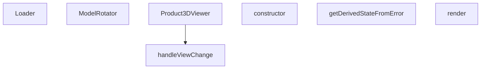

## Genel Bakış
Bu modül, üç boyutlu ürün modellerini görüntülemek ve etkileşimli bir şekilde manipüle etmek için bir React bileşeni sağlar. Modelin yüklenmesi, döndürülmesi ve farklı görünüm açılarından incelenmesi gibi işlevleri bir araya getirir; ayrıca beklenmeyen hataların yakalanıp kullanıcıya gösterilmesi için bir hata sınırı bileşeni içerir.

## Fonksiyon Grupları
### Ana Görüntüleme ve Etkileşim
Bileşenin temel görüntüleme ve kullanıcı etkileşimlerini yöneten fonksiyonlar bu grupta yer alır. Ürün modelinin yüklenmesi, sahnenin döndürülmesi ve farklı kamera açısından bakım seçenekleri sağlanır.
- Loader
- ModelRotator
- Product3DViewer
- handleViewChange

### Hata Yönetimi
Bileşenin render sürecinde oluşabilecek istisnaları yakalayıp kullanıcıya anlamlı bir hata mesajı göstermek için tasarlanmış sınıf ve yöntemler bu grupta bulunur. Hata durumunda yedek bir arayüz sunarak uygulamanın çökmesini önler.
- ErrorBoundary (constructor, getDerivedStateFromError, render)

---

## AXIOMS – Mimari Varsayımlar
Modülün doğru çalışması için aşağıdaki varsayımlar gerekir.

[Aksiyom 1]: Eğer Product3DViewer component'ine **slug** prop'u geçilmezse, ürün modeli yüklenemez.  
[Aksiyom 2]: Eğer Product3DViewer component'ine **modelType** prop'u geçilmezse, model tipi belirlenemez.  
[Aksiyom 3]: Eğer Product3DViewer component'ine **onClose** prop'u geçilmezse, kapatma işlevi tanımlı olmaz.  
[Aksiyom 4]: Eğer Product3DViewer component'ine **isFullscreen** prop'u **true** olarak geçilirse, fullscreen modu etkinleştirilir (varsayılan **false** değeri bu davranışı değiştirir).  
[Aksiyom 5]: Eğer ModelRotator component'ine **rotationRef** prop'u geçilmezse veya **rotationRef.current** **null** ise, model döndürülemez.  
[Aksiyom 6]: Eğer ModelRotator component'ine **enabled** prop'u **false** olarak geçilirse, model etkileşimli döndürme devre dışı bırakılır.  
[Aksiyom 7]: Eğer handleViewChange fonksiyonuna **view** parametresi **'front' | 'top' | 'right' | 'back' | 'bottom' | 'left' | 'iso'** dışında bir değer geçilirse, fonksiyonun davranışı belirsizdir.  
[Aksiyom 8]: Eğer ErrorBoundary constructor'ına **t** prop'u (çeviri fonksiyonu) geçilmezse, hata mesajları çevrilemez.  
[Aksiyom 9]: Eğer ErrorBoundary.getDerivedStateFromError fonksiyonuna **error** parametresi **null** geçilirse, hata durumu state'e yansıtılmaz.  
[Aksiyom 10]: Eğer ErrorBoundary.render metodu component state'inde **error** bilgisi yoksa, **children** prop'u render edilir.  
[Aksiyom 11]: Eğer Loader component'i render edilirken bir JSX elementi döndürmezse, UI'de hiçbir şey gösterilmez.

---

## FONKSİYON DETAYLARI

### Loader
**Ne yapar**: Yüklenme durumunu gösteren basit bir bileşen render eder.  
**Nasıl yapar**: Fonksiyon parametre almaz ve doğrudan JSX döndürür; bu JSX, metin stilini ve arka planını tanımlayan bir `
` öğesini içerir.  
**Parametreler**:  
- Parametre yok  
**Dönüş**: `<Html center>
…
` şeklinde bir JSX elemanı.

### ModelRotator
**Ne yapar**: Verilen çocukları bir THREE.js grup öğesinin içine sararak, bu gruba bir referans bağlar.  
**Nasıl yapar**: `children`, `enabled` ve `rotationRef` özelliklerini alır; `rotationRef` üzerinden grup referansını ayarlar ve ardından `<group ref={rotationRef}>{children}</group>` JSX'ini döndürür.  
**Parametreler**:  
- children: React.ReactNode — Grup içinde render edilecek içerik  
- enabled: boolean — Dönüşümün etkin olup olmadığını belirler (şu anki uygulama doğrudan kullanmıyor olabilir)  
- rotationRef: React.MutableRefObject<THREE.Group | null> — THREE.js grup nesnesine referans tutmak için kullanılan mutable ref  
**Dönüş**: `<group ref={rotationRef}>{children}</group>` JSX elemanı.

### Product3DViewer
**Ne yapar**: Belirtilen ürünün 3D modelini görüntüleyen bir bileşen render eder; tam ekran modu ve kapatma işlevi için props kabul eder.  
**Nasıl yapar**: `slug`, `modelType`, `isFullscreen` (varsayılan false) ve `onClose` props'larını alır; bu bilgilere dayalı olarak 3D görüntüleyiciyi oluşturur ve gerekirse tam ekran veya kapatma kontrollerini sağlar.  
**Parametreler**:  
- slug: string — Görüntülenecek ürünün benzersiz tanımlayıcısı  
- modelType: string — Kullanılacak 3D modelinin türü veya formatı  
- isFullscreen: boolean (varsayılan: false) — Bileşenin tam ekran olarak görüntülenip görüntülenmeyeceği  
- onClose: function — Bileşen kapatıldığında çağrılacak geri çağırım fonksiyonu  
**Dönüş**: `React.FC<Product3DViewerProps>` türünde bir fonksiyon bileşeni.

### handleViewChange
**Ne yapar**: Kamera veya görünüme belirli bir yön (ön, üst, sağ, arka, alt, sol, izometrik) ayarlar.  
**Nasıl yapar**: `view` parametresi olarak kabul edilen litéral birleşim türünden bir değer alır ve bu değere göre iç durum veya görüntüleme matrisini günceller (detaylı uygulama sağlanmadı).  
**Parametreler**:  
- view: 'front' | 'top' | 'right' | 'back' | 'bottom' | 'left' | 'iso' — Uygulanacak görünüme yön  
**Dönüş**: Bilinmiyor (verilen bilgiye göre `void` veya dönüş değeri yoktur).

---

## INTERFACES

### Product3DViewerProps
- `slug?: string`
- `modelType?: string`
- `isFullscreen?: boolean`
- `onToggleFullscreen?: () => void`
- `onClose?: () => void`

---

## AST POINTERS

### [N1_NASIL] AST Pointer: C:\Users\alize\venthub-hvac\src\components\products\3d\Product3DViewer.tsx::Loader
- **params**: (parametre yok)
- **ic_degiskenler**:
  - `progress` — useProgress hook'undan alınan 3D model yükleme ilerlemesi yüzdesi
- **Dönüş**: React.JSX.Element

### [N2_NASIL] AST Pointer: C:\Users\alize\venthub-hvac\src\components\products\3d\Product3DViewer.tsx::ErrorBoundary.constructor
- **params**: { children: React.ReactNode, t: (key: string) => string }
- **ic_degiskenler**:
  - `this.state` — Bileşen hata durumunu tutan state nesnesi, `hasError` (hata varlığı flag'i) ve `error` (oluşan hata nesnesi) alanlarını içerir
- **Dönüş**: yok

### [N3_NASIL] AST Pointer: C:\Users\alize\venthub-hvac\src\components\products\3d\Product3DViewer.tsx::ErrorBoundary.getDerivedStateFromError
- **params**: { error: Error }
- **ic_degiskenler**:
  - `hasError` — Hata oluştuğunu belirten sabit true değeri
  - `error` — Oluşan orijinal hata nesnesi
- **Dönüş**: { hasError: boolean, error: Error }

### [N4_NASIL] AST Pointer: C:\Users\alize\venthub-hvac\src\components\products\3d\Product3DViewer.tsx::ErrorBoundary.render
- **params**: (parametre yok)
- **ic_degiskenler**:
  - `this.state.hasError` — Bileşende hata oluşup oluşmadığını tutan state flag'i
  - `this.props.t` — Çeviri metinlerini getiren i18n fonksiyonu
  - `this.state.error?.message` — Oluşan hatanın kullanıcıya gösterilecek mesajı
  - `this.props.children` — Hata sınırı tarafından sarmalanan alt bileşenler
- **Dönüş**: React.JSX.Element

### [N5_NASIL] AST Pointer: C:\Users\alize\venthub-hvac\src\components\products\3d\Product3DViewer.tsx::ModelRotator
- **params**: { children: React.ReactNode, enabled: boolean, rotationRef: React.MutableRefObject<THREE.Group | null> }
- **ic_degiskenler**:
  - `gl` — useThree hook'undan alınan Three.js WebGL rendering context nesnesi
  - `camera` — useThree hook'undan alınan Three.js sahne kamera nesnesi
  - `isDragging` — Kullanıcının fare ile sürükleme yapıp yapmadığını izleyen useRef nesnesi
  - `previousMouse` — Son fare tıklama/hareketinden önceki x/y koordinatlarını saklayan useRef nesnesi
  - `canvas` — Three.js tarafından kullanılan DOM canvas elementi
  - `handlePointerDown` — Fare tıklama olayını işleyen, sürüklemeyi başlatan fonksiyon
  - `handlePointerUp` — Fare bırakma olayını işleyen, sürüklemeyi bitiren fonksiyon
  - `handlePointerMove` — Fare hareketi olayını işleyen, serbest döndürmeyi hesaplayan fonksiyon
  - `dx` — Hareket sırasındaki fare x ekseni değişimi
  - `dy` — Hareket sırasındaki fare y ekseni değişimi
  - `speed` — Serbest döndürme hassasiyetini ayarlayan sabit çarpan
  - `camRight` — Kamera'nın dünya koordinat sistemindeki sağ eksen vektörü
  - `camUp` — Kamera'nın dünya koordinat sistemindeki yukarı eksen vektörü
- **Dönüş**: React.JSX.Element

### [N6_NASIL] AST Pointer: C:\Users\alize\venthub-hvac\src\components\products\3d\Product3DViewer.tsx::Product3DViewer
- **params**: { slug: string, modelType: string, isFullscreen: boolean = false, onClose: () => void }
- **ic_degiskenler**:
  - `t` — useI18n hook'undan alınan çeviri fonksiyonu
  - `showGrid, setShowGrid` — Izgara katmanının gösterilip gösterilmeyeceğini yöneten state ve güncelleme fonksiyonu
  - `autoRotate, setAutoRotate` — Modelin otomatik dönme durumunu yöneten state ve güncelleme fonksiyonu
  - `showViewMenu, setShowViewMenu` — Görünüm değiştirme menüsünün açık olup olmadığını yöneten state ve güncelleme fonksiyonu
  - `rotationMode, setRotationMode` — Döndürme modunu (orbit/serbest) yöneten state ve güncelleme fonksiyonu
  - `controlsRef` — OrbitControls bileşenine erişmek için kullanılan useRef nesnesi
  - `modelGroupRef` — 3D modelin ait olduğu THREE.Group nesnesine erişmek için kullanılan useRef nesnesi
  - `tb` — Tam ekran/normal modda toolbar boyut ve stillerini tutan yapılandırma nesnesi
  - `handleReset` — Bileşeni varsayılan ayarlarına sıfırlayan useCallback ile oluşturulmuş fonksiyon
  - `handleViewChange` — Kamera konumunu ön tanımlı görünümlere ayarlayan fonksiyon
  - `handleKeyDown` — Klavye kısayollarını işleyen olay fonksiyonu
  - `placement` — getModelPlacement utility'sinden alınan modelin konum ve rotasyon ayarları
- **Dönüş**: React.JSX.Element

### [N7_NASIL] AST Pointer: C:\Users\alize\venthub-hvac\src\components\products\3d\Product3DViewer.tsx::handleViewChange
- **params**: { view: 'front' | 'top' | 'right' | 'back' | 'bottom' | 'left' | 'iso' }
- **ic_degiskenler**:
  - `setAutoRotate` — Otomatik dönmeyi kapatan state güncelleme fonksiyonu
  - `setShowViewMenu` — Görünüm menüsünü kapatan state güncelleme fonksiyonu
  - `controlsRef.current` - Aktif OrbitControls nesnesi
  - `modelGroupRef.current` — Modelin bağlı olduğu THREE.Group nesnesi
  - `dist` — Kamera ile model arası sabit mesafe değeri
  - `cam` — OrbitControls tarafından kullanılan kamera nesnesi
- **Dönüş**: yok

---

## MERMAID CALL GRAPH

## NODE ID STANDARD

  file: src\components\products\3d\Product3DViewer.tsx
  function: src\components\products\3d\Product3DViewer.tsx::Loader
  function: src\components\products\3d\Product3DViewer.tsx::ModelRotator
  function: src\components\products\3d\Product3DViewer.tsx::Product3DViewer
  function: src\components\products\3d\Product3DViewer.tsx::handleViewChange
  class: src\components\products\3d\Product3DViewer.tsx::ErrorBoundary

---

## DISA AKTARILANLAR (EXPORTS)
  export: ErrorBoundary
  export: Loader
  export: ModelRotator
  export: Product3DViewer

---

## BILEŞIM (CONTAINS)
  contains: ReactNode
  contains: error: Error | null }>
  contains: t: (key: string) => string }
  contains: { hasError: boolean

---

## STİL TOKENLERİ

### Arbitrary Değerler (token'a geçirilmemiş)
Yok — tüm stiller token'a geçirilmiş. ✅

### Kullanılan Token'lar (zaten token'a geçirilmiş)
- (yok)

### Tailwind Sınıf Özeti
- **Renkler:** `bg-blue-50`, `bg-product-3d-radial`, `bg-red-50`, `bg-white`, `bg-white/80`, `bg-white/90`, `bg-white/95`, `border-gray-200`, `border-gray-300`, `border-light-gray`, `border-red-200`, `fill-current`, `hover:bg-blue-50`, `hover:bg-gray-100`, `hover:text-primary-navy`
- **Layout:** `absolute`, `backdrop-blur-md`, `bottom-4`, `fixed`, `flex`, `flex-col`, `gap-0.5`, `gap-1`, `gap-2`, `h-full`, `items-center`, `left-0`, `left-1/2`, `left-4`, `overflow-hidden`
- **Varyant/Responsive:** `:`, `hover:` önekleri
- **Yardımcı Sınıflar:** `${autoRotate`, `${isFullscreen`, `${rotationMode`, `${tb.font`, `${tb.minW`, `${tb.pad`, `${tb.top`, `-translate-x-1/2`, `:`, `===`, `animate-spin`, `border`, `break-words`, `font-bold`, `free`