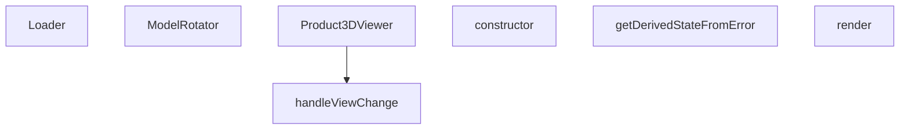

## Genel Bakış
Bu modül, ürünlerin 3D modellerini görüntülemek için kullanılan bir React bileşeni sunar. Kullanıcının modeli farklı açılardan (ön, üst, sağ, arka, alt, sol, izometrik) incelemesine olanak tanır. Tam ekran desteği, otomatik döndürme ve hata yakalama gibi özellikleri içerir.

## Fonksiyon Grupları

### Ana Görüntüleyici
Ürünün 3D modelini görüntülemek için ana bileşeni sağlar. Slug ve model tipi gibi parametrelerle hangi modelin yükleneceğini belirler; tam ekran modu ve kapatma fonksiyonu gibi kullanıcı etkileşimlerini yönetir.
- Product3DViewer

### Model Kontrolü ve Görünüm Yönetimi
3D modelin döndürülmesini ve farklı açılardan görüntülenmesini sağlar. ModelRotator bileşeni modeli otomatik veya manuel olarak döndürürken, handleViewChange fonksiyonu ön, üst, sağ, arka, alt, sol ve izometrik görünümler arasında geçiş yapar.
- ModelRotator, handleViewChange

### Yükleme ve Hata Yönetimi
Model yüklenirken kullanıcıya yükleme durumu gösterir ve 3D işleme sırasında oluşabilecek hataları yakalayarak kullanıcıya anlamlı hata mesajları sunar. ErrorBoundary sınıfı, React bileşen ağacındaki hataları yakalar ve çökme yerine hata ekranı gösterir.
- Loader, ErrorBoundary (constructor, getDerivedStateFromError, render)

---

## AXIOMS – Mimari Varsayımlar
- Bu modül davranışsal mantık içermez (salt veri / konfigürasyon / tip tanımı).
- [Aksiyom 1]: Modülün dışa açtığı yapı (anahtar kümesi / şema) bir sözleşmedir; tüketiciler bu sabit yapıya bağlıdır — kırıcı değişiklik tüm tüketicileri etkiler.
- [Aksiyom 2]: Bir öğe ekleme/çıkarma yapısal-uyumlu olmalı; ilgili tipler ve seçiciler aynı commit'te güncel tutulmalıdır.

---

## FONKSİYON DETAYLARI

### Loader
**Ne yapar**: 3D model yükleme işleminin ilerleme yüzdesini ekranda gösteren bir bileşendir. Kullanıcıya modelin ne kadarının yüklendiğini yüzde olarak bildirir.

**Nasıl yapar**: `useProgress` kancasından `progress` değerini alır. Bu değeri `toFixed(0)` ile ondalıksız tam sayıya çevirerek ekrana yansıtır. `Html` bileşeni kullanılarak Three.js sahnesi üzerine HTML içeriği yerleştirilir ve ortalanmış bir şekilde görüntülenir. Metin, koyu lacivert renkte, yarı saydam beyaz arka plan üzerinde yuvarlatılmış köşeli bir kutu içinde sunulur.

**Parametreler**:
- Bu fonksiyon parametre almaz.

**Dönüş**: JSX elementi döndürür. `Html` bileşeni içinde yüzde değerini gösteren bir `div` elementi içerir.

### ModelRotator
**Ne yapar**: Geliştirildi ancak detay üretilemedi.

### Product3DViewer
**Ne yapar**: Geliştirildi ancak detay üretilemedi.

### handleViewChange
**Ne yapar**: Geliştirildi ancak detay üretilemedi.

### constructor
**Ne yapar**: Geliştirildi ancak detay üretilemedi.

### getDerivedStateFromError
**Ne yapar**: Geliştirildi ancak detay üretilemedi.

### render
**Ne yapar**: Geliştirildi ancak detay üretilemedi.

---

## İTHALATLAR (IMPORTS)
- import: ../../../i18n/I18nProvider::useI18n
- import: ../../../utils/3dModelOffsets::getModelPlacement
- import: ./ProductModelRenderer::ProductModelRenderer
- import: ./core::VentHubCanvas
- import: @react-three/fiber::useThree
- import: react::React
- import: react::Suspense
- import: react::useCallback
- import: react::useEffect
- import: react::useRef
- import: react::useState
- import: three::Vector3
- import: three::type { Group }

---

## INTERFACES

### Product3DViewerProps
- `slug?: string`
- `modelType?: string`
- `isFullscreen?: boolean`
- `onToggleFullscreen?: () => void`
- `onClose?: () => void`

---

## SABİTLER
- **_camRight** (new_expression) — `new Vector3()`
- **_camUp** (new_expression) — `new Vector3()`

---

## AST POINTERS

### [N1_NASIL] AST Pointer: src/components/products/3d/Product3DViewer.tsx::Loader
- **params**: (parametre yok)
- **ic_degiskenler**:
  - `progress` — `useProgress()` hook'undan gelen yükleme ilerleme yüzdesi (sayı)
- **Dönüş**: JSX elementi — yükleme yüzdesini gösteren Html bileşeni

### [N2_NASIL] AST Pointer: src/components/products/3d/Product3DViewer.tsx::ModelRotator
- **params**: `children` (React.ReactNode), `enabled` (boolean), `rotationRef` (React.MutableRefObject<Group | null>)
- **ic_degiskenler**:
  - `gl` — `useThree()` hook'undan gelen Three.js renderer nesnesi
  - `camera` — `useThree()` hook'undan gelen Three.js kamera nesnesi
  - `isDragging` — useRef ile oluşturulan sürükleme durumu boolean referansı
  - `previousMouse` — useRef ile oluşturulan önceki mouse pozisyonu referansı ({x, y})
  - `canvas` — `gl.domElement` erişimi ile elde edilen canvas DOM elementi
  - `handlePointerDown` — pointer basıldığında çağrılan fonksiyon; sürükleme başlatır ve mouse pozisyonunu kaydeder
  - `handlePointerUp` — pointer bırakıldığında çağrılan fonksiyon; sürüklemeyi sonlandırır
  - `handlePointerMove` — pointer hareket ettiğinde çağrılan fonksiyon; model rotasyonunu uygular
  - `dx` — yatay mouse hareket farkı (`e.clientX - previousMouse.current.x`)
  - `dy` — dikey mouse hareket farkı (`e.clientY - previousMouse.current.y`)
  - `speed` — rotasyon hızı sabiti (0.005)
  - `_camRight` — kameranın sağ vektörü (modül seviyesinde tanımlı sabit)
  - `_camUp` — kameranın yukarı vektörü (modül seviyesinde tanımlı sabit)
- **Dönüş**: JSX elementi — `rotationRef` ile bağlanmış `group` bileşeni

### [N3_NASIL] AST Pointer: src/components/products/3d/Product3DViewer.tsx::Product3DViewer
- **params**: `slug` (string), `modelType` (string), `isFullscreen` (boolean, varsayılan: false), `onClose` (fonksiyon, opsiyonel)
- **ic_degiskenler**:
  - `t` — `useI18n()` hook'undan gelen çeviri fonksiyonu
  - `showGrid` — grid çizgilerinin görünürlük durumunu tutan state (boolean)
  - `autoRotate` — otomatik rotasyon durumunu tutan state (boolean)
  - `showViewMenu` — görünüm menüsünün açık/kapalı durumunu tutan state (boolean)
  - `rotationMode` — rotasyon modu state'i ('orbit' | 'free')
  - `controlsRef` — useRef ile oluşturulan OrbitControls bileşen referansı
  - `modelGroupRef` — useRef ile oluşturulan Group nesnesi referansı
  - `tb` — `isFullscreen` durumuna göre toolbar stilleri nesnesi (icon, font, pad, minW, div, top)
  - `handleReset` — useCallback ile oluşturulan sıfırlama fonksiyonu; rotasyon modunu, grid durumunu sıfırlar ve kontrolleri/resetler
  - `handleViewChange` — kamera görünümünü değiştiren fonksiyon (front, top, right, back, bottom, left, iso)
  - `placement` — `getModelPlacement(modelType, slug, 'grounded')` çağrısından dönen model konumlandırma verisi (position, rotation)
  - `handleKeyDown` — useEffect içinde tanımlanan klavye olay dinleyicisi; 'g' tuşu grid'i, 'r' tuşu reset'i tetikler
  - `dist` — handleViewChange içinde kullanılan kamera mesafesi sabiti (3.5)
  - `cam` — handleViewChange içinde `controlsRef.current.object` erişimi ile elde edilen kamera nesnesi
  - `view` — handleViewChange fonksiyonuna gelen görünüm tipi parametresi
  - `v` — görünüm menüsü butonlarını oluşturmak için kullanılan döngü değişkeni (key, label)
- **Dönüş**: JSX elementi — 3D ürün görüntüleyici bileşeni (VentHubCanvas, toolbar, logo)

### [N4_NASIL] AST Pointer: src/components/products/3d/Product3DViewer.tsx::handleViewChange
- **params**: `view` ('front' | 'top' | 'right' | 'back' | 'bottom' | 'left' | 'iso')
- **ic_degiskenler**:
  - `dist` — kamera mesafesi sabiti (3.5)
  - `cam` — `controlsRef.current.object` erişimi ile elde edilen kamera nesnesi
  - `controlsRef.current` — OrbitControls bileşen referansı (null kontrolü yapılır)
  - `modelGroupRef.current` — Group nesnesi referansı (rotasyon sıfırlanır)
- **Dönüş**: yok — kamera pozisyonunu ve rotasyonunu değiştirir

### [N5_NASIL] AST Pointer: src/components/products/3d/Product3DViewer.tsx::ErrorBoundary.constructor
- **params**: `props` ({ children: React.ReactNode, t: (key: string) => string })
- **ic_degiskenler**: (yok)
- **Dönüş**: yok — `this.state`'i `{ hasError: false, error: null }` olarak başlatır

### [N6_NASIL] AST Pointer: src/components/products/3d/Product3DViewer.tsx::ErrorBoundary.getDerivedStateFromError
- **params**: `error` (Error)
- **ic_degiskenler**: (yok)
- **Dönüş**: `{ hasError: true, error }` — hata durumunu state'e yansıtır

### [N7_NASIL] AST Pointer: src/components/products/3d/Product3DViewer.tsx::ErrorBoundary.render
- **params**: (parametre yok)
- **ic_degiskenler**:
  - `this.state.hasError` — hata oluşup oluşmadığını gösteren boolean
  - `this.props.t` — çeviri fonksiyonu (`'product3d.loadError'` anahtarı kullanılır)
  - `this.state.error` — yakalanan hata nesnesi
  - `this.state.error?.message` — hata mesajı (ilk 100 karakteri gösterilir)
  - `this.props.children` — hata olmadığında render edilecek alt bileşenler
- **Dönüş**: JSX elementi — hata durumunda Html içinde hata mesajı, yoksa `this.props.children`

---

## MERMAID CALL GRAPH

## NODE ID STANDARD

  file: Product3DViewer.tsx
  function: Product3DViewer.tsx::Loader
  function: Product3DViewer.tsx::ModelRotator
  function: Product3DViewer.tsx::Product3DViewer
  function: Product3DViewer.tsx::handleViewChange
  class: Product3DViewer.tsx::ErrorBoundary

---

## DISA AKTARILANLAR (EXPORTS)
  export: ErrorBoundary
  export: Loader
  export: ModelRotator
  export: Product3DViewer

---

## BILEŞIM (CONTAINS)
  contains: ReactNode
  contains: error: Error | null }>
  contains: t: (key: string) => string }
  contains: { hasError: boolean

---

## STİL TOKENLERİ

### Arbitrary Değerler (token'a geçirilmemiş)
Yok — tüm stiller token'a geçirilmiş. ✅

### Kullanılan Token'lar (zaten token'a geçirilmiş)
- (yok)

### Tailwind Sınıf Özeti
- **Renkler:** `bg-blue-50`, `bg-product-3d-radial`, `bg-red-50`, `bg-white`, `bg-white/80`, `bg-white/90`, `bg-white/95`, `border-gray-200`, `border-gray-300`, `border-light-gray`, `border-red-200`, `fill-current`, `hover:bg-blue-50`, `hover:bg-gray-100`, `hover:text-primary-navy`
- **Layout:** `absolute`, `backdrop-blur-md`, `bottom-4`, `fixed`, `flex`, `flex-col`, `gap-0.5`, `gap-1`, `gap-2`, `h-full`, `items-center`, `left-0`, `left-1/2`, `left-4`, `overflow-hidden`
- **Varyant/Responsive:** `:`, `hover:` önekleri
- **Yardımcı Sınıflar:** `${autoRotate`, `${isFullscreen`, `${rotationMode`, `${tb.font`, `${tb.minW`, `${tb.pad`, `${tb.top`, `-translate-x-1/2`, `:`, `===`, `animate-spin`, `border`, `break-words`, `font-bold`, `free`