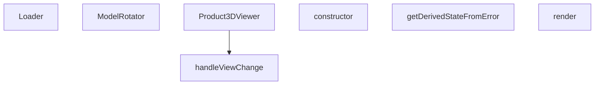

## Genel Bakış
Bu modül, ürünlerin üç boyutlu modellerinin tarayıcıda interaktif olarak görüntülenmesini sağlayan React bileşenlerinden oluşur. Modelin yüklenme sürecini, sahne döndürme mantığını ve farklı kamera açılarından görüntüleme seçeneklerini tek bir koordineli yapı altında toplar. Ayrıca, 3D render sırasında oluşabilecek beklenmedik hataları yakalayarak kullanıcıya bilgilendirici bir geri bildirim sunar.

## Fonksiyon Grupları
### Görüntüleme Motoru ve Etkileşim
Üç boyutlu sahnenin temel yaşam döngüsünü yöneten bileşenler bu grupta yer alır. Modelin yüklenmesi, kullanıcının döndürme girişimlerinin işlenmesi ve kamera açılarının değiştirilmesi gibi temel interaksiyonları kapsar.

- Product3DViewer (ana bileşen, konfigürasyon ve sahneyi başlatır)
- ModelRotator (çocuk bileşenleri sarmalayarak döndürme eksenini kontrol eder)
- Loader (model yüklenirken gösterilen beklenme arayüzü)
- handleViewChange (ön, üst, izometrik gibi tanımlı kamera açılarına geçiş yapar)

### Hata Kalkanı
3D sahne oluşturulurken veya model yüklenirken ortaya çıkabilecek kritik hataları yakalayarak uygulamanın tamamen çökmesini önleyen güvenlik mekanizmasıdır. Hata durumunda kullanıcıya anlaşılır bir alternatif ekran sunulmasını sağlar.

- Error_boundary sınıfı (constructor, getDerivedStateFromError, render)

---

## AXIOMS – Mimari Varsayımlar

Bu modül, THREE.js tabanlı 3D model gösterimi için bir React bileşen zinciri oluşturur. Aşağıdaki mimari varsayımlar fonksiyon imzalarından türetilmiştir.

[Aksiyom 1]: Eğer THREE.js kütüphanesi (veya `THREE.Group` türü) mevcut değilse, `ModelRotator` bileşeni `rotationRef` parametresiyle çalışamaz ve 3D sahne döndürme işlevi bozulur.

[Aksiyom 2]: Eğer `Product3DViewer` bileşeni çağrıldığında `slug` parametresi sağlanmazsa, hangi ürünün 3D modelinin yükleneceği belirsiz kalır ve model yükleme başarısız olur.

[Aksiyom 3]: Eğer `Product3DViewer` bileşeni çağrıldığında `modelType` parametresi sağlanmazsa, modelin hangi format/stratejiyle render edileceği bilinemez ve 3D görünüm oluşturulamaz.

[Aksiyom 4]: Eğer `isFullscreen` değeri `true` olarak ayarlandığında `onClose` callback fonksiyonu sağlanmazsa, kullanıcı tam ekran modundan çıkış yapamaz ve bileşen kilitli kalır.

[Aksiyom 5]: Eğer `ModelRotator` bileşeninde `rotationRef.current` değeri `null` olduğunda döndürme mantığı bu durumu işlemezse, bileşen çökme hatası (null reference) oluşur.

[Aksiyom 6]: Eğer `ModelRotator` bileşeninde `enabled` değeri `false` iken döndürme tetiklenirse, istenmeyen model rotasyonu gerçekleşir.

[Aksiyom 7]: Eğer `handleViewChange` fonksiyonuna `view` parametresi olarak izin verilen değerlerden (`'front'`, `'top'`, `'right'`, `'back'`, `'bottom'`, `'left'`, `'iso'`) farklı bir değer geçilirse, kamera açısı beklenmeyen bir konuma geçer veya render hatası oluşur.

[Aksiyom 8]: Eğer `ErrorBoundary` bileşeni `constructor` çağrısında `t` (çeviri fonksiyonu) parametresi sağlanmazsa, hata durumunda kullanıcıya gösterilecek mesaj oluşturulamaz ve render fonksiyonu hata verir.

[Aksiyom 9]: Eğer `ErrorBoundary.getDerivedStateFromError` fonksiyonu tarafından yakalanan `error` nesnesi beklenen formatta değilse (örn: `message` özelliği yoksa), hata bilgisi eksik işlenir ve kullanıcıya anlamsız bir hata mesajı gösterilebilir.

---

## FONKSİYON DETAYLARI

### Loader
**Ne yapar**: Yüklenme durumunu gösteren basit bir bileşen render eder.  
**Nasıl yapar**: Fonksiyon parametre almaz ve doğrudan JSX döndürür; bu JSX, metin stilini ve arka planını tanımlayan bir `
` öğesini içerir.  
**Parametreler**:  
- Parametre yok  
**Dönüş**: `<Html center>
…
` şeklinde bir JSX elemanı.

### ModelRotator
**Ne yapar**: Verilen çocukları bir THREE.js grup öğesinin içine sararak, bu gruba bir referans bağlar.  
**Nasıl yapar**: `children`, `enabled` ve `rotationRef` özelliklerini alır; `rotationRef` üzerinden grup referansını ayarlar ve ardından `<group ref={rotationRef}>{children}</group>` JSX'ini döndürür.  
**Parametreler**:  
- children: React.ReactNode — Grup içinde render edilecek içerik  
- enabled: boolean — Dönüşümün etkin olup olmadığını belirler (şu anki uygulama doğrudan kullanmıyor olabilir)  
- rotationRef: React.MutableRefObject<THREE.Group | null> — THREE.js grup nesnesine referans tutmak için kullanılan mutable ref  
**Dönüş**: `<group ref={rotationRef}>{children}</group>` JSX elemanı.

### Product3DViewer
**Ne yapar**: Belirtilen ürünün 3D modelini görüntüleyen bir bileşen render eder; tam ekran modu ve kapatma işlevi için props kabul eder.  
**Nasıl yapar**: `slug`, `modelType`, `isFullscreen` (varsayılan false) ve `onClose` props'larını alır; bu bilgilere dayalı olarak 3D görüntüleyiciyi oluşturur ve gerekirse tam ekran veya kapatma kontrollerini sağlar.  
**Parametreler**:  
- slug: string — Görüntülenecek ürünün benzersiz tanımlayıcısı  
- modelType: string — Kullanılacak 3D modelinin türü veya formatı  
- isFullscreen: boolean (varsayılan: false) — Bileşenin tam ekran olarak görüntülenip görüntülenmeyeceği  
- onClose: function — Bileşen kapatıldığında çağrılacak geri çağırım fonksiyonu  
**Dönüş**: `React.FC<Product3DViewerProps>` türünde bir fonksiyon bileşeni.

### handleViewChange
**Ne yapar**: Kamera veya görünüme belirli bir yön (ön, üst, sağ, arka, alt, sol, izometrik) ayarlar.  
**Nasıl yapar**: `view` parametresi olarak kabul edilen litéral birleşim türünden bir değer alır ve bu değere göre iç durum veya görüntüleme matrisini günceller (detaylı uygulama sağlanmadı).  
**Parametreler**:  
- view: 'front' | 'top' | 'right' | 'back' | 'bottom' | 'left' | 'iso' — Uygulanacak görünüme yön  
**Dönüş**: Bilinmiyor (verilen bilgiye göre `void` veya dönüş değeri yoktur).

### constructor
**Ne yapar**: ErrorBoundary bileşeninin başlangıç durumunu (state) initialize eder. Bileşen ilk mount edildiğinde varsayılan değerleri ayarlar.

**Nasıl yapar**: Üst sınıfın (React.Component) constructor'ını `super(props)` ile çağırarak React'ın bileşen mekanizmasını başlatır. Ardından `this.state` nesnesini `hasError: false` ve `error: null` değerleriyle oluşturur. Bu, bileşenin başlangıçta hata olmadığını belirtir.

**Parametreler**:
- `props` : `{ children: React.ReactNode, t: (key: string) => string }` — Bileşenin dışarıdan aldığı özellikler; `children` sarılacak alt bileşenleri, `t` ise i18n çeviri fonksiyonunu temsil eder

**Dönüş**: `void` — Constructor fonksiyonları herhangi bir değer dönmez

### getDerivedStateFromError
**Ne yapar**: Geliştirildi ancak detay üretilemedi.

### render
**Ne yapar**: Geliştirildi ancak detay üretilemedi.

---

## INTERFACES

### Product3DViewerProps
- `slug?: string`
- `modelType?: string`
- `isFullscreen?: boolean`
- `onToggleFullscreen?: () => void`
- `onClose?: () => void`

---

## AST POINTERS

### [N1_NASIL] AST Pointer: Product3DViewer.tsx::Loader
- **params**: (parametre yok)
- **ic_degiskenler**:
  - `progress` — useProgress hook'undan gelen yükleme yüzdesi (0-100 arası)
- **Dönüş**: JSX elementi (Html içinde yükleme yüzdesini gösteren div)

### [N2_NASIL] AST Pointer: Product3DViewer.tsx::ModelRotator
- **params**: `{ children, enabled, rotationRef }` — children: React node, enabled: serbest döndürme modu aktif mi, rotationRef: THREE.Group referansı
- **ic_degiskenler**:
  - `gl` — useThree hook'undan gelen WebGL renderer nesnesi
  - `camera` — useThree hook'undan gelen Three.js camera nesnesi
  - `isDragging` — fare ile sürükleme durumunu tutan ref
  - `previousMouse` — önceki fare pozisyonunu tutan ref {x, y}
- **Dönüş**: JSX elementi (group elementini children ile saran, rotationRef reference'ı)

### [N3_NASIL] AST Pointer: Product3DViewer.tsx::Product3DViewer
- **params**: `{ slug, modelType, isFullscreen = false, onClose }` — slug: model identifier, modelType: model türü, isFullscreen: tam ekran modu, onClose: kapatma callbacki
- **ic_degiskenler**:
  - `t` — useI18n hook'undan gelen çeviri fonksiyonu
  - `showGrid` — grid gösterim durumu state'i
  - `setShowGrid` — grid gösterim durumunu güncelleyen setter
  - `autoRotate` — otomatik döndürme durumu state'i
  - `setAutoRotate` — otomatik döndürme durumunu güncelleyen setter
  - `showViewMenu` — görünüm menüsü açılır/kapalı durumu state'i
  - `setShowViewMenu` — görünüm menüsü durumunu güncelleyen setter
  - `rotationMode` — döndürme modu state'i ('orbit' | 'free')
  - `setRotationMode` — döndürme modunu güncelleyen setter
  - `controlsRef` — OrbitControls referansı
  - `modelGroupRef` — THREE.Group referansı (serbest döndürme için)
  - `tb` — tam ekran durumuna göre toolbar stilleri nesnesi
  - `handleReset` — view/reset butonu için callback fonksiyonu
  - `handleViewChange` — görünüm değiştirme fonksiyonu
  - `placement` — getModelPlacement ile hesaplanan model yerleşim bilgisi (position, rotation)
- **Dönüş**: React.FC<Product3DViewerProps> (3D viewer JSX elementi)

### [N4_NASIL] AST Pointer: Product3DViewer.tsx::handleViewChange
- **params**: `view: 'front' | 'top' | 'right' | 'back' | 'bottom' | 'left' | 'iso'` — hedef görünüm yönü
- **ic_degiskenler**:
  - `dist` — kamera mesafesi sabiti (3.5)
  - `cam` — controlsRef.current.object (Three.js camera referansı)
- **Dönüş**: yok (state ve referansları doğrudan değiştirir)

### [N5_NASIL] AST Pointer: Product3DViewer.tsx::ErrorBoundary.constructor
- **params**: `props: { children: React.ReactNode, t: (key: string) => string }` — children: alt elementler, t: çeviri fonksiyonu
- **ic_degiskenler**: (yok)
- **Dönüş**: yok (constructor)

### [N6_NASIL] AST Pointer: Product3DViewer.tsx::ErrorBoundary.getDerivedStateFromError
- **params**: `error: Error` — yakalanan hata nesnesi
- **ic_degiskenler**: (yok)
- **Dönüş**: `{ hasError: true, error }` — hata durumu ve hata nesnesi

### [N7_NASIL] AST Pointer: Product3DViewer.tsx::ErrorBoundary.render
- **params**: (parametre yok)
- **ic_degiskenler**: (yok — this.state ve this.props kullanılır)
- **Dönüş**: JSX elementi (hata durumunda hata mesajı, aksi halde children)

---

## MERMAID CALL GRAPH

## NODE ID STANDARD

  file: src\components\products\3d\Product3DViewer.tsx
  function: src\components\products\3d\Product3DViewer.tsx::Loader
  function: src\components\products\3d\Product3DViewer.tsx::ModelRotator
  function: src\components\products\3d\Product3DViewer.tsx::Product3DViewer
  function: src\components\products\3d\Product3DViewer.tsx::handleViewChange
  class: src\components\products\3d\Product3DViewer.tsx::ErrorBoundary

---

## DISA AKTARILANLAR (EXPORTS)
  export: ErrorBoundary
  export: Loader
  export: ModelRotator
  export: Product3DViewer

---

## BILEŞIM (CONTAINS)
  contains: ReactNode
  contains: error: Error | null }>
  contains: t: (key: string) => string }
  contains: { hasError: boolean

---

## STİL TOKENLERİ

### Arbitrary Değerler (token'a geçirilmemiş)
Yok — tüm stiller token'a geçirilmiş. ✅

### Kullanılan Token'lar (zaten token'a geçirilmiş)
- (yok)

### Tailwind Sınıf Özeti
- **Renkler:** `bg-blue-50`, `bg-product-3d-radial`, `bg-red-50`, `bg-white`, `bg-white/80`, `bg-white/90`, `bg-white/95`, `border-gray-200`, `border-gray-300`, `border-light-gray`, `border-red-200`, `fill-current`, `hover:bg-blue-50`, `hover:bg-gray-100`, `hover:text-primary-navy`
- **Layout:** `absolute`, `backdrop-blur-md`, `bottom-4`, `fixed`, `flex`, `flex-col`, `gap-0.5`, `gap-1`, `gap-2`, `h-full`, `items-center`, `left-0`, `left-1/2`, `left-4`, `overflow-hidden`
- **Varyant/Responsive:** `:`, `hover:` önekleri
- **Yardımcı Sınıflar:** `${autoRotate`, `${isFullscreen`, `${rotationMode`, `${tb.font`, `${tb.minW`, `${tb.pad`, `${tb.top`, `-translate-x-1/2`, `:`, `===`, `animate-spin`, `border`, `break-words`, `font-bold`, `free`