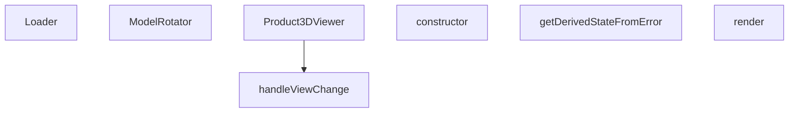

## Genel Bakış
Bu modül, ürünlerin üç boyutlu modellerinin tarayıcıda interaktif olarak görüntülenmesini sağlamak için tasarlanmış bir React bileşen setidir. Temel olarak, 3D modelin yüklenme sürecini yöneten, farklı kamera açılarından görüntülemeyi sağlayan ve modelin döndürülmesini kontrol eden mantığı bir araya getirir. Ayrıca, 3D sahne oluşturma sırasında oluşabilecek kritik hataları yakalayarak uygulamanın çökmesini önleyen bir hata yönetimi katmanı içerir.

## Fonksiyon Grupları
### Görüntüleme Motoru ve Etkileşim
Bu grup, 3D sahnenin temel yaşam döngüsünü ve kullanıcının modelle etkileşimini yöneten bileşenlerden oluşur. Ana görüntüleyiciyi başlatır, yüklenme durumunu görsel olarak temsil eder, modelin döndürülmesini kontrol eder ve tanımlı kamera açıları arasında geçiş yapar.
- Product3DViewer, ModelRotator, Loader, handleViewChange

### Hata Kalkanı
Bu grup, 3D sahne oluşturulurken veya model yüklenirken ortaya çıkabilecek beklenmedik hataları yakalayarak uygulamanın genel stabilitesini korur. Hata durumunda bileşen ağacını durdurur ve kullanıcıya hata hakkında bilgilendirici bir alternatif arayüz sunar.
- ErrorBoundary sınıfı (constructor, getDerivedStateFromError, render)

---

## AXIOMS – Mimari Varsayımlar

Bu modül, 3D ürün modeli görüntüleme bileşenlerinden oluşur. Aşağıdaki mimari varsayımlar, yalnızca fonksiyon imzalarından (parametre tipleri, zorunluluk ve default değerler) çıkarılmıştır.

---

## FONKSİYON DETAYLARI

### Loader
**Ne yapar**: Yüklenme durumunu gösteren basit bir bileşen render eder.  
**Nasıl yapar**: Fonksiyon parametre almaz ve doğrudan JSX döndürür; bu JSX, metin stilini ve arka planını tanımlayan bir `
` öğesini içerir.  
**Parametreler**:  
- Parametre yok  
**Dönüş**: `<Html center>
…
` şeklinde bir JSX elemanı.

### ModelRotator
**Ne yapar**: 3D bir modelin_children_ elemanlarını saran ve etkinleştirildiğinde fare sürüklemeyle döndürülmesine olanak tanıyan bir React bileşenidir.
**Nasıl yapar**: Bileşen, Three.js'in `useThree` hook'undan canvas ve kamera referanslarını alır. `useEffect` içinde, canvas'a `pointerdown` ve pencereye `pointerup` ile `pointermove` olay dinleyicileri ekler. Sürükleme hareketi algılandığında, fare kayma miktarlarını (dx, dy) kameranın世界 eksenlerine göre hesaplanan hız çarpanıyla çarpıp, `rotationRef`'teki Three.js nesnesi üzerinde `rotateOnWorldAxis` yöntemini kullanarak modeli döndürür. Olay dinleyicileri bileşenin bağlantı kesilmesi durumunda temizlenir.
**Parametreler**:
- `children`: React.ReactNode — Döndürülecek olan 3D model veya model grubu.
- `enabled`: boolean — Fare ile döndürme etkinleştirilmiş mi değil mi belirler. `false` olduğunda sürükleme hareketleri işlenmez.
- `rotationRef`: React.MutableRefObject<Group | null> — Döndürme işleminin uygulanacağı Three.js `Group` nesnesine bir referans. Bu ref, bileşenin dışından da erişilebilir olmalıdır.
**Dönüş**: `<group ref={rotationRef}>{children}</group>` — Çocuklarını saran ve döndürme referansını atayan bir Three.js `group` JSX elemanı döner.

### Product3DViewer
**Ne yapar**: Belirtilen ürünün 3D modelini görüntüleyen bir bileşen render eder; tam ekran modu ve kapatma işlevi için props kabul eder.  
**Nasıl yapar**: `slug`, `modelType`, `isFullscreen` (varsayılan false) ve `onClose` props'larını alır; bu bilgilere dayalı olarak 3D görüntüleyiciyi oluşturur ve gerekirse tam ekran veya kapatma kontrollerini sağlar.  
**Parametreler**:  
- slug: string — Görüntülenecek ürünün benzersiz tanımlayıcısı  
- modelType: string — Kullanılacak 3D modelinin türü veya formatı  
- isFullscreen: boolean (varsayılan: false) — Bileşenin tam ekran olarak görüntülenip görüntülenmeyeceği  
- onClose: function — Bileşen kapatıldığında çağrılacak geri çağırım fonksiyonu  
**Dönüş**: `React.FC<Product3DViewerProps>` türünde bir fonksiyon bileşeni.

### handleViewChange
**Ne yapar**: Kamera veya görünüme belirli bir yön (ön, üst, sağ, arka, alt, sol, izometrik) ayarlar.  
**Nasıl yapar**: `view` parametresi olarak kabul edilen litéral birleşim türünden bir değer alır ve bu değere göre iç durum veya görüntüleme matrisini günceller (detaylı uygulama sağlanmadı).  
**Parametreler**:  
- view: 'front' | 'top' | 'right' | 'back' | 'bottom' | 'left' | 'iso' — Uygulanacak görünüme yön  
**Dönüş**: Bilinmiyor (verilen bilgiye göre `void` veya dönüş değeri yoktur).

### ErrorBoundary.constructor
**Ne yapar**: `ErrorBoundary` sınıf bileşeninin kurucusudur ve bileşenin ilk durumunu (state) başlatır.
**Nasıl yapar**: Üst sınıfın (`React.Component`) kurucusunu `super(props)` çağrısıyla çalıştırır ve `this.state` nesnesini `{ hasError: false, error: null }` olarak ayarlayarak hiçbir hata olmadığını ve henüz yakalanmış bir hata nesnesi bulunduğunu belirtir.
**Parametreler**:
- `props`: `{ children: React.ReactNode, t: (key: string) => string }` — Bileşenin props'ları. `children`, hata oluşmadığında render edilecek elemanları içerir. `t`, hata mesajlarını uluslararasılaştırmak için kullanılan bir çeviri fonksiyonudur.
**Dönüş**: void — Kurucu bir değer dönmez.

### ErrorBoundary.getDerivedStateFromError
**Ne yapar**: Bir alt bileşenin Render aşamasında bir hata fırlattığında, ErrorBoundary'nin durumunu güncellenmesi için çağrılan bir yaşam döngüsü methodudur.
**Nasıl yapar**: Statik bir yöntem olarak, fırlatılan `error` nesnesini parametre olarak alır ve bileşenin durumunu `{ hasError: true, error }` olarak güncelleyerek bir sonraki render döngüsünde `render` metodunun hata gösteren dalı çalışmasını sağlar.
**Parametreler**:
- `error`: Error — Yakalanan JavaScript hata nesnesi.
**Dönüş**: `{ hasError: true, error }` — Bileşenin durumunu güncellemek için kullanılacak olan nesne.

### ErrorBoundary.render
**Ne yapar**: `ErrorBoundary` bileşeninin JSX çıktısını oluşturur. Hata oluştuysa hata mesajını gösterir, oluşmadıysa çocuk elemanları doğrudan render eder.
**Nasıl yapar**: Öncelikle `this.state.hasError` durumunu kontrol eder. Eğer `true` ise, Three.js'in `Html` bileşenini kullanarak ekrana ortalanmış, kırmızı arka planlı bir hata kutucuğu render eder. Bu kutucuk, uluslararasılaştırılmış bir başlık (`t('product3d.loadError')`) ve hata mesajının ilk 100 karakterini gösterir. `hasError` durumu `false` ise, `this.props.children` doğrudan döner.
**Parametreler**:
- Bu method herhangi bir parametre almaz. `this.props` ve `this.state` erişimindedir.
**Dönüş**: JSX.Element — Hata durumunda bir `Html` bileşeni, normal durumda ise `this.props.children` döner.

---

## INTERFACES

### Product3DViewerProps
- `slug?: string`
- `modelType?: string`
- `isFullscreen?: boolean`
- `onToggleFullscreen?: () => void`
- `onClose?: () => void`

---

## AST POINTERS

### [N1_NASIL] AST Pointer: src/components/products/3d/Product3DViewer.tsx::Loader
- **params**: []
- **ic_degiskenler**:
  - `progress` — useProgress() hook'undan gelen yükleme yüzdesi (0-100 arası)
- **Dönüş**: JSX elementi, Html center içinde progress yüzdesini gösterir

### [N2_NASIL] AST Pointer: src/components/products/3d/Product3DViewer.tsx::ModelRotator
- **params**: (children: React.ReactNode, enabled: boolean, rotationRef: React.MutableRefObject<Group | null>)
- **ic_degiskenler**:
  - `gl` — useThree() hook'undan gelen WebGL renderer nesnesi
  - `camera` — useThree() hook'undan gelen camera nesnesi
  - `isDragging` — useRef ile oluşturulan, sürükleme durumunu tutan boolean ref
  - `previousMouse` — useRef ile oluşturulan, önceki fare pozisyonunu {x, y} olarak tutan ref
  - `canvas` — gl.domElement'den alınan HTML canvas elementi
  - `handlePointerDown` — fare basma olayı için handler fonksiyonu
  - `handlePointerUp` — fare bırakma olayı için handler fonksiyonu
  - `handlePointerMove` — fare hareketi olayı için handler fonksiyonu
  - `dx` — fare hareketinin x ekseni farkı
  - `dy` — fare hareketinin y ekseni farkı
  - `speed` — rotasyon hızı sabiti (0.005)
  - `camRight` — kameranın sağ vektörü, Vector3(1,0,0) kamera kuanterneyonu ile çarpılmış
  - `camUp` — kameranın yukarı vektörü, Vector3(0,1,0) kamera kuanternyonu ile çarpılmış
- **Dönüş**: JSX elementi, group elementi içinde children render eder

### [N3_NASIL] AST Pointer: src/components/products/3d/Product3DViewer.tsx::Product3DViewer
- **params**: (slug: string, modelType: string, isFullscreen: boolean = false, onClose: () => void)
- **ic_degiskenler**:
  - `t` — useI18n() hook'undan gelen çeviri fonksiyonu
  - `showGrid` — useState ile oluşturulan, ızgara görünürlüğünü tutan boolean state
  - `autoRotate` — useState ile oluşturulan, otomatik döndürme modunu tutan boolean state
  - `showViewMenu` — useState ile oluşturulan, görünüm menüsünün açılış durumunu tutan boolean state
  - `rotationMode` — useState ile oluşturulan, rotasyon modunu ('orbit' veya 'free') tutan state
  - `controlsRef` — useRef ile oluşturulan, OrbitControls referansını tutan ref
  - `modelGroupRef` — useRef ile oluşturulan, model grubu referansını tutan ref
  - `tb` — isFullscreen durumuna göre toolbar stil parametrelerini tutan nesne (icon, font, pad, minW, div, top)
  - `handleReset` — useCallback ile oluşturulan, tüm ayarları sıfırlayan callback fonksiyonu
  - `handleViewChange` — görünüm değişikliği için callback fonksiyonu
  - `handleKeyDown` — useEffect içindeki tuş olayı handler fonksiyonu
  - `placement` — getModelPlacement() fonksiyonundan gelen model pozisyon ve rotasyon bilgisi
- **Dönüş**: JSX elementi, 3D model görüntüleyici UI'ını render eder

### [N4_NASIL] AST Pointer: src/components/products/3d/Product3DViewer.tsx::handleViewChange
- **params**: (view: 'front' | 'top' | 'right' | 'back' | 'bottom' | 'left' | 'iso')
- **ic_degiskenler**:
  - `dist` — kamera mesafesi sabiti (3.5)
  - `cam` — controlsRef.current.object'den gelen kamera nesnesi
- **Dönüş**: yok (void), kamera pozisyonunu ve yönünü ayarlar

### [N5_NASIL] AST Pointer: src/components/products/3d/Product3DViewer.tsx::ErrorBoundary.constructor
- **params**: (props: { children: React.ReactNode, t: (key: string) => string })
- **ic_degiskenler**: yok
- **Dönüş**: yok, super(props) çağırarak state'i {hasError: false, error: olarak başlatır

### [N6_NASIL] AST Pointer: src/components/products/3d/Product3DViewer.tsx::ErrorBoundary.getDerivedStateFromError
- **params**: (error: Error)
- **ic_degiskenler**: yok
- **Dönüş**: {hasError: true, error} state nesnesi

### [N7_NASIL] AST Pointer: src/components/products/3d/Product3DViewer.tsx::ErrorBoundary.render
- **params**: []
- **ic_degiskenler**:
  - `this.state.hasError` — hata durumunu tutan state boolean'ı
  - `this.state.error` — hata nesnesi
  - `this.props.children` — child componentler
  - `this.props.t` — çeviri fonksiyonu
- **Dönüş**: JSX elementi, hata durumunda hata mesajı, normalde children render eder

---

## MERMAID CALL GRAPH

## NODE ID STANDARD

  file: src\components\products\3d\Product3DViewer.tsx
  function: src\components\products\3d\Product3DViewer.tsx::Loader
  function: src\components\products\3d\Product3DViewer.tsx::ModelRotator
  function: src\components\products\3d\Product3DViewer.tsx::Product3DViewer
  function: src\components\products\3d\Product3DViewer.tsx::handleViewChange
  class: src\components\products\3d\Product3DViewer.tsx::ErrorBoundary

---

## DISA AKTARILANLAR (EXPORTS)
  export: ErrorBoundary
  export: Loader
  export: ModelRotator
  export: Product3DViewer

---

## BILEŞIM (CONTAINS)
  contains: ReactNode
  contains: error: Error | null }>
  contains: t: (key: string) => string }
  contains: { hasError: boolean

---

## STİL TOKENLERİ

### Arbitrary Değerler (token'a geçirilmemiş)
Yok — tüm stiller token'a geçirilmiş. ✅

### Kullanılan Token'lar (zaten token'a geçirilmiş)
- (yok)

### Tailwind Sınıf Özeti
- **Renkler:** `bg-blue-50`, `bg-product-3d-radial`, `bg-red-50`, `bg-white`, `bg-white/80`, `bg-white/90`, `bg-white/95`, `border-gray-200`, `border-gray-300`, `border-light-gray`, `border-red-200`, `fill-current`, `hover:bg-blue-50`, `hover:bg-gray-100`, `hover:text-primary-navy`
- **Layout:** `absolute`, `backdrop-blur-md`, `bottom-4`, `fixed`, `flex`, `flex-col`, `gap-0.5`, `gap-1`, `gap-2`, `h-full`, `items-center`, `left-0`, `left-1/2`, `left-4`, `overflow-hidden`
- **Varyant/Responsive:** `:`, `hover:` önekleri
- **Yardımcı Sınıflar:** `${autoRotate`, `${isFullscreen`, `${rotationMode`, `${tb.font`, `${tb.minW`, `${tb.pad`, `${tb.top`, `-translate-x-1/2`, `:`, `===`, `animate-spin`, `border`, `break-words`, `font-bold`, `free`