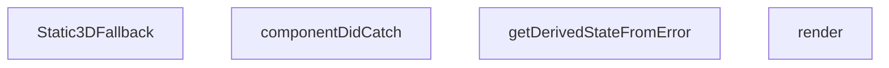

## Genel Bakış
Bu modül, React bileşeninde 3D canvas ile ilgili kritik hataları yakalayan ve uygulamanın çökmesini önleyen bir hata sınırı (error boundary) işlevi görür. Hata durumunda kullanıcıya statik bir 3D fallback göstererek dayanıklılık (resilience) sağlar.

## Fonksiyon Grupları
### Hata Yönetimi
Bileşen ağacındaki hataları yakalar ve durumunu günceller, böylece hatalı bileşenin alt kısmının rendering'i durur.
- getDerivedStateFromError, componentDidCatch

### Alternatif Görünüm Sağlama
Hata durumunda 3D canvas yerine gösterilecek statik alternatif bileşeni tanımlar.
- Static3DFallback

### Temsil ve Yapı
Bileşenin mevcut durumuna göre hangi içeriğin (hatalı çocuk veya fallback) render edileceğine karar verir.
- render

---

## AXIOMS – Mimari Varsayımlar

Bu modül için özel aksiyom tanımlanmamıştır.

---

## FONKSİYON DETAYLARI

### Static3DFallback
**Ne yapar**: Canvas'ın 3D içeriği yüklenemediğinde veya Canvas mount sırasında hata oluştuğunda gösterilecek statik fallback (yedek) UI bileşenini render eder. Bu bileşen, sayfanın tamamen çökmesini engelleyerek kullanıcıya minimal ama anlamlı bir görsel geri bildirim sunar.

**Nasıl yapar**: Sıradan bir React fonksiyonel bileşenidir ve herhangi bir state veya prop almaz. JSX içinde tamamen sabit bir yapı döndürür: Ortalanmış bir `
` içerisine, `Box` ikon bileşeni yerleştirir. `bg-product-3d-radial` sınıfı ile radial gradyan arka plan, `text-steel-gray opacity-40` ile soluk gri tonlarında ikon oluşturulur. `aria-hidden="true"` niteliği ile ikonun ekran okuyucular tarafından yok sayılması sağlanır. Bu bileşen, `ResilientCanvasBoundary`'nin dış katmanında (`props.fallback`) kullanılmak üzere tasarlanmıştır. Documentasyon notuna göre, Canvas bileşeninin kendi içindeki `AssetErrorBoundary` bileşeni Canvas mount sırasındaki throw'ları yakalayamaz; bu yüzden `Static3DFallback` gibi bir dış katman bileşeni şarttır. Ayrıca not edilen açık borç: `webglcontextcreationerror` gibi context-CREATION async hataları henüz bu fallback mekanizması tarafından yakalanamamaktadır.

**Parametreler**:
Bu fonksiyon parametre almaz.

**Dönüş**: JSX elementi (`React.JSX.Element`) döndürür — merkezi hizalanmış, soluk ikonlu, radial gradyan arka planlı bir `
` yapısı.

### getDerivedStateFromError
**Ne yapar**: Geliştirildi ancak detay üretilemedi.

### componentDidCatch
**Ne yapar**: Geliştirildi ancak detay üretilemedi.

### render
**Ne yapar**: Geliştirildi ancak detay üretilemedi.

---

## İTHALATLAR (IMPORTS)
- import: lucide-react::Box
- import: react::React

---

## INTERFACES

### Props
- `children: React.ReactNode`
- `fallback: React.ReactNode`

### State
- `hasError: boolean`

---

## AST POINTERS

### [N1_NASIL] AST Pointer: ResilientCanvasBoundary.tsx::Static3DFallback
- **params**: (parametre yok)
- **ic_degiskenler**: (değişken tanımlanmamış — doğrudan JSX döndürür)
- **Dönüş**: JSX element — `div` içinde `Box` icon'u; 3D yüklensenemediğinde gösterilen statik fallback UI'ı üretir

---

### [N2_NASIL] AST Pointer: ResilientCanvasBoundary.tsx::ResilientCanvasBoundary.getDerivedStateFromError
- **params**: (parametre yok — static metod, React tarafından çağrılır)
- **ic_degiskenler**: (yok — literal obje döndürür)
- **Dönüş**: `State` nesnesi — `{ hasError: true }` döndürerek bileşenin hata durumuna geçmesini sağlar

---

### [N3_NASIL] AST Pointer: ResilientCanvasBoundary.tsx::ResilientCanvasBoundary.componentDidCatch
- **params**: `error` — React tarafından fırlatılan Error nesnesi, 3D bileşenin çökme sebebini içerir
- **ic_degiskenler**: (yok)
- **Dönüş**: yok — yan etki olarak `console.error` ile hata loglanır: `'[VentHubCanvas] 3D yüzeyi yüklenemedi, sayfa ayakta kalıyor:'` prefix'i ile `error` nesnesi yazdırılır

---

### [N4_NASIL] AST Pointer: ResilientCanvasBoundary.tsx::ResilientCanvasBoundary.render
- **params**: (parametre yok)
- **ic_degiskenler**: (yok — koşullu terim doğrudan döndürülür)
- **Dönüş**: JSX — `this.state.hasError === true` ise `this.props.fallback`, aksi halde `this.props.children` döndürülür

---

### Değişken Referans Tablosu (class-level)

| Referans | Tanım |
|---|---|
| `this.state` | `{ hasError: boolean }` — `getDerivedStateFromError` tarafından yönetilen hata durumu |
| `this.state.hasError` | Boolean bayrak, `true` olduğunda fallback gösterilir |
| `this.props.fallback` | Error boundary tetiklendiğinde render edilecek fallback JSX |
| `this.props.children` | Normal durumda render edilecek çocuk bileşenler |

---

## MERMAID CALL GRAPH

## NODE ID STANDARD

  file: src\components\products\3d\core\ResilientCanvasBoundary.tsx
  function: src\components\products\3d\core\ResilientCanvasBoundary.tsx::Static3DFallback
  class: src\components\products\3d\core\ResilientCanvasBoundary.tsx::ResilientCanvasBoundary

---

## DISA AKTARILANLAR (EXPORTS)
  export: ResilientCanvasBoundary
  export: Static3DFallback

---

## BILEŞIM (CONTAINS)
  contains: Component<Props
  contains: State
  contains: State>

---

## STİL TOKENLERİ

### Arbitrary Değerler (token'a geçirilmemiş)
Yok — tüm stiller token'a geçirilmiş. ✅

### Kullanılan Token'lar (zaten token'a geçirilmiş)
- (yok)

### Tailwind Sınıf Özeti
- **Renkler:** `bg-product-3d-radial`, `text-steel-gray`
- **Layout:** `flex`, `h-full`, `items-center`, `justify-center`, `w-full`
- **Varyant/Responsive:** (yok)
- **Yardımcı Sınıflar:** `opacity-40`, `rounded-xl`