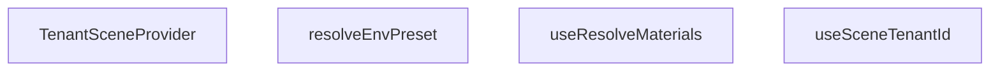

## Genel Bakış
Bu modül, kiracılara (tenant) özel 3D sahne yapılandırmalarını yönetmek için bir React bağlamı (context) ve ilişkili yardımcı işlevleri sağlar. Modül, farklı kiracılar için malzeme ve ortam ayarları gibi özelleştirilmiş kaynakları dinamik olarak çözümleyerek, 3D ürünlerin (örneğin HVAC ekipmanları) görselleştirilmesinde temel bir yapı taşı rolü oynar.

## Fonksiyon Grupları

### Sahne Bağlamı ve Erişim Kancaları
Bu grup, kiracıya özel sahne verilerini üst bileşenlere iletmek için bir bağlam sağlar ve bu bağlamdan bilgi erişimi için kancalar (hooks) sunar.
- TenantSceneProvider, useSceneTenantId

### Kiracıya Özel Kaynak Çözümleyicileri
Bu grup, verilen bir kiracı kimliğine göre spesifik sahne kaynaklarını (malzemeler ve ortam ayarları) çözümlemekten sorumludur. Bu işlevler genellikle bağlamdan kiracı bilgisini alarak kullanılır veya doğrudan bir kiracı kimliği ile çağrılabilir.
- useResolveMaterials, resolveEnvPreset

---

## AXIOMS – Mimari Varsayımlar

Bu modül, bir `tenantId` üzerinden kiracıya özgü 3D sahne malzemelerini ve ortam yapılandırmalarını bağlam (context) aracılığıyla sağlayan bir React context yapısıdır.

[Aksiyom 1]: Eğer `TenantSceneProvider` bir bileşen ağacını sarmıyorsa veya geçerli bir `tenantId` (string) ile çağrılmıyorsa, `useSceneTenantId` hook'u tanımsız/bilinmeyen bir değer döndürür.

[Aksiyom 2]: Eğer `useSceneTenantId` hook'u, `TenantSceneProvider`'ın sağladığı bağlam alanı dışında (hiyerarşik olarak yukarıda bir sağlayıcı olmadan) çağrılıyorsa, geçersiz veya boş bir `tenantId` sonucu oluşur.

[Aksiyom 3]: Eğer `useResolveMaterials` çağrılırken ne argüman olarak bir `_tenantId` verilip ne de çağrı `TenantSceneProvider` bağlamı içinde yapılıyorsa, malzeme çözümlenemez (boş/varsayılan `FanMaterials` döner).

[Aksiyom 4]: Eğer `resolveEnvPreset` çağrılırken geçerli bir `EnvPresetKey` değeri (tanımsız/null değil) sağlanmıyorsa, ortam yapısı (`EnvRigSpec`) doğru çözümlenemez.

[Aksiyom 5]: Eğer `_tenantId` argümanı `useResolveMaterials` veya `resolveEnvPreset` için sağlanmıyorsa (undefined), modülün kendi bağlamındaki (`TenantSceneContext`) `tenantId` değerine geri dönüş yapılır; bu bağlam da mevcut değilse sonuç belirsizdir.

---

## FONKSİYON DETAYLARI

### TenantSceneProvider
**Ne yapar**: TenantSceneProvider, bir React bileşen olup, belirli bir `tenantId` değerini ve alt bileşenlerini sarmalayarak, o `tenantId` değerini React bağlamında (context) sağlayan bir bağlam sağlayıcısıdır.
**Nasıl yapar**: Bileşen, `TenantSceneContext.Provider` bileşenini kullanarak, `value` prop'u olarak `tenantId`'yi ve `children` prop'u olarak alt bileşenleri geçirir. Bu sayede, içindeki tüm bileşenler bağlamı kullanarak ilgili `tenantId` değerine erişebilir.
**Parametreler**:
- tenantId: string — Bu bağlam sağlayıcısının sağlayacağı kiracı tanımlayıcısıdır.
- children: React.ReactNode — Bu bağlam sağlanacak olan alt React bileşenleridir.
**Dönüş**: TenantSceneContext.Provider ile sarılmış children bileşenlerini döndürür.

### useSceneTenantId
**Ne yapar**: Bu hook, bir React bileşeni içinde, yukarıda tanımlanan `TenantSceneContext` bağlamından mevcut `tenantId` değerini almak için kullanılır.
**Nasıl yapar**: `useContext` React hook'unu kullanarak `TenantSceneContext` bağlamına erişir ve bağlamın `value` olarak ayarlanmış olan `tenantId` değerini döndürür.
**Parametreler**: Bu hook parametre almaz.
**Dönüş**: string — Mevcut bağlamdaki `tenantId` değerini döndürür.

### useResolveMaterials
**Ne yapar**: Bu hook, opsiyonel bir `tenantId` parametresi alarak, ilgili kiracı için gerekli materyal (malzeme) setini çözümler (resolve) ve döndürür. Şimdilik doğrudan `useFanMaterials` hook'unu çağırarak fan materyallerini döndürür.
**Nasıl yapar**: Fonksiyon gövdesi, `_tenantId` parametresini şu an için yok sayar ve doğrudan `useFanMaterials()` hook'unu çağırarak `FanMaterials` tipinde bir nesne döndürür. Docstring'e göre, gelecekte bu fonksiyon `resolveMaterials` mantığını kullanarak tam 40'lık bir materyal seti döndürecektir. Fan ve hava temizleyici materyalleri isimle paylaşacak ancak temiz bir partition olmayacaktır. Tenant varyantı, `envMapIntensity` veya `color` gibi özellikleri overlay (bindirme) yaparak uygulayacak, ancak statik `MATERIALS_CACHE` asla değiştirilmeyecektir.
**Parametreler**:
- _tenantId?: string | undefined — Opsiyonel kiracı tanımlayıcısıdır. Fonksiyon adındaki underscore işareti, bu parametrenin şu an için kullanılmadığını ancak gelecekte使用 edileceğini belirtir.
**Dönüş**: FanMaterials — Çözümlenmiş fan materyallerini içeren bir nesne.

### resolveEnvPreset
**Ne yapar**: Bu fonksiyon, verilen bir çevre ön ayar anahtarı (`EnvPresetKey`) ve opsiyonel bir `tenantId` ile, sahne için gerekli çevre donanım (environment rig) özelliklerini içeren bir nesne (`EnvRigSpec`) döndürür.
**Nasıl yapar**: Fonksiyon, `key` parametresini bir `EnvRigSpec` nesnesinin `key` alanı olarak ayarlayarak basitçe döndürür. Docstring'e göre, gerçek uygulamada ışıklandırıcı (lightformer) renk ve yoğunluk değerleri kiracının tonuna göre overlay (bindirme) yapılacak (P2 aşamasında).
**Parametreler**:
- key: EnvPresetKey — Seçilmek istenen çevre ön ayarının anahtarıdır.
- _tenantId?: string | undefined — Opsiyonel kiracı tanımlayıcısıdır. Fonksiyon adındaki underscore işareti, bu parametrenin şu an için kullanılmadığını belirtir.
**Dönüş**: EnvRigSpec — Sadece `key` alanı dolu olan basit bir çevre donanım özellik nesnesi.

---

## İTHALATLAR (IMPORTS)
- import: ../materials/useFanMaterials::type FanMaterials
- import: ../materials/useFanMaterials::useFanMaterials
- import: ./SceneLightingRig::type { EnvPresetKey }
- import: @/utils/tenantConstants::DEFAULT_TENANT_ID
- import: react::React
- import: react::createContext
- import: react::useContext

---

## INTERFACES

### EnvRigSpec
- `key: EnvPresetKey`

---

## SABİTLER
- **TenantSceneContext** (call) — `createContext<string>(DEFAULT_TENANT_ID)`

---

## AST POINTERS

### [N1_NASIL] AST Pointer: src/components/products/3d/core/tenantScene.tsx::TenantSceneProvider
- **params**: `{ tenantId, children }` — `tenantId: string` (kiracının benzersiz tanımlayıcısı), `children: React.ReactNode` (sarılacak React çocukları)
- **ic_degiskenler**: (yok — fonksiyon gövdesinde değişken tanımlanmamış, doğrudan JSX döner)
- **Dönüş**: JSX — `TenantSceneContext.Provider` bileşeni, `value={tenantId}` ile sarılmış `children` döner

### [N2_NASIL] AST Pointer: src/components/products/3d/core/tenantScene.tsx::useSceneTenantId
- **params**: (yok)
- **ic_degiskenler**: (yok — doğrudan `useContext` sonucunu döner)
- **Dönüş**: `string` — mevcut bağlamdaki `tenantId` değerini döner

### [N3_NASIL] AST Pointer: src/components/products/3d/core/tenantScene.tsx::useResolveMaterials
- **params**: `_tenantId?: string` — opsiyonel kiracı tanımlayıcısı (fonksiyon gövdesinde kullanılmıyor, adı `_` ile başlıyor)
- **ic_degiskenler**: (yok — doğrudan `useFanMaterials()` sonucunu döner)
- **Dönüş**: `FanMaterials` — fan malzeme nesnesi

### [N4_NASIL] AST Pointer: src/components/products/3d/core/tenantScene.tsx::resolveEnvPreset
- **params**: `key: EnvPresetKey` (çevre ön ayar anahtarı), `_tenantId?: string` (opsiyonel kiracı tanımlayıcısı, fonksiyon gövdesinde kullanılmıyor)
- **ic_degiskenler**: (yok — doğrudan literal obje döner)
- **Dönüş**: `EnvRigSpec` — `{ key }` nesnesi döner; tenant tonundan overlay uygulanması P2 aşamasında planlanmış

---

## MERMAID CALL GRAPH

## NODE ID STANDARD

  file: src\components\products\3d\core\tenantScene.tsx
  function: src\components\products\3d\core\tenantScene.tsx::TenantSceneProvider
  function: src\components\products\3d\core\tenantScene.tsx::useSceneTenantId
  function: src\components\products\3d\core\tenantScene.tsx::useResolveMaterials
  function: src\components\products\3d\core\tenantScene.tsx::resolveEnvPreset

---

## DISA AKTARILANLAR (EXPORTS)
  export: EnvRigSpec
  export: TenantSceneProvider
  export: resolveEnvPreset
  export: useResolveMaterials
  export: useSceneTenantId

---

## STİL TOKENLERİ

### Arbitrary Değerler (token'a geçirilmemiş)
Yok — tüm stiller token'a geçirilmiş. ✅

### Kullanılan Token'lar (zaten token'a geçirilmiş)
- (yok)

### Tailwind Sınıf Özeti
- **Renkler:** (yok)
- **Layout:** (yok)
- **Varyant/Responsive:** (yok)
- **Yardımcı Sınıflar:** (yok)