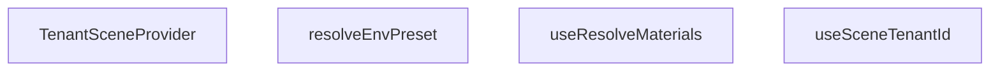

## Genel Bakış
Bu modül, 3D sahne yapısında kiracı (tenant) bazlı özelleştirmeleri yöneten bir React Context katmanıdır. Her kiracıya özel malzeme ve ortam önayarlarını çözümleyerek sahne bileşenlerine sunar. Modül, çok kiracılı (multi-tenant) bir 3D ürün yapılandırmasının temel altyapısını sağlar.

## Fonksiyon Grupları

### Context ve Kiracı Yönetimi
Kiracı kimliğini bir React Context aracılığıyla alt bileşenlere dağıtır ve bu bağlamı tüketmek için bir hook sunar. Bu sayede sahne altındaki tüm bileşenler geçerli kiracı bilgisine erişebilir.
- TenantSceneProvider, useSceneTenantId

### Malzeme ve Ortam Çözümleme
Kiracı kimliğine bağlı olarak 3D sahne malzemelerini ve ortam önayarlarını (environment preset) çözümleyip döndürür. Malzeme çözümleme bir hook olarak, ortam önayarı çözümleme ise doğrudan çağrılabilir bir fonksiyon olarak sunulur.
- useResolveMaterials, resolveEnvPreset

---

## AXIOMS – Mimari Varsayımlar
- Bu modül davranışsal mantık içermez (salt veri / konfigürasyon / tip tanımı).
- [Aksiyom 1]: Modülün dışa açtığı yapı (anahtar kümesi / şema) bir sözleşmedir; tüketiciler bu sabit yapıya bağlıdır — kırıcı değişiklik tüm tüketicileri etkiler.
- [Aksiyom 2]: Bir öğe ekleme/çıkarma yapısal-uyumlu olmalı; ilgili tipler ve seçiciler aynı commit'te güncel tutulmalıdır.

---

## FONKSİYON DETAYLARI

### TenantSceneProvider
**Ne yapar**: Belirli bir kiracıya (tenant) ait sahne bağlamını (context) sağlayan bir React bileşenidir. Bu bileşen, alt bileşen ağacına `tenantId` değerini ileterek, sahneyle ilgili kiracı bilgisinin erişilebilir olmasını sağlar.
**Nasıl yapar**: `TenantSceneContext` adlı bir React Context'inin `Provider` bileşenini kullanır. `tenantId` prop'unu `value` olarak atar ve `children` prop'unu sararak alt bileşenlerin bu bağlama erişmesine olanak tanır.
**Parametreler**:
- tenantId: string — Bağlamda sağlanacak olan kiracı kimlik bilgisi.
- children: React.ReactNode — Provider tarafından sarılacak alt bileşenler.
**Dönüş**: `TenantSceneContext.Provider` bileşeni döndürülür. Bu bileşen, `value` prop'una `tenantId` değerini ve içeriğine `children` prop'unu alır.

### useSceneTenantId
**Ne yapar**: Geçerli kiracı kimliğini (tenant ID) almak için kullanılan özel bir React hook'udur. Bileşenlerin, içinde bulundukları sahne bağlamındaki kiracı bilgisine kolayca erişmesini sağlar.
**Nasıl yapar**: `useContext` hook'unu kullanarak `TenantSceneContext` bağlamından mevcut değeri okur ve döndürür.
**Parametreler**:
- Bu fonksiyon parametre almaz.
**Dönüş**: `string` — Bağlamda bulunan kiracı kimlik bilgisi.

### useResolveMaterials
**Ne yapar**: Fan ve hava temizleyici (purifier) malzemelerini çözmek ve döndürmek için kullanılan bir React hook'udur. Bu fonksiyon, belirli bir kiracı varyantı için malzeme tanımlarını sağlar.
**Nasıl yapar**: Fonksiyon gövdesi, `useFanMaterials()` hook'unu çağırarak `FanMaterials` tipinde bir değer döndürür. Docstring'e göre bu, bir SEAM (E1) noktasıdır; yani imza şu an için mevcut olup, kiracı gövdesi P2 aşamasında tamamlanacaktır. `resolveMaterials` fonksiyonu, productType alt kümesi DEĞİL, fan ve purifier malzemelerini isim bazında paylaşan TAM-40-set döndürür ve temiz bir bölümleme (partition) YOKTUR. Kiracı varyantı, `envMapIntensity` ve `color` için bir OVERLAY uygular. Statik `MATERIALS_CACHE` asla değiştirilmez (mutate edilmez), bu sayede CLEAN dosyası korunur.
**Parametreler**:
- _tenantId: string (isteğe bağlı) — Kiracı kimliği. Şu an için kullanılmıyor (alt çizgi ile belirtilmiş).
**Dönüş**: `FanMaterials` — Çözümlenmiş malzeme tanımları.

### resolveEnvPreset
**Ne yapar**: Belirli bir ortam ön ayarını (environment preset) çözen ve döndüren bir fonksiyondur. Bu fonksiyon, verilen bir ön ayar anahtarı için ortam yapılandırmasını sağlar.
**Nasıl yapar**: Fonksiyon, verilen `key` parametresini kullanarak bir `EnvRigSpec` nesnesi oluşturur ve döndürür. Docstring'e göre, Lightformer'ın renk ve yoğunluğu kiracı tonundan bir OVERLAY alacaktır; bu özellik P2 aşamasında eklenecektir. Gövde, `{ key }` şeklinde basit bir nesne döndürür.
**Parametreler**:
- key: EnvPresetKey — Çözümlenecek ortam ön ayarının anahtarı.
- _tenantId: string (isteğe bağlı) — Kiracı kimliği. Şu an için kullanılmıyor (alt çizgi ile belirtilmiş).
**Dönüş**: `EnvRigSpec` — Çözümlenmiş ortam yapılandırması.

---

## İTHALATLAR (IMPORTS)
- import: ../materials/useFanMaterials::type FanMaterials
- import: ../materials/useFanMaterials::useFanMaterials
- import: ./SceneLightingRig::type { EnvPresetKey }
- import: @/utils/tenantConstants::DEFAULT_TENANT_ID
- import: react::React
- import: react::createContext
- import: react::useContext

---

## INTERFACES

### EnvRigSpec
- `key: EnvPresetKey`

---

## SABİTLER
- **TenantSceneContext** (call) — `createContext<string>(DEFAULT_TENANT_ID)`

---

## AST POINTERS

### [N1_NASIL] AST Pointer: tenantScene.tsx::TenantSceneProvider
- **params**: `tenantId: string`, `children: React.ReactNode`
- **ic_degiskenler**:
  - `TenantSceneContext` — createContext ile oluşturulmuş React context; Provider bileşeni olarak kullanılıyor
  - `tenantId` — Provider'ın `value` prop'una atanıyor, alt bileşenlerin erişimine açılıyor
  - `children` — Provider içinde sarılarak render edilen alt React düğümleri
- **Dönüş**: JSX element (`TenantSceneContext.Provider`)

### [N2_NASIL] AST Pointer: tenantScene.tsx::useSceneTenantId
- **params**: (parametre yok)
- **ic_degiskenler**:
  - `TenantSceneContext` — `useContext` ile okunuyor; bağlamdan mevcut tenant kimliği alınıyor
- **Dönüş**: `string`

### [N3_NASIL] AST Pointer: tenantScene.tsx::useResolveMaterials
- **params**: `_tenantId?: string`
- **ic_degiskenler**:
  - `_tenantId` — parametre olarak tanımlı ama gövdede kullanılmıyor
  - `useFanMaterials` — `../materials/useFanMaterials` modülünden gelen hook; doğrudan çağrılıyor
- **Dönüş**: `FanMaterials`

### [N4_NASIL] AST Pointer: tenantScene.tsx::resolveEnvPreset
- **params**: `key: EnvPresetKey`, `_tenantId?: string`
- **ic_degiskenler**:
  - `key` — `EnvPresetKey` tipinde; dönüş objesinde `key` alanı olarak kullanılıyor
  - `_tenantId` — parametre olarak tanımlı ama gövdede kullanılmıyor
- **Dönüş**: `EnvRigSpec` (`{ key }` objesi)

---

## MERMAID CALL GRAPH

## NODE ID STANDARD

  file: src\components\products\3d\core\tenantScene.tsx
  function: src\components\products\3d\core\tenantScene.tsx::TenantSceneProvider
  function: src\components\products\3d\core\tenantScene.tsx::useSceneTenantId
  function: src\components\products\3d\core\tenantScene.tsx::useResolveMaterials
  function: src\components\products\3d\core\tenantScene.tsx::resolveEnvPreset

---

## DISA AKTARILANLAR (EXPORTS)
  export: EnvRigSpec
  export: TenantSceneProvider
  export: resolveEnvPreset
  export: useResolveMaterials
  export: useSceneTenantId

---

## STİL TOKENLERİ

### Arbitrary Değerler (token'a geçirilmemiş)
Yok — tüm stiller token'a geçirilmiş. ✅

### Kullanılan Token'lar (zaten token'a geçirilmiş)
- (yok)

### Tailwind Sınıf Özeti
- **Renkler:** (yok)
- **Layout:** (yok)
- **Varyant/Responsive:** (yok)
- **Yardımcı Sınıflar:** (yok)