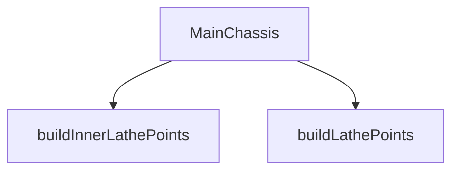

## Genel Bakış
Bu modül, 3B bir şasinin dış ve iç profillerini oluşturan geometrik noktaları üretir ve bu noktaları kullanarak etkileşimli bir 3B şasi bileşeni sunar. Modül, geometrik veri üretimi ve bu veriyi tüketen bir React bileşeni olmak üzere iki temel sorumluluğa sahiptir.

## Fonksiyon Grupları
### Geometrik Veri Üretimi
Bu grup, şasinin döndürme (lathe) geometrisini oluşturacak olan dış ve iç profil noktalarını hesaplar.
- buildLathePoints, buildInnerLathePoints

### 3B Bileşen Oluşturma
Bu grup, üretilen geometrik verileri alarak tarayıcıda renderedilen interaktif bir 3B şasi modelini döndüren React bileşenini tanımlar.
- MainChassis

---

## AXIOMS – Mimari Varsayımlar
- Bu modül davranışsal mantık içermez (salt veri / konfigürasyon / tip tanımı).
- [Aksiyom 1]: Modülün dışa açtığı yapı (anahtar kümesi / şema) bir sözleşmedir; tüketiciler bu sabit yapıya bağlıdır — kırıcı değişiklik tüm tüketicileri etkiler.
- [Aksiyom 2]: Bir öğe ekleme/çıkarma yapısal-uyumlu olmalı; ilgili tipler ve seçiciler aynı commit'te güncel tutulmalıdır.

---

## FONKSİYON DETAYLARI

### buildLathePoints
**Ne yapar**: Dış gövde profil noktalarını Three.js Vector2 nesnelerine dönüştürerek döner. Bu fonksiyon, torna (lathe) geometrisi oluşturmak için gerekli olan dış yüzey profil noktalarını hazırlar.

**Nasıl yapar**: PROFILE_POINTS dizisi üzerinde map fonksiyonu ile iterasyon yapar. Her bir noktayı [y, r] formatından alır ve Vector2(r, y) şeklinde yeni bir vektör nesnesine dönüştürür. X eksenine yarıçap (r), Y eksenine yükseklik (y) değeri atanır.

**Parametreler**:
- Parametre almaz

**Dönüş**: Vector2[] — Dış gövde profilini temsil eden Vector2 vektörleri dizisi. Her vektör, sırasıyla (yarıçap, yükseklik) koordinatlarını içerir.

### buildInnerLathePoints
**Ne yapar**: Bir torun geometrisinin iç kısmı (örneğin boşluk veya ince duvar) için 2D noktalar dizisi üretir. Bu noktalar, dış profilin iç eşdeğerini oluşturmak için kullanılır.  
**Nasıl yapar**: Dış profil noktalarına benzer bir algoritma uygulanır; ancak her nokta, belirli bir kalınlık ofseti ile iç kenara kaydırılarak yeni Vector2 nesneleri oluşturulur. Sonuç olarak iç profil noktalarının dizisi döndürülür.  
**Parametreler**:  
- (parametre yok)  
**Dönüş**: THREE.Vector2[] – İç torun profili için oluşturulan 2D noktaların dizisi.

### MainChassis
**Ne yapar**: Ana şasi bileşenini render eden bir React fonksiyonel bileşenidir. Seçim, izolasyon ve gizlilik durumlarına göre görsel stilini değiştirir ve tıklama olayını üst bileşene iletir.  
**Nasıl yapar**: Bileşen, alınan `isSelected`, `isIsolated`, `isHidden` bayraklarına göre CSS sınıflarını dinamik olarak belirler; `onClick` prop’u ise öğeye tıklandığında çağrılır. JSX içinde genellikle bir `<mesh>` veya `<group>` gibi Three.js sarmalayıcı öğesi kullanılarak 3D modeli gösterilir.  
**Parametreler**:  
- isSelected: boolean — Şasinin seçili olup olmadığını gösterir; true ise vurgulanmış stil uygulanır.  
- isIsolated: boolean — Şasının izole edilip edilmediğini belirtir; true ise diğer parçalar üzerinden etkilenmeden bağımsız olarak render edilir.  
- isHidden: boolean — Şasinin gizli olup olmadığını belirler; true ise bileşen hiçbir şey render etmez (null döndürür).  
- onClick: (event: React.MouseEvent) => void — Kullanıcı şasiye tıkladığında çağrılan geri çağırım fonksiyonu.  
**Dönüş**: React.FC<MainChassisProps> – Verilen props’a göre uygun görseli ve davranışı sağlayan bir React fonksiyonel bileşeni.

---

## İTHALATLAR (IMPORTS)
- import: ../../core::useResolveMaterials
- import: react::React
- import: react::useEffect
- import: react::useMemo
- import: three::BoxGeometry
- import: three::LatheGeometry
- import: three::TorusGeometry
- import: three::Vector2

---

## INTERFACES

### MainChassisProps
- `isSelected?: boolean`
- `isIsolated?: boolean`
- `isHidden?: boolean`
- `onClick?: () => void`
- `explode?: number`

---

## SABİTLER
- **PROFILE_POINTS** (array) — `[
  [-0.76, 0.485], [-0.74, 0.496], [-0.72, 0.500], [-0.70, 0.497], [-0.66, ...`
- **INNER_PROFILE_POINTS** (array) — `[
  [-0.72, 0.460], [-0.60, 0.455], [-0.45, 0.445], [-0.30, 0.432], [-0.15, ...`

---

## AST POINTERS

### [N1_NASIL] AST Pointer: src/components/products/3d/factory/parts/MainChassis.tsx::buildLathePoints
- **params**: yok
- **ic_degiskenler**: yok
- **Dönüş**: `Vector2[]` — `PROFILE_POINTS` sabitindeki her `[y, r]` çiftini `new Vector2(r, y)` nesnesine dönüştürerek dizi oluşturur

### [N2_NASIL] AST Pointer: src/components/products/3d/factory/parts/MainChassis.tsx::buildInnerLathePoints
- **params**: yok
- **ic_degiskenler**: yok
- **Dönüş**: `Vector2[]` — `INNER_PROFILE_POINTS` sabitindeki her `[y, r]` çiftini `new Vector2(r, y)` nesnesine dönüştürerek dizi oluşturur

### [N3_NASIL] AST Pointer: src/components/products/3d/factory/parts/MainChassis.tsx::MainChassis
- **params**:
  - `isSelected` — bileşenin seçili olup olmadığını belirten boolean
  - `isIsolated` — bileşenin izole edilip edilmediğini belirten boolean
  - `isHidden` — bileşenin gizli olup olmadığını belirten boolean
  - `onClick` — tıklama olayında çağrılacak fonksiyon (opsiyonel)
- **ic_degiskenler**:
  - `galvanizedSteel` — `useResolveMaterials()` kancasından gelen galvanizli çelik malzeme
  - `chassisInnerMat` — `useResolveMaterials()` kancasından gelen şasi iç malzemesi
  - `safetyOrange` — `useResolveMaterials()` kancasından gelen güvenlik turuncusu malzeme
  - `outerGeo` — `useMemo` ile oluşturulan `LatheGeometry`, `buildLathePoints()` ve 72 segment ile dış geometri
  - `innerGeo` — `useMemo` ile oluşturulan `LatheGeometry`, `buildInnerLathePoints()` ve 72 segment ile iç geometri
  - `flangeGeo` — `useMemo` ile oluşturulan `TorusGeometry(0.493, 0.012, 12, 72)` flanş geometrisi
  - `ribGeo` — `useMemo` ile oluşturulan `BoxGeometry(0.008, 1.44, 0.008)` kaburga geometrisi
  - `mainMaterial` — `isSelected` true ise `safetyOrange`, false ise `galvanizedSteel` olarak atanan ana malzeme
- **Dönüş**: `JSX.Element | null` — `isHidden` true veya `isIsolated` false ise `null` döner, aksi halde `<group>` içinde mesh'lerden oluşan JSX döner. `useEffect` cleanup fonksiyonu ile `outerGeo`, `innerGeo`, `flangeGeo`, `ribGeo` geometrilerini dispose eder.

---

## MERMAID CALL GRAPH

## NODE ID STANDARD

  file: src\components\products\3d\factory\parts\MainChassis.tsx
  function: src\components\products\3d\factory\parts\MainChassis.tsx::buildLathePoints
  function: src\components\products\3d\factory\parts\MainChassis.tsx::buildInnerLathePoints
  function: src\components\products\3d\factory\parts\MainChassis.tsx::MainChassis

---

## DISA AKTARILANLAR (EXPORTS)
  export: MainChassis
  export: buildInnerLathePoints
  export: buildLathePoints

---

## STİL TOKENLERİ

### Arbitrary Değerler (token'a geçirilmemiş)
Yok — tüm stiller token'a geçirilmiş. ✅

### Kullanılan Token'lar (zaten token'a geçirilmiş)
- (yok)

### Tailwind Sınıf Özeti
- **Renkler:** (yok)
- **Layout:** (yok)
- **Varyant/Responsive:** (yok)
- **Yardımcı Sınıflar:** (yok)