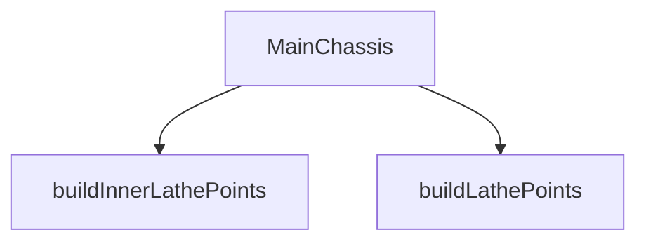

## Genel Bakış
Bu modül, 3B bir şasinin dış ve iç profillerini tanımlayan geometrik nokta dizilerini üretmekle sorumludur. Elde edilen bu noktalar, React tabanlı bir 3B modelleme bileşeni tarafından kullanılarak görsel ve etkileşimli bir şasi parçası oluşturulur.

## Fonksiyon Grupları
### Geometrik Veri Üretimi
Bu grup, şasinin döndürme (lathe) geometrisini oluşturacak olan dış ve iç profil noktalarını hesaplar.
- buildLathePoints, buildInnerLathePoints

### 3B Bileşen Oluşturma
Bu grup, üretilen geometrik verileri alarak tarayıcıda renderedilen interaktif bir 3B şasi modelini döndüren React bileşenini tanımlar.
- MainChassis

---

## AXIOMS – Mimari Varsayımlar

Bu modül, dış ve iç profil geometrilerini üreten iki bağımsız fonksiyon ile bu geometriyi render eden bir React bileşeninden oluşur. Fonksiyon imzaları ve modül sabitleri üzerinden aşağıdaki varsayımlar türetilmiştir.

---

**[Aksiyom 1]:** Eğer `PROFILE_POINTS` sabiti tanımlı değilse veya boş dizi ise, `buildLathePoints()` geçerli dış profil geometri noktaları üretemez.

**[Aksiyom 2]:** Eğer `INNER_PROFILE_POINTS` sabiti tanımlı değilse veya boş dizi ise, `buildInnerLathePoints()` geçerli iç profil geometri noktaları üretemez.

**[Aksiyom 3]:** Eğer `MainChassis` bileşeni çağrıldığında `isSelected` prop'u sağlanmamışsa, bileşenin seçim durumu belirsiz olur.

**[Aksiyom 4]:** Eğer `MainChassis` bileşeni çağrıldığında `isIsolated` prop'u sağlanmamışsa, bileşenin izole durumu belirsiz olur.

**[Aksiyom 5]:** Eğer `MainChassis` bileşeni çağrıldığında `isHidden` prop'u sağlanmamışsa, bileşenin görünürlük durumu belirsiz olur.

**[Aksiyom 6]:** Eğer `onClick` callback'i sağlanmamışsa ve kullanıcı şasiye tıklarsa, tıklama olayı işlenemez (propagation durumu bilinmiyor).

**[Aksiyom 7]:** `PROFILE_POINTS` ve `INNER_PROFILE_POINTS` dizilerinin her bir elemanının, geçerli 3D koordinat verisi (sayısal değerler içeren yapı) içerdiği varsayılır; aksi halde geometri oluşturma fonksiyonları hatalı sonuç döndürür.

**[Aksiyom 8]:** `buildLathePoints()` ve `buildInnerLathePoints()` fonksiyonları parametresiz oldukları için, girdilerini yalnızca modül kapsamındaki sabitlerden (`PROFILE_POINTS`, `INNER_PROFILE_POINTS`) alır; harici bağımlılıkları yoktur.

---

## FONKSİYON DETAYLARI

### buildLathePoints
**Ne yapar**: Dış gövde profil noktalarını Three.js Vector2 nesnelerine dönüştürerek döner. Bu fonksiyon, torna (lathe) geometrisi oluşturmak için gerekli olan dış yüzey profil noktalarını hazırlar.

**Nasıl yapar**: PROFILE_POINTS dizisi üzerinde map fonksiyonu ile iterasyon yapar. Her bir noktayı [y, r] formatından alır ve Vector2(r, y) şeklinde yeni bir vektör nesnesine dönüştürür. X eksenine yarıçap (r), Y eksenine yükseklik (y) değeri atanır.

**Parametreler**:
- Parametre almaz

**Dönüş**: Vector2[] — Dış gövde profilini temsil eden Vector2 vektörleri dizisi. Her vektör, sırasıyla (yarıçap, yükseklik) koordinatlarını içerir.

### buildInnerLathePoints
**Ne yapar**: Bir torun geometrisinin iç kısmı (örneğin boşluk veya ince duvar) için 2D noktalar dizisi üretir. Bu noktalar, dış profilin iç eşdeğerini oluşturmak için kullanılır.  
**Nasıl yapar**: Dış profil noktalarına benzer bir algoritma uygulanır; ancak her nokta, belirli bir kalınlık ofseti ile iç kenara kaydırılarak yeni Vector2 nesneleri oluşturulur. Sonuç olarak iç profil noktalarının dizisi döndürülür.  
**Parametreler**:  
- (parametre yok)  
**Dönüş**: THREE.Vector2[] – İç torun profili için oluşturulan 2D noktaların dizisi.

### MainChassis
**Ne yapar**: Ana şasi bileşenini render eden bir React fonksiyonel bileşenidir. Seçim, izolasyon ve gizlilik durumlarına göre görsel stilini değiştirir ve tıklama olayını üst bileşene iletir.  
**Nasıl yapar**: Bileşen, alınan `isSelected`, `isIsolated`, `isHidden` bayraklarına göre CSS sınıflarını dinamik olarak belirler; `onClick` prop’u ise öğeye tıklandığında çağrılır. JSX içinde genellikle bir `<mesh>` veya `<group>` gibi Three.js sarmalayıcı öğesi kullanılarak 3D modeli gösterilir.  
**Parametreler**:  
- isSelected: boolean — Şasinin seçili olup olmadığını gösterir; true ise vurgulanmış stil uygulanır.  
- isIsolated: boolean — Şasının izole edilip edilmediğini belirtir; true ise diğer parçalar üzerinden etkilenmeden bağımsız olarak render edilir.  
- isHidden: boolean — Şasinin gizli olup olmadığını belirler; true ise bileşen hiçbir şey render etmez (null döndürür).  
- onClick: (event: React.MouseEvent) => void — Kullanıcı şasiye tıkladığında çağrılan geri çağırım fonksiyonu.  
**Dönüş**: React.FC<MainChassisProps> – Verilen props’a göre uygun görseli ve davranışı sağlayan bir React fonksiyonel bileşeni.

---

## INTERFACES

### MainChassisProps
- `isSelected?: boolean`
- `isIsolated?: boolean`
- `isHidden?: boolean`
- `onClick?: () => void`
- `explode?: number`

---

## SABİTLER
- **PROFILE_POINTS** (array) — `[

  [-0.76, 0.485], [-0.74, 0.496], [-0.72, 0.500], [-0.70, 0.497], [-0.66, ...`
- **INNER_PROFILE_POINTS** (array) — `[

  [-0.72, 0.460], [-0.60, 0.455], [-0.45, 0.445], [-0.30, 0.432], [-0.15, ...`

---

## AST POINTERS

### [N1_NASIL] AST Pointer: `src/components/products/3d/factory/parts/MainChassis.tsx`::buildLathePoints
- **params**: (parametre yok)
- **ic_degiskenler**:
  - `PROFILE_POINTS` — Sabit array, `map` ile `[y, r]` çiftlerini `Vector2(r, y)`'ye dönüştürür; dış gövde profil noktalarını tanımlar
- **Dönüş**: `Vector2[]` — LatheGeometry'ye verilecek 2B profil noktaları

---

### [N2_NASIL] AST Pointer: `src/components/products/3d/factory/parts/MainChassis.tsx`::buildInnerLathePoints
- **params**: (parametre yok)
- **ic_degiskenler**:
  - `INNER_PROFILE_POINTS` — Sabit array, `map` ile `[y, r]` çiftlerini `Vector2(r, y)`'ye dönüştürür; iç gövde profil noktalarını tanımlar
- **Dönüş**: `Vector2[]` — LatheGeometry'ye verilecek iç profil noktaları

---

### [N3_NASIL] AST Pointer: `src/components/products/3d/factory/parts/MainChassis.tsx`::MainChassis
- **params**: `{ isSelected, isIsolated, isHidden, onClick }` — Destructured props
- **ic_degiskenler**:
  - `galvanizedSteel` — `useFanMaterials()` hook'undan gelen galvaniz çelik malzemesi; varsayılan dış gövde rengi
  - `chassisInnerMat` — `useFanMaterials()` hook'undan gelen iç şasi malzemesi; iç mesh'e atanır
  - `safetyOrange` — `useFanMaterials()` hook'undan gelen turuncu malzeme; seçili durumda dış gövde rengi
  - `outerGeo` — `useMemo` ile oluşturulan `LatheGeometry(buildLathePoints(), 72)`; dış gövde geometrisi, 72 segment
  - `innerGeo` — `useMemo` ile oluşturulan `LatheGeometry(buildInnerLathePoints(), 72)`; iç gövde geometrisi, 72 segment
  - `flangeGeo` — `useMemo` ile oluşturulan `TorusGeometry(0.493, 0.012, 12, 72)`; flanş/halka geometrisi, 0.493 yarıçap, 0.012 tüp yarıçapı
  - `ribGeos` — `useMemo` callback'inden dönen `BoxGeometry[]` dizisi; 4 adet `BoxGeometry(0.008, 1.44, 0.008)` (ince dikey kaburga)
  - `mainMaterial` — `isSelected ? safetyOrange : galvanizedSteel` koşullu atama; seçiliyse turuncu, değilse galvaniz çelik
- **Dönüş**: JSX `<group name="MainChassis">` — 1 outer mesh, 1 inner mesh, 2 flanş mesh (üst/alt y=±0.72), 4 rib mesh (dairesel yerleşim)

---

### [N4_NASIL] AST Pointer: `src/components/products/3d/factory/parts/MainChassis.tsx`::ribGeos (useMemo callback)
- **params**: (parametre yok)
- **ic_degiskenler**:
  - `ribs` — `BoxGeometry[]` boş dizi; döngüde 4 adet `BoxGeometry(0.008, 1.44, 0.008)` push edilir
  - `i` — `let` ile tanımlı döngü sayacı, 0..3 arası; her iterasyonda yeni bir kaburga geometrisi ekler
- **Dönüş**: `BoxGeometry[]` — 4 elemanlı geometri dizisi

---

### [N5_NASIL] AST Pointer: `src/components/products/3d/factory/parts/MainChassis.tsx`::onClick (event handler)
- **params**: `e` — React synthetic event
- **ic_degiskenler**:
  - `e` — Tıklama eventi; `e.stopPropagation()` ile yukarı propogasyon engellenir
  - `onClick` — Prop'tan gelen opsiyonel callback; `onClick?.()` ile çağrılır (event durdurulduktan sonra)
- **Dönüş**: yok (yan etki: tıklama event'i durdurulur, üst bileşen onClick çağrılır)

---

### [N6_NASIL] AST Pointer: `src/components/products/3d/factory/parts/MainChassis.tsx`::ribGeos.map callback
- **params**: `geo, i` — `geo`: mevcut `BoxGeometry` elemanı, `i`: dizi indeksi (0..3)
- **ic_degiskenler**:
  - `geo` — Mevcut iterasyondaki `BoxGeometry` nesnesi; `<mesh>`'in `geometry` prop'una atanır
  - `i` — Dizi indeksi; hem `key={i}` hem de dairesel konum hesaplamasında `Math.cos((i * Math.PI) / 2)` ve `Math.sin((i * Math.PI) / 2)` ile kullanılır
  - `mainMaterial` — Dışarıdan kapanan değişken; tüm rib mesh'lerine `material` olarak atanır
- **Dönüş**: JSX `<mesh>` — 4 kaburga, yarıçap 0.485 daire üzerinde 0°, 90°, 180°, 270° açılarıyla yerleştirilmiş

---

## MERMAID CALL GRAPH

## NODE ID STANDARD

  file: src\components\products\3d\factory\parts\MainChassis.tsx
  function: src\components\products\3d\factory\parts\MainChassis.tsx::buildLathePoints
  function: src\components\products\3d\factory\parts\MainChassis.tsx::buildInnerLathePoints
  function: src\components\products\3d\factory\parts\MainChassis.tsx::MainChassis

---

## DISA AKTARILANLAR (EXPORTS)
  export: MainChassis
  export: buildInnerLathePoints
  export: buildLathePoints

---

## STİL TOKENLERİ

### Arbitrary Değerler (token'a geçirilmemiş)
Yok — tüm stiller token'a geçirilmiş. ✅

### Kullanılan Token'lar (zaten token'a geçirilmiş)
- (yok)

### Tailwind Sınıf Özeti
- **Renkler:** (yok)
- **Layout:** (yok)
- **Varyant/Responsive:** (yok)
- **Yardımcı Sınıflar:** (yok)