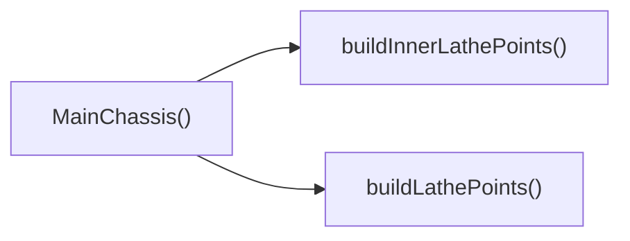

## Genel Bakış
Bu modül, 3B bir şasi modelinin geometrik noktalarını oluşturan yardımcı fonksiyonları ve bu noktaları kullanarak render edilen ana şasi bileşenini içerir. Geometri oluşturma işlevleri, şeklin profilini tanımlayan nokta dizilerini üretir; ana fonksiyon ise bu verileri alarak React tabanlı bir 3B nesne döndürür.

## Fonksiyon Grupları
### Geometri Üretimi
Bu grup, şasinin dış ve iç profilini tanımlayan nokta dizilerini hesaplar.
- buildLathePoints
- buildInnerLathePoints

### Bileşen Renderlama
Bu grup, hesaplanan nokta verilerini kullanarak görsel şasi modelini oluşturur ve etkileşim özelliklerini yönetir.
- MainChassis

---

## AXIOMS – Mimari Varsayımlar
Bu modülün doğru çalışması için aşağıdaki koşulların sağlanması gerekir.

[Aksiyom 1]: Eğer **PROFILE_POINTS** tanımı veya içeriği yoksa, `buildLathePoints()` fonksiyonu geçerli bir nokta listesi üretemez ve boş veya tanımsız bir sonuç döndürür.  
[Aksiyom 2]: Eğer **INNER_PROFILE_POINTS** tanımı veya içeriği yoksa, `buildInnerLathePoints()` fonksiyonu geçerli bir iç profil nokta listesi üretemez ve boş veya tanımsız bir sonuç döndürür.  
[Aksiyom 3]: Eğer **MainChassis** bileşenine `isSelected` prop’u verilmez veya tip boolean dışında bir değer geçerse, seçili durumuna dayalı görsel veya mantıksal koşullar beklenmedik şekilde değerlendirilir.  
[Aksiyom 4]: Eğer **MainChassis** bileşenine `isIsolated` prop’u verilmez veya tip boolean dışında bir değer geçerse, izolasyon durumuna bağlı stil veya davranışlar beklenmedik şekilde uygulanır.  
[Aksiyom 5]: Eğer **MainChassis** bileşenine `isHidden` prop’u verilmez veya tip boolean dışında bir değer geçerse, gizlenme/görünürlük kontrolü beklenmedik şekilde çalışır.  
[Aksiyom 6]: Eğer **MainChassis** bileşenine `onClick` prop’u verilmez veya tip fonksiyon dışında bir değer geçerse, kullanıcı tıklamasını işleyen olay yöneticisi çalışmaz veya hata üretir.  
[Aksiyom 7]: Eğer `buildLathePoints()` ve `buildInnerLathePoints()` fonksiyonları sırasıyla **PROFILE_POINTS** ve **INNER_PROFILE_POINTS** dışındaki verilere bağımlıysa, bu fonksiyonların çıktısı beklenen geometriyi üretemez.  

Bu varsayımlar, modülün mevcut fonksiyon imzaları ve sabitleri çerçevesinde mantıksal olarak türetilmiştir; belge, yorum veya varsayılan değerler dışındaki bilgilerden türetilmemiştir.

---

## FONKSIYON DETAYLARI

### buildLathePoints
**Ne yapar**: Bir torun (lathe) geometrisi için 2D noktalar dizisi oluşturur. Bu noktalar, bir eksen çevresinde döndürülerek 3D bir modelin profilini tanımlar.  
**Nasıl yapar**: Fonksiyon, önceden tanımlanmış bir profil (örneğin chassis dış konturunun kesiti) üzerinden sırayla THREE.Vector2 nesneleri üretir ve bu nesneleri bir dizide toplar.  
**Parametreler**:  
- (parametre yok)  
**Dönüş**: THREE.Vector2[] – Oluşturulan 2D noktaların dizisi; her bir nokta X ve Y koordinatlarını içerir.

### buildInnerLathePoints
**Ne yapar**: Bir torun geometrisinin iç kısmı (örneğin boşluk veya ince duvar) için 2D noktalar dizisi üretir. Bu noktalar, dış profilin iç eşdeğerini oluşturmak için kullanılır.  
**Nasıl yapar**: Dış profil noktalarına benzer bir algoritma uygulanır; ancak her nokta, belirli bir kalınlık ofseti ile iç kenara kaydırılarak yeni Vector2 nesneleri oluşturulur. Sonuç olarak iç profil noktalarının dizisi döndürülür.  
**Parametreler**:  
- (parametre yok)  
**Dönüş**: THREE.Vector2[] – İç torun profili için oluşturulan 2D noktaların dizisi.

### MainChassis
**Ne yapar**: Ana şasi bileşenini render eden bir React fonksiyonel bileşenidir. Seçim, izolasyon ve gizlilik durumlarına göre görsel stilini değiştirir ve tıklama olayını üst bileşene iletir.  
**Nasıl yapar**: Bileşen, alınan `isSelected`, `isIsolated`, `isHidden` bayraklarına göre CSS sınıflarını dinamik olarak belirler; `onClick` prop’u ise öğeye tıklandığında çağrılır. JSX içinde genellikle bir `<mesh>` veya `<group>` gibi Three.js sarmalayıcı öğesi kullanılarak 3D modeli gösterilir.  
**Parametreler**:  
- isSelected: boolean — Şasinin seçili olup olmadığını gösterir; true ise vurgulanmış stil uygulanır.  
- isIsolated: boolean — Şasının izole edilip edilmediğini belirtir; true ise diğer parçalar üzerinden etkilenmeden bağımsız olarak render edilir.  
- isHidden: boolean — Şasinin gizli olup olmadığını belirler; true ise bileşen hiçbir şey render etmez (null döndürür).  
- onClick: (event: React.MouseEvent) => void — Kullanıcı şasiye tıkladığında çağrılan geri çağırım fonksiyonu.  
**Dönüş**: React.FC<MainChassisProps> – Verilen props’a göre uygun görseli ve davranışı sağlayan bir React fonksiyonel bileşeni.

---

## INTERFACES

### MainChassisProps
- `isSelected?: boolean`
- `isIsolated?: boolean`
- `isHidden?: boolean`
- `onClick?: () => void`
- `explode?: number`

---

## SABİTLER
- **PROFILE_POINTS** (array) — `[
  [-0.76, 0.485], [-0.74, 0.496], [-0.72, 0.500], [-0.70, 0.497], [-0.66, ...`
- **INNER_PROFILE_POINTS** (array) — `[
  [-0.72, 0.460], [-0.60, 0.455], [-0.45, 0.445], [-0.30, 0.432], [-0.15, ...`

---

## AST POINTERS

### [N1_NASIL] AST Pointer: src/components/products/3d/factory/parts/MainChassis.tsx::buildLathePoints
- **params**: (parametre yok)
- **ic_degiskenler**: (yok)
- **Dönüş**: THREE.Vector2[]

### [N2_NASIL] AST Pointer: src/components/products/3d/factory/parts/MainChassis.tsx::buildInnerLathePoints
- **params**: (parametre yok)
- **ic_degiskenler**: (yok)
- **Dönüş**: THREE.Vector2[]

### [N3_NASIL] AST Pointer: src/components/products/3d/factory/parts/MainChassis.tsx::MainChassis
- **params**: isSelected, isIsolated, isHidden, onClick
- **ic_degiskenler**: 
  - `galvanizedSteel` — useFanMaterials hook tarafından döndürülen galvanize paslanmaz malzeme
  - `chassisInnerMat` — useFanMaterials hook tarafından döndürülen şasi iç malzemesi
  - `safetyOrange` — useFanMaterials hook tarafından döndürülen güvenlik turuncu rengi
  - `outerGeo` — buildLathePoints ile oluşturulan dış torüs geometrisi (LatheGeometry)
  - `innerGeo` — buildInnerLathePoints ile oluşturulan iç torüs geometrisi (LatheGeometry)
  - `flangeGeo` — sabit çaplı torüs geometrisi (TorusGeometry) flange için
  - `ribGeos` — 4 adet BoxGeometry içeren rib geometri dizisi
  - `mainMaterial` — isSelected ise safetyOrange, değilse galvanizedSteel seçilen malzeme
- **Dönüş**: JSX.Element | null (grup veya null)

### [N4_NASIL] AST Pointer: src/components/products/3d/factory/parts/MainChassis.tsx::ribGeos
- **params**: (parametre yok)
- **ic_degiskenler**: 
  - `ribs` — BoxGeometry nesnelerini tutan başlangıç boş dizisi
  - `i` — döngü sayacı, 0‑3 arasında değişir
- **Dönüş**: THREE.BoxGeometry[]

### [N5_NASIL] AST Pointer: src/components/products/3d/factory/parts/MainChassis.tsx::handleClick
- **params**: e (MouseEvent)
- **ic_degiskenler**: (yok)
- **Dönüş**: (yok) — olay propagasyonunu durdurur ve onClick props fonksiyonunu çağırır

### [N6_NASIL] AST Pointer: src/components/products/3d/factory/parts/MainChassis.tsx::ribMap
- **params**: geo (THREE.BoxGeometry), i (number)
- **ic_degiskenler**: (yok)
- **Dönüş**: JSX.Element (<mesh> elementi) — rib geometrisi için mesh döndürür

---

## ÇAĞRI HARİTASI

### Disariya Cagrilar (Outgoing)
- **MainChassis()** fonksiyonu, chassisin dış ve iç profil noktalarını oluşturmak için **buildLathePoints** ve **buildInnerLathePoints** fonksiyonlarını çağırır.

### Disaridan Cagrilanlar (Incoming)
- Verilen veri setinde bu modülü çağıran dış fonksiyon veya dosya belirtilmemiştir.

### Ic Ice Fonksiyonlar (Nested)
- Yok

---

## DOSYA-İÇİ ÇAĞRI GRAFİĞİ
  MainChassis() → buildInnerLathePoints()
  MainChassis() → buildLathePoints()

---

## NODE ID STANDARD

  file: src\components\products\3d\factory\parts\MainChassis.tsx
  function: src\components\products\3d\factory\parts\MainChassis.tsx::buildLathePoints
  function: src\components\products\3d\factory\parts\MainChassis.tsx::buildInnerLathePoints
  function: src\components\products\3d\factory\parts\MainChassis.tsx::MainChassis

---

## DISA AKTARILANLAR (EXPORTS)
  export: MainChassis
  export: buildInnerLathePoints
  export: buildLathePoints