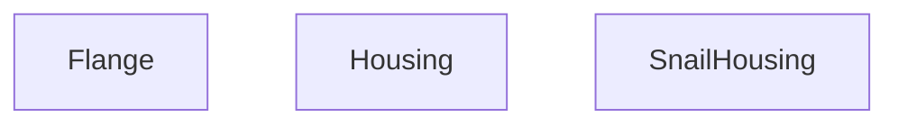

## Genel Bakış
Bu modül, 3B ürün görselleştirmesi için kullanılan React bileşenlerini içerir. Temel amacı, geometrik parametrelerle (yarıçap, uzunluk, kalınlık vb.) özelleştirilebilen flanş ve gövde geometrileri oluşturmaktır. Bileşenler, fiziksel geçerliliği olan 3B modeller üretmek üzere tasarlanmıştır.

## Fonksiyon Grupları
### Flanş Oluşturma
Verilen yarıçap ve delik sayısına göre bir flanş (bağlantı parçası) geometrisi oluşturur.
- Flange

### Ana Gövde Oluşturma
Belirtilen boyut ve kalınlık parametrelerine dayalı olarak ana gövde (housing) geometrisini üretir.
- Housing

### Özel Gövde Oluşturma
Ölçeklenebilir bir "salyangoz" tipi gövde geometrisi oluşturur.
- SnailHousing

---

## AXIOMS – Mimari Varsayımlar
Bu modül, 3B geometri üreten React bileşenlerinden oluşur; geometrik parametrelerin geçerli ve tutarlı olması beklenir.

**[Aksiyom 1]**: Eğer `Flange` için `radius` pozitif bir sayı değilse, geometrik olarak tanımsız veya görünmez bir flanş oluşur.

**[Aksiyom 2]**: Eğer `Flange` için `holes` pozitif bir tamsayı değilse, delikler doğru oluşturulamaz; tutarsız veya eksik delik deseni oluşur.

**[Aksiyom 3]**: Eğer `Housing` için `radius` pozitif bir sayı değilse, gövde geometrisi tanımsız hale gelir.

**[Aksiyom 4]**: Eğer `Housing` için `length` pozitif bir sayı değilse, gövde uzunluğu sıfır veya negatif olur; geçersiz silindirik hacim oluşur.

**[Aksiyom 5]**: Eğer `Housing` için `thickness` pozitif bir sayı değilse, duvar kalınlığı sıfır veya negatif olur; içi dolu veya tanımsız bir gövde oluşur.

**[Aksiyom 6]**: Eğer `Housing` için `width` verilmezse, bileşen render edilemez; `width` zorunlu bir props'tur.

**[Aksiyom 7]**: Eğer `Housing` için `color` verilmezse, bileşen render edilemez; `color` zorunlu bir props'tur.

**[Aksiyom 8]**: Eğer `SnailHousing` için `scale` sıfır veya negatif bir sayıysa, geometri sıfır boyutlu veya ters çevrilmiş olur; anlamlı bir 3B model oluşmaz.

---

## FONKSİYON DETAYLARI

### Flange
**Ne yapar**: Verilen propsa dayalı bir React bileşeni (JSX) döndürür.  
**Nasıl yapar**: Props objesinden `radius` ve `holes` değerleri destructure edilerek kullanılır; bileşenin iç mantığı kaynak kodunda belirtilmemiştir.  
**Parametreler**:
- radius: number — flange'ın yarıçapı  
- holes: number — delik sayısı (varsayılan 8)  
**Dönüş**: `React.FC<FlangeProps>` türünde bir JSX elementi.

### Housing
**Ne yapar**: `Housing` fonksiyonu, verilen boyut ve renk parametrelerine göre bir React fonksiyonel bileşeni döndüren bir üretici fonksiyondur. Dosya konumundan (`src/components/products/3d/parts/`) anlaşılacağı üzere, 3D ürün görselleştirme kapsamında bir muhafaza (housing) parçasını temsil eden bir bileşendir.

**Nasıl yapar**: Fonksiyon, aldığı parametreleri destructuring yöntemiyle ayrıştırır. `thickness` parametresi için varsayılan değer olarak `0.02` atanmıştır; böylece çağrı tarafında bu değer belirtilmezse otomatik olarak kullanılır. `width` ve `color` parametreleri sırasıyla `_width` ve `_color` adlarıyla yeniden adlandırılarak (alias) fonksiyon gövdesinde kullanılır. Bu yeniden adlandırma, muhtemelen bileşen içindeki yerel değişken adlarıyla çakışmayı önlemek amacıyla yapılmıştır. Fonksiyon, `React.FC<HousingProps>` tipinde bir bileşen döndürür; burada `HousingProps` arayüzü bu bileşenin kabul ettiği propları tanımlar.

**Parametreler**:
- `radius`: tip belirtilmemiş — Muhafaza parçasının yarıçapını temsil eder.
- `length`: tip belirtilmemiş — Muhafaza parçasının uzunluğunu temsil eder.
- `thickness`: tip belirtilmemiş, varsayılan değer `0.02` — Muhafaza parçasının kalınlığını temsil eder. Çağrı sırasında belirtilmezse `0.02` değeri kullanılır.
- `width`: tip belirtilmemiş, fonksiyon içinde `_width` adıyla kullanılır — Muhafaza parçasının genişliğini temsil eder.
- `color`: tip belirtilmemiş, fonksiyon içinde `_color` adıyla kullanılır — Muhafaza parçasının rengini temsil eder.

**Dönüş**: `React.FC<HousingProps>` — `HousingProps` arayüzünü proplar olarak kabul eden bir React fonksiyonel bileşeni döndürür.

### SnailHousing
**Ne yapar**: Verilen propsa dayalı bir React bileşeni (JSX) döndürür.  
**Nasıl yapar**: Props objesinden `scale` değeri destructure edilerek kullanılır; bileşenin iç mantığı kaynak kodunda belirtilmemiştir.  
**Parametreler**:
- scale: number — ölçek faktörü (varsayılan 1)  
**Dönüş**: `React.FC<{ scale?: number }>` türünde bir JSX elementi.

---

## İTHALATLAR (IMPORTS)
- import: ../core::useResolveMaterials
- import: react::React
- import: react::useEffect
- import: react::useMemo

---

## INTERFACES

### FlangeProps
- `radius: number`
- `width?: number`
- `holes?: number`

### HousingProps
- `radius: number`
- `length: number`
- `thickness?: number`
- `width?: number`
- `color?: string`

---

## AST POINTERS

### [N1_NASIL] AST Pointer: Housing.tsx::Flange
- **params**: `radius`, `holes` (varsayılan: 8)
- **ic_degiskenler**:
  - `materials` — `useResolveMaterials()` hook'undan dönen materyal nesnesi; `materials.galvanizedSteel` ve `materials.industrialSteel` olarak erişilir
  - `geometries` — `useMemo` ile oluşturulan, `radius` bağımlılığıyla hesaplanan geometri nesnesi; `geometries.ringGeo` ve `geometries.boltGeo` alanlarını içerir
  - `ringGeo` — `new RingGeometry(radius, radius + 0.1, 32)` ile oluşturulan ana halka geometrisi
  - `boltGeo` — `new CylinderGeometry(0.015, 0.015, 0.03, 8)` ile oluşturulan cıvata geometrisi
  - `angle` — her cıvita için `(i * Math.PI * 2) / holes` formülüyle hesaplanan açı (radyan)
  - `r` — cıvitaların merkezden uzaklığı, `radius + 0.05` değeri
  - `i` — `Array(holes).fill(0).map` döngüsündeki indeks
- **Dönüş**: JSX — `<group>` içinde ana halka mesh'i ve `holes` adet cıvita mesh'i

### [N2_NASIL] AST Pointer: Housing.tsx::Housing
- **params**: `radius`, `length`, `thickness` (varsayılan: 0.02), `width` (dış ad: `_width`), `color` (dış ad: `_color`)
- **ic_degiskenler**:
  - `materials` — `useResolveMaterials()` hook'undan dönen materyal nesnesi; `materials.galvanizedSteel` olarak erişilir
  - `geometries` — `useMemo` ile oluşturulan, `[radius, length, thickness]` bağımlılıklarıyla hesaplanan geometri nesnesi; `geometries.cylinderGeo` ve `geometries.ringGeo` alanlarını içerir
  - `cylinderGeo` — `new CylinderGeometry(radius, radius, length, 32, 1, true)` ile oluşturulan açık uçlu silindir geometrisi
  - `ringGeo` — `new RingGeometry(radius - thickness, radius, 32)` ile oluşturulan halka geometrisi (kalınlık illüzyonu için)
- **Dönüş**: JSX — `rotation={[Math.PI / 2, 0, 0]}` ile döndürülmüş `<group>` içinde silindir mesh'i ve iki uç halka mesh'i

### [N3_NASIL] AST Pointer: Housing.tsx::SnailHousing
- **params**: `scale` (varsayılan: 1)
- **ic_degiskenler**:
  - `materials` — `useResolveMaterials()` hook'undan dönen materyal nesnesi; `materials.galvanizedSteel` ve `materials.industrialSteel` olarak erişilir
  - `shape` — `useMemo` ile oluşturulan, bağımlılıksız hesaplanan `Shape` nesnesi; salyangoz spirali ve çıkış ağzı Bezier eğrileriyle tanımlanır
  - `s` — `new Shape()` ile oluşturulan geçici şekil nesnesi; `moveTo`, `bezierCurveTo`, `lineTo` çağrılarıyla salyangoz profilini çizer
  - `geometries` — `useMemo` ile oluşturulan, `[shape]` bağımlılığıyla hesaplanan geometri nesnesi; `geometries.sideShapeGeo`, `geometries.extrudeGeo` ve `geometries.outletFlangeGeo` alanlarını içerir
  - `sideShapeGeo` — `new ShapeGeometry(shape)` ile oluşturulan yan kapak geometrisi
  - `extrudeGeo` — `new ExtrudeGeometry(shape, { steps: 2, depth: 0.6, bevelEnabled: true, bevelThickness: 0.02, bevelSize: 0.02, bevelSegments: 2 })` ile oluşturulan extrüde gövde geometrisi
  - `outletFlangeGeo` — `new BoxGeometry(0.1, 0.6, 0.65)` ile oluşturulan kare çıkış flanşı geometrisi
- **Dönüş**: JSX — `scale={scale}` ile ölçeklenmiş `<group>` içinde iki yan kapak mesh'i, extrüde gövde mesh'i ve çıkış flanşı mesh'i

---

## MERMAID CALL GRAPH

## NODE ID STANDARD

  file: src\components\products\3d\parts\Housing.tsx
  function: src\components\products\3d\parts\Housing.tsx::Flange
  function: src\components\products\3d\parts\Housing.tsx::Housing
  function: src\components\products\3d\parts\Housing.tsx::SnailHousing

---

## DISA AKTARILANLAR (EXPORTS)
  export: Flange
  export: Housing
  export: SnailHousing

---

## STİL TOKENLERİ

### Arbitrary Değerler (token'a geçirilmemiş)
Yok — tüm stiller token'a geçirilmiş. ✅

### Kullanılan Token'lar (zaten token'a geçirilmiş)
- (yok)

### Tailwind Sınıf Özeti
- **Renkler:** (yok)
- **Layout:** (yok)
- **Varyant/Responsive:** (yok)
- **Yardımcı Sınıflar:** (yok)