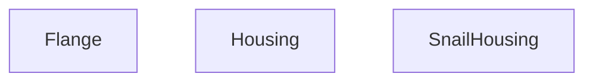

## Genel Bakış
Bu modül, 3B modelleme bağlamında kullanılan temel mekanik parçaları tanımlayan React bileşenlerini içerir. Her fonksiyon, belirli geometrik özellikleri (yarıçap, uzunluk, kalınlık, delik sayısı vb.) parametre olarak alarak ilgili parçanın görsel ve yapısal temsilini üretir.

## Fonksiyon Grupları
### Temel Parça Oluşturucular
Bu grup, modülün ana işlevini oluşturan üç farklı 3B parçayı tanımlayan bileşenleri içerir; her biri belirli bir mekanik işlevi için özelleştirilmiş geometri üretir.
- Flange, Housing, SnailHousing

### Özelleştirilebilir Özellik Grupları
Bu işlevler, parçaların temel boyutlarını ve görünüm özelliklerini ayarlamak için kullanılan parametreleri kabul eder; böylece aynı temel tasarım üzerinden çeşitli varyantlar kolayca üretilebilir.
- Flange (yarıçap ve delik sayısı)
- Housing (yarıçap, uzunluk, kalınlık ve genişlik)
- SnailHousing (ölçek faktörü)

---

## AXIOMS – Mimari Varsayımlar
Bu modülün fonksiyon imzalarından türetilen varsayımlar aşağıda belirtilmiştir.

[Aksiyom 1]: Eğer **Flange** fonksiyonuna `radius` parametresi verilmezse, fonksiyon çalıştırılamaz (eksik gerekli argüman hatası olur).  
[Aksiyom 2]: Eğer **Flange** fonksiyonuna `holes` parametresi verilmezse, `holes` varsayılan olarak **8** değerini alır.  
[Aksiyom 3]: Eğer **Housing** fonksiyonuna `radius` parametresi verilmezse, fonksiyon çalıştırılamaz.  
[Aksiyom 4]: Eğer **Housing** fonksiyonuna `length` parametresi verilmezse, fonksiyon çalıştırılamaz.  
[Aksiyom 5]: Eğer **Housing** fonksiyonuna `thickness` parametresi verilmezse, `thickness` varsayılan olarak **0.02** değerini alır.  
[Aksiyom 6]: Eğer **Housing** fonksiyonuna `width` parametresi verilmezse, fonksiyon çalıştırılamaz.  
[Aksiyom 7]: Eğer **SnailHousing** fonksiyonuna `scale` parametresi verilmezse, `scale` varsayılan olarak **1** değerini alır.

---

## FONKSİYON DETAYLARI

### Flange
**Ne yapar**: Verilen propsa dayalı bir React bileşeni (JSX) döndürür.  
**Nasıl yapar**: Props objesinden `radius` ve `holes` değerleri destructure edilerek kullanılır; bileşenin iç mantığı kaynak kodunda belirtilmemiştir.  
**Parametreler**:
- radius: number — flange'ın yarıçapı  
- holes: number — delik sayısı (varsayılan 8)  
**Dönüş**: `React.FC<FlangeProps>` türünde bir JSX elementi.

### Housing
**Ne yapar**: Verilen propsa dayalı bir React bileşeni (JSX) döndürür.  
**Nasıl yapar**: Props objesinden `radius`, `length`, `thickness` ve `width` ( `_width` olarak adlandırılmış ) değerleri destructure edilerek kullanılır; bileşenin iç mantığı kaynak kodunda belirtilmemiştir.  
**Parametreler**:
- radius: number — housingenin yarıçapı  
- length: number — housingenin uzunluğu  
- thickness: number — housingenin kalınlığı (varsayılan 0.02)  
- _width: number — housingenin genişliği  
**Dönüş**: `React.FC<HousingProps>` türünde bir JSX elementi.

### SnailHousing
**Ne yapar**: Verilen propsa dayalı bir React bileşeni (JSX) döndürür.  
**Nasıl yapar**: Props objesinden `scale` değeri destructure edilerek kullanılır; bileşenin iç mantığı kaynak kodunda belirtilmemiştir.  
**Parametreler**:
- scale: number — ölçek faktörü (varsayılan 1)  
**Dönüş**: `React.FC<{ scale?: number }>` türünde bir JSX elementi.

---

## INTERFACES

### FlangeProps
- `radius: number`
- `width?: number`
- `holes?: number`

### HousingProps
- `radius: number`
- `length: number`
- `thickness?: number`
- `width?: number`
- `color?: string`

---

## AST POINTERS

### [N1_NASIL] AST Pointer: C:\Users\alize\venthub-hvac\src\components\products\3d\parts\Housing.tsx::Flange
- **params**: radius, holes = 8
- **ic_degiskenler**: 
  - `materials` — hook returning material objects (galvanizedSteel, industrialSteel) used for mesh materials
- **Dönüş**: JSX.Element

### [N2_NASIL] AST Pointer: C:\Users\alize\venthub-hvac\src\components\products\3d\parts\Housing.tsx::Housing
- **params**: radius, length, thickness = 0.02, width: _width
- **ic_degiskenler**: 
  - `materials` — hook returning material objects (galvanizedSteel) used for mesh materials
- **Dönüş**: JSX.Element

### [N3_NASIL] AST Pointer: C:\Users\alize\venthub-hvac\src\components\products\3d\parts\Housing.tsx::SnailHousing
- **params**: scale = 1
- **ic_degiskenler**: 
  - `materials` — hook returning material objects (galvanizedSteel, industrialSteel) used for mesh materials
  - `shape` — memoized THREE.Shape defining the snail housing profile
  - `extrudeSettings` — configuration object for ExtrudeGeometry (steps, depth, bevel settings)
- **Dönüş**: JSX.Element

---

## MERMAID CALL GRAPH

## NODE ID STANDARD

  file: src\components\products\3d\parts\Housing.tsx
  function: src\components\products\3d\parts\Housing.tsx::Flange
  function: src\components\products\3d\parts\Housing.tsx::Housing
  function: src\components\products\3d\parts\Housing.tsx::SnailHousing

---

## DISA AKTARILANLAR (EXPORTS)
  export: Flange
  export: Housing
  export: SnailHousing

---

## STİL TOKENLERİ

### Arbitrary Değerler (token'a geçirilmemiş)
Yok — tüm stiller token'a geçirilmiş. ✅

### Kullanılan Token'lar (zaten token'a geçirilmiş)
- (yok)

### Tailwind Sınıf Özeti
- **Renkler:** (yok)
- **Layout:** (yok)
- **Varyant/Responsive:** (yok)
- **Yardımcı Sınıflar:** (yok)