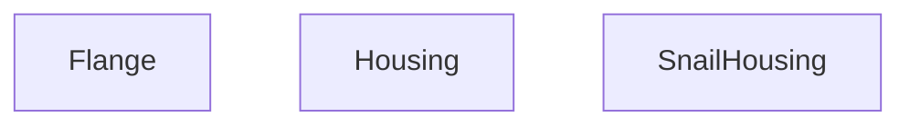

---

## AXIOMS – Mimari Varsayımlar
Bu modül, 3B geometri üreten React bileşenlerinden oluşur; geometrik parametrelerin geçerli ve tutarlı olması beklenir.

**[Aksiyom 1]**: Eğer `Flange` için `radius` pozitif bir sayı değilse, geometrik olarak tanımsız veya görünmez bir flanş oluşur.

**[Aksiyom 2]**: Eğer `Flange` için `holes` pozitif bir tamsayı değilse, deliklerin doğru oluşturulamaz; tutarsız veya eksik delik deseni oluşur.

**[Aksiyom 3]**: Eğer `Housing` için `radius` pozitif bir sayı değilse, gövde geometrisi tanımsız hale gelir.

**[Aksiyom 4]**: Eğer `Housing` için `length` pozitif bir sayı değilse, gövde boyutu anlamsız olur veya çöker.

**[Aksiyom 5]**: Eğer `Housing` için `thickness` pozitif bir sayı değilse, gövde et kalınlığı negatif veya sıfır olur; bu fiziksel olarak geçersiz bir durumdur.

**[Aksiyom 6]**: Eğer `SnailHousing` için `scale` pozitif bir sayı değilse, salyangoz gövdesi ters orantılı veya ters çevrilmiş olur; beklenmeyen geometri oluşur.

**[Aksiyom 7]**: Eğer `radius` ile `width` (Housing'de `_width` olarak geçer) arasındaki oran fiziksel olarak geçerli bir oran değilse (örn. çap `width`'ten küçükse), Housing geometrisi kendini içe doğru katlayabilir veya çakışabilir.

**[Aksiyom 8]**: Eğer `Housing` için `thickness` değeri `radius`'tan büyükse, gövde içi tamamen dolu hale gelir; delik veya boşluk kalmaz.

---

## FONKSİYON DETAYLARI

### Flange
**Ne yapar**: Verilen propsa dayalı bir React bileşeni (JSX) döndürür.  
**Nasıl yapar**: Props objesinden `radius` ve `holes` değerleri destructure edilerek kullanılır; bileşenin iç mantığı kaynak kodunda belirtilmemiştir.  
**Parametreler**:
- radius: number — flange'ın yarıçapı  
- holes: number — delik sayısı (varsayılan 8)  
**Dönüş**: `React.FC<FlangeProps>` türünde bir JSX elementi.

### Housing
**Ne yapar**: Verilen propsa dayalı bir React bileşeni (JSX) döndürür.  
**Nasıl yapar**: Props objesinden `radius`, `length`, `thickness` ve `width` ( `_width` olarak adlandırılmış ) değerleri destructure edilerek kullanılır; bileşenin iç mantığı kaynak kodunda belirtilmemiştir.  
**Parametreler**:
- radius: number — housingenin yarıçapı  
- length: number — housingenin uzunluğu  
- thickness: number — housingenin kalınlığı (varsayılan 0.02)  
- _width: number — housingenin genişliği  
**Dönüş**: `React.FC<HousingProps>` türünde bir JSX elementi.

### SnailHousing
**Ne yapar**: Verilen propsa dayalı bir React bileşeni (JSX) döndürür.  
**Nasıl yapar**: Props objesinden `scale` değeri destructure edilerek kullanılır; bileşenin iç mantığı kaynak kodunda belirtilmemiştir.  
**Parametreler**:
- scale: number — ölçek faktörü (varsayılan 1)  
**Dönüş**: `React.FC<{ scale?: number }>` türünde bir JSX elementi.

---

## INTERFACES

### FlangeProps
- `radius: number`
- `width?: number`
- `holes?: number`

### HousingProps
- `radius: number`
- `length: number`
- `thickness?: number`
- `width?: number`
- `color?: string`

---

## AST POINTERS

### [N1_NASIL] AST Pointer: components/products/3d/parts/Housing.tsx::Flange
- **params**: `radius` — flanşın dış yarıçapı, `holes = 8` — flanştaki cıvata delik sayısı (varsayılan 8)
- **ic_degiskenler**:
  - `materials` — `useFanMaterials()` hook'undan gelen malzeme nesnesi, galvaniz çelik ve endüstriyel çelik materyallerini içerir
  - `angle` — (map callback içinde) her cıvatanın açısal konumu, `(i * Math.PI * 2) / holes` ile hesaplanan radyan cinsinden açı
  - `r` — cıvataların yerleştirildiği yarıçap, `radius + 0.05` olarak flanş yüzeyine yerleştirilir
- **Dönüş**: `<group>` elemanı içinde ana ringGeometry halkası ve `Array(holes).fill(0).map(...)` ile döngüsel olarak oluşturulmuş cıvata mesh'leri

---

### [N2_NASIL] AST Pointer: components/products/3d/parts/Housing.tsx::Housing
- **params**: `radius` — silindirik gövde yarıçapı, `length` — gövde boyu (silindir yüksekliği), `thickness = 0.02` — gövde kalınlığı (halka genişliği), `width: _width` — genişlik parametresi (prefixed `_`, kullanılmıyor)
- **ic_degiskenler**:
  - `materials` — `useFanMaterials()` hook'undan gelen malzeme nesnesi, galvaniz çelik materyalini içerir
- **Dönüş**: `<group rotation={[Math.PI / 2, 0, 0]}>` içinde openEnded silindir gövdesi + üst ve alt uçlarda `ringGeometry` halkalar ile kalınlık illüzyonu

---

### [N3_NASIL] AST Pointer: components/products/3d/parts/Housing.tsx::SnailHousing
- **params**: `scale = 1` — salyangoz gövdesinin genel ölçek çarpanı (varsayılan 1)
- **ic_degiskenler**:
  - `materials` — `useFanMaterials()` hook'undan gelen malzeme nesnesi, galvaniz çelik ve endüstriyel çelik materyallerini içerir
  - `shape` — `useMemo` ile oluşturulan `Three.Shape` nesnesi, salyangoz spirali geometrisini tanımlar; Bezier eğrileri ile logaritmik spiral yaklaşımı ve kare çıkış ağzı (atış) çizimini içerir
  - `extrudeSettings` — `{ steps: 2, depth: 0.6, bevelEnabled: true, bevelThickness: 0.02, bevelSize: 0.02, bevelSegments: 2 }` — `ExtrudeGeometry` için extrüzyon parametreleri; 2 adım, 0.6 birim derinlik, yuvarlatılmış kenarlar
- **Dönüş**: `<group scale={scale}>` içinde iki adet yan kapak (shapeGeometry ile ön/arka yüz), extruded gövde (extrudeGeometry ile dolu gövde) ve kare çıkış flanşı (boxGeometry)

---

## MERMAID CALL GRAPH

## NODE ID STANDARD

  file: src\components\products\3d\parts\Housing.tsx
  function: src\components\products\3d\parts\Housing.tsx::Flange
  function: src\components\products\3d\parts\Housing.tsx::Housing
  function: src\components\products\3d\parts\Housing.tsx::SnailHousing

---

## DISA AKTARILANLAR (EXPORTS)
  export: Flange
  export: Housing
  export: SnailHousing

---

## STİL TOKENLERİ

### Arbitrary Değerler (token'a geçirilmemiş)
Yok — tüm stiller token'a geçirilmiş. ✅

### Kullanılan Token'lar (zaten token'a geçirilmiş)
- (yok)

### Tailwind Sınıf Özeti
- **Renkler:** (yok)
- **Layout:** (yok)
- **Varyant/Responsive:** (yok)
- **Yardımcı Sınıflar:** (yok)