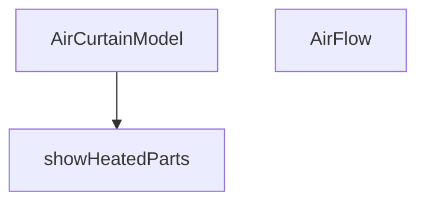

## Genel Bakış
Bu modül, hava perdesi ürünlerinin 3B görselleştirmesini sağlayan React bileşenlerini içerir. Isıtma ve akış özelliklerinin koşullu olarak gösterilmesini yönetir; ısıtmalı bölgeler ve karışık akış senaryolarına göre bileşen içeriğini dinamik olarak render eder.

## Fonksiyon Grupları
### 3B Model Bileşenleri
Hava perdesinin üç boyutlu modelini ve hava akışı görselleştirmesini oluşturarak ana görselleştirme yapısını kurar.
- AirCurtainModel, AirFlow

### Koşullu Gösterim Yardımcıları
Isıtma ile ilgili 3B parçaların render edilip edilmeyeceğini belirleyerek bileşenin prop değerlerine duyarlı olmasını sağlar.
- showHeatedParts

---

## AXIOMS – Mimari Varsayımlar
Bu modül için özel aksiyom tanımlanmamıştır.

### Neden tanimlanmadi?
- Fonksiyon gövdeleri saglanmamistir. Mimari varsayimlar, fonksiyonlarin gercek uygulama koduna (gövdeye) dayali olarak üretilmelidir.
- Mevcut fonksiyon imzalari, sadece parametre ve varsayilan deger bilgisi vermektedir; herhangi bir kosul veya sonuc iliskisini ortaya koymamaktadir.
- Saglanan eski dokumanda (overview ve fonksiyon gruplari) aksiyom olusturmaya yetecek detayli uygulama mantigi bulunmamaktadir.

---

## FONKSİYON DETAYLARI

### AirCurtainModel
**Ne yapar**: Havaperdesi (Air Curtain) cihazının tam 3D modelini oluşturur ve sahneye yerleştirir. Cihazın gövdesini, iç tambur fanını, ısıtıcı bobinlerini, üfleme ızgarasını ve kontrol panelini bileşenler halinde render ederek animasyonlu bir görsel sunar.

**Nasıl yapar**: React Three Fiber kullanarak bir `<group>` içine çoklu `<mesh>` ve bileşenler ekler. Cihazın temel yapısını oluşturan box geometrileri, yan panelleri, arka paneli ve üst paneli malzemelerle kaplar. İç tambur fanı (cross-flow drum) için bir ref ile animasyonlu döndürme (useFrame) ekler. `isHeated` prop'una bağlı olarak ısıtıcı bobinlerini ve IR sensöründeki durum LED rengini değiştirir. Son olarak, üfleme ızgarasının içine `AirFlow` animasyonlu bileşenini yerleştirerek hava akışı simülasyonunu başlatır.

**Parametreler**:
- isHeated: boolean — Cihazın ısıtıcılı olup olmadığını belirtir. true olduğunda ısıtıcı bobinleri görünür ve sensör LED'i turuncu olur. Varsayılanı false'dur.
- showMixed: boolean — Hava akışının "karışık" (hem sıcak hem soğuk) modda simüle edilip edilmeyeceğini belirtir. AirFlow bileşenine aktarılır. Varsayılanı false'dur.

**Dönüş**: JSX Element — 3D sahne içinde yerleştirilebilecek, cihazın tüm geometrik ve animasyonlu parçalarını içeren bir React Three Fiber bileşeni döndürür.

### AirFlow
**Ne yapar**: Havaperdesinden çıkan hava akışını görsel olarak simüle eden animasyonlu bir 2D katmanlar (dilimler) serisi oluşturur. Dilimlerin renkleri, opaklıkları ve dalgalı hareketleri, cihazın çalışma moduna (ısıtmalı, soğuk veya karışık) göre dinamik olarak değişir.

**Nasıl yapar**: Belirli sayıda (SLICE_COUNT) yatay planeGeometry dilimi oluşturur. Her dilimin başlangıç opaklık değeri, dikey pozisyonuna göre bir gradient (üstte yoğun, altta sönük) ile ayarlanır. `isHeated` ve `showMixed` prop'larına göre her dilime bir "tip" (sıcak veya soğuk) atanır. useFrame her karede tüm dilimlerin malzemesini günceller: sinüs dalga fonksiyonu ile opaklıkta dalgalanma ve hafif yatay titreşim ekleyerek gerçekçi bir akış hissi yaratır.

**Parametreler**:
- isHeated: boolean — Hava akışının tamamının sıcak (turuncu) olup olmadığını belirtir. true ise tüm dilimler turuncu; false ise mavi olur.
- showMixed: boolean — Hava akışının "karışık" modda olup olmadığını belirtir. true ise dilimler periyodik olarak sıcak ve soğuk renkler arasında alternatifler.

**Dönüş**: JSX Element — 3D sahne içinde yerleştirilecek, animasyonlu ve saydam planeGeometry dilimlerinden oluşan bir hava perdesi görseli döndürür.

### showHeatedParts
**Ne yapar**: showHeatedParts, havalama perdesi modelinin ısıtma bölümlerinin gösterilip gösterilmeyeceğini belirleyen bir sabit değer döndürür.  
**Nasıl yapar**: Fonksiyon her çağrıldığında doğrudan `true` değerini döndürür; bu, ısıtma bölümlerinin her zaman gösterilmesi gerektiğini gösterir.  
**Parametreler**: Fonksiyon hiçbir parametre almaz.  
**Dönüş**: Boolean türünde `true` değeri döndürür.

---

## INTERFACES

### AirCurtainModelProps
- `isHeated?: boolean`
- `showMixed?: boolean`

---

## AST POINTERS

### [N1_NASIL] AirCurtainModel.tsx::AirCurtainModel
- **params**: ({ isHeated = false, showMixed = false }: AirCurtainModelProps)
- **ic_degiskenler**:
  - `drumRef` — İç tambur fan (Cross-Flow) için React ref nesnesi, 3D grubun DOM referansını tutar
  - `materials` — useFanMaterials() hook'undan gelen materyal nesnesi, tüm 3D mesh'lerin malzemelerini içerir (matteBlack, industrialSteel, safetyOrange)
- **Dönüş**: JSX (React Three Fiber bileşenleri)

### [N2_NASIL] AirCurtainModel.tsx::AirFlow
- **params**: ({ isHeated, showMixed }: { isHeated: boolean, showMixed: boolean })
- **ic_degiskenler**:
  - `meshRefs` — Her hava akışı dilimi için React ref dizisi, dilim mesh'lerinin DOM referanslarını tutar
  - `SLICE_COUNT` — Sabit: Yatay dilim sayısı (28)
  - `CURTAIN_WIDTH` — Sabit: Perde genişliği (2.32 birim)
  - `CURTAIN_HEIGHT` — Sabit: Toplam akış mesafesi (1.6 birim)
  - `SLICE_HEIGHT` — Sabit: Tek bir dilim yüksekliği (CURTAIN_HEIGHT / SLICE_COUNT * 1.05)
  - `MAX_OPACITY` — Sabit: Üst dilimlerdeki maksimum opaklık (0.32)
  - `WAVE_SPEED` — Sabit: Dalga hareket hızı (2.5)
  - `WAVE_INTENSITY` — Sabit: Dalga genliği (0.12)
  - `slices` — useMemo ile hesaplanan dilim verileri dizisi, her dilim için yPos, baseOpacity ve type değerlerini içerir
  - `timeRef` — Animasyon zamanlayıcısı için React ref, geçen toplam süreyi tutar
  - `hotColor` — Sıcak hava rengi (turuncu tonu #fb923c)
  - `coldColor` — Soğuk hava rengi (mavi tonu #38bdf8)
- **Dönüş**: JSX (React Three Fiber bileşenleri)

### [N3_NASIL] AirCurtainModel.tsx::showHeatedParts
- **params**: (yok)
- **ic_degiskenler**: (yok)
- **Dönüş**: boolean (her zaman true)

---

## MERMAID CALL GRAPH

## NODE ID STANDARD

  file: src\components\products\3d\types\AirCurtainModel.tsx
  function: src\components\products\3d\types\AirCurtainModel.tsx::AirCurtainModel
  function: src\components\products\3d\types\AirCurtainModel.tsx::AirFlow
  function: src\components\products\3d\types\AirCurtainModel.tsx::showHeatedParts

---

## DISA AKTARILANLAR (EXPORTS)
  export: AirCurtainModel
  export: AirCurtainModelProps
  export: AirFlow
  export: showHeatedParts

---

## STİL TOKENLERİ

### Arbitrary Değerler (token'a geçirilmemiş)
Yok — tüm stiller token'a geçirilmiş. ✅

### Kullanılan Token'lar (zaten token'a geçirilmiş)
- (yok)

### Tailwind Sınıf Özeti
- **Renkler:** `bg-blue-600`, `bg-white`, `border-blue-200`, `text-primary-navy`, `text-xs`
- **Layout:** `flex`, `gap-1`, `h-2`, `items-center`, `shadow-inner`, `w-2`
- **Varyant/Responsive:** (yok)
- **Yardımcı Sınıflar:** `border`, `font-black`, `pointer-events-none`, `px-2`, `py-0.5`, `rounded-full`, `rounded-sm`, `select-none`, `tracking-tighter`