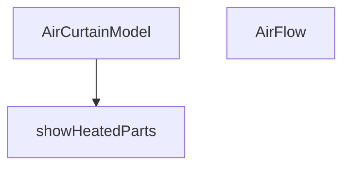

## Genel Bakış
Bu modül, hava perdesi ürünlerinin 3B görselleştirmesini sağlayan React bileşenlerini içerir. Isıtma ve akış özelliklerinin koşullu olarak gösterilmesini yönetir; ısıtmalı bölgeler ve karışık akış senaryolarına göre bileşen içeriğini dinamik olarak render eder.

## Fonksiyon Grupları
### 3B Model Bileşenleri
Hava perdesinin üç boyutlu modelini ve hava akışı görselleştirmesini oluşturarak ana görselleştirme yapısını kurar.
- AirCurtainModel, AirFlow

### Koşullu Gösterim Yardımcıları
Isıtma ile ilgili 3B parçaların render edilip edilmeyeceğini belirleyerek bileşenin prop değerlerine duyarlı olmasını sağlar.
- showHeatedParts

---

## AXIOMS – Mimari Varsayımlar
Bu modül için özel aksiyom tanımlanmamıştır.

### Neden tanimlanmadi?
- Fonksiyon gövdeleri saglanmamistir. Mimari varsayimlar, fonksiyonlarin gercek uygulama koduna (gövdeye) dayali olarak üretilmelidir.
- Mevcut fonksiyon imzalari, sadece parametre ve varsayilan deger bilgisi vermektedir; herhangi bir kosul veya sonuc iliskisini ortaya koymamaktadir.
- Saglanan eski dokumanda (overview ve fonksiyon gruplari) aksiyom olusturmaya yetecek detayli uygulama mantigi bulunmamaktadir.

---

## FONKSİYON DETAYLARI

### AirCurtainModel

**Ne yapar**: VentHub hava perdesi (air curtain) ürününün Three.js tabanlı 3D modelini render eden React bileşenidir. Ana gövde, yan kapaklar, arka panel, iç tambur fan, opsiyonel ısıtıcı batarya, üfleme ızgarası, IR sensör ve kontrol paneli dahil olmak üzere fiziksel tüm bileşenleri sahneye yerleştirir. Prop'lara bağlı olarak ısıtıcılı/ısıtıcısız ve karışık akış simülasyonu görsellerini dinamik olarak yönetir.

**Nasıl yapar**: Bileşen, `useRef` ile iç tambur fan grubuna referans alır ve `useFrame` kancasıyla her karede bu referansın `rotation.x` değerini `delta * 12` kadar azaltarak Cross-Flow fanın sürekli dönmesini sağlar. Malzemeler `useFanMaterials()` özel kancasından (custom hook) tek seferde çekilerek tüm mesh'lere atanır. Isıtıcı batarya grubunun görünürlüğü `isHeated` prop'u veya `showHeatedParts()` fonksiyonu ile kontrol edilir. Üfleme ızgarası altına yerleştirilen `AirFlow` bileşenine `isHeated` ve `showMixed` prop'ları aktarılarak hava akışı simülasyonunun türü belirlenir. IR sensör LED rengi ısıtıcılı modellerde turuncu (#f97316), aksi halde yeşil (#22c55e) olarak koşullu atanır. Tüm sahne `scale={[0.8, 0.8, 0.8]}` ve `rotation={[0, -Math.PI / 2, 0]}` ile normalize edilir. `BRAND_LABEL` sabiti, HTML overlay içinde VentHub marka etiketi olarak gövde üzerine bindirilir; bu etiket `Html` transform bileşeni ile 3D sahneye sabitlenir ve `select-none pointer-events-none` sınıflarıyla etkileşime kapatılır.

**Parametreler**:
- `isHeated: boolean` — Modelin ısıtıcılı olup olmadığını belirler. `true` olduğunda ısıtıcı batarya bobinleri görünür hale gelir ve IR sensör LED'i turuncu renge döner. Varsayılan değeri `false`'tur.
- `showMixed: boolean` — Karışık (mixed) hava akışı simülasyonunun gösterilip gösterilmeyeceğini belirler. `AirFlow` alt bileşenine aktarılarak akış görselleştirmesinin türünü değiştirir. Varsayılan değeri `false`'tur.

**Dönüş**: JSX elementi (`JSX.Element`) — Hava perdesinin tüm 3B geometrik bileşenlerini, animasyonlarını ve interaktif unsurlarını içeren React Three Fiber sahne ağacı. Fonksiyon component yapısı gereği React element döndürür; `void` dönüşü değildir.

### AirFlow
**Ne yapar**: Havaperdesinden çıkan hava akışını görsel olarak simüle eden animasyonlu bir 2D katmanlar (dilimler) serisi oluşturur. Dilimlerin renkleri, opaklıkları ve dalgalı hareketleri, cihazın çalışma moduna (ısıtmalı, soğuk veya karışık) göre dinamik olarak değişir.

**Nasıl yapar**: Belirli sayıda (SLICE_COUNT) yatay planeGeometry dilimi oluşturur. Her dilimin başlangıç opaklık değeri, dikey pozisyonuna göre bir gradient (üstte yoğun, altta sönük) ile ayarlanır. `isHeated` ve `showMixed` prop'larına göre her dilime bir "tip" (sıcak veya soğuk) atanır. useFrame her karede tüm dilimlerin malzemesini günceller: sinüs dalga fonksiyonu ile opaklıkta dalgalanma ve hafif yatay titreşim ekleyerek gerçekçi bir akış hissi yaratır.

**Parametreler**:
- isHeated: boolean — Hava akışının tamamının sıcak (turuncu) olup olmadığını belirtir. true ise tüm dilimler turuncu; false ise mavi olur.
- showMixed: boolean — Hava akışının "karışık" modda olup olmadığını belirtir. true ise dilimler periyodik olarak sıcak ve soğuk renkler arasında alternatifler.

**Dönüş**: JSX Element — 3D sahne içinde yerleştirilecek, animasyonlu ve saydam planeGeometry dilimlerinden oluşan bir hava perdesi görseli döndürür.

### showHeatedParts
**Ne yapar**: showHeatedParts, havalama perdesi modelinin ısıtma bölümlerinin gösterilip gösterilmeyeceğini belirleyen bir sabit değer döndürür.  
**Nasıl yapar**: Fonksiyon her çağrıldığında doğrudan `true` değerini döndürür; bu, ısıtma bölümlerinin her zaman gösterilmesi gerektiğini gösterir.  
**Parametreler**: Fonksiyon hiçbir parametre almaz.  
**Dönüş**: Boolean türünde `true` değeri döndürür.

---

## İTHALATLAR (IMPORTS)
- import: ../materials/useFanMaterials::useFanMaterials
- import: @react-three/drei::Html
- import: @react-three/fiber::useFrame
- import: react::React
- import: react::useMemo
- import: react::useRef
- import: three::AdditiveBlending
- import: three::Color
- import: three::DoubleSide
- import: three::type { Group, Mesh, MeshBasicMaterial }

---

## INTERFACES

### AirCurtainModelProps
- `isHeated?: boolean`
- `showMixed?: boolean`

---

## AST POINTERS

### [N1_NASIL] AST Pointer: 3d/types/AirCurtainModel.tsx::AirCurtainModel
- **params**: `{ isHeated = false, showMixed = false }` — 3D modelin ısıtma ve karışık akış modunu belirten prop'lar
- **ic_degiskenler**:
  - `drumRef` — İç tambur fan (Cross-Flow) referansı, useFrame hook'u ile döndürmek için kullanılır
  - `materials` — useFanMaterials hook'undan gelen malzeme nesneleri (matteBlack, industrialSteel, safetyOrange)
- **Dönüş**: JSX (3D modelin tüm parçalarını render eden React component)

### [N2_NASIL] AST Pointer: 3d/types/AirCurtainModel.tsx::AirFlow
- **params**: `{ isHeated, showMixed }` — Akış animasyonunun ısıtma ve karışık mod parametreleri
- **ic_degiskenler**:
  - `meshRefs` — Her dilim için Three.js Mesh referanslarını tutan dizi
  - `SLICE_COUNT` — Yatay dilim sayısı (28)
  - `CURTAIN_WIDTH` — Perde genişliği (2.32 birim)
  - `CURTAIN_HEIGHT` — Toplam akış mesafesi (1.6 birim)
  - `SLICE_HEIGHT` — Her bir dilimin yüksekliği (CURTAIN_HEIGHT / SLICE_COUNT * 1.05)
  - `MAX_OPACITY` — Üst dilimlerdeki maksimum opacity değeri (0.32)
  - `WAVE_SPEED` — Dalga hareket hızı (2.5)
  - `WAVE_INTENSITY` — Dalga genliği (0.12)
  - `slices` — useMemo ile memoize edilmiş dilim verileri dizisi (pozisyon, opacity, tip bilgileri)
  - `timeRef` — Animasyon zaman referansı (useRef ile tutulan 0 başlangıçlı sayaç)
  - `hotColor` — Sıcak akış rengi (turuncu, "#fb923c")
  - `coldColor` — Soğuk akış rengi (mavi, "#38bdf8")
- **Dönüş**: JSX (animasyonlu hava akışı dilimlerini render eden React component)

### [N3_NASIL] AST Pointer: 3d/types/AirCurtainModel.tsx::showHeatedParts
- **params**: (yok)
- **ic_degiskenler**: (yok)
- **Dönüş**: `true` — Her zaman true döndüren yardımcı fonksiyon, ısıtıcı parçaları göstermek için koşul kontrolünde kullanılır

---

## MERMAID CALL GRAPH

## NODE ID STANDARD

  file: src\components\products\3d\types\AirCurtainModel.tsx
  function: src\components\products\3d\types\AirCurtainModel.tsx::AirCurtainModel
  function: src\components\products\3d\types\AirCurtainModel.tsx::AirFlow
  function: src\components\products\3d\types\AirCurtainModel.tsx::showHeatedParts

---

## DISA AKTARILANLAR (EXPORTS)
  export: AirCurtainModel
  export: AirCurtainModelProps
  export: AirFlow
  export: showHeatedParts

---

## STİL TOKENLERİ

### Arbitrary Değerler (token'a geçirilmemiş)
Yok — tüm stiller token'a geçirilmiş. ✅

### Kullanılan Token'lar (zaten token'a geçirilmiş)
- (yok)

### Tailwind Sınıf Özeti
- **Renkler:** `bg-blue-600`, `bg-white`, `border-blue-200`, `text-primary-navy`, `text-xs`
- **Layout:** `flex`, `gap-1`, `h-2`, `items-center`, `shadow-inner`, `w-2`
- **Varyant/Responsive:** (yok)
- **Yardımcı Sınıflar:** `border`, `font-black`, `pointer-events-none`, `px-2`, `py-0.5`, `rounded-full`, `rounded-sm`, `select-none`, `tracking-tighter`