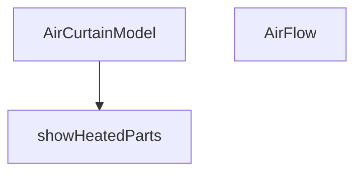

## Genel Bakış
Bu modül, hava perdesi ürünlerinin 3B görselleştirmesi için React bileşenleri sunar. Ana bileşen, ısıtma ve akış özelliklerine göre iç bileşenleri koşullu olarak render eder.

## Fonksiyon Grupları
### 3B Model Bileşenleri
Hava perdesi ürününün üç boyutlu modelini oluşturur ve alt bileşenlerini düzenler.
- AirCurtainModel, AirFlow

### Koşullu Gösterim Yardımcıları
Isıtma parçalarının render edilip edilmeyeceğini belirleyerek bileşenin duruma duyarlı olmasını sağlar.
- showHeatedParts

---

## AXIOMS – Mimari Varsayımlar

Bu modül, hava perdesi 3B modelinin ısıtma ve akış özelliklerinin koşullu gösterimini yöneten React bileşenlerinden oluşur.

[Aksiyom 1]: Eğer `isHeated` parametresi `true` değerini almazsa, ısıtma ile ilgili 3B parçalar (heated parts) gösterilmez.

[Aksiyom 2]: Eğer `showMixed` parametresi `true` değerini almazsa, karışık akış gösterimi devre dışı kalır.

[Aksiyom 3]: Eğer `isHeated` değeri `true` ise, `showHeatedParts()` fonksiyonu çağrılarak ısıtma bölgelerinin görünürlüğü aktive edilir.

[Aksiyom 4]: `AirCurtainModel` bileşeni varsayılan olarak (`isHeated = false`, `showMixed = false`) ısıtmalı ve karışık akış gösterimi kapalı bir durumda başlatılır.

[Aksiyom 5]: `AirFlow` bileşeni, `isHeated` ve `showMixed` değerlerine doğrudan bağımlıdır; her iki parametre de `boolean` tipinde olmalıdır.

[Aksiyom 6]: Eğer `showHeatedParts()` parametresiz olarak çağrılıyorsa, ısıtma parçalarının gösterilip gösterilmeyeceğine dair karar mekanizması (isHeated kontrolü) `AirCurtainModel` içinde gerçekleştirilir.

---

## FONKSİYON DETAYLARI

### AirCurtainModel
**Ne yapar**: AirCurtainModel, verilen `isHeated` ve `showMixed` özelliklerine göre bir havalama perdesi modelinin görsel temsili oluşturur.  
**Nasıl yapar**: Props olarak alınan bayrakları okur; `isHeated` true ise ısıtma elemanlarını, `showMixed` true ise karışık akım gösterimini render eder, aksi takdirde bu bölümleri gizler veya varsayılan görünümü gösterir.  
**Parametreler**:  
- isHeated: boolean — Modelin ısıtma bölümünün gösterilip gösterilmeyeceğini belirler; varsayılan değer false.  
- showMixed: boolean — Karışık akım görselleştirmesinin etkin olup olmayacağını belirler; varsayılan değer false.  
**Dönüş**: Bileşen bir JSX elementi döndürür; explicit bir dönüş tipi belirtilmediği için void veya React elementi olarak kabul edilebilir.

### AirFlow
**Ne yapar**: AirFlow, `isHeated` ve `showMixed` bayraklarına dayalı olarak havalama perdesi üzerindeki akım durumunu görselleştirir.  
**Nasıl yapar**: Bileşen, aldığı iki boolean değeri kontrol ederek ısıtma ve karışık akım bölümlerinin görünürlüğünü ayarlar; bu bayraklar true olduğunda ilgili grafik veya simge render edilir, false olduğunda gizlenir.  
**Parametreler**:  
- isHeated: boolean — Isıtma akımının gösterilip gösterilmeyeceğini belirler.  
- showMixed: boolean — Karışık akımın gösterilip gösterilmeyeceğini belirler.  
**Dönüş**: Bileşen bir JSX elementi döndürür; dönüş tipi açıkça belirtilmediği için void veya React elementi olarak düşünülebilir.

### showHeatedParts
**Ne yapar**: showHeatedParts, havalama perdesi modelinin ısıtma bölümlerinin gösterilip gösterilmeyeceğini belirleyen bir sabit değer döndürür.  
**Nasıl yapar**: Fonksiyon her çağrıldığında doğrudan `true` değerini döndürür; bu, ısıtma bölümlerinin her zaman gösterilmesi gerektiğini gösterir.  
**Parametreler**: Fonksiyon hiçbir parametre almaz.  
**Dönüş**: Boolean türünde `true` değeri döndürür.

---

## INTERFACES

### AirCurtainModelProps
- `isHeated?: boolean`
- `showMixed?: boolean`

---

## AST POINTERS

### [N1_NASIL] AST Pointer: AirCurtainModel.tsx::AirCurtainModel
- **params**: `{ isHeated = false, showMixed = false }` — `isHeated`: ısıtıcı modunun aktif olup olmadığını belirtir (varsayılan false); `showMixed`: karışık (sıcak/soğuk) akış modunu gösterir (varsayılan false)
- **ic_degiskenler**:
  - `drumRef` — useRef ile tutulan THREE.Group referansı, iç tambur fanın X ekseni etrafında döndürülmesi için kullanılır
  - `materials` — useFanMaterials() hook'undan dönen material nesnesi; matteBlack, industrialSteel, safetyOrange gibi malzemeleri içerir
- **Dönüş**: JSX (React elementi) — Hava perdesi (Air Curtain) 3D modelini render eder; yan etki olarak `drumRef` referansı üzerinden her frame'de tambur rotasyonunu animasyonlar

### [N2_NASIL] AST Pointer: AirCurtainModel.tsx::AirFlow
- **params**: `{ isHeated, showMixed }` — `isHeated`: ısıtıcılı model ise true, sıcak renkli akış gösterir; `showMixed`: karma mod ise her 3. dilimi sıcak yapar
- **ic_degiskenler**:
  - `meshRefs` — useRef ile tutulan THREE.Mesh referansları dizisi (28 adet dilim mesh'ini tutar)
  - `SLICE_COUNT` — sabit: 28, yatay dilim sayısı
  - `CURTAIN_WIDTH` — sabit: 2.32, perde genişliği (cihaz genişliğiyle eşleşir)
  - `CURTAIN_HEIGHT` — sabit: 1.6, toplam akış mesafesi
  - `SLICE_HEIGHT` — sabit: her bir dilimin yüksekliği (CURTAIN_HEIGHT / SLICE_COUNT * 1.05 ile hafif overlap)
  - `MAX_OPACITY` — sabit: 0.32, üst dilimlerdeki maksimum opaklık
  - `WAVE_SPEED` — sabit: 2.5, dalga hızı (aşağı doğru hareket)
  - `WAVE_INTENSITY` — sabit: 0.12, dalga genliği
  - `slices` — useMemo ile hesaplanan dilim verileri dizisi; her eleman `{ yPos, baseOpacity, type }` içerir (yPos: dikey pozisyon, baseOpacity: gradyan opaklık, type: 0=soğuk/1=sıcak)
  - `timeRef` — useRef ile tutulan akümülatör zaman değeri, her frame'de delta eklenerek güncellenir
  - `hotColor` — THREE.Color nesnesi: "#fb923c" (sıcak turuncu)
  - `coldColor` — THREE.Color nesnesi: "#38bdf8" (soğuk mavi)
- **Dönüş**: JSX (React elementi) — Animasyonlu hava akışı simülasyonunu render eder; useFrame ile her frame'de dilimlerin opaklığını sinüsoidal dalga ile, pozisyonunu yatay titreşimle günceller

### [N3_NASIL] AST Pointer: AirCurtainModel.tsx::showHeatedParts
- **params**: (yok)
- **ic_degiskenler**: (yok)
- **Dönüş**: `true` — Her zaman true döner; ısıtıcı batarya bölümünün görünür olmasını sağlar (audit/mixed mod amaçlı)

---

## MERMAID CALL GRAPH

## NODE ID STANDARD

  file: src\components\products\3d\types\AirCurtainModel.tsx
  function: src\components\products\3d\types\AirCurtainModel.tsx::AirCurtainModel
  function: src\components\products\3d\types\AirCurtainModel.tsx::AirFlow
  function: src\components\products\3d\types\AirCurtainModel.tsx::showHeatedParts

---

## DISA AKTARILANLAR (EXPORTS)
  export: AirCurtainModel
  export: AirCurtainModelProps
  export: AirFlow
  export: showHeatedParts

---

## STİL TOKENLERİ

### Arbitrary Değerler (token'a geçirilmemiş)
Yok — tüm stiller token'a geçirilmiş. ✅

### Kullanılan Token'lar (zaten token'a geçirilmiş)
- (yok)

### Tailwind Sınıf Özeti
- **Renkler:** `bg-blue-600`, `bg-white`, `border-blue-200`, `text-primary-navy`, `text-xs`
- **Layout:** `flex`, `gap-1`, `h-2`, `items-center`, `shadow-inner`, `w-2`
- **Varyant/Responsive:** (yok)
- **Yardımcı Sınıflar:** `border`, `font-black`, `pointer-events-none`, `px-2`, `py-0.5`, `rounded-full`, `rounded-sm`, `select-none`, `tracking-tighter`