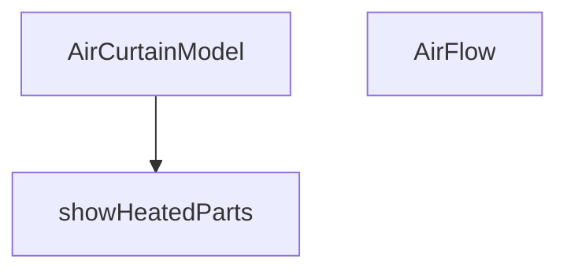

## Genel Bakış
Bu modül, VentHub hava perdesi ürünlerinin Three.js tabanlı 3B görselleştirmesini sağlayan React bileşenlerini içerir. Fiziksel cihazın ana gövde, yan kapaklar, arka panel, tambur fan, üfleme ızgarası, IR sensör ve kontrol paneli gibi bileşenlerini sahneye yerleştirir. `isHeated` ve `showMixed` prop'larına bağlı olarak ısıtıcılı/ısıtıcısız ve karışık akış senaryolarına göre model içeriğini koşullu olarak render eder.

## Fonksiyon Grupları
### 3B Model Bileşenleri
Hava perdesinin üç boyutlu modelini ve hava akışı görselleştirmesini oluşturarak ana görselleştirme yapısını kurar. `AirCurtainModel` ana bileşendir ve `AirFlow` bileşenini kendi içinde kullanarak akış görselleştirmesini sahneye dahil eder.
- AirCurtainModel, AirFlow

### Koşullu Gösterim Yardımcıları
Isıtma ile ilgili 3B parçaların (örneğin ısıtıcı batarya) render edilip edilmeyeceğini belirleyerek bileşenin prop değerlerine duyarlı olmasını sağlar. `AirCurtainModel` tarafından çağrılarak ısıtmalı bölgelerin görünürlüğünü kontrol eder.
- showHeatedParts

---

## AXIOMS – Mimari Varsayımlar

Bu modül, hava perdesi 3B modelinin ısıtma ve akış durumuna göre koşullu render edilmesini varsayar.

[Aksiyom 1]: Eğer `isHeated` parametresi `AirCurtainModel` bileşenine

---

## FONKSİYON DETAYLARI

### AirCurtainModel
**Ne yapar**: VentHub marka hava perdesi (air curtain) cihazının 3D modelini oluşturur. Isıtıcılı ve karma mod seçeneklerini destekleyen bu bileşen, cihazın gövdesini, iç tambur fanını, ısıtıcı bataryasını, üfleme ızgarasını ve IR sensör panelini render eder.

**Nasıl yapar**: Bileşen, `useRef` ile iç tambur fanının referansını tutar ve `useFrame` kancasıyla her karede fanın X ekseni etrafında dönmesini sağlar. `useResolveMaterials` kancasıyla paylaşılan materyalleri alır. `useMemo` ile tüm geometri nesnelerini (kutu, silindir, düzlem vb.) ve özel LED/IR pencere materyallerini oluşturur; bu sayede VRAM sızıntıları önlenir. `useEffect` kancaları bileşen unmount edildiğinde tüm geometri ve materyallerin `dispose()` ile temizlenmesini sağlar. Model; ana gövde, VentHub marka etiketi (HTML tabanlı), yan kapaklar, arka panel, üst panel, 18 adet tambur halkasından oluşan iç fan, 8 adet ısıtıcı bobin, 7 adet ızgara parçası ve IR sensör panelinden oluşur. Isıtıcı bobinlerin görünürlüğü `isHeated` veya `showHeatedParts()` koşullarına bağlıdır. IR LED'in rengi `isHeated` durumuna göre sıcak (turuncu) veya soğuk (yeşil) olarak değişir. Üfleme ızgarasının altında `AirFlow` alt bileşeni yer alır.

**Parametreler**:
- isHeated: boolean — Hava perdesinin ısıtıcılı modda olup olmadığını belirtir. Varsayılan değeri `false`'dur. Isıtıcı bobinlerin ve IR LED'in görünümünü kontrol eder.
- showMixed: boolean — Karma (mixed) hava akışı modunun gösterilip gösterilmeyeceğini belirtir. Varsayılan değeri `false`'dur. `AirFlow` alt bileşenine iletilir.

**Dönüş**: JSX elementi döndürür (React Three Fiber `<group>` yapısı). Kesin dönüş tipi kaynakta belirtilmemiştir.

### AirFlow
**Ne yapar**: Havaperdesinden çıkan hava akışını görsel olarak simüle eden animasyonlu bir 2D katmanlar (dilimler) serisi oluşturur. Dilimlerin renkleri, opaklıkları ve dalgalı hareketleri, cihazın çalışma moduna (ısıtmalı, soğuk veya karışık) göre dinamik olarak değişir.

**Nasıl yapar**: Belirli sayıda (SLICE_COUNT) yatay planeGeometry dilimi oluşturur. Her dilimin başlangıç opaklık değeri, dikey pozisyonuna göre bir gradient (üstte yoğun, altta sönük) ile ayarlanır. `isHeated` ve `showMixed` prop'larına göre her dilime bir "tip" (sıcak veya soğuk) atanır. useFrame her karede tüm dilimlerin malzemesini günceller: sinüs dalga fonksiyonu ile opaklıkta dalgalanma ve hafif yatay titreşim ekleyerek gerçekçi bir akış hissi yaratır.

**Parametreler**:
- isHeated: boolean — Hava akışının tamamının sıcak (turuncu) olup olmadığını belirtir. true ise tüm dilimler turuncu; false ise mavi olur.
- showMixed: boolean — Hava akışının "karışık" modda olup olmadığını belirtir. true ise dilimler periyodik olarak sıcak ve soğuk renkler arasında alternatifler.

**Dönüş**: JSX Element — 3D sahne içinde yerleştirilecek, animasyonlu ve saydam planeGeometry dilimlerinden oluşan bir hava perdesi görseli döndürür.

### showHeatedParts
**Ne yapar**: showHeatedParts, havalama perdesi modelinin ısıtma bölümlerinin gösterilip gösterilmeyeceğini belirleyen bir sabit değer döndürür.  
**Nasıl yapar**: Fonksiyon her çağrıldığında doğrudan `true` değerini döndürür; bu, ısıtma bölümlerinin her zaman gösterilmesi gerektiğini gösterir.  
**Parametreler**: Fonksiyon hiçbir parametre almaz.  
**Dönüş**: Boolean türünde `true` değeri döndürür.

---

## İTHALATLAR (IMPORTS)
- import: ../core::useResolveMaterials
- import: @react-three/drei::Html
- import: @react-three/fiber::useFrame
- import: react::React
- import: react::useEffect
- import: react::useMemo
- import: react::useRef
- import: three::type { Group, Mesh }

---

## INTERFACES

### AirCurtainModelProps
- `isHeated?: boolean`
- `showMixed?: boolean`

---

## SABİTLER
- **HOT_COLOR** (new_expression) — `new Color("#fb923c")`
- **COLD_COLOR** (new_expression) — `new Color("#38bdf8")`
- **SLICE_HEIGHT** (binary_expression) — `CURTAIN_HEIGHT / SLICE_COUNT * 1.05`

---

## AST POINTERS

### [N1_NASIL] AST Pointer: AirCurtainModel.tsx::AirCurtainModel
- **params**: `isHeated` (boolean, varsayılan: false), `showMixed` (boolean, varsayılan: false)
- **ic_degiskenler**:
  - `drumRef` — useRef<Group>(null), iç tambur fanın (Cross-Flow) X ekseni etrafında döndürülmesi için Three.js Group referansı
  - `materials` — useResolveMaterials() çağrısıyla elde edilen materyal çözümleri (matteBlack, industrialSteel, safetyOrange vb.)
  - `geometries` — useMemo ile memoize edilen geometri nesnesi; VRAM sızıntısını önlemek için oluşturulur. İçerik: bodyGeo (BoxGeometry), labelBgGeo (BoxGeometry), labelPlaneGeo (PlaneGeometry), sidePanelGeo (BoxGeometry), rearPanelGeo (BoxGeometry), topPanelGeo (BoxGeometry), drumShaftGeo (CylinderGeometry), drumRingGeo (CylinderGeometry), heatingCoilGeo (BoxGeometry), grilleBaseGeo (BoxGeometry), grillePieceGeo (BoxGeometry), irPanelGeo (BoxGeometry), irLedGeo (CircleGeometry), irWindowGeo (PlaneGeometry)
  - `ledHotMat` — useMemo ile oluşturulan MeshBasicMaterial, renk: "#f97316" (sıcak durum LED'i)
  - `ledColdMat` — useMemo ile oluşturulan MeshBasicMaterial, renk: "#22c55e" (soğuk durum LED'i)
  - `irWindowMat` — useMemo ile oluşturulan MeshBasicMaterial, renk: "#1a1a1a" (IR pencere materyali)
  - `state` — useFrame callback parametresi, Three.js render state bilgisi
  - `delta` — useFrame callback parametresi, kareler arası geçen süre (saniye); drumRef.current.rotation.x -= delta * 12 hesabında kullanılır
  - `geo` — Object.values(geometries).forEach döngüsünde her bir geometri; unmount'ta geo.dispose() ile temizlenir
  - `x` — [-1.23, 1.23] dizisinden gelen yan kapak X pozisyonu
  - `i` — map döngü indeksi (yan kapaklar, tambur halkaları, ısıtıcı bobinler, ızgara parçaları)
  - `z` — [-0.09, -0.06, -0.03, 0, 0.03, 0.06, 0.09] dizisinden gelen ızgara parçası Z pozisyonu
- **Dönüş**: JSX elementi (group) — scale [0.8, 0.8, 0.8], rotation [0, -Math.PI/2, 0]

### [N2_NASIL] AST Pointer: AirCurtainModel.tsx::AirFlow
- **params**: `isHeated` (boolean), `showMixed` (boolean)
- **ic_degiskenler**:
  - `meshRefs` — useRef<(Mesh | null)[]>([]), her dilim mesh'ine referans tutar; useFrame içinde mesh.position.x ayarlamasında kullanılır
  - `slices` — useMemo ile oluşturulan dilim verileri dizisi; her eleman: yPos (y pozisyonu, üstten aşağı -t * CURTAIN_HEIGHT), baseOpacity (üstte yoğun altta sönük gradient), type (1=sıcak, 0=soğuk). showMixed true ise her 3 dilimde bir type=1, değilse isHeated'e bağlı
  - `t` — normalize konum (0=en üst, 1=en alt), hesaplama: i / (SLICE_COUNT - 1)
  - `type` — dilim sıcaklık tipi (0 veya 1); showMixed true ise i % 3 === 0 kontrolüyle, değilse isHeated'e göre belirlenir
  - `planeGeo` — useMemo ile oluşturulan PlaneGeometry(CURTAIN_WIDTH, SLICE_HEIGHT); tüm dilimlerde ortak kullanılır
  - `materialsArray` — useMemo ile oluşturulan MeshBasicMaterial dizisi; her materyal: color (HOT_COLOR veya COLD_COLOR), transparent: true, opacity: 0, side: DoubleSide, blending: AdditiveBlending, depthWrite: false
  - `s` — slices[i] referansı; s.type ile renk seçimi, s.baseOpacity ile dalga opaklık hesabında kullanılır
  - `materialsRef` — useRef<MeshBasicMaterial[]>([]), materialsArray güncel değerini tutar; useFrame içinde mat.opacity ayarlamasında kullanılır
  - `timeRef` — useRef(0), kümülatif zaman takibi; useFrame her karede timeRef.current += delta yapar
  - `state` — useFrame callback parametresi
  - `delta` — useFrame callback parametresi, kareler arası geçen süre
  - `time` — timeRef.current değeri, dalga ve titreşim hesaplamalarında kullanılır
  - `mesh` — meshRefs.current[i], her dilim mesh referansı; yoksa return ile atlanır
  - `mat` — materialsRef.current[i], her dilim materyali; yoksa return ile atlanır
  - `wave` — Math.sin(time * WAVE_SPEED - t * Math.PI * 3) * WAVE_INTENSITY, sinüsoidal dalga pulse değeri
  - `el` — ref callback parametresi; meshRefs.current[i] = el ataması yapar
- **Dönüş**: JSX elementi (group) — position [0, -0.04, 0], içinde SLICE_COUNT adet mesh

### [N3_NASIL] AST Pointer: AirCurtainModel.tsx::showHeatedParts
- **params**: (parametre yok)
- **ic_degiskenler**: (iç değişken yok)
- **Dönüş**: true (boolean) — Audit amaçlı veya mixed modda ısıtıcı bataryayı göstermek için sabit true döndürür

---

## MERMAID CALL GRAPH

## NODE ID STANDARD

  file: src\components\products\3d\types\AirCurtainModel.tsx
  function: src\components\products\3d\types\AirCurtainModel.tsx::AirCurtainModel
  function: src\components\products\3d\types\AirCurtainModel.tsx::AirFlow
  function: src\components\products\3d\types\AirCurtainModel.tsx::showHeatedParts

---

## DISA AKTARILANLAR (EXPORTS)
  export: AirCurtainModel
  export: AirCurtainModelProps
  export: AirFlow
  export: showHeatedParts

---

## STİL TOKENLERİ

### Arbitrary Değerler (token'a geçirilmemiş)
Yok — tüm stiller token'a geçirilmiş. ✅

### Kullanılan Token'lar (zaten token'a geçirilmiş)
- (yok)

### Tailwind Sınıf Özeti
- **Renkler:** `bg-blue-600`, `bg-white`, `border-blue-200`, `text-primary-navy`, `text-xs`
- **Layout:** `flex`, `gap-1`, `h-2`, `items-center`, `shadow-inner`, `w-2`
- **Varyant/Responsive:** (yok)
- **Yardımcı Sınıflar:** `border`, `font-black`, `pointer-events-none`, `px-2`, `py-0.5`, `rounded-full`, `rounded-sm`, `select-none`, `tracking-tighter`