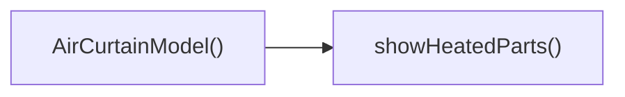

## Genel Bakış
Bu modül, hava perdeleri gibi 3B ürün modellerini görselleştirmek için React bileşenleri ve yardımcı bir fonksiyon içerir. Ana bileşen `AirCurtainModel`, kullanıcı seçeneklerine göre akış ve ısıtma parçalarını gösteren `AirFlow` bileşenini düzenler ve gerektiğinde `showHeatedParts` fonksiyonunu çağırarak ısıtma bölümlerinin görünürlüğünü kontrol eder.

## Fonksiyon Grupları
### Ana Görüntüleme Bileşenleri
Kullanıcı arayüzünde 3B modelin temel yapısını oluşturur ve özelliklere göre iç içe bileşenleri yerleştirir.
- AirCurtainModel, AirFlow

### Görselleştirme Yardımcı Fonksiyonu
Isıtma parçalarının gösterilip gösterilmeyeceğine karar vererek görsel çıktıyı dinamik olarak ayarlar.
- showHeatedParts

---

## AXIOMS – Mimari Varsayımlar
Modülün doğru çalışması için aşağıdaki varsayımlar gerekir.

[Aksiyom 1]: Eğer AirCurtainModel component'ına **isHeated** prop'u yoksa, varsayılan **false** değeri kullanılır ve ısıtma parçaları gösterilmez.  
[Aksiyom 2]: Eğer AirCurtainModel component'ına **showMixed** prop'u yoksa, varsayılan **false** değeri kullanılır ve karışım akımı gösterilmez.  
[Aksiyom 3]: Eğer AirFlow component'ına **isHeated** veya **showMixed** prop'larından biri yoksa, TypeScript derleme hatası oluşur ve component render edilemez.  
[Aksiyom 4]: Eğer **isHeated** false olduğunda **showHeatedParts()** fonksiyonu çağrılırsa, ısıtma parçaları görsel olarak gösterilmez (fonksiyon etkisiz olur).

---

## FONKSIYON DETAYLARI

### AirCurtainModel
**Ne yapar**: AirCurtainModel, verilen `isHeated` ve `showMixed` özelliklerine göre bir havalama perdesi modelinin görsel temsili oluşturur.  
**Nasıl yapar**: Props olarak alınan bayrakları okur; `isHeated` true ise ısıtma elemanlarını, `showMixed` true ise karışık akım gösterimini render eder, aksi takdirde bu bölümleri gizler veya varsayılan görünümü gösterir.  
**Parametreler**:  
- isHeated: boolean — Modelin ısıtma bölümünün gösterilip gösterilmeyeceğini belirler; varsayılan değer false.  
- showMixed: boolean — Karışık akım görselleştirmesinin etkin olup olmayacağını belirler; varsayılan değer false.  
**Dönüş**: Bileşen bir JSX elementi döndürür; explicit bir dönüş tipi belirtilmediği için void veya React elementi olarak kabul edilebilir.

### AirFlow
**Ne yapar**: AirFlow, `isHeated` ve `showMixed` bayraklarına dayalı olarak havalama perdesi üzerindeki akım durumunu görselleştirir.  
**Nasıl yapar**: Bileşen, aldığı iki boolean değeri kontrol ederek ısıtma ve karışık akım bölümlerinin görünürlüğünü ayarlar; bu bayraklar true olduğunda ilgili grafik veya simge render edilir, false olduğunda gizlenir.  
**Parametreler**:  
- isHeated: boolean — Isıtma akımının gösterilip gösterilmeyeceğini belirler.  
- showMixed: boolean — Karışık akımın gösterilip gösterilmeyeceğini belirler.  
**Dönüş**: Bileşen bir JSX elementi döndürür; dönüş tipi açıkça belirtilmediği için void veya React elementi olarak düşünülebilir.

### showHeatedParts
**Ne yapar**: showHeatedParts, havalama perdesi modelinin ısıtma bölümlerinin gösterilip gösterilmeyeceğini belirleyen bir sabit değer döndürür.  
**Nasıl yapar**: Fonksiyon her çağrıldığında doğrudan `true` değerini döndürür; bu, ısıtma bölümlerinin her zaman gösterilmesi gerektiğini gösterir.  
**Parametreler**: Fonksiyon hiçbir parametre almaz.  
**Dönüş**: Boolean türünde `true` değeri döndürür.

---

## INTERFACES

### AirCurtainModelProps
- `isHeated?: boolean`
- `showMixed?: boolean`

---

## AST POINTERS

### [N1_NASIL] AST Pointer: src/components/products/3d/types/AirCurtainModel.tsx::AirCurtainModel
- **params**: { isHeated?: boolean, showMixed?: boolean } (varsayılan değerler: isHeated=false, showMixed=false)
- **ic_degiskenler**:
  - `drumRef` — useRef<THREE.Group> ile oluşturulmuş referans, içindeki iç tambur fan 3D grubunu referanslar, useFrame callback'i içinde X ekseni rotasyonunu güncellemek için kullanılır
  - `materials` — useFanMaterials() hook'undan dönen malzeme nesnesi, tüm 3D mesh'lerin yüzey materyallerini atamak için kullanılır (matteBlack, industrialSteel, safetyOrange tipleri içerir)
  - `state` — useFrame callback'ine gelen Three.js sahne durumu nesnesi
  - `delta` — useFrame callback'ine gelen frame arası süre farkı, animasyonların ekran güncelleme hızına bağımsız çalışması için kullanılır
  - `x` — yan kapaklar map fonksiyonunda gelen X pozisyonu değeri, her yan kapağın yatay konumunu ayarlar
  - `i` — yan kapaklar map fonksiyonunda gelen index değeri, React listelerinde benzersiz key olarak kullanılır
  - `_` — tambur halkaları map fonksiyonunda gelen kullanılmayan dizi elemanı, sadece index almak için kullanılır
  - `i` — tambur halkaları map fonksiyonunda gelen index değeri, key olarak ve X konumu hesaplamasında kullanılır
  - `_` — ısıtıcı batarya dilimleri map fonksiyonunda gelen kullanılmayan dizi elemanı
  - `i` — ısıtıcı batarya dilimleri map fonksiyonunda gelen index değeri, key olarak ve Y konumu hesaplamasında kullanılır
  - `z` — ızgara çubukları map fonksiyonunda gelen Z pozisyonu değeri, her çubuğun derinlik konumunu ayarlar
  - `i` — ızgara çubukları map fonksiyonunda gelen index değeri, key olarak kullanılır
- **Dönüş**: Three.js JSX grubu, hava perdesi 3D modelini sahneye ekler

### [N2_NASIL] AST Pointer: src/components/products/3d/types/AirCurtainModel.tsx::AirFlow
- **params**: { isHeated: boolean, showMixed: boolean }
- **ic_degiskenler**:
  - `meshRefs` — useRef<(THREE.Mesh | null)[]> ile oluşturulmuş referans, tüm hava akışı dilimlerinin mesh referanslarını dizide tutar, animasyon sırasında her frame'de konum ve opacity güncellemek için kullanılır
  - `SLICE_COUNT` — Sabit değer, hava akışını oluşturan yatay dilim sayısı
  - `CURTAIN_WIDTH` — Sabit değer, hava perdesinin genişliği, ana cihaz genişliğiyle eşleşir
  - `CURTAIN_HEIGHT` — Sabit değer, hava akışının toplam dikey mesafesi
  - `SLICE_HEIGHT` — Sabit değer, her bir hava diliminin yüksekliği, dilimler arası hafif örtüşme için ayarlanmıştır
  - `MAX_OPACITY` — Sabit değer, en üstteki hava diliminin ulaşabileceği maksimum şeffaflık değeri
  - `WAVE_SPEED` — Sabit değer, hava akışındaki dalga hareketinin hızı
  - `WAVE_INTENSITY` — Sabit değer, hava akışındaki dalganın genliği (yükseklik değişimi miktarı)
  - `slices` — useMemo ile oluşturulmuş dizi, her hava diliminin Y konumu, temel opacity'si ve hava tipi (sıcak/soğuk) bilgilerini içerir, isHeated ve showMixed değiştiğinde yeniden hesaplanır
  - `timeRef` — useRef<number> ile oluşturulmuş referans, animasyonun başından beri geçen toplam süreyi tutar, zaman bazlı dalga hesaplamaları için kullanılır
  - `state` — useFrame callback'ine gelen Three.js sahne durumu nesnesi
  - `delta` — useFrame callback'ine gelen frame arası süre farkı, animasyon akıcılığı için kullanılır
  - `time` — animasyonda geçen toplam süre, timeRef.current'dan alınır, dalga hesaplamalarında kullanılır
  - `s` — slices.forEach callback'ine gelen mevcut dilim verisi nesnesi
  - `i` — slices.forEach callback'ine gelen mevcut dilim index değeri, meshRefs'ten ilgili mesh'i almak ve konum hesaplamalarında kullanılır
  - `mesh` — mevcut dilimin 3D mesh nesnesi, meshRefs.current[i]'den alınır, konumunu güncellemek için kullanılır
  - `mat` — mevcut mesh'in materyali, opacity değerini güncellemek için kullanılır
  - `hotColor` — THREE.Color nesnesi, sıcak hava akışı için kullanılan turuncu renk değeri
  - `coldColor` — THREE.Color nesnesi, soğuk hava akışı için kullanılan mavi renk değeri
  - `el` — slices.map callback'ine gelen mesh elemanı, meshRefs dizisine atanarak referans kaydedilir
- **Dönüş**: Three.js JSX grubu, dinamik hava akışı animasyonunu ana modelin altına ekler

### [N3_NASIL] AST Pointer: src/components/products/3d/types/AirCurtainModel.tsx::showHeatedParts
- **params**: (parametre yok)
- **ic_degiskenler**: (yok)
- **Dönüş**: boolean (her zaman true, ısıtıcı bataryanın görünürlüğünü kontrol etmek için kullanılır)

---

## ÇAĞRI HARİTASI

### Disariya Cagrilar (Outgoing)
- **AirCurtainModel()** fonksiyonu, ısıtma parçalarını göstermek için **showHeatedParts** fonksiyonunu çağırır.

### Disaridan Cagrilanlar (Incoming)
- Belirtilen veri setinde bu modülü çağıran dış bir fonksiyon veya modül bulunmamaktadır.

### Ic Ice Fonksiyonlar (Nested)
- Yok

---

## DOSYA-İÇİ ÇAĞRI GRAFİĞİ
  AirCurtainModel() → showHeatedParts()

---

## NODE ID STANDARD

  file: src\components\products\3d\types\AirCurtainModel.tsx
  function: src\components\products\3d\types\AirCurtainModel.tsx::AirCurtainModel
  function: src\components\products\3d\types\AirCurtainModel.tsx::AirFlow
  function: src\components\products\3d\types\AirCurtainModel.tsx::showHeatedParts

---

## DISA AKTARILANLAR (EXPORTS)
  export: AirCurtainModel
  export: AirCurtainModelProps
  export: AirFlow
  export: showHeatedParts