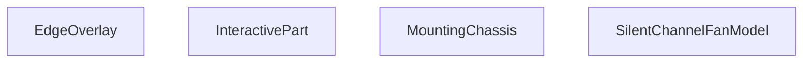

## Genel Bakış
Bu modül, sessiz kanal fanları için interaktif bir 3D React bileşenidir. Ana sorumluluğu, fanın tüm bileşenlerini (gövde, şasi, kenarlıklar vb.) Three.js geometrileriyle bir araya getirmek, bu parçaların görünümünü (patlama, gizleme, izole etme) ve kullanıcı etkileşimlerini (tıklama, üzerine gelme) yönetmektir.

## Fonksiyon Grupları
### Ana Model Orkestratörü
Tüm fan modelinin üst düzey bileşenidir. Alt parçaları, gelen parametreleri (patlama mesafesi, seçili parça, gizli parçalar) ve etkileşim olaylarını birleştirerek nihai 3D view'u render eder.
- SilentChannelFanModel

### Etkileşim Yöneticisi
3D model parçalarının kullanıcı etkileşimlerini (tıklama, üzerine gelme) soyutlayan ve yöneten bir sarmalayıcı bileşendir. Ayrıca parçaların gizlenmesi veya izole edilmesi mantığını uygular.
- InteractivePart

### Yapısal ve Dekoratif 3D Parçalar
Fanın fiziksel yapısını oluşturan, belirli geometrik parametrelerle (boy, çap, yarıçap) ve malzemelerle tanımlanan alt 3D bileşenleridir. Her biri modelin belirli bir bölümünü render eder.
- MountingChassis (montaj şasesi)
- EdgeOverlay (kenar kaplaması)

---

## AXIOMS – Mimari Varsayımlar

Bu modül, Three.js tabanlı bir 3D fan modelinin parçalarını orkestre eden bir React bileşen ağıdır. Aşağıdaki varsayımlar fonksiyon imzalarından türetilmiştir.

[Aksiyom 1]: Eğer `EdgeOverlay` bileşeni `displayStyle` parametresi olmadan çağrılırsa, bileşen render sırasında hata verir (zorunlu string parametre, default değer yoktur).

[Aksiyom 2]: Eğer `MountingChassis` bileşeni `bodyHalfLen`, `neckLen`, `neckRad` veya `bRad` parametrelerinden herhangi biri olmadan çağrılırsa, Three.js geometri hesaplamaları geçersiz boyutlarla çalışır veya hata oluşur (dört parametre de zorunlu number, default değerleri yoktur).

[Aksiyom 3]: Eğer `SilentChannelFanModel` çağrılırken `explode` parametresi verilmezse, değer `0` olarak kabul edilir ve parçalar arası patlama mesafesi sıfırdır (default: `0`).

[Aksiyom 4]: Eğer `SilentChannelFanModel` çağrılırken `hiddenParts` parametresi verilmezse, boş dizi `[]` olarak kabul edilir ve hiçbir parça gizli durumda başlar (default: `[]`).

[Aksiyom 5]: Eğer `InteractivePart` bileşeni `hiddenParts` veya `isolatedPart` parametreleri olmadan çağrılırsa, bu parçanın görünürlük ve izolasyon durumu üst bileşen tarafından belirlenmelidir; aksi takdirde parçanın görünürlüğü belirsiz kalır.

[Aksiyom 6]: Eğer `MountingChassis` bileşeni `material` parametresi geçerli bir `Material` tipi olmadan çağrılırsa, Three.js materyal oluşturma sırasında hata oluşur (zorunlu parametre, tipi `Material`).

[Aksiyom 7]: Eğer `SilentChannelFanModel` bileşenine `selectedPart` veya `isolatedPart` olarak `MountingChassis` veya `EdgeOverlay` bileşenlerinin tanınmayan bir ismi verilirse, ilgili parça vurgulanmaz veya izole edilmez.

---

## FONKSİYON DETAYLARI

### EdgeOverlay
**Ne yapar**: SilentChannelFanModel 3B sahnesinde kullanılan, kenar çizimlerini üst katman olarak render eden React bileşenidir. Sessiz kanal fanı modelinin geometrik kenarlarının belirtilen stilde gösterilmesini sağlar.
**Nasıl yapar**: Aldığı görsel stil parametresini kullanarak Three.js tabanlı 3B sahnede kenar öğelerini konumlandırır ve görsel özelliklerini ayarlar, modelin diğer katmanlarının üzerinde olacak şekilde üst katmanda render edilir.
**Parametreler**:
- name: displayStyle — type: string — Bileşenin kenarları hangi görsel stilde göstereceğini tanımlayan string değer, tüm 3B öğelerin görünüm kurallarıyla uyumlu çalışır.
**Dönüş**: Tipi belirtilmemiştir, void veya bilinmiyor olarak tanımlanmıştır.

### MountingChassis

**Ne yapar**: Fan montaj şasesini (chassis) 3B olarak oluşturur. Taban plakası, üzerindeki montaj yuvaları ve iki adet eğik üst yüzeyli dikey duvar elemanlarını içeren tam bir şase geometrisi üretir. Bu bileşen, sessiz kanatlı fan modelinin alt kısmına monte edilen yapısal destek parçasını temsil eder.

**Nasıl yapar**: Fonksiyon, verilen boyut parametrelerine dayanarak iki ana geometrik parça oluşturur. Öncelikle taban plakasını (baseShape) oluşturur: dikdörtgen bir plaka üzerine, iki adet yuvarlatılmış köşeli slot deliği (montaj vida yuvası) yerleştirir. Bu şekil `extrudeGeometry` ile verilen kalınlıkta 3B haline getirilir. İkinci olarak dikey duvar şeklini (wallShape) oluşturur: altı düz, üstü ise boyun (neck) yarıçapına uygun yarım daire formunda eğimli bir duvar profili çizilir ve aynı extrude işlemine tabi tutulur. Duvarlar, şase uzunluğu boyunca iki uçta simetrik olarak konumlandırılır; birinci duvar ön yüzde, ikinci duvar ise 180 derece döndürülmüş olarak arka yüzde yer alır. Tüm geometrik hesaplamalarda `useMemo` kullanılarak gereksiz yeniden hesaplamalar önlenir. Her bir `mesh` üzerine `EdgeOverlay` bileşeni eklenerek kenar çizimi (`displayStyle`) kontrolü sağlanır. Bileşen, `group` elemanlarının iç içe yerleştirilmesiyle `[0, -bRad, 0]` konumuna-ofset edilerek fan gövdesinin altına hizalanır.

**Parametreler**:
- `bodyHalfLen`: `number` — Fan gövdesinin yarım uzunluğu; şase taban plakasının toplam uzunluğunu hesaplamak için kullanılır. `(bodyHalfLen + neckLen) * 2` formülüyle taban uzunluğu belirlenir.
- `neckLen`: `number` — Boyun (neck) bölgesinin uzunluğu; hem taban plakasının toplam uzunluğuna hem de duvarların yerleştirildiği eksenel pozisyona (`wallZ`) ve duvar duvar yüksekliğinin konumlandırılmasına etki eder.
- `neckRad`: `number` — Boyun bölgesinin yarıçapı; duvar şeklinin üst kısmındaki yarım daire yayının (absarc) yarıçapı olarak kullanılır. Ayrıca şase genişliği `neckRad * 2.2` olarak hesaplanır ve duvar üst kenarının iç kenarı `neckRad * 0.99` olarak kısaltılır.
- `bRad`: `number` — Ana fan gövdesinin yarıçapı; dikey duvarların yüksekliğini (`bRad * 0.9`) belirler ve bileşenin dikey konum-ofsetinde (`-bRad`) referans olarak kullanılır.
- `material`: `Material` — Three.js material nesnesi; tüm mesh elemanlarına uygulanan yüzey malzemesini tanımlar. Renk, parlaklık, opaklık gibi görsel özellikleri belirler.
- `displayStyle`: `string` — Kenar çizimi gösterim stilini belirten dize değeri; her bir mesh elemanına eklenen `EdgeOverlay` bileşenine iletilir. Wireframe, solid veya outline gibi farklı görüntüleme modları için kullanılır.

**Dönüş**: JSX bileşeni döndürür — bir React Three Fiber `group` elemanı içinde taban plakası ve iki adet simetrik dikey duvar olmak üzere üç `mesh` elemanını barındıran 3B sahne düğümü. Doğrudan bir return tipi (`void` değil) olup, render edilebilir bir JSX yapısıdır.

### InteractivePart
**Ne yapar**: 3B fan modelinin herhangi bir parçasını kullanıcı etkileşimlerine açık hale getiren sarmalayıcı React bileşenidir. Parçalara tıklama, üzerine gelme gibi olayları yönetir, gizleme ve izole etme işlemlerini kontrol eder.
**Nasıl yapar**: İçerisine aldığı çocuk 3B öğelerini sarmalar, prop olarak aldığı gizli parça listesine göre istenmeyen öğelerin render edilmesini engeller, izole edilen parçayı sadece aktif olarak gösterir, kullanıcı etkileşimlerini aldığı geri çağırma fonksiyonları aracılığıyla üst bileşenlere iletir.
**Parametreler**:
- name: name — type: string — Etkileşimli parçanın benzersiz tanımlayıcı adı, diğer parçalardan ayırt edilmesini sağlar.
- name: children — type: React.ReactNode — Bileşenin içerisinde sarmalayacağı tüm içerik, genellikle 3B geometri öğelerinden oluşur.
- name: onPartClick — type: function — Parçaya kullanıcı tarafından tıklandığında tetiklenen geri çağırma fonksiyonu.
- name: onHover — type: function — Kullanıcının fare imlecini parça üzerine getirmesiyle tetiklenen geri çağırma fonksiyonu.
- name: hiddenParts — type: string[] — Gizlenmesi gereken tüm parça adlarını içeren dizi, listedeki öğeler render edilmez.
- name: isolatedPart — type: string — Sahnede sadece kendisinin gösterileceği izole edilmiş parça adı, tüm diğer parçaların görünürlüğünü kapatır.
**Dönüş**: React.FC<InteractivePartProps> türünde, etkileşimleri yönetilmiş içeriği render eden bir React bileşeni döndürür.

### SilentChannelFanModel

**Ne yapar**: Sessiz Kanal Fanı (Silent Channel Fan) ürününün interaktif 3D modelini render eder. Fanın tüm parçalarını (şasi, dış gövde, iç yalıtım, elektrik kutusu) geometrik olarak oluşturur ve kullanıcının parçaları seçmesine, izole etmesine, gizlemesine olanak tanır.

**Nasıl yapar**: React Three Fiber (R3F) kullanarak Three.js sahnesinde bileşen bazlı 3D modelleme yapar. `useFanMaterials()` hook'u ile malzeme materyallerini (matteBlack, jetOrange, vorticeGreen) merkezi olarak yönetir. Her parça `InteractivePart` bileşeni ile sarılarak tıklama, hover ve seçim işlevleri kazandırılır. `explode` parametresi parçaları birbirinden ayırarak "patlamış görünüm" (exploded view) oluşturur. Dış gövde için küre geometrisi, iç yalıtım için silindir geometrisi, kutu için `RoundedBox` kullanılır. `compensatoryStretch` hesaplaması ile küre kesitinin doğal yüksekliğine göre dikey ölçekleme yapılarak proporsiyonel görünüm korunur. `enableTooltip` aktif olduğunda, hover edilen parçanın adı `Html` bileşeni ile 3D sahne üzerine 2D overlay olarak gösterilir.

**Parametreler**:
- `explode`: `number` (varsayılan: `0`) — Parçaları birbirinden ayırma miktarı. 0 değerinde montaj konumunda, pozitif değerlerde parçalar dışarı doğru açılarak exploded view oluşturur.
- `onPartClick`: `(partName: string) => void` — Parçaya tıklandığında çağrılan geri çağırma fonksiyonu. Tıklanan parçanın adını üst bileşene iletir.
- `selectedPart`: `string | null` — Şu anda seçili olan parçanın adı. Seçili parça vurgulanmış olarak gösterilir.
- `isolatedPart`: `string | null` — İzole edilen parçanın adı. Belirtilen parça dışında diğerleri gizlenerek sadece o parça görüntülenir.
- `hiddenParts`: `string[]` (varsayılan: `[]`) — Gizlenmesi istenen parçaların adlarını içeren dizi. Bu listedeki parçalar render edilmez.
- `displayStyle`: `'shaded' | 'wireframe' | 'points'` (varsayılan: `'shaded'`) — 3D modelin görüntülenme stili. `'shaded'` dolu yüzey, `'wireframe'` tel kafes, `'points'` nokta bulutu gösterir.
- `enableTooltip`: `boolean` (varsayılan: `false`) — Hover durumunda parça adı tooltip'ini aktif eder.

**Dönüş**: `JSX.Element` — Three.js sahnesinde render edilecek React elementi. `<group>` içinde tüm fan parçalarını ve opsiyonel tooltip'i içerir.

---

## İTHALATLAR (IMPORTS)
- import: ../materials/useFanMaterials::useFanMaterials
- import: @react-three/drei::Edges
- import: @react-three/drei::Html
- import: @react-three/drei::RoundedBox
- import: @react-three/drei::Text
- import: @react-three/drei::useCursor
- import: react::React
- import: react::useMemo
- import: react::useState
- import: three::Path
- import: three::Shape
- import: three::type { Material }

---

## INTERFACES

### InteractivePartProps
- `name: string`
- `children: React.ReactNode`
- `onPartClick?: (partName: string) => void`
- `selectedPart?: string | null`
- `isolatedPart?: string | null`
- `hiddenParts?: string[]`
- `onHover?: (partName: string | null) => void`

### SilentChannelFanModelProps
- `explode?: number`
- `onPartClick?: (partName: string) => void`
- `selectedPart?: string | null`
- `isolatedPart?: string | null`
- `hiddenParts?: string[]`
- `displayStyle?: 'shaded' | 'shadedEdges' | 'wireframe' | 'hiddenLines'`
- `enableTooltip?: boolean`

---

## AST POINTERS

### [N1_NASIL] AST Pointer: types/SilentChannelFanModel.tsx::EdgeOverlay
- **params**: `displayStyle` — string, kenar çizimi gösterim modu ('shadedEdges' | 'hiddenLines')
- **ic_degiskenler**:
  - (parametre dışında değişken yok — doğrudan props kullanılır)
- **Dönüş**: `null` (koşul sağlanmazsa) veya `<Edges>` JSX bileşeni

---

### [N2_NASIL] AST Pointer: types/SilentChannelFanModel.tsx::MountingChassis
- **params**: `bodyHalfLen` (number), `neckLen` (number), `neckRad` (number), `bRad` (number), `material` (Material), `displayStyle` (string)
- **ic_degiskenler**:
  - `chassisWidth` — şasi genişliği, neckRad * 2.2
  - `chassisLen` — şasi uzunluğu, (bodyHalfLen + neckLen) * 2
  - `wallZ` — yan duvarların Z eksenindeki konumu, (chassisLen / 2) - neckLen * 0.8
  - `wallHeight` — yan duvar yüksekliği, bRad * 0.9
  - `baseThick` — tabla kalınlığı, 0.012
  - `wallThick` — duvar kalınlığı, 0.012
  - `baseExtrudeSettings` — useMemo ile memoize edilmiş tabla ekstrüzyon ayarları (depth, bevel parametreleri)
  - `baseShape` — useMemo ile memoize edilmiş tabla Shape nesnesi, slot delikleri dahil
  - `wallExtrudeSettings` — useMemo ile memoize edilmiş duvar ekstrüzyon ayarları
  - `wallShape` — useMemo ile memoize edilmiş yan duvar Shape nesnesi, üstü yaylı
- **Dönüş**: JSX — `<group>` içinde 2 adet duvar ve 1 adet tabla mesh'i (toplam 3 mesh + 3 EdgeOverlay)

---

### [N3_NASIL] AST Pointer: types/SilentChannelFanModel.tsx::MountingChassis → useMemo(baseShape) callback
- **params**: (yok — closure: `chassisWidth`, `chassisLen` dışarıdan erişilir)
- **ic_degiskenler**:
  - `s` — ana Shape nesnesi, dikdörtgen tabla kontürü
  - `w` — yarım genişlik, chassisWidth / 2
  - `l` — yarım uzunluk, chassisLen / 2
  - `slotW` — slot genişliği, 0.02
  - `slotL` — slot uzunluğu, chassisLen * 0.5
  - `slotR` — slot yarıçapı, slotW / 2
  - `xOff` — döngü değişkeni, slot merkez ofseti ([-w*0.6, w*0.6])
  - `hole` — Path nesnesi, her slot için yuvarlak köşeli delik
- **Dönüş**: Shape (s) — slot delikli tabla kontürü

---

### [N4_NASIL] AST Pointer: types/SilentChannelFanModel.tsx::MountingChassis → useMemo(wallShape) callback
- **params**: (yok — closure: `chassisWidth`, `wallHeight`, `neckRad` dışarıdan erişilir)
- **ic_degiskenler**:
  - `s` — ana Shape nesnesi, yan duvar kontürü
  - `w` — yarım genişlik, chassisWidth / 2
  - `h` — duvar yüksekliği, wallHeight
- **Dönüş**: Shape (s) — üstü yay (absarc ile yarım daire) olan yan duvar kontürü

---

### [N5_NASIL] AST Pointer: types/SilentChannelFanModel.tsx::InteractivePart
- **params**: `name` (string), `children` (ReactNode), `onPartClick` (fonksiyon|null), `onHover` (fonksiyon|null), `hiddenParts` (string[]|undefined), `isolatedPart` (string|null|undefined)
- **ic_degiskenler**:
  - `hovered` — useState boolean, fare üzerine gelip gelmediğini takip eder
  - `setHover` — hovered state setter, useCursor hook'uyla fare imleci değişimi tetikler
- **Dönüş**: `null` (parça gizliyse veya izole değilse) veya `<group>` JSX — children'ı sarmalayan, tıklama/hover olaylarını yöneten小组

---

### [N6_NASIL] AST Pointer: types/SilentChannelFanModel.tsx::InteractivePart → onClick handler
- **params**: `e` (MouseEvent — three.js pointer event)
- **ic_degiskenler**:
  - (yok — closure: `onPartClick`, `name` dışarıdan erişilir)
- **Dönüş**: yok (e.stopPropagation() çağırır, onPartClick(name) tetikler)

---

### [N7_NASIL] AST Pointer: types/SilentChannelFanModel.tsx::InteractivePart → onPointerOver handler
- **params**: `e` (PointerEvent)
- **ic_degiskenler**:
  - (yok — closure: `setHover`, `onHover`, `name` dışarıdan erişilir)
- **Dönüş**: yok (e.stopPropagation() çağırır, setHover(true), onHover(name))

---

### [N8_NASIL] AST Pointer: types/SilentChannelFanModel.tsx::InteractivePart → onPointerOut handler
- **params**: `e` (PointerEvent)
- **ic_degiskenler**:
  - (yok — closure: `setHover`, `onHover` dışarıdan erişilir)
- **Dönüş**: yok (e.stopPropagation() çağırır, setHover(false), onHover(null))

---

### [N9_NASIL] AST Pointer: types/SilentChannelFanModel.tsx::SilentChannelFanModel
- **params**: `explode` (number, default 0), `onPartClick` (fonksiyon), `selectedPart` (string), `isolatedPart` (string), `hiddenParts` (string[], default []), `displayStyle` (string, default 'shaded'), `enableTooltip` (boolean, default false)
- **ic_degiskenler**:
  - `materials` — useFanMaterials() hook sonucu, tüm malzeme referanslarını içerir (matteBlack, jetOrange, vorticeGreen vb.)
  - `hoveredPart` — useState<string | null>, fare ile üzerine gelinen parçanın adı
  - `setHoveredPart` — hoveredPart state setter, InteractivePart onHover callback'ine verilir
  - `bRad` — ana gövde yarçapı, 0.32
  - `sphereEndRad` — küre kesim uç yarıçapı, 0.2625
  - `neckRad` — boyun yarıçapı, sphereEndRad * 0.75
  - `bodyHalfLen` — gövde yarım uzunluğu, 0.54
  - `internalAssemblyLen` — iç montaj uzunluğu, bodyHalfLen * 2
  - `phiLimit` — küre kesim açısı limiti, Math.asin(sphereEndRad / bRad)
  - `naturalHeight` — doğal yükseklik, bRad * Math.cos(phiLimit)
  - `compensatoryStretch` — küre geometrisini düzleştirmek için scale çarpanı, naturalHeight > 0.01 ise bodyHalfLen/naturalHeight
- **Dış referanslar** (fonksiyon gövdesinde tanımlı değil): `VORTICE_LABEL` — Text bileşeninde使用的 marka etiketi sabiti
- **Dönüş**: JSX — `<group>` içinde tooltip (Html), montaj ayağı (MountingChassis), dış gövde (sphereGeometry), iç montaj (cylinderGeometry), elektrik bağlantı kutusu (RoundedBox) ve marka plakası (Text) olmak üzere 5 interaktif parça katmanı

---

## MERMAID CALL GRAPH

## NODE ID STANDARD

  file: src\components\products\3d\types\SilentChannelFanModel.tsx
  function: src\components\products\3d\types\SilentChannelFanModel.tsx::EdgeOverlay
  function: src\components\products\3d\types\SilentChannelFanModel.tsx::MountingChassis
  function: src\components\products\3d\types\SilentChannelFanModel.tsx::InteractivePart
  function: src\components\products\3d\types\SilentChannelFanModel.tsx::SilentChannelFanModel

---

## DISA AKTARILANLAR (EXPORTS)
  export: EdgeOverlay
  export: InteractivePart
  export: MountingChassis
  export: SilentChannelFanModel

---

## STİL TOKENLERİ

### Arbitrary Değerler (token'a geçirilmemiş)
Yok — tüm stiller token'a geçirilmiş. ✅

### Kullanılan Token'lar (zaten token'a geçirilmiş)
- (yok)

### Tailwind Sınıf Özeti
- **Renkler:** (yok)
- **Layout:** (yok)
- **Varyant/Responsive:** (yok)
- **Yardımcı Sınıflar:** (yok)