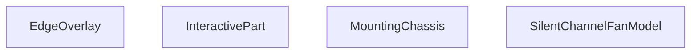

## Genel Bakış
Bu modül, HVAC sistemlerinde kullanılan sessiz kanal fanları için interaktif 3D React bileşeni sunar. Fanın tüm fiziksel yapısını üç boyutlu olarak oluşturur, kullanıcı etkileşimlerini yönetir ve parça patlatma, seçme, gizleme gibi gelişmiş görsel opsiyonları destekler. Three.js tabanlı 3D kütüphanelerle entegre çalışacak şekilde tasarlanmıştır.

## Fonksiyon Grupları
### Ana Kök 3D Model Bileşeni
Tüm fan modelinin merkezi bileşenidir, tüm alt parçaları bir araya getirir, gelen tüm konfigürasyonları modele uygular ve ana görünümden sorumludur.
- SilentChannelFanModel

### Kullanıcı Etkileşimi Yönetim Bileşeni
Modelin parçalarının kullanıcı tıklamaları, fare üzerine gelme gibi etkileşimlerini yönetir, parçaların gizlenmesi, izole edilmesi gibi interaktif özellikleri sağlayan sarmalayıcı bileşendir.
- InteractivePart

### 3D Model Alt Parçası Bileşenleri
Fanın fiziksel yapısını oluşturan ayrı görsel alt bileşenlerdir, belirtilen boyut, malzeme ve görünüm ayarlarına göre modele ait şasi, kenar kaplaması gibi parçaları render eder.
- MountingChassis, EdgeOverlay

---

## AXIOMS – Mimari Varsayımlar
Bu 3B sessiz kanal fanı modelini render eden React bileşeni, üç boyutlu geometrisinin, parça etkileşimlerinin ve görünürlük ayarlarının doğru çalışması için tüm bağımlı alt bileşenlere ve tüm zorunlu prop değerlerinin hatasız iletilmesi zorunluluğuna dayanır.

[Aksiyom 1]: Eğer MountingChassis bileşenine iletilen bodyHalfLen, neckLen, neckRad, bRad sayısal prop'ları geçerli pozitif sayı olarak sağlanmazsa, fan şasisinin 3B geometrisi bozulur, sahada doğru render edilemez.
[Aksiyom 2]: Eğer MountingChassis ve EdgeOverlay bileşenlerine iletilen displayStyle string prop'u iletilmezse, bu bileşenlerin görsel stilleri uygulanamaz, modelin görsel sunumu hatalı olur.
[Aksiyom 3]: Eğer MountingChassis bileşenine iletilen THREE.Material türündeki material prop'u geçerli bir Three.js malzemesi olarak sağlanmazsa, şasi bileşeni yüzey özellikleri olmadan render edilir, görünürlüğü kaybolur.
[Aksiyom 4]: Eğer InteractivePart ve SilentChannelFanModel bileşenlerine iletilen onPartClick tıklama işleyici fonksiyonu geçerli bir fonksiyon olarak sağlanmazsa, kullanıcının model parçalarıyla tıklama etkileşimi çalışmaz, parça seçimi işlemleri başarısız olur.
[Aksiyom 5]: Eğer InteractivePart bileşenine iletilen children prop'u geçerli React alt elemanları olarak sağlanmazsa, tüm model parçaları kullanıcı girişlerine yanıt veremez, 3B sahadaki tüm etkileşimler devre dışı kalır.
[Aksiyom 6]: Eğer SilentChannelFanModel ana bileşenine iletilen explode prop'u 0'dan küçük negatif bir sayı olarak gönderilirse, model parçalarının ayrıştırma (explode) işlemi ters çalışır, tüm parçaların konumları bozulur.
[Aksiyom 7]: Eğer SilentChannelFanModel bileşenine iletilen hiddenParts dizisi geçerli bir dizi olarak sağlanmazsa, gizlenmesi gereken model parçaları görünmeye devam eder, parça gizleme kuralı uygulanamaz.
[Aksiyom 8]: Eğer SilentChannelFanModel bileşeninin zorunlu SilentChannelFanModelProps türündeki temel prop'ları eksiksiz olarak iletilmezse, ana fan modeli bileşeni çalışmaz, 3B saha içinde hiç render edilemez.

---

## FONKSIYON DETAYLARI

### EdgeOverlay
**Ne yapar**: SilentChannelFanModel 3B sahnesinde kullanılan, kenar çizimlerini üst katman olarak render eden React bileşenidir. Sessiz kanal fanı modelinin geometrik kenarlarının belirtilen stilde gösterilmesini sağlar.
**Nasıl yapar**: Aldığı görsel stil parametresini kullanarak Three.js tabanlı 3B sahnede kenar öğelerini konumlandırır ve görsel özelliklerini ayarlar, modelin diğer katmanlarının üzerinde olacak şekilde üst katmanda render edilir.
**Parametreler**:
- name: displayStyle — type: string — Bileşenin kenarları hangi görsel stilde göstereceğini tanımlayan string değer, tüm 3B öğelerin görünüm kurallarıyla uyumlu çalışır.
**Dönüş**: Tipi belirtilmemiştir, void veya bilinmiyor olarak tanımlanmıştır.

### MountingChassis
**Ne yapar**: Sessiz kanal fanının ana montaj şasisinin 3B geometrisini oluşturan React bileşenidir. Fanın gövde ve bağlantı boynu kısımlarını tanımlayan boyut ve malzeme parametreleriyle gerçekçi bir şasi modeli oluşturur.
**Nasıl yapar**: Aldığı uzunluk, yarıçap ve malzeme bilgilerini Three.js geometri fonksiyonlarıyla işler, girilen displayStyle parametresine göre şasinin görsel görünümünü ayarlar ve 3B sahneye ekler.
**Parametreler**:
- name: bodyHalfLen — type: number — Fan gövdesinin tam uzunluğunun yarısını belirten sayısal değer, geometrik ölçekleme için kullanılır.
- name: neckLen — type: number — Şasinin bağlantı boynunun toplam uzunluğunu tanımlayan sayısal değer.
- name: neckRad — type: number — Şasi boynunun yarıçapını belirten sayısal değer.
- name: bRad — type: number — Gövde tabanının yarıçapını tanımlayan sayısal değer.
- name: material — type: THREE.Material — Şasi geometrisine uygulanacak Three.js uyumlu 3B malzeme nesnesi.
- name: displayStyle — type: string — Şasinin sahne içerisinde hangi görsel stilde gösterileceğini belirten string değer.
**Dönüş**: Tipi belirtilmemiştir, void veya bilinmiyor olarak tanımlanmıştır.

### InteractivePart
**Ne yapar**: 3B fan modelinin herhangi bir parçasını kullanıcı etkileşimlerine açık hale getiren sarmalayıcı React bileşenidir. Parçalara tıklama, üzerine gelme gibi olayları yönetir, gizleme ve izole etme işlemlerini kontrol eder.
**Nasıl yapar**: İçerisine aldığı çocuk 3B öğelerini sarmalar, prop olarak aldığı gizli parça listesine göre istenmeyen öğelerin render edilmesini engeller, izole edilen parçayı sadece aktif olarak gösterir, kullanıcı etkileşimlerini aldığı geri çağırma fonksiyonları aracılığıyla üst bileşenlere iletir.
**Parametreler**:
- name: name — type: string — Etkileşimli parçanın benzersiz tanımlayıcı adı, diğer parçalardan ayırt edilmesini sağlar.
- name: children — type: React.ReactNode — Bileşenin içerisinde sarmalayacağı tüm içerik, genellikle 3B geometri öğelerinden oluşur.
- name: onPartClick — type: function — Parçaya kullanıcı tarafından tıklandığında tetiklenen geri çağırma fonksiyonu.
- name: onHover — type: function — Kullanıcının fare imlecini parça üzerine getirmesiyle tetiklenen geri çağırma fonksiyonu.
- name: hiddenParts — type: string[] — Gizlenmesi gereken tüm parça adlarını içeren dizi, listedeki öğeler render edilmez.
- name: isolatedPart — type: string — Sahnede sadece kendisinin gösterileceği izole edilmiş parça adı, tüm diğer parçaların görünürlüğünü kapatır.
**Dönüş**: React.FC<InteractivePartProps> türünde, etkileşimleri yönetilmiş içeriği render eden bir React bileşeni döndürür.

### SilentChannelFanModel
**Ne yapar**: Tüm sessiz kanal fanı 3B modelini bir araya getiren ana kök bileşenidir. Modelin tüm alt parçalarını, görsel ayarlarını ve kullanıcı etkileşimlerini tek merkezden yönetir, komple fan sahnesini oluşturur.
**Nasıl yapar**: İçerisinde EdgeOverlay, MountingChassis ve InteractivePart gibi tüm alt bileşenleri kullanarak parçaları birleştirir, explode parametresiyle parçaların birbirinden ne kadar ayrıştırılacağını ayarlar, seçili, gizli ve izole parça durumlarını tüm alt bileşenlere ileterek sahneyi güncel tutar.
**Parametreler**:
- name: explode — type: number — Varsayılan değeri 0 olan, model parçalarının birbirinden ne kadar uzaklaştırılarak gösterileceğini belirten sayısal ayrıştırma katsayısı.
- name: onPartClick — type: function — Modelin herhangi bir parçasına tıklandığında tetiklenen genel geri çağırma fonksiyonu.
- name: selectedPart — type: string — Kullanıcı tarafından şu anda seçilmiş olan parça benzersiz adı.
- name: isolatedPart — type: string — Sahnede tek başına gösterilen izole edilmiş parça adı.
- name: hiddenParts — type: string[] — Varsayılan değeri boş dizi olan, gizlenmesi gereken tüm parça adlarını içeren dizi.
- name: displa — type: SilentChannelFanModelProps — Bileşenin tüm genel görselleştirme ve çalışma ayarlarını içeren tip tanımlı nesnesi.
**Dönüş**: Tipi belirtilmemiştir, void veya bilinmiyor olarak tanımlanmıştır.

---

## INTERFACES

### InteractivePartProps
- `name: string`
- `children: React.ReactNode`
- `onPartClick?: (partName: string) => void`
- `selectedPart?: string | null`
- `isolatedPart?: string | null`
- `hiddenParts?: string[]`
- `onHover?: (partName: string | null) => void`

### SilentChannelFanModelProps
- `explode?: number`
- `onPartClick?: (partName: string) => void`
- `selectedPart?: string | null`
- `isolatedPart?: string | null`
- `hiddenParts?: string[]`
- `displayStyle?: 'shaded' | 'shadedEdges' | 'wireframe' | 'hiddenLines'`
- `enableTooltip?: boolean`

---

## AST POINTERS

### [N1_NASIL] AST Pointer: C:\Users\alize\venthub-hvac\src\components\products\3d\types\SilentChannelFanModel.tsx::EdgeOverlay
- **params**: displayStyle: string
- **ic_degiskenler**:
  - `displayStyle` — Kenar çizim stilini belirleyen giriş parametresi, geçerli stil değerlerini kontrol etmek için kullanılır
  - `Edges.threshold` - Kenar algılama eşiği, 12 olarak sabit ayarlanmıştır
  - `Edges.color` - Kenarların çizim rengi, stile göre siyah veya gri olarak atanır
  - `Edges.linewidth` - Kenarların kalınlığı, stile göre 2 veya 1 olarak atanır
- **Dönüş**: Stil geçerli değilse null, geçerliyse Three.js Edges JSX elemanı

---

### [N2_NASIL] AST Pointer: C:\Users\alize\venthub-hvac\src\components\products\3d\types\SilentChannelFanModel.tsx::MountingChassis
- **params**: bodyHalfLen: number, neckLen: number, neckRad: number, bRad: number, material: THREE.Material, displayStyle: string
- **ic_degiskenler**:
  - `chassisWidth` — Şasi genişliği, boyut hesaplaması için kullanılır, neckRad * 2.2 olarak atanır
  - `chassisLen` — Şasi uzunluğu, boyut hesaplaması için kullanılır, (bodyHalfLen + neckLen) * 2 olarak atanır
  - `wallZ` — Yan duvarların Z ekseni konumu, duvar yerleşimi için hesaplanır
  - `wallHeight` — Yan duvarların yüksekliği, boyut hesaplaması için kullanılır, bRad * 0.9 olarak atanır
  - `baseThick` — Şasi tabanının kalınlığı, 0.012 olarak sabit tanımlanır
  - `wallThick` — Yan duvarların kalınlığı, 0.012 olarak sabit tanımlanır
  - `baseExtrudeSettings` — Taban geometrisinin ekstrüzyon ayarları, useMemo ile önbelleğe alınır
  - `baseShape` — Şasi tabanının 2D şekli, içine yuva delikleri eklenmiş THREE.Shape nesnesi, useMemo ile önbelleğe alınır
  - `wallExtrudeSettings` — Yan duvar geometrisinin ekstrüzyon ayarları, useMemo ile önbelleğe alınır
  - `wallShape` — Yan duvarların 2D şekli, useMemo ile önbelleğe alınmış THREE.Shape nesnesi
  - `EdgeOverlay` — Tüm şasi geometrilerine kenar çizimi eklemek için çağrılan alt component
- **Dönüş**: Şasi elemanlarını içeren Three.js JSX grubu

---

### [N3_NASIL] AST Pointer: C:\Users\alize\venthub-hvac\src\components\products\3d\types\SilentChannelFanModel.tsx::baseShapeAnonim
- **params**: (parametre yok)
- **ic_degiskenler**:
  - `s` — Oluşturulan ana taban şekli, THREE.Shape nesnesi
  - `w` — Taban şeklinin yarım genişliği, şekil köşelerini çizmek için kullanılır
  - `l` — Taban şeklinin yarım uzunluğu, şekil köşelerini çizmek için kullanılır
  - `slotW` — Taban üzerindeki yuvaların genişliği, delik oluşturmak için kullanılır
  - `slotL` — Taban üzerindeki yuvaların uzunluğu, delik oluşturmak için kullanılır
  - `slotR` — Yuva köşelerinin yuvarlatma yarıçapı, eğrisel kenarlar için kullanılır
  - `xOff` — Döngü değişkeni, iki adet yuvanın X ekseni ofsetini tutar
  - `hole` — Her yuva için oluşturulan THREE.Path nesnesi, ana şeklin delikler listesine eklenir
- **Dönüş**: İçine yuva delikleri eklenmiş THREE.Shape nesnesi

---

### [N4_NASIL] AST Pointer: C:\Users\alize\venthub-hvac\src\components\products\3d\types\SilentChannelFanModel.tsx::wallShapeAnonim
- **params**: (parametre yok)
- **ic_degiskenler**:
  - `s` — Oluşturulan yan duvar ana şekli, THREE.Shape nesnesi
  - `w` — Duvar şeklinin yarım genişliği, şekil köşelerini çizmek için kullanılır
  - `h` — Duvar şeklinin yüksekliği, şekil köşelerini çizmek için kullanılır
- **Dönüş**: Tamamlanmış yan duvar THREE.Shape nesnesi

---

### [N5_NASIL] AST Pointer: C:\Users\alize\venthub-hvac\src\components\products\3d\types\SilentChannelFanModel.tsx::InteractivePart
- **params**: name: string, children: React.ReactNode, onPartClick: function, onHover: function, hiddenParts: string[], isolatedPart: string
- **ic_degiskenler**:
  - `hovered` — Parça üzerinde fare olup olmadığını tutan state değişkeni, useState ile oluşturulur
  - `setHover` — hovered state'ini güncellemek için kullanılan state setter fonksiyonu
  - `useCursor` — Fare imlecini hover durumuna göre değiştirmek için çağrılan drei hook'u
  - `hiddenParts?.includes(name)` — Parça gizli listesinde mi diye kontrol eden koşul
  - `isolatedPart && isolatedPart !== name` — Sadece tek parça gösteriliyorsa bu parça o mu diye kontrol eden koşul
  - `group` — Tüm alt elemanları gruplayan, etkileşim eventlerine sahip Three.js grubu
- **Dönüş**: Koşullar sağlanmazsa null, aksi takdirde etkileşimli parça JSX'i

---

### [N6_NASIL] AST Pointer: C:\Users\alize\venthub-hvac\src\components\products\3d\types\SilentChannelFanModel.tsx::InteractivePart_onClick
- **params**: e: React.PointerEvent<THREE.Group>
- **ic_degiskenler**:
  - `e.stopPropagation()` — Event'in üst elemanlara yayılmasını engeller
  - `onPartClick?.(name)` — Parça tıklandığında üst componentlere bildiren opsiyonel callback, parça adını gönderir
- **Dönüş**: yok

---

### [N7_NASIL] AST Pointer: C:\Users\alize\venthub-hvac\src\components\products\3d\types\SilentChannelFanModel.tsx::InteractivePart_onPointerOver
- **params**: e: React.PointerEvent<THREE.Group>
- **ic_degiskenler**:
  - `e.stopPropagation()` — Event'in yayılmasını engeller
  - `setHover(true)` — Fare parça üzerine gelince hover state'ini aktif eder
  - `onHover?.(name)` — Üst componentlere fare bu parça üzerinde diye bildiren callback
- **Dönüş**: yok

---

### [N8_NASIL] AST Pointer: C:\Users\alize\venthub-hvac\src\components\products\3d\types\SilentChannelFanModel.tsx::InteractivePart_onPointerOut
- **params**: e: React.PointerEvent<THREE.Group>
- **ic_degiskenler**:
  - `e.stopPropagation()` — Event'in yayılmasını engeller
  - `setHover(false)` — Fare parça üzerinden çıkınca hover state'ini kapatır
  - `onHover?.(null)` — Üst componentlere fare bu parça üzerinde artık değil diye bildiren callback
- **Dönüş**: yok

---

### [N9_NASIL] AST Pointer: C:\Users\alize\venthub-hvac\src\components\products\3d\types\SilentChannelFanModel.tsx::SilentChannelFanModel
- **params**: explode: number, onPartClick: function, selectedPart: string, isolatedPart: string, hiddenParts: string[], displayStyle: string, enableTooltip: boolean
- **ic_degiskenler**:
  - `materials` — Fan parçalarının materyallerini döndüren özel hook, useFanMaterials ile alınır
  - `hoveredPart` — Üzerinde fare olan parça adını tutan state değişkeni, useState ile oluşturulur
  - `setHoveredPart` — hoveredPart state'ini güncelleyen setter fonksiyonu
  - `bRad` — Fan dış gövdesinin ana yarıçapı, tüm boyut hesaplamaları için temel değer
  - `sphereEndRad` — Fan gövdesi uç küresinin yarıçapı
  - `neckRad` — Fan orta bağlantı bölümünün yarıçapı
  - `bodyHalfLen` — Fan ana gövdesinin yarım uzunluğu
  - `internalAssemblyLen` — Fan iç montajının toplam uzunluğu
  - `phiLimit` — Küre geometrisinin kesme açısı, gövde şeklini oluşturmak için kullanılır
  - `naturalHeight` — Gövdenin doğal yüksekliği, oran hesaplamaları için kullanılır
  - `compensatoryStretch` — Gövde boyut bozukluklarını düzeltmek için hesaplanan uzama katsayısı
  - `Html` — Tooltip göstermek için kullanılan drei Html componenti
  - `InteractivePart` — Tüm fan parçalarını sarmalayan etkileşimli component
  - `MountingChassis` — Montaj şasisini render eden alt component
  - `EdgeOverlay` — Tüm geometrilere kenar çizimi ekleyen component
- **Dönüş**: Tüm fan modelini içeren ana Three.js JSX grubu

---

## MERMAID CALL GRAPH

## NODE ID STANDARD

  file: src\components\products\3d\types\SilentChannelFanModel.tsx
  function: src\components\products\3d\types\SilentChannelFanModel.tsx::EdgeOverlay
  function: src\components\products\3d\types\SilentChannelFanModel.tsx::MountingChassis
  function: src\components\products\3d\types\SilentChannelFanModel.tsx::InteractivePart
  function: src\components\products\3d\types\SilentChannelFanModel.tsx::SilentChannelFanModel

---

## DISA AKTARILANLAR (EXPORTS)
  export: EdgeOverlay
  export: InteractivePart
  export: MountingChassis
  export: SilentChannelFanModel

---

## STİL TOKENLERİ

### Arbitrary Değerler (token'a geçirilmemiş)
Yok — tüm stiller token'a geçirilmiş. ✅

### Kullanılan Token'lar (zaten token'a geçirilmiş)
- (yok)

### Tailwind Sınıf Özeti
- **Renkler:** (yok)
- **Layout:** (yok)
- **Responsive:** (yok)
