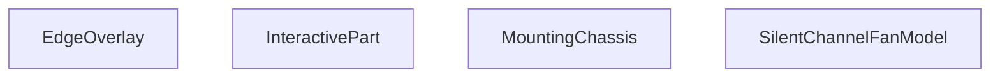

## Genel Bakış
Bu modül, sessiz kanal fanları için interaktif bir 3D React bileşenidir. Ana sorumluluğu, fanın tüm bileşenlerini (gövde, şasi, kenarlıklar vb.) Three.js geometrileriyle bir araya getirmek, bu parçaların görünümünü (patlama, gizleme, izole etme) ve kullanıcı etkileşimlerini (tıklama, üzerine gelme) yönetmektir.

## Fonksiyon Grupları
### Ana Model Orkestratörü
Tüm fan modelinin üst düzey bileşenidir. Alt parçaları, gelen parametreleri (patlama mesafesi, seçili parça, gizli parçalar) ve etkileşim olaylarını birleştirerek nihai 3D view'u render eder.
- SilentChannelFanModel

### Etkileşim Yöneticisi
3D model parçalarının kullanıcı etkileşimlerini (tıklama, üzerine gelme) soyutlayan ve yöneten bir sarmalayıcı bileşendir. Ayrıca parçaların gizlenmesi veya izole edilmesi mantığını uygular.
- InteractivePart

### Yapısal ve Dekoratif 3D Parçalar
Fanın fiziksel yapısını oluşturan, belirli geometrik parametrelerle (boy, çap, yarıçap) ve malzemelerle tanımlanan alt 3D bileşenleridir. Her biri modelin belirli bir bölümünü render eder.
- MountingChassis (montaj şasesi)
- EdgeOverlay (kenar kaplaması)

---

## AXIOMS – Mimari Varsayımlar

Bu modül için fonksiyon gövdeleri paylaşılmamıştır; yalnızca fonksiyon imzalarından ve modül yapısından çıkarılabilen temel mimari varsayımlar aşağıdadır.

**[Aksiyom 1]:** Eğer `MountingChassis` bileşenine geçirilen `bodyHalfLen`, `neckLen`, `neckRad` veya `bRad` değerlerinden herhangi biri negatif veya sıfırsa, Three.js geometri oluşturma hataları oluşur veya anlamsız 3D model geometrisi üretilir.

**[Aksiyom 2]:** Eğer `MountingChassis` bileşenine geçirilen `material` parametresi geçerli bir `THREE.Material` instance'ı değilse, Three.js render sürecinde Material tipi uyumsuzluğu hatası oluşur.

**[Aksiyom 3]:** Eğer `SilentChannelFanModel` bileşenine geçirilen `hiddenParts` dizisi içindeki elemanlar, `InteractivePart` bileşenlerinin `name` değerleriyle eşleşmiyorsa, hiçbir parça gizlenmez ve tüm parçalar görünür kalır.

**[Aksiyom 4]:** Eğer `SilentChannelFanModel` bileşeninde `explode` parametresi 0'dan farklı bir değere ayarlanırsa, parçaların orijinal pozisyonlarından dışarı doğru dağıtılması beklenir; ancak dağıtma vektörlerinin yönleri ve uzaklıkları fonksiyon gövdesinde tanımlı olmadığından, bu davranış bilinmiyor.

**[Aksiyom 5]:** Eğer `InteractivePart` bileşenine `onPartClick` callback'i geçirilmemişse, parça tıklama etkileşimi çalışmayabilir veya hata oluşabilir; bu durum fonksiyon gövdesinde ele alınıp alınmadığı bilinmiyor.

**[Aksiyom 6]:** Eğer `InteractivePart` bileşenine `isolatedPart` değeri olarak geçilen isim, mevcut bir parçanın `name` değeriyle eşleşmiyorsa, izolasyon etkileşimi hiçbir parçaya uygulanmaz.

**[Aksiyom 7]:** Eğer `SilentChannelFanModel` bileşeninin `displayStyle` parametresi geçerli bir değer değilse (örn: boş string veya tanımsız bir enum değeri), `EdgeOverlay` ve `MountingChassis` bileşenlerine anlamsız display stil bilgisi iletilir ve görsel çıktı belirsiz olur.

**[Aksiyom 8]:** `SilentChannelFanModel` tüm alt 3D bileşenleri (EdgeOverlay, MountingChassis, InteractivePart) bünyesinde barındırdığından, bu modülün `@react-three/fiber` veya eşdeğeri Three.js React entegrasyonu ile bir `<Canvas>` içine yerleştirilmesi zorunludur; aksi halde 3D sahne oluşturulamaz.

---

## FONKSİYON DETAYLARI

### EdgeOverlay
**Ne yapar**: SilentChannelFanModel 3B sahnesinde kullanılan, kenar çizimlerini üst katman olarak render eden React bileşenidir. Sessiz kanal fanı modelinin geometrik kenarlarının belirtilen stilde gösterilmesini sağlar.
**Nasıl yapar**: Aldığı görsel stil parametresini kullanarak Three.js tabanlı 3B sahnede kenar öğelerini konumlandırır ve görsel özelliklerini ayarlar, modelin diğer katmanlarının üzerinde olacak şekilde üst katmanda render edilir.
**Parametreler**:
- name: displayStyle — type: string — Bileşenin kenarları hangi görsel stilde göstereceğini tanımlayan string değer, tüm 3B öğelerin görünüm kurallarıyla uyumlu çalışır.
**Dönüş**: Tipi belirtilmemiştir, void veya bilinmiyor olarak tanımlanmıştır.

### MountingChassis
**Ne yapar**: Sessiz kanal fanının ana montaj şasisinin 3B geometrisini oluşturan React bileşenidir. Fanın gövde ve bağlantı boynu kısımlarını tanımlayan boyut ve malzeme parametreleriyle gerçekçi bir şasi modeli oluşturur.
**Nasıl yapar**: Aldığı uzunluk, yarıçap ve malzeme bilgilerini Three.js geometri fonksiyonlarıyla işler, girilen displayStyle parametresine göre şasinin görsel görünümünü ayarlar ve 3B sahneye ekler.
**Parametreler**:
- name: bodyHalfLen — type: number — Fan gövdesinin tam uzunluğunun yarısını belirten sayısal değer, geometrik ölçekleme için kullanılır.
- name: neckLen — type: number — Şasinin bağlantı boynunun toplam uzunluğunu tanımlayan sayısal değer.
- name: neckRad — type: number — Şasi boynunun yarıçapını belirten sayısal değer.
- name: bRad — type: number — Gövde tabanının yarıçapını tanımlayan sayısal değer.
- name: material — type: THREE.Material — Şasi geometrisine uygulanacak Three.js uyumlu 3B malzeme nesnesi.
- name: displayStyle — type: string — Şasinin sahne içerisinde hangi görsel stilde gösterileceğini belirten string değer.
**Dönüş**: Tipi belirtilmemiştir, void veya bilinmiyor olarak tanımlanmıştır.

### InteractivePart
**Ne yapar**: 3B fan modelinin herhangi bir parçasını kullanıcı etkileşimlerine açık hale getiren sarmalayıcı React bileşenidir. Parçalara tıklama, üzerine gelme gibi olayları yönetir, gizleme ve izole etme işlemlerini kontrol eder.
**Nasıl yapar**: İçerisine aldığı çocuk 3B öğelerini sarmalar, prop olarak aldığı gizli parça listesine göre istenmeyen öğelerin render edilmesini engeller, izole edilen parçayı sadece aktif olarak gösterir, kullanıcı etkileşimlerini aldığı geri çağırma fonksiyonları aracılığıyla üst bileşenlere iletir.
**Parametreler**:
- name: name — type: string — Etkileşimli parçanın benzersiz tanımlayıcı adı, diğer parçalardan ayırt edilmesini sağlar.
- name: children — type: React.ReactNode — Bileşenin içerisinde sarmalayacağı tüm içerik, genellikle 3B geometri öğelerinden oluşur.
- name: onPartClick — type: function — Parçaya kullanıcı tarafından tıklandığında tetiklenen geri çağırma fonksiyonu.
- name: onHover — type: function — Kullanıcının fare imlecini parça üzerine getirmesiyle tetiklenen geri çağırma fonksiyonu.
- name: hiddenParts — type: string[] — Gizlenmesi gereken tüm parça adlarını içeren dizi, listedeki öğeler render edilmez.
- name: isolatedPart — type: string — Sahnede sadece kendisinin gösterileceği izole edilmiş parça adı, tüm diğer parçaların görünürlüğünü kapatır.
**Dönüş**: React.FC<InteractivePartProps> türünde, etkileşimleri yönetilmiş içeriği render eden bir React bileşeni döndürür.

### SilentChannelFanModel
**Ne yapar**: Tüm sessiz kanal fanı 3B modelini bir araya getiren ana kök bileşenidir. Modelin tüm alt parçalarını, görsel ayarlarını ve kullanıcı etkileşimlerini tek merkezden yönetir, komple fan sahnesini oluşturur.
**Nasıl yapar**: İçerisinde EdgeOverlay, MountingChassis ve InteractivePart gibi tüm alt bileşenleri kullanarak parçaları birleştirir, explode parametresiyle parçaların birbirinden ne kadar ayrıştırılacağını ayarlar, seçili, gizli ve izole parça durumlarını tüm alt bileşenlere ileterek sahneyi güncel tutar.
**Parametreler**:
- name: explode — type: number — Varsayılan değeri 0 olan, model parçalarının birbirinden ne kadar uzaklaştırılarak gösterileceğini belirten sayısal ayrıştırma katsayısı.
- name: onPartClick — type: function — Modelin herhangi bir parçasına tıklandığında tetiklenen genel geri çağırma fonksiyonu.
- name: selectedPart — type: string — Kullanıcı tarafından şu anda seçilmiş olan parça benzersiz adı.
- name: isolatedPart — type: string — Sahnede tek başına gösterilen izole edilmiş parça adı.
- name: hiddenParts — type: string[] — Varsayılan değeri boş dizi olan, gizlenmesi gereken tüm parça adlarını içeren dizi.
- name: displa — type: SilentChannelFanModelProps — Bileşenin tüm genel görselleştirme ve çalışma ayarlarını içeren tip tanımlı nesnesi.
**Dönüş**: Tipi belirtilmemiştir, void veya bilinmiyor olarak tanımlanmıştır.

---

## INTERFACES

### InteractivePartProps
- `name: string`
- `children: React.ReactNode`
- `onPartClick?: (partName: string) => void`
- `selectedPart?: string | null`
- `isolatedPart?: string | null`
- `hiddenParts?: string[]`
- `onHover?: (partName: string | null) => void`

### SilentChannelFanModelProps
- `explode?: number`
- `onPartClick?: (partName: string) => void`
- `selectedPart?: string | null`
- `isolatedPart?: string | null`
- `hiddenParts?: string[]`
- `displayStyle?: 'shaded' | 'shadedEdges' | 'wireframe' | 'hiddenLines'`
- `enableTooltip?: boolean`

---

## AST POINTERS

### [N1_NASIL] AST Pointer: `SilentChannelFanModel.tsx`::EdgeOverlay
- **params**: `{ displayStyle: string }`
- **ic_degiskenler**: (yok — sadece params kullanılır)
- **Dönüş**: `JSX.Element | null` — `displayStyle` `'shadedEdges'` veya `'hiddenLines'` ise `<Edges>` bileşeni döner, aksi halde `null`.

---

## MERMAID CALL GRAPH

## NODE ID STANDARD

  file: src\components\products\3d\types\SilentChannelFanModel.tsx
  function: src\components\products\3d\types\SilentChannelFanModel.tsx::EdgeOverlay
  function: src\components\products\3d\types\SilentChannelFanModel.tsx::MountingChassis
  function: src\components\products\3d\types\SilentChannelFanModel.tsx::InteractivePart
  function: src\components\products\3d\types\SilentChannelFanModel.tsx::SilentChannelFanModel

---

## DISA AKTARILANLAR (EXPORTS)
  export: EdgeOverlay
  export: InteractivePart
  export: MountingChassis
  export: SilentChannelFanModel

---

## STİL TOKENLERİ

### Arbitrary Değerler (token'a geçirilmemiş)
Yok — tüm stiller token'a geçirilmiş. ✅

### Kullanılan Token'lar (zaten token'a geçirilmiş)
- (yok)

### Tailwind Sınıf Özeti
- **Renkler:** (yok)
- **Layout:** (yok)
- **Varyant/Responsive:** (yok)
- **Yardımcı Sınıflar:** (yok)