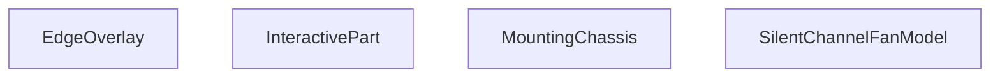

## Genel Bakış
Bu modül, sessiz kanal fanının 3D görsel modelini oluşturan bir React bileşen modülüdür. Modelin parçaları arasında etkileşimli seçim, gizleme, izole etme ve patlatma (explode) gibi görünüm kontrolü sağlar. Alt bileşenler aracılığıyla montaj şasesi ve kenar çizgileri gibi yapısal detaylar ayrı sorumluluklar olarak yönetilir.

## Fonksiyon Grupları

### Ana Model Bileşeni
Sessiz kanal fanının tam 3D modelini bir araya getiren üst düzey bileşendir. Patlatma mesafesi, parça seçimi, gizli/izole parça durumu ve görünüm stili gibi üst düzey parametreleri alarak alt bileşenleri koordine eder.
- SilentChannelFanModel

### Yapısal Alt Bileşenler
Modelin fiziksel yapısını temsil eden parçalardır. Montaj şasesi geometrik parametrelerle (gövde uzunluğu, boyun ölçüleri, yarıçaplar) ve malzeme bilgisiyle oluşturulur; kenar overlay'i ise çizgi/stil tabanlı bir görüntüleme katmanı sağlar.
- MountingChassis, EdgeOverlay

### Etkileşim Yönetimi
Parçaların kullanıcı etkileşimlerini (tıklama, hover, gizleme, izole etme) yöneten sarmalayıcı bileşendir. Çocuk bileşenleri alarak onlara tıklanabilirlik ve hover davranışı kazandırır; gizli veya izole parça durumuna göre görünürlük kontrolü uygular.
- InteractivePart

---

## AXIOMS – Mimari Varsayımlar

Bu modül, 3D sessiz kanal fan modelini React bileşenleriyle oluşturan bir görselleştirme modülüdür.

[Aksiyom 1]: Eğer `SilentChannelFanModel` bileşenine `explode` parametresi sağlanmazsa, varsayılan değer `0` kullanılır (patlatılmış görünüm kapalı).

[Aksiyom 2]: Eğer `SilentChannelFanModel` bileşenine `hiddenParts` parametresi sağlanmazsa, varsayılan olarak boş dizi `[]` kullanılır (hiçbir parça gizli değildir).

[Aksiyom 3]: Eğer `MountingChassis` bileşenine geometrik boyut parametreleri (`bodyHalfLen`, `neckLen`, `neckRad`, `bRad`) sağlanmazsa, bileşen doğru şekilde oluşturulamaz; bu parametrelerin değerleri bilinmiyor.

[Aksiyom 4]: Eğer `MountingChassis` bileşenine `material` parametresi sağlanmazsa, bileşen doğru şekilde oluşturulamaz; `Material` tipinde bir değer zorunludur.

[Aksiyom 5]: Eğer `InteractivePart` bileşenine `name` parametresi sağlanmazsa, parçanın tanımlanması mümkün olmaz.

[Aksiyom 6]: Eğer `SilentChannelFanModel` bileşeninde `selectedPart` ve/veya `isolatedPart` değerleri sağlanmazsa, parçalar arası seçim/ayırma işlevselliği çalışmaz.

[Aksiyom 7]: Eğer `displayStyle` parametresi (`EdgeOverlay`, `MountingChassis` veya `SilentChannelFanModel` bileşenlerinde) sağlanmazsa, görsel stil belirlenemez; bu parametre için varsayılan değer bilinmiyor.

---

## FONKSİYON DETAYLARI

### EdgeOverlay
**Ne yapar**: Kenar çizgisi (edge overlay) efektini uygulayan bir React bileşenidir. 3B model üzerinde kenar vurgulama görselleştirmesi sağlar.
**Nasıl yapar**: Gövde kodu verilmemiştir; yalnızca bileşen adı ve `displayStyle` parametresi bilinmektedir. Kenar çizgilerinin nasıl çizildiğine dair iç mantık kaynakta yer almamaktadır.
**Parametreler**:
- displayStyle: string — Kenar çizgilerinin görsel stilini belirten değer (örneğin çizgi kalınlığı, renk, opaklık gibi stil ayarlarını kontrol eder). Geçerli olası değerler kaynakta belirtilmemiştir.

**Dönüş**: Kaynakta dönüş tipi açıkça belirtilmemiştir. JSX döndüren bir fonksiyonel bileşen olduğu anlaşılmaktadır ancak kesin dönüş tipi bilinmemektedir.

### MountingChassis
**Ne yapar**: Geliştirildi ancak detay üretilemedi.

### InteractivePart
**Ne yapar**: Geliştirildi ancak detay üretilemedi.

### SilentChannelFanModel
**Ne yapar**: Geliştirildi ancak detay üretilemedi.

---

## İTHALATLAR (IMPORTS)
- import: ../core::useResolveMaterials
- import: @react-three/drei::Edges
- import: @react-three/drei::Html
- import: @react-three/drei::RoundedBox
- import: @react-three/drei::Text
- import: @react-three/drei::useCursor
- import: react::React
- import: react::useEffect
- import: react::useMemo
- import: react::useState
- import: three::type { Material }

---

## INTERFACES

### InteractivePartProps
- `name: string`
- `children: React.ReactNode`
- `onPartClick?: (partName: string) => void`
- `selectedPart?: string | null`
- `isolatedPart?: string | null`
- `hiddenParts?: string[]`
- `onHover?: (partName: string | null) => void`

### SilentChannelFanModelProps
- `explode?: number`
- `onPartClick?: (partName: string) => void`
- `selectedPart?: string | null`
- `isolatedPart?: string | null`
- `hiddenParts?: string[]`
- `displayStyle?: 'shaded' | 'shadedEdges' | 'wireframe' | 'hiddenLines'`
- `enableTooltip?: boolean`

---

## AST POINTERS

### [N1_NASIL] AST Pointer: SilentChannelFanModel.tsx::EdgeOverlay
- **params**: `displayStyle` — kenar çizgisi stilini belirler ('shadedEdges' veya 'hiddenLines')
- **ic_degiskenler**: yok
- **Dönüş**: `<Edges>` JSX elementi veya `null` (displayStyle 'shadedEdges' veya 'hiddenLines' değilse null döner)

### [N2_NASIL] AST Pointer: SilentChannelFanModel.tsx::MountingChassis
- **params**: `bodyHalfLen` (number), `neckLen` (number), `neckRad` (number), `bRad` (number), `material` (Material), `displayStyle` (string)
- **ic_degiskenler**:
  - `chassisWidth` — neckRad * 2.2 hesaplanan şasi genişliği
  - `chassisLen` — (bodyHalfLen + neckLen) * 2 hesaplanan şasi uzunluğu
  - `wallZ` — (chassisLen / 2) - neckLen * 0.8 hesaplanan duvar Z pozisyonu
  - `wallHeight` — bRad * 0.9 hesaplanan duvar yüksekliği
  - `baseThick` — 0.012 sabit taban kalınlığı
  - `wallThick` — 0.012 sabit duvar kalınlığı
  - `baseExtrudeSettings` — useMemo ile oluşturulan taban extrude ayarları (depth: baseThick, bevelEnabled: true, bevelSize: 0.002, bevelThickness: 0.002)
  - `baseShape` — useMemo ile oluşturulan Shape nesnesi; dikdörtgen taban ve iki adet slot deliği (slotW: 0.02, slotL: chassisLen * 0.5) içerir
  - `wallExtrudeSettings` — useMemo ile oluşturulan duvar extrude ayarları (depth: wallThick, bevelEnabled: true, bevelSize: 0.002, bevelThickness: 0.002)
  - `wallShape` — useMemo ile oluşturulan Shape nesnesi; duvar profili, üstte neckRad yarım daire kemer içerir
  - `baseGeometry` — useMemo ile oluşturulan ExtrudeGeometry (baseShape + baseExtrudeSettings)
  - `wallGeometry` — useMemo ile oluşturulan ExtrudeGeometry (wallShape + wallExtrudeSettings)
- **Dönüş**: JSX — `<group>` içinde taban mesh'i ve iki duvar mesh'i (biri pozitif wallZ'de, diğeri negatif wallZ'de 180° döndürülmüş) döner

### [N3_NASIL] AST Pointer: SilentChannelFanModel.tsx::InteractivePart
- **params**: `name` (string), `children` (React.ReactNode), `onPartClick` (fonksiyon), `onHover` (fonksiyon), `hiddenParts` (string[]), `isolatedPart` (string)
- **ic_degiskenler**:
  - `hovered` — useState(false) ile oluşturulan hover durumu boolean'ı
  - `setHover` — hovered state'ini güncelleyen setter fonksiyonu
- **Dönüş**: JSX — `<group>` elementi veya `null` (hiddenParts name'i içeriyorsa veya isolatedPart name ile eşleşmiyorsa null döner)

### [N4_NASIL] AST Pointer: SilentChannelFanModel.tsx::SilentChannelFanModel
- **params**: `explode` (number, varsayılan 0), `onPartClick` (fonksiyon), `selectedPart` (string), `isolatedPart` (string), `hiddenParts` (string[], varsayılan []), `displayStyle` (string, varsayılan 'shaded'), `enableTooltip` (boolean, varsayılan false)
- **ic_degiskenler**:
  - `materials` — useResolveMaterials hook'undan dönen materyal nesneleri (matteBlack, jetOrange, vorticeGreen vb.)
  - `hoveredPart` — useState(null) ile oluşturulan hover edilen parça adı (string | null)
  - `setHoveredPart` — hoveredPart state'ini güncelleyen setter fonksiyonu
  - `bRad` — 0.32 sabit küre taban yarıçapı
  - `sphereEndRad` — 0.2625 sabit küre uç yarıçapı
  - `neckRad` — sphereEndRad * 0.75 hesaplanan boyun yarıçapı
  - `bodyHalfLen` — 0.54 sabit gövde yarım uzunluğu
  - `internalAssemblyLen` — bodyHalfLen * 2 hesaplanan iç montaj uzunluğu
  - `phiLimit` — Math.asin(sphereEndRad / bRad) hesaplanan küre kesim açısı limiti
  - `naturalHeight` — bRad * Math.cos(phiLimit) hesaplanan doğal yükseklik
  - `compensatoryStretch` — naturalHeight > 0.01 ise bodyHalfLen / naturalHeight, aksi halde 1; gövde scaleY çarpanı
  - `sphereGeometry` — useMemo ile oluşturulan SphereGeometry (bRad, 64, 32, 0, Math.PI * 2, phiLimit, Math.PI - 2 * phiLimit)
  - `cylinderGeometry` — useMemo ile oluşturulan CylinderGeometry (neckRad - 0.006, neckRad - 0.012, internalAssemblyLen, 64, 1, true)
  - `planeGeometry` — useMemo ile oluşturulan PlaneGeometry (0.22, 0.1)
- **Dönüş**: JSX — `<group>` içinde tooltip (koşullu), şasi montaj ayağı, dış gövde (küre), akustik izolasyon (silindir) ve elektrik bağlantı kutusu (RoundedBox + Text) parçalarını döner

---

## MERMAID CALL GRAPH

## NODE ID STANDARD

  file: src\components\products\3d\types\SilentChannelFanModel.tsx
  function: src\components\products\3d\types\SilentChannelFanModel.tsx::EdgeOverlay
  function: src\components\products\3d\types\SilentChannelFanModel.tsx::MountingChassis
  function: src\components\products\3d\types\SilentChannelFanModel.tsx::InteractivePart
  function: src\components\products\3d\types\SilentChannelFanModel.tsx::SilentChannelFanModel

---

## DISA AKTARILANLAR (EXPORTS)
  export: EdgeOverlay
  export: InteractivePart
  export: MountingChassis
  export: SilentChannelFanModel

---

## STİL TOKENLERİ

### Arbitrary Değerler (token'a geçirilmemiş)
Yok — tüm stiller token'a geçirilmiş. ✅

### Kullanılan Token'lar (zaten token'a geçirilmiş)
- (yok)

### Tailwind Sınıf Özeti
- **Renkler:** (yok)
- **Layout:** (yok)
- **Varyant/Responsive:** (yok)
- **Yardımcı Sınıflar:** (yok)