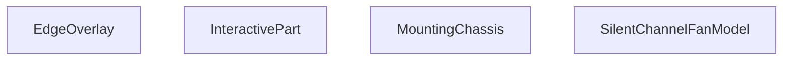

## Genel Bakış
Bu modül, sessiz kanal fanları için interaktif bir 3D React bileşenidir. Ana sorumluluğu, fanın tüm bileşenlerini (gövde, şasi, kenarlıklar vb.) Three.js geometrileriyle bir araya getirmek, bu parçaların görünümünü (patlama, gizleme, izole etme) ve kullanıcı etkileşimlerini (tıklama, üzerine gelme) yönetmektir.

## Fonksiyon Grupları
### Ana Model Orkestratörü
Tüm fan modelinin üst düzey bileşenidir. Alt parçaları, gelen parametreleri (patlama mesafesi, seçili parça, gizli parçalar) ve etkileşim olaylarını birleştirerek nihai 3D view'u render eder.
- SilentChannelFanModel

### Etkileşim Yöneticisi
3D model parçalarının kullanıcı etkileşimlerini (tıklama, üzerine gelme) soyutlayan ve yöneten bir sarmalayıcı bileşendir. Ayrıca parçaların gizlenmesi veya izole edilmesi mantığını uygular.
- InteractivePart

### Yapısal ve Dekoratif 3D Parçalar
Fanın fiziksel yapısını oluşturan, belirli geometrik parametrelerle (boy, çap, yarıçap) ve malzemelerle tanımlanan alt 3D bileşenleridir. Her biri modelin belirli bir bölümünü render eder.
- MountingChassis (montaj şasesi)
- EdgeOverlay (kenar kaplaması)

---

## AXIOMS – Mimari Varsayımlar

Bu modül, Three.js tabanlı bir 3D fan modelinin parçalarını orkestre eden bir React bileşen ağıdır. Aşağıdaki varsayımlar fonksiyon imzalarından türetilmiştir.

[Aksiyom 1]: Eğer `EdgeOverlay` bileşeni `displayStyle` parametresi olmadan çağrılırsa, bileşen render sırasında hata verir (zorunlu string parametre, default değer yoktur).

[Aksiyom 2]: Eğer `MountingChassis` bileşeni `bodyHalfLen`, `neckLen`, `neckRad` veya `bRad` parametrelerinden herhangi biri olmadan çağrılırsa, Three.js geometri hesaplamaları geçersiz boyutlarla çalışır veya hata oluşur (dört parametre de zorunlu number, default değerleri yoktur).

[Aksiyom 3]: Eğer `SilentChannelFanModel` çağrılırken `explode` parametresi verilmezse, değer `0` olarak kabul edilir ve parçalar arası patlama mesafesi sıfırdır (default: `0`).

[Aksiyom 4]: Eğer `SilentChannelFanModel` çağrılırken `hiddenParts` parametresi verilmezse, boş dizi `[]` olarak kabul edilir ve hiçbir parça gizli durumda başlar (default: `[]`).

[Aksiyom 5]: Eğer `InteractivePart` bileşeni `hiddenParts` veya `isolatedPart` parametreleri olmadan çağrılırsa, bu parçanın görünürlük ve izolasyon durumu üst bileşen tarafından belirlenmelidir; aksi takdirde parçanın görünürlüğü belirsiz kalır.

[Aksiyom 6]: Eğer `MountingChassis` bileşeni `material` parametresi geçerli bir `Material` tipi olmadan çağrılırsa, Three.js materyal oluşturma sırasında hata oluşur (zorunlu parametre, tipi `Material`).

[Aksiyom 7]: Eğer `SilentChannelFanModel` bileşenine `selectedPart` veya `isolatedPart` olarak `MountingChassis` veya `EdgeOverlay` bileşenlerinin tanınmayan bir ismi verilirse, ilgili parça vurgulanmaz veya izole edilmez.

---

## FONKSİYON DETAYLARI

### EdgeOverlay
**Ne yapar**: SilentChannelFanModel 3B sahnesinde kullanılan, kenar çizimlerini üst katman olarak render eden React bileşenidir. Sessiz kanal fanı modelinin geometrik kenarlarının belirtilen stilde gösterilmesini sağlar.
**Nasıl yapar**: Aldığı görsel stil parametresini kullanarak Three.js tabanlı 3B sahnede kenar öğelerini konumlandırır ve görsel özelliklerini ayarlar, modelin diğer katmanlarının üzerinde olacak şekilde üst katmanda render edilir.
**Parametreler**:
- name: displayStyle — type: string — Bileşenin kenarları hangi görsel stilde göstereceğini tanımlayan string değer, tüm 3B öğelerin görünüm kurallarıyla uyumlu çalışır.
**Dönüş**: Tipi belirtilmemiştir, void veya bilinmiyor olarak tanımlanmıştır.

### MountingChassis

**Ne yapar**: Fan montaj şasesini (chassis) 3B olarak oluşturur. Taban plakası, üzerindeki montaj yuvaları ve iki adet eğik üst yüzeyli dikey duvar elemanlarını içeren tam bir şase geometrisi üretir. Bu bileşen, sessiz kanatlı fan modelinin alt kısmına monte edilen yapısal destek parçasını temsil eder.

**Nasıl yapar**: Fonksiyon, verilen boyut parametrelerine dayanarak iki ana geometrik parça oluşturur. Öncelikle taban plakasını (baseShape) oluşturur: dikdörtgen bir plaka üzerine, iki adet yuvarlatılmış köşeli slot deliği (montaj vida yuvası) yerleştirir. Bu şekil `extrudeGeometry` ile verilen kalınlıkta 3B haline getirilir. İkinci olarak dikey duvar şeklini (wallShape) oluşturur: altı düz, üstü ise boyun (neck) yarıçapına uygun yarım daire formunda eğimli bir duvar profili çizilir ve aynı extrude işlemine tabi tutulur. Duvarlar, şase uzunluğu boyunca iki uçta simetrik olarak konumlandırılır; birinci duvar ön yüzde, ikinci duvar ise 180 derece döndürülmüş olarak arka yüzde yer alır. Tüm geometrik hesaplamalarda `useMemo` kullanılarak gereksiz yeniden hesaplamalar önlenir. Her bir `mesh` üzerine `EdgeOverlay` bileşeni eklenerek kenar çizimi (`displayStyle`) kontrolü sağlanır. Bileşen, `group` elemanlarının iç içe yerleştirilmesiyle `[0, -bRad, 0]` konumuna-ofset edilerek fan gövdesinin altına hizalanır.

**Parametreler**:
- `bodyHalfLen`: `number` — Fan gövdesinin yarım uzunluğu; şase taban plakasının toplam uzunluğunu hesaplamak için kullanılır. `(bodyHalfLen + neckLen) * 2` formülüyle taban uzunluğu belirlenir.
- `neckLen`: `number` — Boyun (neck) bölgesinin uzunluğu; hem taban plakasının toplam uzunluğuna hem de duvarların yerleştirildiği eksenel pozisyona (`wallZ`) ve duvar duvar yüksekliğinin konumlandırılmasına etki eder.
- `neckRad`: `number` — Boyun bölgesinin yarıçapı; duvar şeklinin üst kısmındaki yarım daire yayının (absarc) yarıçapı olarak kullanılır. Ayrıca şase genişliği `neckRad * 2.2` olarak hesaplanır ve duvar üst kenarının iç kenarı `neckRad * 0.99` olarak kısaltılır.
- `bRad`: `number` — Ana fan gövdesinin yarıçapı; dikey duvarların yüksekliğini (`bRad * 0.9`) belirler ve bileşenin dikey konum-ofsetinde (`-bRad`) referans olarak kullanılır.
- `material`: `Material` — Three.js material nesnesi; tüm mesh elemanlarına uygulanan yüzey malzemesini tanımlar. Renk, parlaklık, opaklık gibi görsel özellikleri belirler.
- `displayStyle`: `string` — Kenar çizimi gösterim stilini belirten dize değeri; her bir mesh elemanına eklenen `EdgeOverlay` bileşenine iletilir. Wireframe, solid veya outline gibi farklı görüntüleme modları için kullanılır.

**Dönüş**: JSX bileşeni döndürür — bir React Three Fiber `group` elemanı içinde taban plakası ve iki adet simetrik dikey duvar olmak üzere üç `mesh` elemanını barındıran 3B sahne düğümü. Doğrudan bir return tipi (`void` değil) olup, render edilebilir bir JSX yapısıdır.

### InteractivePart
**Ne yapar**: 3B fan modelinin herhangi bir parçasını kullanıcı etkileşimlerine açık hale getiren sarmalayıcı React bileşenidir. Parçalara tıklama, üzerine gelme gibi olayları yönetir, gizleme ve izole etme işlemlerini kontrol eder.
**Nasıl yapar**: İçerisine aldığı çocuk 3B öğelerini sarmalar, prop olarak aldığı gizli parça listesine göre istenmeyen öğelerin render edilmesini engeller, izole edilen parçayı sadece aktif olarak gösterir, kullanıcı etkileşimlerini aldığı geri çağırma fonksiyonları aracılığıyla üst bileşenlere iletir.
**Parametreler**:
- name: name — type: string — Etkileşimli parçanın benzersiz tanımlayıcı adı, diğer parçalardan ayırt edilmesini sağlar.
- name: children — type: React.ReactNode — Bileşenin içerisinde sarmalayacağı tüm içerik, genellikle 3B geometri öğelerinden oluşur.
- name: onPartClick — type: function — Parçaya kullanıcı tarafından tıklandığında tetiklenen geri çağırma fonksiyonu.
- name: onHover — type: function — Kullanıcının fare imlecini parça üzerine getirmesiyle tetiklenen geri çağırma fonksiyonu.
- name: hiddenParts — type: string[] — Gizlenmesi gereken tüm parça adlarını içeren dizi, listedeki öğeler render edilmez.
- name: isolatedPart — type: string — Sahnede sadece kendisinin gösterileceği izole edilmiş parça adı, tüm diğer parçaların görünürlüğünü kapatır.
**Dönüş**: React.FC<InteractivePartProps> türünde, etkileşimleri yönetilmiş içeriği render eden bir React bileşeni döndürür.

### SilentChannelFanModel
**Ne yapar**: Tüm sessiz kanal fanı 3B modelini bir araya getiren ana kök bileşenidir. Modelin tüm alt parçalarını, görsel ayarlarını ve kullanıcı etkileşimlerini tek merkezden yönetir, komple fan sahnesini oluşturur.
**Nasıl yapar**: İçerisinde EdgeOverlay, MountingChassis ve InteractivePart gibi tüm alt bileşenleri kullanarak parçaları birleştirir, explode parametresiyle parçaların birbirinden ne kadar ayrıştırılacağını ayarlar, seçili, gizli ve izole parça durumlarını tüm alt bileşenlere ileterek sahneyi güncel tutar.
**Parametreler**:
- name: explode — type: number — Varsayılan değeri 0 olan, model parçalarının birbirinden ne kadar uzaklaştırılarak gösterileceğini belirten sayısal ayrıştırma katsayısı.
- name: onPartClick — type: function — Modelin herhangi bir parçasına tıklandığında tetiklenen genel geri çağırma fonksiyonu.
- name: selectedPart — type: string — Kullanıcı tarafından şu anda seçilmiş olan parça benzersiz adı.
- name: isolatedPart — type: string — Sahnede tek başına gösterilen izole edilmiş parça adı.
- name: hiddenParts — type: string[] — Varsayılan değeri boş dizi olan, gizlenmesi gereken tüm parça adlarını içeren dizi.
- name: displa — type: SilentChannelFanModelProps — Bileşenin tüm genel görselleştirme ve çalışma ayarlarını içeren tip tanımlı nesnesi.
**Dönüş**: Tipi belirtilmemiştir, void veya bilinmiyor olarak tanımlanmıştır.

---

## INTERFACES

### InteractivePartProps
- `name: string`
- `children: React.ReactNode`
- `onPartClick?: (partName: string) => void`
- `selectedPart?: string | null`
- `isolatedPart?: string | null`
- `hiddenParts?: string[]`
- `onHover?: (partName: string | null) => void`

### SilentChannelFanModelProps
- `explode?: number`
- `onPartClick?: (partName: string) => void`
- `selectedPart?: string | null`
- `isolatedPart?: string | null`
- `hiddenParts?: string[]`
- `displayStyle?: 'shaded' | 'shadedEdges' | 'wireframe' | 'hiddenLines'`
- `enableTooltip?: boolean`

---

## AST POINTERS

### [N1_NASIL] AST Pointer: types/SilentChannelFanModel.tsx::EdgeOverlay
- **params**: `{ displayStyle }` — displayStyle: string, kenar çizimi modu ('shadedEdges' | 'hiddenLines')
- **ic_degiskenler**:
  (yok — parametreler dışında iç değişken kullanılmaz)
- **Dönüş**: `null` veya `<Edges>` JSX elemanı. `displayStyle` 'shadedEdges' veya 'hiddenLines' değilse `null` döner; aksi halde renk ve çizgi kalınlığı modu göre ayarlanmış `<Edges>` bileşeni render eder.

---

### [N2_NASIL] AST Pointer: types/SilentChannelFanModel.tsx::MountingChassis
- **params**: `bodyHalfLen` (number, gövde yarı uzunluğu), `neckLen` (number, boyun uzunluğu), `neckRad` (number, boyun yarıçapı), `bRad` (number, ana gövde yarıçapı), `material` (Material, Three.js malzeme), `displayStyle` (string, kenar çizim modu)
- **ic_degiskenler**:
  - `chassisWidth` — şasi genişliği, `neckRad * 2.2` hesaplanır
  - `chassisLen` — şasi uzunluğu, `(bodyHalfLen + neckLen) * 2` hesaplanır
  - `wallZ` — dikey duvarların Z ekseninde konumu, `(chassisLen / 2) - neckLen * 0.8`
  - `wallHeight` — dikey duvarların yüksekliği, `bRad * 0.9`
  - `baseThick` — taban kalınlığı, sabit `0.012`
  - `wallThick` — duvar kalınlığı, sabit `0.012`
  - `baseExtrudeSettings` — useMemo hook'u, taban şekli için extrude ayarları (depth, bevel parametreleri)
  - `baseShape` — useMemo hook'u, taban Shape nesnesi; dikdörtgen ana gövde ve iki adet slot deliği (Path hole) oluşturur
  - `wallExtrudeSettings` — useMemo hook'u, duvar şekli için extrude ayarları
  - `wallShape` — useMemo hook'u, duvar Shape nesnesi; dikdörtgen alt kısım ve üstte yarım daire (absarc) içeren profil
- **Dönüş**: JSX `<group>` yapısı — `[0, -bRad, 0]` pozisyonunda 3 adet mesh içerir: 1 adet taban (extrudeGeometry + baseShape), 2 adet dikey duvar (`wallZ` ve `-wallZ` pozisyonlarında, ikincisi Y ekseni etrafında 180° döndürülmüş). Her mesh'e `material` atanmış ve `EdgeOverlay` child olarak eklenmiştir.

---

### [N3_NASIL] AST Pointer: types/SilentChannelFanModel.tsx::MountingChassis.baseShape (useMemo callback)
- **params**: (yok — useCallback/useMemo anonim fonksiyonu)
- **ic_degiskenler**:
  - `s` — Shape nesnesi, taban ana konturu oluşturmak için kullanılır
  - `w` — kontur genişliğinin yarısı, `chassisWidth / 2`
  - `l` — kontur uzunluğunun yarısı, `chassisLen / 2`
  - `slotW` — slot deliğinin genişliği, sabit `0.02`
  - `slotL` — slot deliğinin uzunluğu, `chassisLen * 0.5`
  - `slotR` — slot köşe yarıçapı, `slotW / 2`
  - `xOff` — for döngüsü değişkeni, her slot için x-ekseni ofseti (`-w * 0.6` ve `w * 0.6`)
  - `hole` — Path nesnesi, her slot deliğinin konturunu temsil eder (moveTo, lineTo, quadraticCurveTo ile yuvarlak köşeli dikdörtgen delik)
- **Dönüş**: Shape nesnesi `s` — iki adet slot deliği (`s.holes`) içeren tam kontur

---

### [N4_NASIL] AST Pointer: types/SilentChannelFanModel.tsx::MountingChassis.wallShape (useMemo callback)
- **params**: (yok — useCallback/useMemo anonim fonksiyonu)
- **ic_degiskenler**:
  - `s` — Shape nesnesi, dikey duvar profilini oluşturmak için
  - `w` — kontur genişliğinin yarısı, `chassisWidth / 2`
  - `h` — duvar yüksekliği, `wallHeight`
- **Dönüş**: Shape nesnesi `s` — alt kısım dikdörtgen, üst kısım `neckRad` yarıçapında yarım daire (absarc ile `Math.PI` → `2 * Math.PI`) ile oluşturulmuş kapalı profil

---

### [N5_NASIL] AST Pointer: types/SilentChannelFanModel.tsx::InteractivePart
- **params**: `name` (string, parçanın adı), `children` (React child elemanları), `onPartClick` (fonksiyon, tıklama callback), `onHover` (fonksiyon, hover callback), `hiddenParts` (string[] | undefined, gizli parçalar listesi), `isolatedPart` (string | undefined, izole edilmiş parça adı)
- **ic_degiskenler**:
  - `hovered` — useState hook'u (boolean), imlecin parçanın üzerinde olup olmadığını tutar, başlangıç değeri `false`
  - `setHover` — useState'in setter fonksiyonu, `hovered` durumunu günceller
- **Dönüş**: `null` veya `<group>` JSX elemanı. `hiddenParts` içinde `name` varsa veya `isolatedPart` tanımlı ve `name`'e eşit değilse `null` döner; aksi halde tıklama, hover ve pointer-out event handler'ları bağlanmış bir `<group>` döner ve `children` render edilir. `useCursor(hovered)` ile hover durumunda imleç değişimi sağlanır.

---

### [N6_NASIL] AST Pointer: types/SilentChannelFanModel.tsx::InteractivePart.onClick handler
- **params**: `e` (PointerEvent, Three.js pointer event objesi)
- **ic_degiskenler**: (yok)
- **Dönüş**: yok (yan etki: `e.stopPropagation()` ile event yayılımını durdurur, `onPartClick?.(name)` ile tıklanan parçanın adını üst bileşene iletir)

---

### [N7_NASIL] AST Pointer: types/SilentChannelFanModel.tsx::InteractivePart.onPointerOver handler
- **params**: `e` (PointerEvent, Three.js pointer event objesi)
- **ic_degiskenler**: (yok)
- **Dönüş**: yok (yan etki: `e.stopPropagation()` ile event durdurulur, `setHover(true)` ile `hovered` durumu true'ya çekilir, `onHover?.(name)` ile üst bileşene parça adı iletilir)

---

### [N8_NASIL] AST Pointer: types/SilentChannelFanModel.tsx::InteractivePart.onPointerOut handler
- **params**: `e` (PointerEvent, Three.js pointer event objesi)
- **ic_degiskenler**: (yok)
- **Dönüş**: yok (yan etki: `e.stopPropagation()` ile event durdurulur, `setHover(false)` ile `hovered` durumu false'a çekilir, `onHover?.(null)` ile üst bileşene `null` iletilir)

---

### [N9_NASIL] AST Pointer: types/SilentChannelFanModel.tsx::SilentChannelFanModel
- **params**: `explode` (number, varsayılan `0`, parçaların ayrılma mesafesi), `onPartClick` (fonksiyon, tıklama callback), `selectedPart` (string, seçili parça adı), `isolatedPart` (string, izole parça adı), `hiddenParts` (string[], varsayılan `[]`, gizlenecek parçalar), `displayStyle` (string, varsayılan `'shaded'`, render modu), `enableTooltip` (boolean, varsayılan `false`, tooltip gösterilip gösterilmeyeceği)
- **ic_degiskenler**:
  - `materials` — `useFanMaterials()` hook'unun dönüşü; `{ matteBlack, jetOrange, vorticeGreen }` gibi malzeme objelerini içerir
  - `hoveredPart` — useState hook'u (string | null), imlecin üzerinde bulunduğu parçanın adını tutar, başlangıç `null`
  - `setHoveredPart` — useState'in setter fonksiyonu
  - `bRad` — ana gövde yarıçapı, sabit `0.32`
  - `sphereEndRad` — küresel uç yarıçapı, sabit `0.2625`
  - `neckRad` — boyun (geçiş bölgesi) yarıçapı, `sphereEndRad * 0.75`
  - `bodyHalfLen` — gövde yarı uzunluğu, sabit `0.54`
  - `internalAssemblyLen` — iç montaj uzunluğu, `bodyHalfLen * 2`
  - `phiLimit` — küresel geometri açı limiti, `Math.asin(sphereEndRad / bRad)`
  - `naturalHeight` — doğal yükseklik, `bRad * Math.cos(phiLimit)`
  - `compensatoryStretch` — telafi edici uzatma oranı, `naturalHeight > 0.01 ? bodyHalfLen / naturalHeight : 1` — kürenin kısaltılmış görünümünü dikey eksende düzeltmek için
- **Dönüş**: JSX `<group>` — `enableTooltip && hoveredPart` koşulu sağlanıyorsa `<Html>` tooltip'i (parça adı gösteren styled div), ardından 4 ana InteractivePart grubu:
  1. **"Montaj Ayağı / Şasi"** — `<MountingChassis>` bileşeni, `explode * 0.8` kadar aşağı kaydırılmış
  2. **"Dış Gövde (Plastik)"** — `<sphereGeometry>` ile oluşturulmuş küresel kabuk, `compensatoryStretch` ile dikey uzatılmış, `explode * 0.5` kadar dışa kaydırılmış
  3. **"Akustik İzolasyon (Sarı Sünger)"** — `<cylinderGeometry>` ile iç silindir, `internalAssemblyLen` uzunluğunda, `explode * 1.5` kadar kaydırılmış
  4. **"Elektrik Bağlantı Kutusu"** — `<RoundedBox>` kutu ve `<Text>` ile "VORTICE" markalama plakası, `explode * 0.5` kadar dışa kaydırılmış

---

## MERMAID CALL GRAPH

## NODE ID STANDARD

  file: src\components\products\3d\types\SilentChannelFanModel.tsx
  function: src\components\products\3d\types\SilentChannelFanModel.tsx::EdgeOverlay
  function: src\components\products\3d\types\SilentChannelFanModel.tsx::MountingChassis
  function: src\components\products\3d\types\SilentChannelFanModel.tsx::InteractivePart
  function: src\components\products\3d\types\SilentChannelFanModel.tsx::SilentChannelFanModel

---

## DISA AKTARILANLAR (EXPORTS)
  export: EdgeOverlay
  export: InteractivePart
  export: MountingChassis
  export: SilentChannelFanModel

---

## STİL TOKENLERİ

### Arbitrary Değerler (token'a geçirilmemiş)
Yok — tüm stiller token'a geçirilmiş. ✅

### Kullanılan Token'lar (zaten token'a geçirilmiş)
- (yok)

### Tailwind Sınıf Özeti
- **Renkler:** (yok)
- **Layout:** (yok)
- **Varyant/Responsive:** (yok)
- **Yardımcı Sınıflar:** (yok)