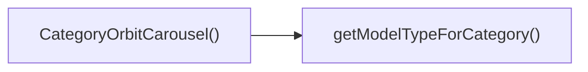

## Genel Bakış
Bu React bileşeni, VentHub HVAC platformunda ürün kategorilerini etkileşimli dairesel karusel formatında sunmak üzere tasarlanmıştır. Kullanıcıların alt kategorilere tıklayarak ilgili ürün içeriklerine erişmesini sağlarken, standart ve kompakt görünüm seçenekleriyle farklı sayfa düzenlerine uyum sağlar. İçerdiği yardımcı fonksiyon ile kategori kimliklerine göre uygun içerik tiplerini belirleyerek karuselin doğru şekilde yapılandırılmasını destekler.

## Fonksiyon Grupları
### Ana Kategori Karusel Bileşeni
Tüm karusel işlevselliğini yöneten, alt kategori seçimi etkileşimlerini alan ve görünüm ayarlarını uygulayan ana React bileşenidir.
- CategoryOrbitCarousel

### Kategori Yardımcı Fonksiyonu
Gelen kategori benzersiz adres (slug) değerine göre uygun model tipini belirleyerek ana bileşenin içerik yükleme sürecini destekleyen yardımcı fonksiyondur.
- getModelTypeForCategory

---

## AXIOMS – Mimari Varsayımlar
Ürün kategorilerini kaydırılabilir carousel formatında sunan bu React bileşeni, doğru çalışması için prop olarak iletilen işlevlerin ve harici kategori çözümleme fonksiyonunun sistemde mevcut ve uyumlu veri tipleriyle iletilmiş olmasına tamamen bağlıdır.

[Aksiyom 1]: Eğer CategoryOrbitCarouselProps içindeki zorunlu onSubcategorySelect işlevi sağlanmazsa, kullanıcının bir alt kategori seçmesi durumunda hiçbir işlem tetiklenmez, kategori seçim akışı tamamen kesintiye uğrar.
[Aksiyom 2]: Eğer kategori çözümleme fonksiyonu getModelTypeForCategory projeye dahil edilmemişse, slug değerine göre uygun ürün modeli türü belirlenemediğinden carousel içindeki kategori kartları doğru içerikle doldurulamaz.
[Aksiyom 3]: Eğer compact prop'u boolean veri tipi dışında bir türde iletilirse, tanımlı varsayılan false değeri devreye giremeyeceğinden carousel'in görünüm boyutlandırması hatalı çalışır, kullanıcı arayüzünün düzeni bozulur.
[Aksiyom 4]: Eğer getModelTypeForCategory fonksiyonuna geçirilen slug parametresi geçerli bir kategori tanımlayıcısı değilse, eşleşen model türü döndürülemediğinden ilgili kategori öğesi carousel'de görüntülenemez.

---

## FONKSIYON DETAYLARI

### getModelTypeForCategory
**Ne yapar**: İsteğe bağlı olarak gelen kategori slug değerine göre uygun ürün model tipini eşleştirip döndürür, kategori bazlı ürün sınıflandırması işlemini gerçekleştirir. Sadece tanımlı ve geçerli slug değerleri için geçerli bir model tipi sonucu üretir.
**Nasıl yapar**: Gelen slug parametresini önceden tanımlanmış kategori-model eşleşmeleri ile karşılaştırır, eşleşme bulunduğunda ilgili model tipini iletir. Eğer slug tanımsız ise veya hiçbir eşleşme sağlanamaz ise tanımsız değerini döndürür.
**Parametreler**:
- slug: string | undefined — İşlem yapılacak kategorinin benzersiz, URL yapısına uygun kısa kimliği, isteğe bağlı olarak tanımlanabilir
**Dönüş**: string | undefined — Geçerli ve eşleşen slug durumunda ilgili ürün model tipini, geçersiz veya tanımsız slug durumunda undefined değerini döndürür

### CategoryOrbitCarousel
**Ne yapar**: VentHub HVAC platformu ürünlerini kategorilere göre dairesel yörünge karusel formatında sunan React bileşenidir, kullanıcıların listedeki alt kategoriler arasında gezinmesini ve seçim yapmasını sağlar. Farklı ekran boyutları ve kullanım senaryolarına uygun olarak kompakt modda çalışma desteği sunar.
**Nasıl yapar**: Aldığı yapılandırma parametrelerine göre arayüzünü düzenler, kullanıcı tarafından bir alt kategori seçimi yapıldığında üst bileşene seçim bilgisini iletmek için tanımlanan callback fonksiyonunu tetikler. Varsayılan olarak standart boyutlu düzeni kullanır, compact parametresi true olarak iletildiğinde daha küçük ölçekli arayüzü render eder.
**Parametreler**:
- onSubcategorySelect: CategoryOrbitCarouselProps tipinde tanımlı callback fonksiyonu — Kullanıcı tarafından bir alt kategori seçildiğinde tetiklenir, seçilen kategori bilgilerini üst bileşene iletmek için kullanılır
- compact: boolean — Bileşenin kompakt küçük boyutlu modda çalışmasını sağlayan isteğe bağlı parametre, varsayılan değeri false olarak tanımlanmıştır
**Dönüş**: Void veya bilinmeyen türde değer, React bileşeni olarak ekrana karusel arayüzünü render eder, dönüş tipi açıkça tanımlanmamıştır

---

## INTERFACES

### CategoryOrbitCarouselProps
- `onSubcategorySelect?: (categorySlug: string, subcategorySlug?: string) => void`
- `compact?: boolean`

---

## AST POINTERS

### [N1_NASIL] AST Pointer: C:\Users\alize\venthub-hvac\src\components\products\CategoryOrbitCarousel.tsx::getModelTypeForCategory
- **params**: slug?: string
- **ic_degiskenler**:
  - `s` — gelen slug değerini küçük harfe çeviren geçici değişken, tüm kategori eşleştirmelerinde kullanılır
- **Dönüş**: string | undefined

### [N2_NASIL] AST Pointer: C:\Users\alize\venthub-hvac\src\components\products\CategoryOrbitCarousel.tsx::CategoryOrbitCarousel
- **params**: onSubcategorySelect, compact = false (tür: CategoryOrbitCarouselProps)
- **ic_degiskenler**:
  - `router` — Next.js yönlendirme nesnesi, sayfa geçişleri için kullanılır
  - `categories` — Context'ten alınan tüm kategori listesi
  - `categoriesLoading` — Kategorilerin yüklenme durumu, yükleme ekranı göstermek için kullanılır
  - `wrapCategory` — Ham kategori verisini view modeline dönüştüren fonksiyon
  - `t` — I18n çeviri fonksiyonu, metinleri çevirmek için kullanılır
  - `level` — Mevcut görünen kategori seviyesi state'i, 'main' veya 'subcategory' alır
  - `activeMainCategorySlug` — Aktif ana kategorinin slug'ını saklayan state, alt kategorilere geçişte kullanılır
  - `isTransitioning` — Seviye değişimi sırasında geçiş animasyonunu yöneten state
  - `focusedItemTitle` — Odaklanan kategorinin başlığını saklayan state, başlık alanında gösterilir
  - `frontCardTitle` — Önde olan kartın başlığını saklayan state, odaklanan öğe yokken gösterilir
  - `hintIndex` — Döngüsel kullanıcı ipuçlarının indeksini saklayan state
  - `ROTATING_HINTS` — Kullanıcıya gösterilen etkileşim ipuçlarını içeren sabit dizi
  - `mainCategories` — Ana kategori (parent_id'si null) view modelleri listesi, useMemo ile hesaplanır
  - `activeMainCategory` - Slug'ı eşleşen aktif ana kategori nesnesi, useMemo ile bulunur
  - `subcategories` — Aktif ana kategorinin alt kategoriler listesi, useMemo ile hesaplanır
  - `mainCategoriesMap` — Ana kategorileri slug anahtarıyla eşleyen Map nesnesi, hızlı erişim için kullanılır
  - `subcategoriesMap` — Alt kategorileri slug anahtarıyla eşleyen Map nesnesi, hızlı erişim için kullanılır
  - `displayItems` — Orbital karuselde gösterilecek şekilde formatlanmış öğe listesi, useMemo ile oluşturulur
  - `handleFocusedItemChange` — Odaklanan öğe değiştiğinde tetiklenen callback, başlık ve ipuçlarını günceller
  - `handleFrontCardChange` — Öndeki kart değiştiğinde tetiklenen callback, başlık ve ipucu indeksini günceller
  - `handleCardClick` — Karta tıklandığında tetiklenen callback, kategori geçişleri veya sayfa yönlendirmesi yapar
  - `handleBack` — Geri butonuna tıklandığında tetiklenen callback, ana kategori seviyesine döner
  - `handleViewAllProducts` — Tüm ürünleri gör butonuna tıklandığında tetiklenen callback, kategori sayfasına yönlendirir
  - `isMobile` — Cihazın mobil olup olmadığını saklayan state, boyut hesaplamaları için kullanılır
  - `responsiveHeight` — Kompakt mod ve cihaza göre hesaplanan karusel yüksekliği
  - `responsiveModelScale` — Kompakt mod ve cihaza göre hesaplanan 3D model ölçeği
- **Dönüş**: JSX.Element

### [N3_NASIL] AST Pointer: C:\Users\alize\venthub-hvac\src\components\products\CategoryOrbitCarousel.tsx::mainCategories_useMemo_callback
- **params**: (yok)
- **ic_degiskenler**:
  - `categories` — Tüm ham kategori listesi, filtreleme için kullanılır
  - `wrapCategory` — Kategori verisini view modeline dönüştüren fonksiyon
  - `c` — Filtre ve map döngüsündeki geçici kategori nesnesi
  - `vm` — wrapCategory ile dönüştürülmüş view model nesnesi, null kontrolü yapılır
- **Dönüş**: NonNullable<ReturnType<typeof wrapCategory>>[]

### [N4_NASIL] AST Pointer: C:\Users\alize\venthub-hvac\src\components\products\CategoryOrbitCarousel.tsx::activeMainCategory_useMemo_callback
- **params**: (yok)
- **ic_degiskenler**:
  - `mainCategories` — Ana kategori view modelleri listesi, arama için kullanılır
  - `activeMainCategorySlug` — Aranan aktif kategori slug'ı
  - `c` — find döngüsündeki geçici ana kategori nesnesi
- **Dönüş**: typeof mainCategories[number] | null

### [N5_NASIL] AST Pointer: C:\Users\alize\venthub-hvac\src\components\products\CategoryOrbitCarousel.tsx::subcategories_useMemo_callback
- **params**: (yok)
- **ic_degiskenler**:
  - `activeMainCategory` — Aktif ana kategori nesnesi, null ise boş dizi döndürülür
  - `categories` — Tüm ham kategori listesi, filtreleme için kullanılır
  - `wrapCategory` — Kategori verisini view modeline dönüştüren fonksiyon
  - `c` — Filtre ve map döngüsündeki geçici alt kategori nesnesi
  - `vm` — wrapCategory ile dönüştürülmüş view model nesnesi, null kontrolü yapılır
- **Dönüş**: NonNullable<ReturnType<typeof wrapCategory>>[]

### [N6_NASIL] AST Pointer: C:\Users\alize\venthub-hvac\src\components\products\CategoryOrbitCarousel.tsx::mainCategoriesMap_useMemo_callback
- **params**: (yok)
- **ic_degiskenler**:
  - `map` — Oluşturulan boş Map nesnesi, kategorileri eklemek için kullanılır
  - `mainCategories` — Ana kategori view modelleri listesi, Map'e eklemek için kullanılır
  - `c` — döngüdeki geçici ana kategori nesnesi
- **Dönüş**: Map<string, typeof mainCategories[number]>

### [N7_NASIL] AST Pointer: C:\Users\alize\venthub-hvac\src\components\products\CategoryOrbitCarousel.tsx::subcategoriesMap_useMemo_callback
- **params**: (yok)
- **ic_degiskenler**:
  - `map` — Oluşturulan boş Map nesnesi, alt kategorileri eklemek için kullanılır
  - `subcategories` — Alt kategori view modelleri listesi, Map'e eklemek için kullanılır
  - `s` — döngüdeki geçici alt kategori nesnesi
- **Dönüş**: Map<string, typeof subcategories[number]>

### [N8_NASIL] AST Pointer: C:\Users\alize\venthub-hvac\src\components\products\CategoryOrbitCarousel.tsx::handleFocusedItemChange
- **params**: itemId: string | null
- **ic_degiskenler**:
  - `itemId` — Odaklanan öğenin ID'si (slug'ı)
  - `level` — Mevcut kategori seviyesi, hangi Map'ten arama yapılacağını belirler
  - `mainCategoriesMap` — Ana kategorilerin saklandığı Map, ana seviyede arama için kullanılır
  - `subcategoriesMap` — Alt kategorilerin saklandığı Map, alt kategori seviyesinde arama için kullanılır
  - `title` — Bulunan kategorinin displayName'i, state'e kaydedilmek üzere saklanan geçici değişken
  - `cat` — mainCategoriesMap'ten bulunan ana kategori nesnesi
  - `sub` — subcategoriesMap'ten bulunan alt kategori nesnesi
- **Dönüş**: undefined

### [N9_NASIL] AST Pointer: C:\Users\alize\venthub-hvac\src\components\products\CategoryOrbitCarousel.tsx::handleFrontCardChange
- **params**: itemId: string
- **ic_degiskenler**:
  - `itemId` — Öne gelen öğenin ID'si (slug'ı)
  - `level` — Mevcut kategori seviyesi, hangi Map'ten arama yapılacağını belirler
  - `mainCategoriesMap` — Ana kategorilerin saklandığı Map, ana seviyede arama için kullanılır
  - `subcategoriesMap` — Alt kategorilerin saklandığı Map, alt kategori seviyesinde arama için kullanılır
  - `title` — Bulunan kategorinin displayName'i, state'e kaydedilmek üzere saklanan geçici değişken
  - `cat` — mainCategoriesMap'ten bulunan ana kategori nesnesi
  - `sub` — subcategoriesMap'ten bulunan alt kategori nesnesi
  - `prev` — setHintIndex ile erişilen önceki hint indeksi değeri
- **Dönüş**: undefined

### [N10_NASIL] AST Pointer: C:\Users\alize\venthub-hvac\src\components\products\CategoryOrbitCarousel.tsx::level_change_useEffect_callback
- **params**: (yok)
- **ic_degiskenler**: Seviye değiştiğinde başlık state'lerini sıfırlamak için kullanılan state fonksiyonları
- **Dönüş**: undefined

### [N11_NASIL] AST Pointer: C:\Users\alize\venthub-hvac\src\components\products\CategoryOrbitCarousel.tsx::displayItems_useMemo_callback
- **params**: (yok)
- **ic_degiskenler**:
  - `level` — Mevcut kategori seviyesi, hangi kategori listesinin kullanılacağını belirler
  - `mainCategories` — Ana seviyede kullanılacak ana kategori listesi
  - `subcategories` — Alt kategori seviyesinde kullanılacak alt kategori listesi
  - `categories` — Tüm ham kategori listesi, ham kategori verisini çekmek için kullanılır
  - `vm` — map döngüsündeki geçici kategori view model nesnesi
- **Dönüş**: Array<{id: string, title: string, image: string, categorySlug: string, modelType: string | undefined}>

### [N12_NASIL] AST Pointer: C:\Users\alize\venthub-hvac\src\components\products\CategoryOrbitCarousel.tsx::displayItems_main_map_callback
- **params**: vm
- **ic_degiskenler**:
  - `vm` — İşlenen kategori view model nesnesi
  - `categories` — Tüm ham kategori listesi, eşleşen ham kategoriyi bulmak için kullanılır
  - `rawCat` — vm.slug ile bulunan ham kategori nesnesi
  - `dbModelType` — Ham kategorinin metadata'sından alınan model_type değeri, öncelikli olarak kullanılır
- **Dönüş**: {id: string, title: string, image: string, categorySlug: string, modelType: string | undefined}

### [N13_NASIL] AST Pointer: C:\Users\alize\venthub-hvac\src\components\products\CategoryOrbitCarousel.tsx::displayItems_sub_map_callback
- **params**: vm
- **ic_degiskenler**:
  - `vm` — İşlenen alt kategori view model nesnesi
  - `categories` — Tüm ham kategori listesi, eşleşen ham kategoriyi bulmak için kullanılır
  - `rawCat` — vm.slug ile bulunan ham kategori nesnesi
  - `dbModelType` — Ham kategorinin metadata'sından alınan model_type değeri, öncelikli olarak kullanılır
- **Dönüş**: {id: string, title: string, image: string, categorySlug: string, modelType: string | undefined}

### [N14_NASIL] AST Pointer: C:\Users\alize\venthub-hvac\src\components\products\CategoryOrbitCarousel.tsx::handleCardClick
- **params**: itemId: string
- **ic_degiskenler**:
  - `itemId` — Tıklanan kartın ID'si (slug'ı)
  - `level` — Mevcut kategori seviyesi, işlem akışını belirler
  - `mainCategoriesMap` — Ana kategori Map'i, ana seviyede kategori bulmak için kullanılır
  - `subcategoriesMap` — Alt kategori Map'i, alt seviyede kategori bulmak için kullanılır
  - `activeMainCategorySlug` — Aktif ana kategori slug'ı, yönlendirmede kullanılır
  - `categories` — Tüm ham kategori listesi, alt kategori kontrolü için kullanılır
  - `router` — Next.js yönlendirme nesnesi, sayfa geçişi için kullanılır
  - `onSubcategorySelect` — Props'tan alınan alt kategori seçim callback'i, varsa tetiklenir
  - `categoryVm` — mainCategoriesMap'ten bulunan ana kategori nesnesi
  - `hasSubs` — Tıklanan ana kategorinin alt kategorisi olup olmadığını kontrol eden boolean değer
  - `subVm` — subcategoriesMap'ten bulunan alt kategori nesnesi
- **Dönüş**: undefined

### [N15_NASIL] AST Pointer: C:\Users\alize\venthub-hvac\src\components\products\CategoryOrbitCarousel.tsx::handleCardClick_setTimeout_callback
- **params**: (yok)
- **ic_degiskenler**: Seviyeyi subcategory yapıp geçiş durumunu kapan state fonksiyonları
- **Dönüş**: undefined

### [N16_NASIL] AST Pointer: C:\Users\alize\venthub-hvac\src\components\products\CategoryOrbitCarousel.tsx::handleBack
- **params**: (yok)
- **ic_degiskenler**: Geçiş durumunu açan, ana seviyeye dönmek için kullanılan state fonksiyonları
- **Dönüş**: undefined

### [N17_NASIL] AST Pointer: C:\Users\alize\venthub-hvac\src\components\products\CategoryOrbitCarousel.tsx::handleBack_setTimeout_callback
- **params**: (yok)
- **ic_degiskenler**: Seviyeyi main yapıp aktif kategori slug'ını sıfırlayan, geçiş durumunu kapatan state fonksiyonları
- **Dönüş**: undefined

### [N18_NASIL] AST Pointer: C:\Users\alize\venthub-hvac\src\components\products\CategoryOrbitCarousel.tsx::handleViewAllProducts
- **params**: (yok)
- **ic_degiskenler**:
  - `activeMainCategorySlug` — Aktif ana kategori slug'ı, yönlendirmede kullanılır
  - `router` — Next.js yönlendirme nesnesi, kategori sayfasına gitmek için kullanılır
- **Dönüş**: undefined

### [N19_NASIL] AST Pointer: C:\Users\alize\venthub-hvac\src\components\products\CategoryOrbitCarousel.tsx::mobile_check_useEffect_callback
- **params**: (yok)
- **ic_degiskenler**:
  - `checkMobile` — Pencere genişliğini kontrol ederek mobil durumunu güncelleyen fonksiyon
  - `window` — Tarayıcı pencere nesnesi, resize event'i eklemek için kullanılır
- **Dönüş**: Cleanup fonksiyonu | undefined

### [N20_NASIL] AST Pointer: C:\Users\alize\venthub-hvac\src\components\products\CategoryOrbitCarousel.tsx::checkMobile
- **params**: (yok)
- **ic_degiskenler**:
  - `window.innerWidth` — Pencere genişliği, 768px'ten küçükse mobil olarak işaretlenir
- **Dönüş**: undefined

### [N21_NASIL] AST Pointer: C:\Users\alize\venthub-hvac\src\components\products\CategoryOrbitCarousel.tsx::mobile_check_cleanup_callback
- **params**: (yok)
- **ic_degiskenler**:
  - `window` — Tarayıcı pencere nesnesi, resize event'ini kaldırmak için kullanılır
- **Dönüş**: undefined

---

## ÇAĞRI HARİTASI

### Disariya Cagrilar (Outgoing)
Dosya içindeki CategoryOrbitCarousel() fonksiyonu, kategoriye ait model türünü almak için aynı dosyadaki getModelTypeForCategory fonksiyonunu çağırır.

### Disaridan Cagrilanlar (Incoming)
Sağlanan çağrı verisinde bu modülü kullanan herhangi bir dış dosya veya fonksiyon bilgisi kaydedilmemiştir.

### Ic Ice Fonksiyonlar (Nested)
Yok

---

## DOSYA-İÇİ ÇAĞRI GRAFİĞİ
  CategoryOrbitCarousel() → getModelTypeForCategory()

---

## NODE ID STANDARD

  file: src\components\products\CategoryOrbitCarousel.tsx
  function: src\components\products\CategoryOrbitCarousel.tsx::getModelTypeForCategory
  function: src\components\products\CategoryOrbitCarousel.tsx::CategoryOrbitCarousel

---

## DISA AKTARILANLAR (EXPORTS)
  export: CategoryOrbitCarousel
  export: getModelTypeForCategory

---

## STİL TOKENLERİ

### Arbitrary Değerler (token'a geçirilmemiş)
- **shadow:** (yok)
- **height:** `h-[400px]`
- **width:** `max-w-[150px]`
- **spacing:** (yok)
- **diğer:** `active:scale-[0.98]`, `bg-[radial-gradient(circle_at_center,rgba(30,41,59,0.5)_0%,rgb(2,6,23)_70%)]`, `bg-[radial-gradient(circle_at_center,rgba(6,182,212,0.15)_0%,rgb(2,6,23)_70%)]`, `hover:scale-[1.02]`

### Kullanılan Token'lar (zaten token'a geçirilmiş)
- (yok)

### Tailwind Sınıf Özeti
- **Renkler:** `bg-gradient-to-r`, `bg-surface-darker`, `bg-white/10`, `border-white/20`, `from-cyan-500`, `md:text-3xl`, `sm:text-sm`, `text-center`, `text-cyan-400`, `text-sm`, `text-white`, `text-white/50`, `text-white/90`, `text-xl`, `text-xs`
- **Layout:** `absolute`, `backdrop-blur-md`, `flex`, `flex-col`, `from-cyan-500`, `gap-2`, `gap-3`, `group-hover:-translate-x-1`, `h-4`, `hover:shadow-cyan-500/30`, `hover:shadow-lg`, `items-center`, `justify-between`, `justify-center`, `left-0`
- **Responsive:** `md:`, `sm:` prefix kullanımları
